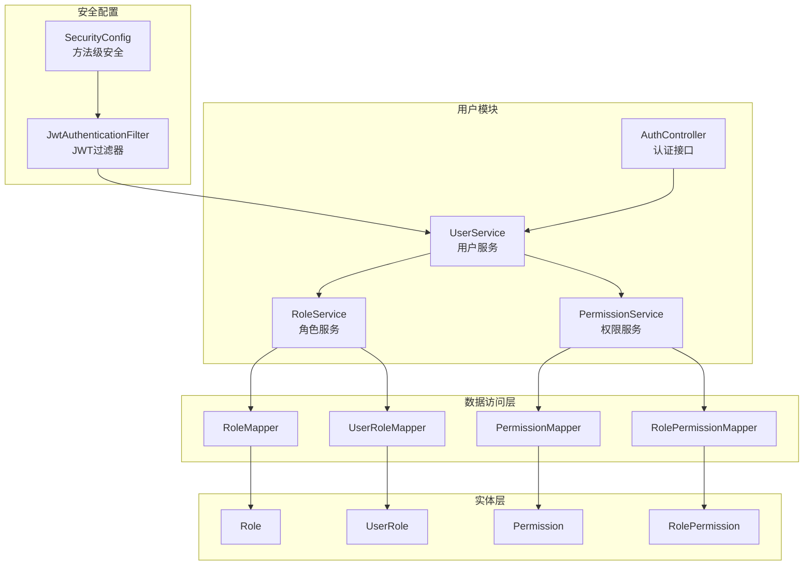
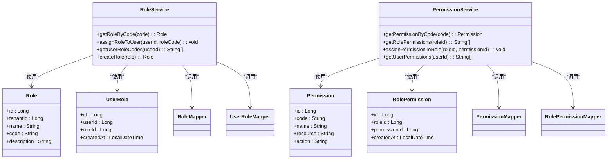
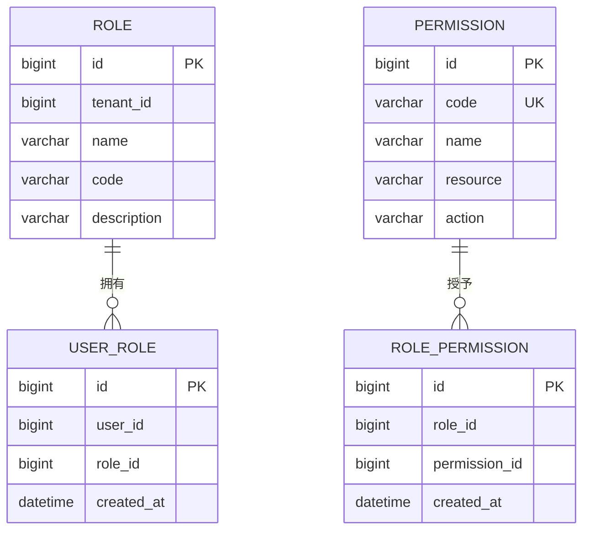
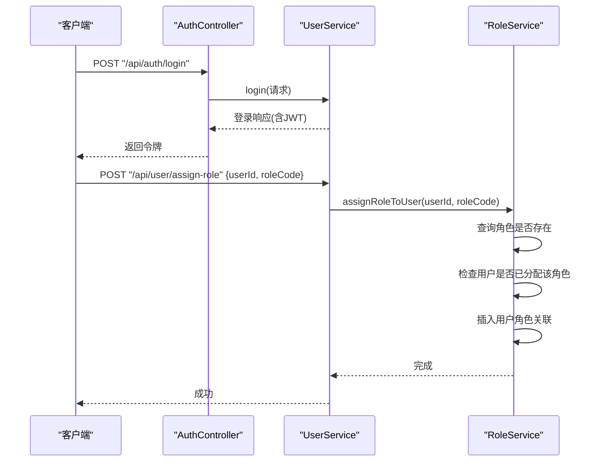
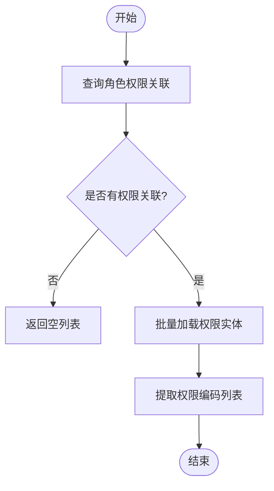
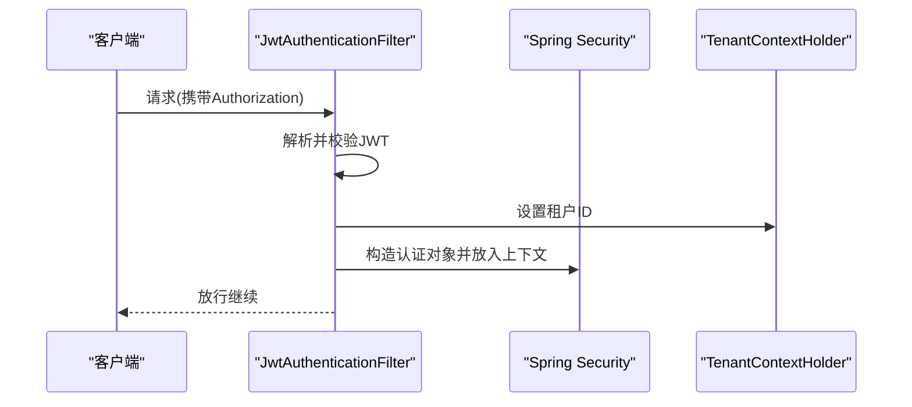
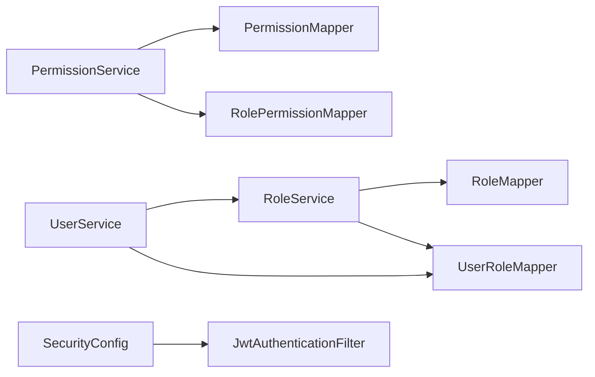

# 角色权限管理

<cite>
**本文引用的文件**
- [Role.java](file://backend/src/main/java/com/edu/user/entity/Role.java)
- [Permission.java](file://backend/src/main/java/com/edu/user/entity/Permission.java)
- [UserRole.java](file://backend/src/main/java/com/edu/user/entity/UserRole.java)
- [RolePermission.java](file://backend/src/main/java/com/edu/user/entity/RolePermission.java)
- [RoleService.java](file://backend/src/main/java/com/edu/user/service/RoleService.java)
- [PermissionService.java](file://backend/src/main/java/com/edu/user/service/PermissionService.java)
- [RoleMapper.java](file://backend/src/main/java/com/edu/user/mapper/RoleMapper.java)
- [PermissionMapper.java](file://backend/src/main/java/com/edu/user/mapper/PermissionMapper.java)
- [UserRoleMapper.java](file://backend/src/main/java/com/edu/user/mapper/UserRoleMapper.java)
- [RolePermissionMapper.java](file://backend/src/main/java/com/edu/user/mapper/RolePermissionMapper.java)
- [schema.sql](file://backend/src/main/resources/db/schema.sql)
- [JwtAuthenticationFilter.java](file://backend/src/main/java/com/edu/common/security/JwtAuthenticationFilter.java)
- [SecurityConfig.java](file://backend/src/main/java/com/edu/common/config/SecurityConfig.java)
- [UserService.java](file://backend/src/main/java/com/edu/user/service/UserService.java)
- [AuthController.java](file://backend/src/main/java/com/edu/user/controller/AuthController.java)
</cite>

## 目录
1. [简介](#简介)
2. [项目结构](#项目结构)
3. [核心组件](#核心组件)
4. [架构总览](#架构总览)
5. [详细组件分析](#详细组件分析)
6. [依赖分析](#依赖分析)
7. [性能考虑](#性能考虑)
8. [故障排查指南](#故障排查指南)
9. [结论](#结论)
10. [附录](#附录)

## 简介
本文件系统性阐述基于 RBAC 的角色权限管理体系，覆盖用户、角色、权限三者的多对多关系建模与实现；解释角色继承与权限组合规则；给出角色分配、权限查询与权限验证的接口与使用示例；并讨论权限缓存策略、性能优化与权限变更的实时生效机制。

## 项目结构
围绕权限管理的核心代码位于后端模块的 user 与 common 包中，采用分层架构：实体层（entity）、数据访问层（mapper）、业务服务层（service）、控制层（controller），并结合通用安全配置与过滤器。

图表来源
- [AuthController.java:1-32](file://backend/src/main/java/com/edu/user/controller/AuthController.java#L1-32)
- [UserService.java:1-194](file://backend/src/main/java/com/edu/user/service/UserService.java#L1-194)
- [RoleService.java:1-83](file://backend/src/main/java/com/edu/user/service/RoleService.java#L1-83)
- [PermissionService.java:1-63](file://backend/src/main/java/com/edu/user/service/PermissionService.java#L1-63)
- [RoleMapper.java:1-9](file://backend/src/main/java/com/edu/user/mapper/RoleMapper.java#L1-9)
- [PermissionMapper.java:1-9](file://backend/src/main/java/com/edu/user/mapper/PermissionMapper.java#L1-9)
- [UserRoleMapper.java:1-9](file://backend/src/main/java/com/edu/user/mapper/UserRoleMapper.java#L1-9)
- [RolePermissionMapper.java:1-9](file://backend/src/main/java/com/edu/user/mapper/RolePermissionMapper.java#L1-9)
- [Role.java:1-18](file://backend/src/main/java/com/edu/user/entity/Role.java#L1-18)
- [Permission.java:1-18](file://backend/src/main/java/com/edu/user/entity/Permission.java#L1-18)
- [UserRole.java:1-15](file://backend/src/main/java/com/edu/user/entity/UserRole.java#L1-15)
- [RolePermission.java:1-15](file://backend/src/main/java/com/edu/user/entity/RolePermission.java#L1-15)
- [SecurityConfig.java:1-50](file://backend/src/main/java/com/edu/common/config/SecurityConfig.java#L1-50)
- [JwtAuthenticationFilter.java:1-70](file://backend/src/main/java/com/edu/common/security/JwtAuthenticationFilter.java#L1-70)

章节来源
- [AuthController.java:1-32](file://backend/src/main/java/com/edu/user/controller/AuthController.java#L1-32)
- [UserService.java:1-194](file://backend/src/main/java/com/edu/user/service/UserService.java#L1-194)
- [RoleService.java:1-83](file://backend/src/main/java/com/edu/user/service/RoleService.java#L1-83)
- [PermissionService.java:1-63](file://backend/src/main/java/com/edu/user/service/PermissionService.java#L1-63)
- [SecurityConfig.java:1-50](file://backend/src/main/java/com/edu/common/config/SecurityConfig.java#L1-50)
- [JwtAuthenticationFilter.java:1-70](file://backend/src/main/java/com/edu/common/security/JwtAuthenticationFilter.java#L1-70)

## 核心组件
- 实体模型
  - 角色：包含主键、租户标识、角色编码与名称、描述等字段。
  - 权限：包含主键、权限编码、名称、资源类型与操作类型等字段。
  - 用户角色关联：记录用户与角色的多对多关系。
  - 角色权限关联：记录角色与权限的多对多关系。
- 服务层
  - 角色服务：提供按编码获取角色、为用户分配角色、查询用户角色编码列表、创建角色等能力。
  - 权限服务：提供按编码获取权限、查询角色拥有的权限列表、为角色分配权限等能力。
- 数据访问层
  - 对应各实体的基础 Mapper 接口，用于 MyBatis-Plus 的 CRUD。
- 安全层
  - 基于 JWT 的请求过滤器与安全配置，支持方法级安全注解。

章节来源
- [Role.java:1-18](file://backend/src/main/java/com/edu/user/entity/Role.java#L1-18)
- [Permission.java:1-18](file://backend/src/main/java/com/edu/user/entity/Permission.java#L1-18)
- [UserRole.java:1-15](file://backend/src/main/java/com/edu/user/entity/UserRole.java#L1-15)
- [RolePermission.java:1-15](file://backend/src/main/java/com/edu/user/entity/RolePermission.java#L1-15)
- [RoleService.java:1-83](file://backend/src/main/java/com/edu/user/service/RoleService.java#L1-83)
- [PermissionService.java:1-63](file://backend/src/main/java/com/edu/user/service/PermissionService.java#L1-63)
- [RoleMapper.java:1-9](file://backend/src/main/java/com/edu/user/mapper/RoleMapper.java#L1-9)
- [PermissionMapper.java:1-9](file://backend/src/main/java/com/edu/user/mapper/PermissionMapper.java#L1-9)
- [UserRoleMapper.java:1-9](file://backend/src/main/java/com/edu/user/mapper/UserRoleMapper.java#L1-9)
- [RolePermissionMapper.java:1-9](file://backend/src/main/java/com/edu/user/mapper/RolePermissionMapper.java#L1-9)
- [JwtAuthenticationFilter.java:1-70](file://backend/src/main/java/com/edu/common/security/JwtAuthenticationFilter.java#L1-70)
- [SecurityConfig.java:1-50](file://backend/src/main/java/com/edu/common/config/SecurityConfig.java#L1-50)

## 架构总览
RBAC 权限模型通过“用户-角色-权限”三层映射实现细粒度资源访问控制。用户通过角色间接获得权限，角色可继承多个权限；权限由资源与操作共同定义，形成精确到资源维度的控制点。

图表来源
- [Role.java:1-18](file://backend/src/main/java/com/edu/user/entity/Role.java#L1-18)
- [Permission.java:1-18](file://backend/src/main/java/com/edu/user/entity/Permission.java#L1-18)
- [UserRole.java:1-15](file://backend/src/main/java/com/edu/user/entity/UserRole.java#L1-15)
- [RolePermission.java:1-15](file://backend/src/main/java/com/edu/user/entity/RolePermission.java#L1-15)
- [RoleService.java:1-83](file://backend/src/main/java/com/edu/user/service/RoleService.java#L1-83)
- [PermissionService.java:1-63](file://backend/src/main/java/com/edu/user/service/PermissionService.java#L1-63)
- [RoleMapper.java:1-9](file://backend/src/main/java/com/edu/user/mapper/RoleMapper.java#L1-9)
- [PermissionMapper.java:1-9](file://backend/src/main/java/com/edu/user/mapper/PermissionMapper.java#L1-9)
- [UserRoleMapper.java:1-9](file://backend/src/main/java/com/edu/user/mapper/UserRoleMapper.java#L1-9)
- [RolePermissionMapper.java:1-9](file://backend/src/main/java/com/edu/user/mapper/RolePermissionMapper.java#L1-9)

## 详细组件分析

### 实体与表结构设计
- 角色表（role）：包含租户标识、角色编码与名称、描述等，唯一约束为“租户+编码”，确保多租户隔离下的角色编码唯一。
- 权限表（permission）：系统级权限，不绑定租户，包含权限编码、资源与操作类型，唯一约束为“权限编码”。
- 用户角色关联表（user_role）：用户与角色的多对多关系，唯一约束为“用户+角色”，防止重复分配。
- 角色权限关联表（role_permission）：角色与权限的多对多关系，唯一约束为“角色+权限”，保证权限去重。

图表来源
- [schema.sql:64-104](file://backend/src/main/resources/db/schema.sql#L64-L104)

章节来源
- [schema.sql:64-104](file://backend/src/main/resources/db/schema.sql#L64-L104)

### 角色服务（RoleService）
- 职责
  - 按角色编码获取角色（自动带租户上下文）。
  - 将角色分配给用户（幂等：若已分配则不重复插入）。
  - 查询用户的全部角色编码。
  - 创建角色。
- 关键流程
  - 分配角色时先查询角色是否存在，再检查用户是否已有该角色，最后插入关联记录。
  - 查询用户角色时先查询用户的所有角色关联，再批量查询角色以获取编码。

图表来源
- [AuthController.java:1-32](file://backend/src/main/java/com/edu/user/controller/AuthController.java#L1-32)
- [UserService.java:124-131](file://backend/src/main/java/com/edu/user/service/UserService.java#L124-L131)
- [RoleService.java:34-55](file://backend/src/main/java/com/edu/user/service/RoleService.java#L34-L55)

章节来源
- [RoleService.java:1-83](file://backend/src/main/java/com/edu/user/service/RoleService.java#L1-83)
- [UserService.java:124-131](file://backend/src/main/java/com/edu/user/service/UserService.java#L124-L131)

### 权限服务（PermissionService）
- 职责
  - 按权限编码获取权限。
  - 查询指定角色拥有的权限编码列表。
  - 为角色分配权限。
  - 提供用户权限查询（当前返回空，需结合角色服务完善）。
- 关键流程
  - 查询角色权限时，先查询角色权限关联，再批量查询权限实体，最后提取权限编码列表。

图表来源
- [PermissionService.java:30-47](file://backend/src/main/java/com/edu/user/service/PermissionService.java#L30-L47)

章节来源
- [PermissionService.java:1-63](file://backend/src/main/java/com/edu/user/service/PermissionService.java#L1-63)

### 安全认证与授权
- JWT 过滤器
  - 从请求头提取 Bearer 令牌，校验通过后从令牌解析用户与租户信息，设置安全上下文与租户上下文。
  - 对特定公开路径（如认证与租户相关接口）放行。
- 安全配置
  - 禁用 CSRF 与 X-Frame-Options，启用方法级安全注解，配置 JWT 过滤器前置。
  - 公开路径放行，其余请求均需认证。

图表来源
- [JwtAuthenticationFilter.java:27-53](file://backend/src/main/java/com/edu/common/security/JwtAuthenticationFilter.java#L27-L53)
- [SecurityConfig.java:26-43](file://backend/src/main/java/com/edu/common/config/SecurityConfig.java#L26-L43)

章节来源
- [JwtAuthenticationFilter.java:1-70](file://backend/src/main/java/com/edu/common/security/JwtAuthenticationFilter.java#L1-70)
- [SecurityConfig.java:1-50](file://backend/src/main/java/com/edu/common/config/SecurityConfig.java#L1-50)

### API 接口与使用示例
- 认证接口
  - POST /api/auth/login：登录获取 JWT。
  - POST /api/auth/register：注册用户并分配默认角色。
- 用户管理接口（示例）
  - POST /api/user/assign-role：为用户分配角色（需要鉴权与租户上下文）。
  - GET /api/user/{userId}/roles：查询用户的角色编码列表。
- 权限管理接口（示例）
  - GET /api/role/{roleId}/permissions：查询角色的权限编码列表。
  - POST /api/role/{roleId}/grant-permission：为角色授予权限。

说明
- 使用示例中的路径与方法为概念性描述，具体请参考对应控制器与服务实现。

章节来源
- [AuthController.java:1-32](file://backend/src/main/java/com/edu/user/controller/AuthController.java#L1-32)
- [UserService.java:124-131](file://backend/src/main/java/com/edu/user/service/UserService.java#L124-L131)
- [RoleService.java:57-74](file://backend/src/main/java/com/edu/user/service/RoleService.java#L57-L74)
- [PermissionService.java:30-47](file://backend/src/main/java/com/edu/user/service/PermissionService.java#L30-L47)

## 依赖分析
- 组件耦合
  - UserService 依赖 RoleService 与 UserRoleMapper，用于用户角色分配与查询。
  - RoleService 依赖 RoleMapper 与 UserRoleMapper，用于角色与用户角色关联。
  - PermissionService 依赖 PermissionMapper 与 RolePermissionMapper，用于权限与角色权限关联。
- 外部依赖
  - Spring Security 方法级安全注解与 JWT 工具类。
  - MyBatis-Plus 提供的通用 Mapper 与条件构造器。

图表来源
- [UserService.java:29-32](file://backend/src/main/java/com/edu/user/service/UserService.java#L29-L32)
- [RoleService.java:24-25](file://backend/src/main/java/com/edu/user/service/RoleService.java#L24-L25)
- [PermissionService.java](file://backend/src/main/java/com/edu/user/service/PermissionService.java#L22)
- [SecurityConfig.java:23-24](file://backend/src/main/java/com/edu/common/config/SecurityConfig.java#L23-L24)

章节来源
- [UserService.java:1-194](file://backend/src/main/java/com/edu/user/service/UserService.java#L1-194)
- [RoleService.java:1-83](file://backend/src/main/java/com/edu/user/service/RoleService.java#L1-83)
- [PermissionService.java:1-63](file://backend/src/main/java/com/edu/user/service/PermissionService.java#L1-63)
- [SecurityConfig.java:1-50](file://backend/src/main/java/com/edu/common/config/SecurityConfig.java#L1-50)

## 性能考虑
- 批量查询优化
  - 在查询用户角色与角色权限时，采用批量 ID 查询减少多次数据库往返。
- 索引与约束
  - 角色表与用户角色关联表对“租户+编码”与“用户+角色”建立唯一索引，避免重复与提升查询效率。
  - 权限表对“权限编码”建立唯一索引，确保权限查找高效。
- 缓存策略建议
  - 用户权限缓存：以用户 ID 为键，缓存用户角色编码与权限编码集合，设置合理过期时间。
  - 角色权限缓存：以角色 ID 为键，缓存角色拥有的权限编码集合。
  - 缓存失效：在角色分配/回收、权限授予/撤销、角色创建/修改时主动失效相关缓存。
- 实时生效机制
  - 结合缓存失效策略与事件监听（如事务提交后触发缓存清理），确保权限变更后尽快生效。
- 其他优化
  - 合理使用分页查询与延迟加载，避免一次性加载过多数据。
  - 对高频查询建立复合索引（如用户角色关联表的 user_id 列）。

章节来源
- [RoleService.java:57-74](file://backend/src/main/java/com/edu/user/service/RoleService.java#L57-L74)
- [PermissionService.java:30-47](file://backend/src/main/java/com/edu/user/service/PermissionService.java#L30-L47)
- [schema.sql:98-104](file://backend/src/main/resources/db/schema.sql#L98-L104)

## 故障排查指南
- 常见问题
  - 用户名已存在：注册或创建用户时，若同租户下用户名重复会抛出业务异常。
  - 用户不存在或密码错误：登录时若用户不存在或密码不匹配会抛出业务异常。
  - 角色不存在：为用户分配角色前需确认角色存在，否则抛出业务异常。
  - 租户上下文缺失：注册、登录等操作需设置租户上下文，否则抛出业务异常。
- 排查步骤
  - 检查请求头 Authorization 是否携带有效 JWT。
  - 确认租户上下文是否正确设置（JWT 中包含租户 ID）。
  - 核对角色编码与权限编码是否已在数据库中存在且唯一。
  - 查看日志输出，定位具体失败环节（如角色分配、权限授予、用户查询）。

章节来源
- [UserService.java:34-104](file://backend/src/main/java/com/edu/user/service/UserService.java#L34-L104)
- [RoleService.java:26-55](file://backend/src/main/java/com/edu/user/service/RoleService.java#L26-L55)
- [JwtAuthenticationFilter.java:34-50](file://backend/src/main/java/com/edu/common/security/JwtAuthenticationFilter.java#L34-L50)

## 结论
本权限体系以 RBAC 为核心，通过角色与权限的多对多映射实现灵活的资源访问控制。结合 JWT 认证与方法级安全，能够满足多租户场景下的权限隔离需求。建议在生产环境中引入权限缓存与失效策略，并完善用户权限查询接口，以进一步提升性能与可用性。

## 附录
- 数据库初始化脚本与索引
  - 参考 schema.sql 中的表结构与索引定义，确保权限相关表具备必要的唯一约束与索引。
- 安全配置要点
  - 明确公开接口与受保护接口的划分，确保安全链路正确加载。

章节来源
- [schema.sql:64-104](file://backend/src/main/resources/db/schema.sql#L64-L104)
- [SecurityConfig.java:26-43](file://backend/src/main/java/com/edu/common/config/SecurityConfig.java#L26-L43)