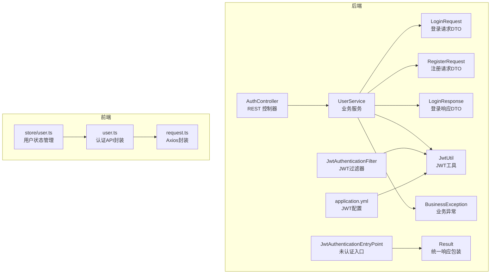
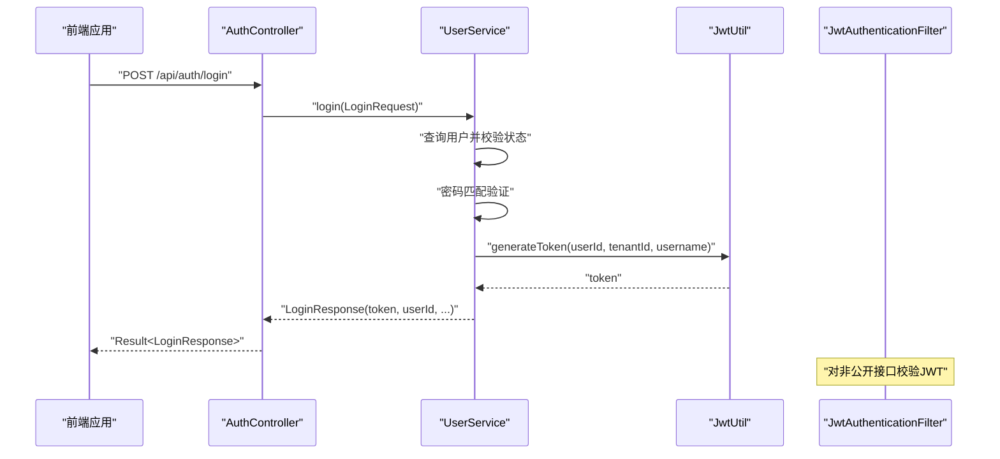
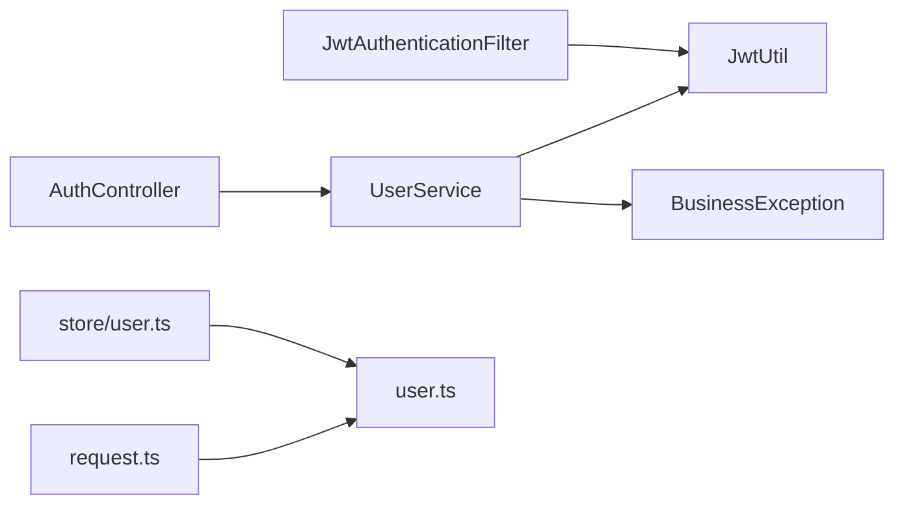

# 认证接口

<cite>
**本文引用的文件**
- [AuthController.java](file://backend/src/main/java/com/edu/user/controller/AuthController.java)
- [LoginRequest.java](file://backend/src/main/java/com/edu/user/dto/LoginRequest.java)
- [RegisterRequest.java](file://backend/src/main/java/com/edu/user/dto/RegisterRequest.java)
- [LoginResponse.java](file://backend/src/main/java/com/edu/user/dto/LoginResponse.java)
- [UserService.java](file://backend/src/main/java/com/edu/user/service/UserService.java)
- [JwtAuthenticationFilter.java](file://backend/src/main/java/com/edu/common/security/JwtAuthenticationFilter.java)
- [JwtAuthenticationEntryPoint.java](file://backend/src/main/java/com/edu/common/security/JwtAuthenticationEntryPoint.java)
- [JwtUtil.java](file://backend/src/main/java/com/edu/common/util/JwtUtil.java)
- [Result.java](file://backend/src/main/java/com/edu/common/entity/Result.java)
- [BusinessException.java](file://backend/src/main/java/com/edu/common/exception/BusinessException.java)
- [application.yml](file://backend/src/main/resources/application.yml)
- [user.ts](file://frontend/src/api/user.ts)
- [request.ts](file://frontend/src/utils/request.ts)
- [user.ts (Pinia Store)](file://frontend/src/store/user.ts)
- [JwtUtilTest.java](file://backend/src/test/java/com/edu/common/util/JwtUtilTest.java)
</cite>

## 目录
1. [简介](#简介)
2. [项目结构](#项目结构)
3. [核心组件](#核心组件)
4. [架构总览](#架构总览)
5. [详细组件分析](#详细组件分析)
6. [依赖分析](#依赖分析)
7. [性能考量](#性能考量)
8. [故障排查指南](#故障排查指南)
9. [结论](#结论)
10. [附录](#附录)

## 简介
本文件面向前端与后端开发者，系统化梳理认证相关API接口，覆盖登录与注册两大核心能力，包括：
- 接口定义：请求参数、响应格式、错误码
- 核心流程：用户名密码验证、JWT生成与校验、默认角色分配
- 前端调用示例与错误处理策略
- 安全设计：请求头、租户隔离、JWT配置、公开接口豁免
- 测试用例与调试指南

## 项目结构
认证相关代码主要分布在后端的用户模块与通用安全工具中，前端通过统一请求封装进行调用。

图表来源
- [AuthController.java:1-32](file://backend/src/main/java/com/edu/user/controller/AuthController.java#L1-L32)
- [UserService.java:1-194](file://backend/src/main/java/com/edu/user/service/UserService.java#L1-L194)
- [JwtAuthenticationFilter.java:1-70](file://backend/src/main/java/com/edu/common/security/JwtAuthenticationFilter.java#L1-L70)
- [JwtAuthenticationEntryPoint.java:1-32](file://backend/src/main/java/com/edu/common/security/JwtAuthenticationEntryPoint.java#L1-L32)
- [JwtUtil.java:1-123](file://backend/src/main/java/com/edu/common/util/JwtUtil.java#L1-L123)
- [Result.java:1-44](file://backend/src/main/java/com/edu/common/entity/Result.java#L1-L44)
- [BusinessException.java:1-28](file://backend/src/main/java/com/edu/common/exception/BusinessException.java#L1-L28)
- [application.yml:45-47](file://backend/src/main/resources/application.yml#L45-L47)
- [user.ts:1-25](file://frontend/src/api/user.ts#L1-L25)
- [request.ts:1-53](file://frontend/src/utils/request.ts#L1-L53)
- [user.ts (Pinia Store):1-44](file://frontend/src/store/user.ts#L1-L44)

章节来源
- [AuthController.java:1-32](file://backend/src/main/java/com/edu/user/controller/AuthController.java#L1-L32)
- [application.yml:45-47](file://backend/src/main/resources/application.yml#L45-L47)

## 核心组件
- 认证控制器：提供登录与注册两个公开接口，返回统一响应包装。
- 用户服务：实现注册、登录、角色分配、用户查询等核心业务。
- JWT工具：负责令牌生成、解析、校验与载荷提取。
- 安全过滤器：在非公开接口上校验JWT并设置租户上下文。
- 统一响应与异常：规范返回结构与业务异常码。

章节来源
- [AuthController.java:18-30](file://backend/src/main/java/com/edu/user/controller/AuthController.java#L18-L30)
- [UserService.java:34-104](file://backend/src/main/java/com/edu/user/service/UserService.java#L34-L104)
- [JwtUtil.java:33-45](file://backend/src/main/java/com/edu/common/util/JwtUtil.java#L33-L45)
- [JwtAuthenticationFilter.java:34-50](file://backend/src/main/java/com/edu/common/security/JwtAuthenticationFilter.java#L34-L50)
- [Result.java:21-42](file://backend/src/main/java/com/edu/common/entity/Result.java#L21-L42)
- [BusinessException.java:13-26](file://backend/src/main/java/com/edu/common/exception/BusinessException.java#L13-L26)

## 架构总览
认证流程涉及前后端协作与后端内部组件交互，关键点：
- 前端通过Axios封装发送请求，自动注入租户头与Authorization头。
- 后端控制器转发到用户服务；登录时生成JWT，注册时分配默认角色。
- 安全过滤器对非公开接口进行JWT校验，公开接口（如认证接口）不校验。

图表来源
- [AuthController.java:20-24](file://backend/src/main/java/com/edu/user/controller/AuthController.java#L20-L24)
- [UserService.java:68-104](file://backend/src/main/java/com/edu/user/service/UserService.java#L68-L104)
- [JwtUtil.java:33-45](file://backend/src/main/java/com/edu/common/util/JwtUtil.java#L33-L45)
- [JwtAuthenticationFilter.java:34-50](file://backend/src/main/java/com/edu/common/security/JwtAuthenticationFilter.java#L34-L50)

## 详细组件分析

### 登录接口 POST /api/auth/login
- 功能概述：接收用户名与密码，校验用户存在性、状态与密码，成功后签发JWT并返回用户信息。
- 请求参数
  - 类型：JSON
  - 字段
    - username：字符串，必填
    - password：字符串，必填
- 响应数据
  - token：字符串，JWT访问令牌
  - userId：整数，用户标识
  - username：字符串，用户名
  - realName：字符串，真实姓名
- 错误码
  - 400：用户名或密码为空、用户不存在、用户被禁用、密码错误、租户上下文缺失
  - 401：未认证（由安全入口统一返回）
- 安全要点
  - 使用租户隔离：登录前需设置租户头，服务端据此限定查询范围
  - 返回体不含明文密码，仅返回必要信息
- 前端调用要点
  - 自动注入租户头与Authorization头
  - 成功后将token存入本地存储并在后续请求中携带

章节来源
- [AuthController.java:20-24](file://backend/src/main/java/com/edu/user/controller/AuthController.java#L20-L24)
- [LoginRequest.java:7-12](file://backend/src/main/java/com/edu/user/dto/LoginRequest.java#L7-L12)
- [LoginResponse.java:6-11](file://backend/src/main/java/com/edu/user/dto/LoginResponse.java#L6-L11)
- [UserService.java:68-104](file://backend/src/main/java/com/edu/user/service/UserService.java#L68-L104)
- [BusinessException.java:13-26](file://backend/src/main/java/com/edu/common/exception/BusinessException.java#L13-L26)
- [JwtAuthenticationEntryPoint.java:28-29](file://backend/src/main/java/com/edu/common/security/JwtAuthenticationEntryPoint.java#L28-L29)
- [request.ts:16-23](file://frontend/src/utils/request.ts#L16-L23)
- [user.ts:4-10](file://frontend/src/api/user.ts#L4-L10)
- [user.ts (Pinia Store):25-31](file://frontend/src/store/user.ts#L25-L31)

### 注册接口 POST /api/auth/register
- 功能概述：创建新用户，校验用户名唯一性，加密密码，分配默认角色（若未指定则为教师），返回用户信息。
- 请求参数
  - 类型：JSON
  - 字段
    - username：字符串，必填
    - password：字符串，必填
    - realName：字符串，可选
    - email：字符串，可选
    - phone：字符串，可选
    - roleCode：字符串，可选（默认分配TEACHER）
- 响应数据
  - 返回创建后的用户对象（包含基础字段与状态）
- 错误码
  - 400：用户名已存在、租户上下文缺失
- 角色分配
  - 默认角色为TEACHER；可通过roleCode显式指定
- 安全要点
  - 密码使用PasswordEncoder加密存储
  - 租户隔离：基于租户上下文限制用户归属

章节来源
- [AuthController.java:26-30](file://backend/src/main/java/com/edu/user/controller/AuthController.java#L26-L30)
- [RegisterRequest.java:7-18](file://backend/src/main/java/com/edu/user/dto/RegisterRequest.java#L7-L18)
- [UserService.java:34-66](file://backend/src/main/java/com/edu/user/service/UserService.java#L34-L66)
- [BusinessException.java:13-26](file://backend/src/main/java/com/edu/common/exception/BusinessException.java#L13-L26)

### JWT令牌生成与校验
- 生成
  - 参数：用户ID、租户ID、用户名
  - 过期时间：由配置项控制（默认24小时）
- 校验
  - 校验签名与有效期
  - 提取用户ID、租户ID、用户名
- 过期判断
  - 基于载荷中的过期时间判断

章节来源
- [JwtUtil.java:33-45](file://backend/src/main/java/com/edu/common/util/JwtUtil.java#L33-L45)
- [JwtUtil.java:66-77](file://backend/src/main/java/com/edu/common/util/JwtUtil.java#L66-L77)
- [JwtUtil.java:82-110](file://backend/src/main/java/com/edu/common/util/JwtUtil.java#L82-L110)
- [application.yml:45-47](file://backend/src/main/resources/application.yml#L45-L47)

### 安全过滤与公开接口豁免
- 非公开接口
  - 在每次请求进入业务层前，过滤器校验JWT有效性
  - 成功后设置租户上下文与Spring Security认证上下文
- 公开接口
  - 认证接口与租户相关接口不进行JWT校验，便于完成登录与租户选择

章节来源
- [JwtAuthenticationFilter.java:34-50](file://backend/src/main/java/com/edu/common/security/JwtAuthenticationFilter.java#L34-L50)
- [JwtAuthenticationFilter.java:64-68](file://backend/src/main/java/com/edu/common/security/JwtAuthenticationFilter.java#L64-L68)

### 统一响应与异常
- 统一响应
  - 成功：code=200，message="success"，data为具体数据
  - 失败：code为业务码，message为错误信息
- 业务异常
  - BusinessException默认业务错误码为400
  - 登录/注册过程抛出的异常会被转换为对应错误码与消息

章节来源
- [Result.java:21-42](file://backend/src/main/java/com/edu/common/entity/Result.java#L21-L42)
- [BusinessException.java:13-26](file://backend/src/main/java/com/edu/common/exception/BusinessException.java#L13-L26)

## 依赖分析
- 控制器依赖服务层，服务层依赖JWT工具与异常类型
- 安全过滤器依赖JWT工具与租户上下文
- 前端通过Axios封装统一处理请求与响应，自动注入头信息

图表来源
- [AuthController.java:18-30](file://backend/src/main/java/com/edu/user/controller/AuthController.java#L18-L30)
- [UserService.java:32-32](file://backend/src/main/java/com/edu/user/service/UserService.java#L32-L32)
- [JwtAuthenticationFilter.java:25-25](file://backend/src/main/java/com/edu/common/security/JwtAuthenticationFilter.java#L25-L25)
- [request.ts:1-53](file://frontend/src/utils/request.ts#L1-L53)
- [user.ts:1-25](file://frontend/src/api/user.ts#L1-L25)
- [user.ts (Pinia Store):1-44](file://frontend/src/store/user.ts#L1-L44)

## 性能考量
- JWT生成与校验为轻量操作，性能开销可忽略
- 建议在高并发场景下：
  - 合理设置JWT过期时间，平衡安全性与刷新频率
  - 对登录/注册接口进行必要的限流（可在网关或应用层扩展）
  - 使用连接池与缓存优化数据库访问（当前项目已配置连接池）

## 故障排查指南
- 常见问题与处理
  - 400 用户名或密码为空：检查前端表单校验与请求体
  - 400 用户不存在/用户被禁用：确认租户上下文与用户状态
  - 400 密码错误：确认密码加密与匹配逻辑
  - 400 用户名已存在：更换用户名或清理重复数据
  - 401 未认证：确认Authorization头是否正确携带，token是否过期
- 前端错误处理
  - 响应拦截器对非200进行提示，并在401时清空token并跳转登录页
  - 网络异常统一提示“网络错误”
- 调试建议
  - 打开后端日志级别以定位问题
  - 使用单元测试验证JWT生成与解析逻辑

章节来源
- [BusinessException.java:13-26](file://backend/src/main/java/com/edu/common/exception/BusinessException.java#L13-L26)
- [JwtAuthenticationEntryPoint.java:28-29](file://backend/src/main/java/com/edu/common/security/JwtAuthenticationEntryPoint.java#L28-L29)
- [request.ts:37-50](file://frontend/src/utils/request.ts#L37-L50)
- [JwtUtilTest.java:21-54](file://backend/src/test/java/com/edu/common/util/JwtUtilTest.java#L21-L54)

## 结论
本认证体系以JWT为核心，结合租户隔离与公开接口豁免策略，提供了简洁可靠的登录与注册能力。前后端通过统一的请求封装与响应格式协同工作，配合完善的错误处理与安全过滤，满足教学平台的多租户与权限管理需求。

## 附录

### 接口定义与调用示例

- 登录
  - 方法与路径：POST /api/auth/login
  - 请求头：Content-Type: application/json；X-Tenant-Id: 租户ID
  - 请求体字段：username、password
  - 成功响应：code=200，data包含token、userId、username、realName
  - 失败响应：code为400或401，message为错误信息
  - 前端调用参考：[user.ts:4-10](file://frontend/src/api/user.ts#L4-L10)，[request.ts:16-23](file://frontend/src/utils/request.ts#L16-L23)

- 注册
  - 方法与路径：POST /api/auth/register
  - 请求头：Content-Type: application/json；X-Tenant-Id: 租户ID
  - 请求体字段：username、password、realName、email、phone、roleCode（可选，默认TEACHER）
  - 成功响应：code=200，data为创建后的用户对象
  - 失败响应：code为400，message为错误信息
  - 前端调用参考：[user.ts:13-15](file://frontend/src/api/user.ts#L13-L15)

章节来源
- [AuthController.java:20-30](file://backend/src/main/java/com/edu/user/controller/AuthController.java#L20-L30)
- [LoginRequest.java:7-12](file://backend/src/main/java/com/edu/user/dto/LoginRequest.java#L7-L12)
- [RegisterRequest.java:7-18](file://backend/src/main/java/com/edu/user/dto/RegisterRequest.java#L7-L18)
- [Result.java:21-42](file://backend/src/main/java/com/edu/common/entity/Result.java#L21-L42)
- [user.ts:4-15](file://frontend/src/api/user.ts#L4-L15)
- [request.ts:16-23](file://frontend/src/utils/request.ts#L16-L23)

### 安全考虑
- 请求头
  - Authorization: Bearer <token>（用于受保护接口）
  - X-Tenant-Id: 租户ID（用于多租户隔离）
- 防暴力破解
  - 可在网关或应用层增加登录尝试次数限制与IP封禁策略（当前项目未内置）
- 敏感信息保护
  - 密码经PasswordEncoder加密存储
  - 响应不返回明文密码
  - JWT不承载敏感业务数据

章节来源
- [request.ts:16-23](file://frontend/src/utils/request.ts#L16-L23)
- [UserService.java:53-53](file://backend/src/main/java/com/edu/user/service/UserService.java#L53-L53)
- [JwtAuthenticationFilter.java:64-68](file://backend/src/main/java/com/edu/common/security/JwtAuthenticationFilter.java#L64-L68)

### API测试用例与调试
- JWT工具测试
  - 生成与校验：验证token生成、校验与过期判断
  - 载荷提取：验证用户ID、租户ID、用户名提取
  - 无效token：验证校验失败
  - 参考：[JwtUtilTest.java:21-54](file://backend/src/test/java/com/edu/common/util/JwtUtilTest.java#L21-L54)
- 建议补充
  - 登录/注册接口的集成测试（含错误场景）
  - 安全过滤器对公开与受保护接口的行为验证

章节来源
- [JwtUtilTest.java:21-54](file://backend/src/test/java/com/edu/common/util/JwtUtilTest.java#L21-L54)