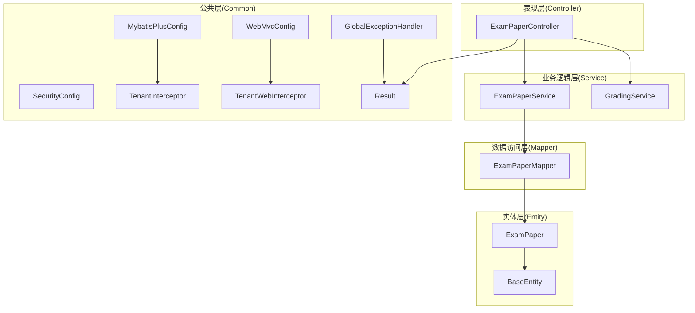
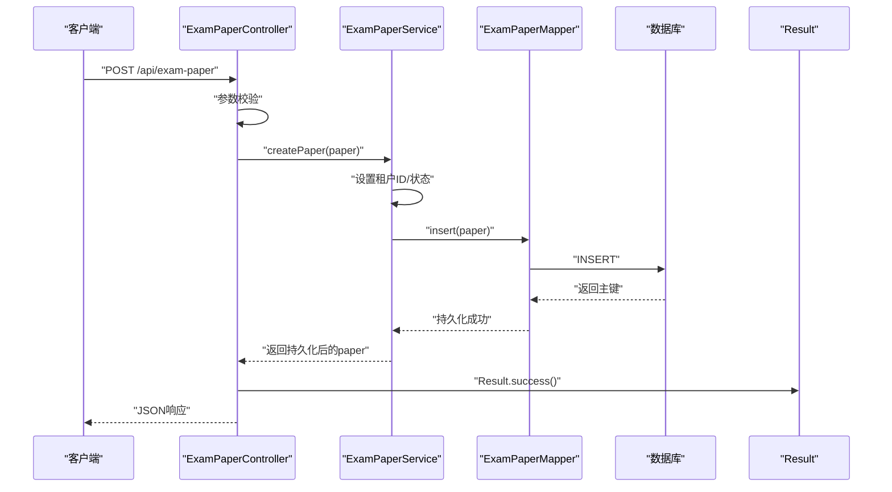
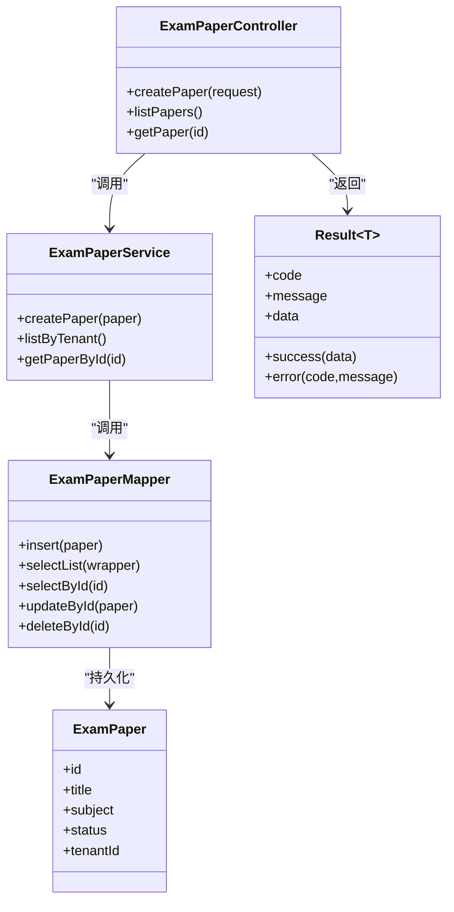
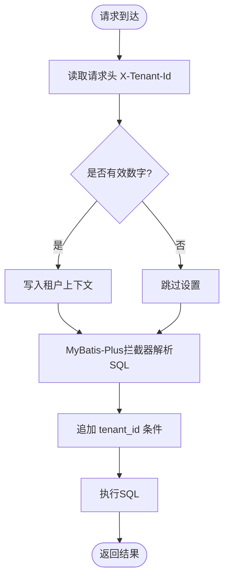
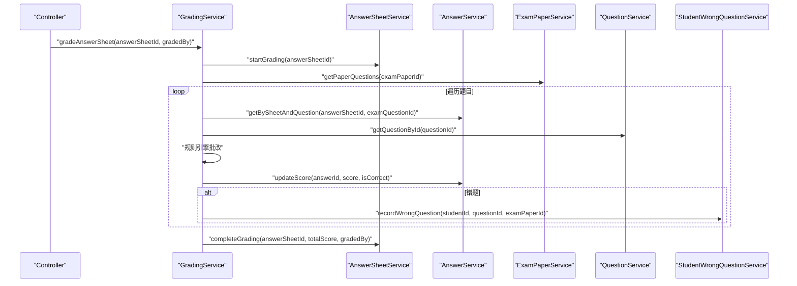
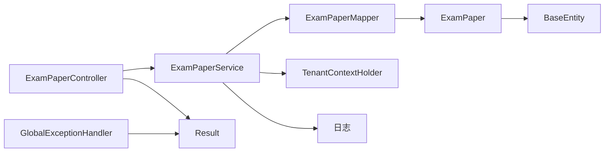

# 分层架构设计

<cite>
**本文引用的文件**
- [EduApplication.java](file://backend/src/main/java/com/edu/EduApplication.java)
- [MybatisPlusConfig.java](file://backend/src/main/java/com/edu/common/config/MybatisPlusConfig.java)
- [WebMvcConfig.java](file://backend/src/main/java/com/edu/common/config/WebMvcConfig.java)
- [SecurityConfig.java](file://backend/src/main/java/com/edu/common/config/SecurityConfig.java)
- [BaseEntity.java](file://backend/src/main/java/com/edu/common/entity/BaseEntity.java)
- [Result.java](file://backend/src/main/java/com/edu/common/entity/Result.java)
- [GlobalExceptionHandler.java](file://backend/src/main/java/com/edu/common/exception/GlobalExceptionHandler.java)
- [TenantInterceptor.java](file://backend/src/main/java/com/edu/common/interceptor/TenantInterceptor.java)
- [TenantWebInterceptor.java](file://backend/src/main/java/com/edu/common/interceptor/TenantWebInterceptor.java)
- [ExamPaperController.java](file://backend/src/main/java/com/edu/exam/controller/ExamPaperController.java)
- [ExamPaperService.java](file://backend/src/main/java/com/edu/exam/service/ExamPaperService.java)
- [ExamPaperMapper.java](file://backend/src/main/java/com/edu/exam/mapper/ExamPaperMapper.java)
- [ExamPaper.java](file://backend/src/main/java/com/edu/exam/entity/ExamPaper.java)
- [GradingService.java](file://backend/src/main/java/com/edu/grading/service/GradingService.java)
- [pom.xml](file://backend/pom.xml)
</cite>

## 目录
1. [引言](#引言)
2. [项目结构](#项目结构)
3. [核心组件](#核心组件)
4. [架构总览](#架构总览)
5. [详细组件分析](#详细组件分析)
6. [依赖分析](#依赖分析)
7. [性能考虑](#性能考虑)
8. [故障排查指南](#故障排查指南)
9. [结论](#结论)
10. [附录](#附录)

## 引言
本设计文档面向教师智能教学系统的后端代码，系统采用标准的四层架构：表现层（Controller）、业务逻辑层（Service）、数据访问层（Mapper）、实体层（Entity）。文档将详细阐述每层职责、接口设计原则、数据传递模式、层间依赖与调用链路、异常处理机制，并结合MyBatis-Plus与Spring MVC配置，给出最佳实践与性能优化建议。

## 项目结构
系统以模块化方式组织，按功能域划分包结构：
- 表现层：位于各功能域的 controller 包，负责接收HTTP请求、参数校验、返回统一响应。
- 业务逻辑层：位于各功能域的 service 包，封装领域业务规则与流程编排。
- 数据访问层：位于各功能域的 mapper 包，基于MyBatis-Plus进行数据库操作。
- 实体层：位于各功能域的 entity 包，继承通用基类，映射数据库表结构。
- 公共层：common 包下包含全局配置、统一响应、异常处理、多租户拦截等横切能力。

图表来源
- [ExamPaperController.java:1-218](file://backend/src/main/java/com/edu/exam/controller/ExamPaperController.java#L1-L218)
- [ExamPaperService.java:1-107](file://backend/src/main/java/com/edu/exam/service/ExamPaperService.java#L1-L107)
- [ExamPaperMapper.java:1-13](file://backend/src/main/java/com/edu/exam/mapper/ExamPaperMapper.java#L1-L13)
- [ExamPaper.java:1-31](file://backend/src/main/java/com/edu/exam/entity/ExamPaper.java#L1-L31)
- [MybatisPlusConfig.java:1-23](file://backend/src/main/java/com/edu/common/config/MybatisPlusConfig.java#L1-L23)
- [WebMvcConfig.java:1-24](file://backend/src/main/java/com/edu/common/config/WebMvcConfig.java#L1-L24)
- [SecurityConfig.java:1-50](file://backend/src/main/java/com/edu/common/config/SecurityConfig.java#L1-L50)
- [TenantInterceptor.java:1-142](file://backend/src/main/java/com/edu/common/interceptor/TenantInterceptor.java#L1-L142)
- [TenantWebInterceptor.java:1-42](file://backend/src/main/java/com/edu/common/interceptor/TenantWebInterceptor.java#L1-L42)
- [Result.java:1-44](file://backend/src/main/java/com/edu/common/entity/Result.java#L1-L44)
- [GlobalExceptionHandler.java:1-69](file://backend/src/main/java/com/edu/common/exception/GlobalExceptionHandler.java#L1-L69)

章节来源
- [EduApplication.java:1-15](file://backend/src/main/java/com/edu/EduApplication.java#L1-L15)
- [pom.xml:1-152](file://backend/pom.xml#L1-L152)

## 核心组件
- 应用入口与扫描
  - 应用启动类启用Spring Boot并扫描所有功能域的Mapper接口，确保MyBatis-Plus能发现各模块的持久层。
- 统一响应与异常处理
  - 统一响应包装Result，保证前后端一致的数据契约；全局异常处理器集中处理业务异常、参数校验、认证与权限异常以及未知异常。
- 多租户隔离
  - Web层拦截器从请求头读取租户ID并写入上下文；MyBatis-Plus拦截器在SQL执行前自动注入租户过滤条件，保障数据安全。
- 安全与鉴权
  - 基于Spring Security的无状态JWT过滤链，开放特定路径，其余请求均需认证。

章节来源
- [EduApplication.java:1-15](file://backend/src/main/java/com/edu/EduApplication.java#L1-L15)
- [Result.java:1-44](file://backend/src/main/java/com/edu/common/entity/Result.java#L1-L44)
- [GlobalExceptionHandler.java:1-69](file://backend/src/main/java/com/edu/common/exception/GlobalExceptionHandler.java#L1-L69)
- [MybatisPlusConfig.java:1-23](file://backend/src/main/java/com/edu/common/config/MybatisPlusConfig.java#L1-L23)
- [WebMvcConfig.java:1-24](file://backend/src/main/java/com/edu/common/config/WebMvcConfig.java#L1-L24)
- [SecurityConfig.java:1-50](file://backend/src/main/java/com/edu/common/config/SecurityConfig.java#L1-L50)
- [TenantInterceptor.java:1-142](file://backend/src/main/java/com/edu/common/interceptor/TenantInterceptor.java#L1-L142)
- [TenantWebInterceptor.java:1-42](file://backend/src/main/java/com/edu/common/interceptor/TenantWebInterceptor.java#L1-L42)

## 架构总览
系统遵循“Controller-Service-Mapper-Entity”分层，配合公共层横切关注点（安全、多租户、异常），形成清晰的职责边界与稳定的调用链路。

图表来源
- [ExamPaperController.java:35-52](file://backend/src/main/java/com/edu/exam/controller/ExamPaperController.java#L35-L52)
- [ExamPaperService.java:27-38](file://backend/src/main/java/com/edu/exam/service/ExamPaperService.java#L27-L38)
- [ExamPaperMapper.java:1-13](file://backend/src/main/java/com/edu/exam/mapper/ExamPaperMapper.java#L1-L13)
- [Result.java:21-31](file://backend/src/main/java/com/edu/common/entity/Result.java#L21-L31)

## 详细组件分析

### 表现层（Controller）职责与接口设计
- 职责
  - 接收HTTP请求，进行参数校验（@Valid），调用Service完成业务处理，组装统一响应对象。
  - 对外暴露REST风格接口，路径前缀按功能域划分，如“/api/exam-paper”。
- 设计原则
  - 单一职责：每个Controller聚焦一个资源或领域。
  - 参数校验前置：利用Spring Validation在进入业务逻辑前拦截非法输入。
  - 统一响应：所有Controller方法返回Result<T>，便于前端统一处理。
- 数据传递模式
  - 请求体：DTO（如ExamPaperCreateRequest）承载业务输入。
  - 响应体：DTO（如ExamPaperResponse）或Result<T>，避免直接暴露实体。
- 示例
  - 创建试卷：ExamPaperController.createPaper() -> Service.createPaper() -> Mapper.insert() -> Result.success()。

章节来源
- [ExamPaperController.java:1-218](file://backend/src/main/java/com/edu/exam/controller/ExamPaperController.java#L1-L218)
- [Result.java:1-44](file://backend/src/main/java/com/edu/common/entity/Result.java#L1-L44)

### 业务逻辑层（Service）职责与事务管理
- 职责
  - 封装业务规则与流程编排，协调多个Mapper或跨模块调用。
  - 通过注解声明事务边界，保证业务一致性。
- 设计原则
  - 领域内聚：同一业务场景下的操作放在同一个Service中。
  - 事务边界明确：长流程或跨表操作使用@Transactional标注。
  - 上下文与安全：读取租户上下文，必要时抛出业务异常。
- 示例
  - 试卷创建：ExamPaperService.createPaper()设置租户ID与默认状态，插入后记录日志。

章节来源
- [ExamPaperService.java:1-107](file://backend/src/main/java/com/edu/exam/service/ExamPaperService.java#L1-L107)

### 数据访问层（Mapper）与MyBatis-Plus
- 职责
  - 提供基础的CRUD能力，基于MyBatis-Plus简化SQL编写。
- 设计原则
  - 接口仅声明方法，不实现；具体SQL由框架生成或XML映射。
  - 与实体类一一对应，表名与实体类通过注解映射。
- 配置要点
  - 启动类开启Mapper扫描，公共配置注册MyBatis-Plus拦截器，注入租户过滤。
- 示例
  - ExamPaperMapper继承BaseMapper，提供ExamPaper实体的增删改查能力。

章节来源
- [ExamPaperMapper.java:1-13](file://backend/src/main/java/com/edu/exam/mapper/ExamPaperMapper.java#L1-L13)
- [MybatisPlusConfig.java:1-23](file://backend/src/main/java/com/edu/common/config/MybatisPlusConfig.java#L1-L23)
- [EduApplication.java:1-15](file://backend/src/main/java/com/edu/EduApplication.java#L1-L15)

### 实体层（Entity）与基类
- 职责
  - 映射数据库表结构，提供POJO属性与注解。
- 设计原则
  - 继承通用基类BaseEntity，统一字段（租户ID、创建/更新时间、逻辑删除）。
  - 使用注解标识表名与字段，减少重复配置。
- 示例
  - ExamPaper继承BaseEntity，包含试卷相关字段。

章节来源
- [BaseEntity.java:1-38](file://backend/src/main/java/com/edu/common/entity/BaseEntity.java#L1-L38)
- [ExamPaper.java:1-31](file://backend/src/main/java/com/edu/exam/entity/ExamPaper.java#L1-L31)

### 层间交互与调用链
- 控制器到服务：ExamPaperController -> ExamPaperService
- 服务到数据访问：ExamPaperService -> ExamPaperMapper
- 数据访问到数据库：MyBatis-Plus -> MySQL/H2
- 统一响应与异常：Controller -> Result；全局异常 -> Result.error

图表来源
- [ExamPaperController.java:1-218](file://backend/src/main/java/com/edu/exam/controller/ExamPaperController.java#L1-L218)
- [ExamPaperService.java:1-107](file://backend/src/main/java/com/edu/exam/service/ExamPaperService.java#L1-L107)
- [ExamPaperMapper.java:1-13](file://backend/src/main/java/com/edu/exam/mapper/ExamPaperMapper.java#L1-L13)
- [ExamPaper.java:1-31](file://backend/src/main/java/com/edu/exam/entity/ExamPaper.java#L1-L31)
- [Result.java:1-44](file://backend/src/main/java/com/edu/common/entity/Result.java#L1-L44)

### 多租户与安全拦截链
- Web层拦截：TenantWebInterceptor从请求头读取租户ID，写入上下文，清理在afterCompletion。
- MyBatis-Plus拦截：TenantInterceptor在查询前解析SQL，自动追加租户过滤条件，支持PlainSelect与SetOperationList。
- 安全配置：SecurityConfig禁用CSRF与frameOptions，会话策略STATELESS，开放特定路径，其余请求需认证。

图表来源
- [TenantWebInterceptor.java:1-42](file://backend/src/main/java/com/edu/common/interceptor/TenantWebInterceptor.java#L1-L42)
- [TenantInterceptor.java:1-142](file://backend/src/main/java/com/edu/common/interceptor/TenantInterceptor.java#L1-L142)
- [MybatisPlusConfig.java:1-23](file://backend/src/main/java/com/edu/common/config/MybatisPlusConfig.java#L1-L23)

章节来源
- [WebMvcConfig.java:1-24](file://backend/src/main/java/com/edu/common/config/WebMvcConfig.java#L1-L24)
- [SecurityConfig.java:1-50](file://backend/src/main/java/com/edu/common/config/SecurityConfig.java#L1-L50)

### 异常处理机制
- 全局异常处理器集中捕获：
  - 业务异常：返回400与错误码消息。
  - 租户异常：返回403。
  - 参数校验异常：收集字段错误信息，返回400。
  - 认证/权限异常：分别返回401/403。
  - 未知异常：返回500。
- 统一响应：所有异常最终包装为Result.error(code,message)，保持前后端一致。

章节来源
- [GlobalExceptionHandler.java:1-69](file://backend/src/main/java/com/edu/common/exception/GlobalExceptionHandler.java#L1-L69)
- [Result.java:1-44](file://backend/src/main/java/com/edu/common/entity/Result.java#L1-L44)

### 批改服务（示例：规则引擎）与跨模块协作
- 职责：对答题卡逐题批改，依据题型采用不同规则，汇总得分并记录错题。
- 调用链：GradingService -> AnswerSheetService/AnswerService/ExamPaperService/QuestionService/StudentWrongQuestionService。
- 事务：整个批改过程在一个事务中，保证一致性。

图表来源
- [GradingService.java:1-232](file://backend/src/main/java/com/edu/grading/service/GradingService.java#L1-L232)

章节来源
- [GradingService.java:1-232](file://backend/src/main/java/com/edu/grading/service/GradingService.java#L1-L232)

## 依赖分析
- 模块耦合
  - Controller仅依赖Service接口，低耦合高内聚。
  - Service依赖Mapper接口与工具/上下文，避免直接依赖具体实现。
  - Mapper依赖实体与MyBatis-Plus基础设施，不反向依赖上层。
- 外部依赖
  - MyBatis-Plus、Spring Security、JWT、Redis、H2、JSqlParser等。
- 循环依赖
  - 通过接口抽象避免循环依赖；跨模块调用通过Service层编排。

图表来源
- [ExamPaperController.java:1-218](file://backend/src/main/java/com/edu/exam/controller/ExamPaperController.java#L1-L218)
- [ExamPaperService.java:1-107](file://backend/src/main/java/com/edu/exam/service/ExamPaperService.java#L1-L107)
- [ExamPaperMapper.java:1-13](file://backend/src/main/java/com/edu/exam/mapper/ExamPaperMapper.java#L1-L13)
- [ExamPaper.java:1-31](file://backend/src/main/java/com/edu/exam/entity/ExamPaper.java#L1-L31)
- [BaseEntity.java:1-38](file://backend/src/main/java/com/edu/common/entity/BaseEntity.java#L1-L38)
- [Result.java:1-44](file://backend/src/main/java/com/edu/common/entity/Result.java#L1-L44)
- [GlobalExceptionHandler.java:1-69](file://backend/src/main/java/com/edu/common/exception/GlobalExceptionHandler.java#L1-L69)

章节来源
- [pom.xml:1-152](file://backend/pom.xml#L1-L152)

## 性能考虑
- SQL过滤与索引
  - 租户过滤在SQL层强制执行，建议在tenant_id、业务主键与常用查询字段建立索引。
- 批量与分页
  - 列表查询使用分页与排序，避免一次性加载大量数据。
- 缓存策略
  - 对热点配置与字典类数据引入缓存（Redis），降低数据库压力。
- 事务与锁
  - 批改等长事务尽量缩短，避免长时间持有行锁；对并发写入场景使用乐观锁或重试。
- 日志与监控
  - 关键路径增加日志埋点，结合指标监控定位慢查询与异常。

## 故障排查指南
- 常见问题
  - 401/403：检查JWT过滤链与认证入口点配置，确认请求头携带Token且未过期。
  - 400参数错误：查看全局异常中字段校验错误集合，修正请求体。
  - 业务异常：捕获BusinessException，核对Service中的业务规则与上下文。
  - 数据越权：确认Web层拦截器已设置租户上下文，且MyBatis-Plus拦截器生效。
- 排查步骤
  - 开启相应日志级别，观察全局异常处理器输出。
  - 在Service层打印关键入参与返回值，定位事务边界内的异常点。
  - 使用数据库审计或慢查询日志，定位SQL性能瓶颈。

章节来源
- [SecurityConfig.java:1-50](file://backend/src/main/java/com/edu/common/config/SecurityConfig.java#L1-L50)
- [GlobalExceptionHandler.java:1-69](file://backend/src/main/java/com/edu/common/exception/GlobalExceptionHandler.java#L1-L69)
- [TenantWebInterceptor.java:1-42](file://backend/src/main/java/com/edu/common/interceptor/TenantWebInterceptor.java#L1-L42)
- [TenantInterceptor.java:1-142](file://backend/src/main/java/com/edu/common/interceptor/TenantInterceptor.java#L1-L142)

## 结论
该系统通过清晰的四层架构与公共横切能力，实现了表现层与数据层的解耦、业务规则的集中管理与多租户的安全隔离。结合统一响应与异常处理机制，提升了系统的可维护性与可观测性。建议在后续迭代中持续完善缓存策略、异步批处理与监控告警体系，进一步提升性能与稳定性。

## 附录
- 配置清单
  - 启动类Mapper扫描：确保com.edu.*.mapper包被扫描。
  - MyBatis-Plus拦截器：注册TenantInterceptor，注入租户过滤。
  - WebMvc拦截器：注册TenantWebInterceptor，设置最高优先级。
  - 安全配置：无状态JWT过滤链，开放特定路径。
- 最佳实践
  - DTO/VO分离，严格控制对外暴露的数据结构。
  - 事务边界明确，长流程拆分与补偿策略。
  - 多租户贯穿所有数据访问路径，避免遗漏。
  - 统一异常与响应，前端友好提示与错误码。