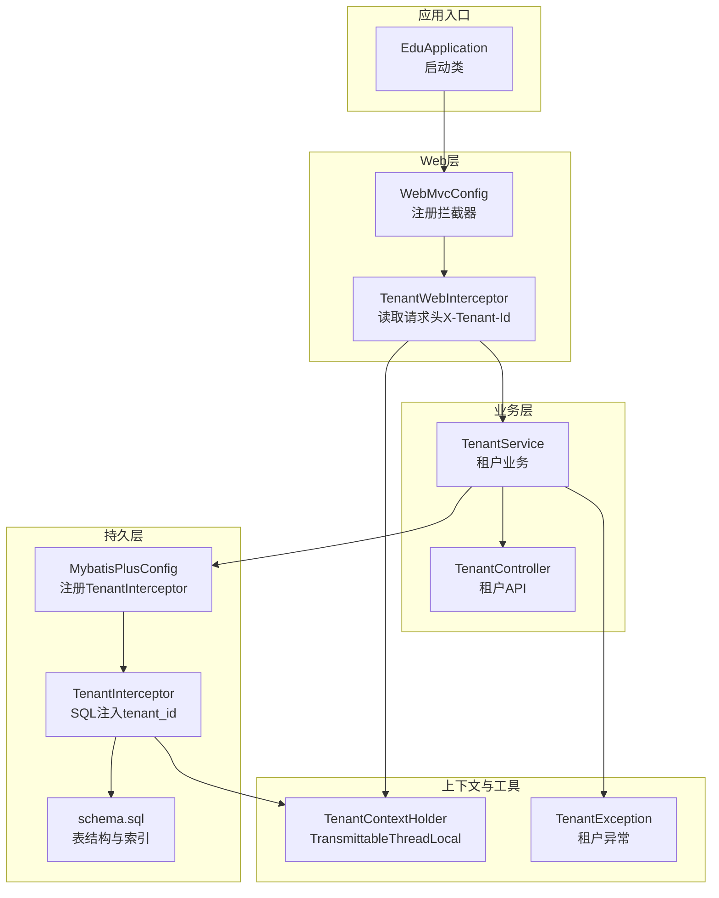
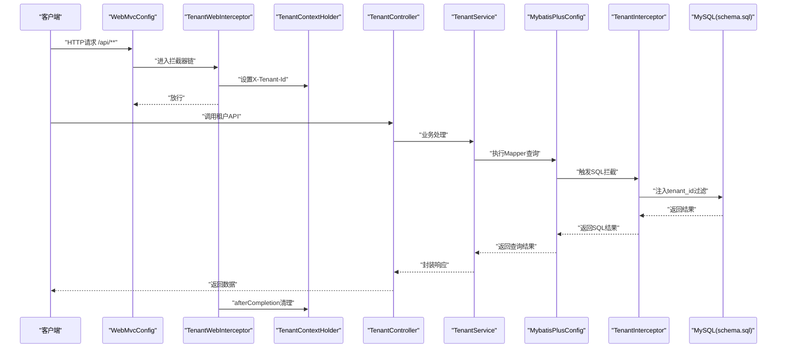
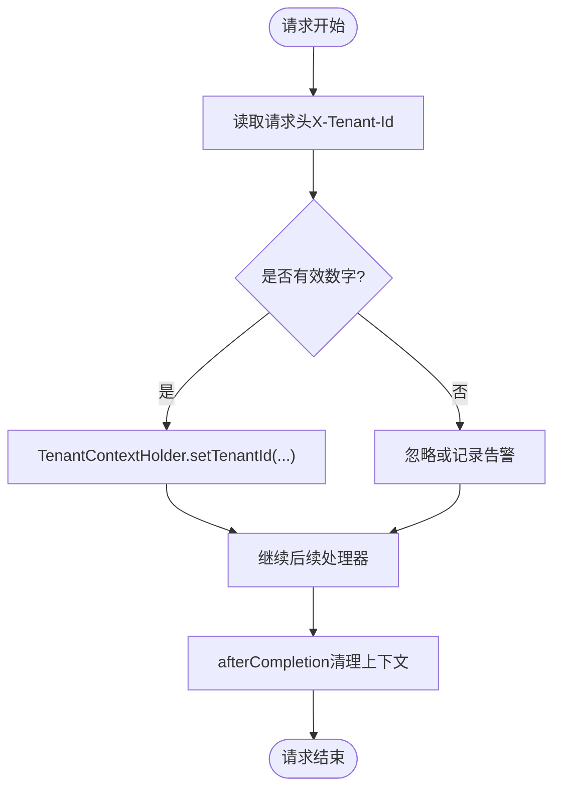
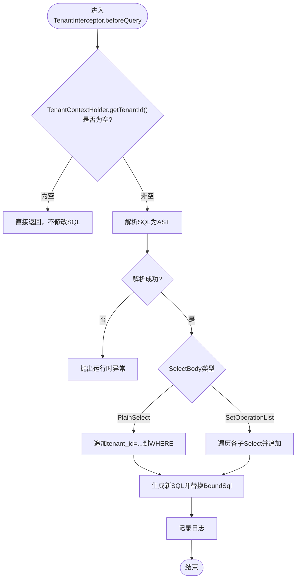
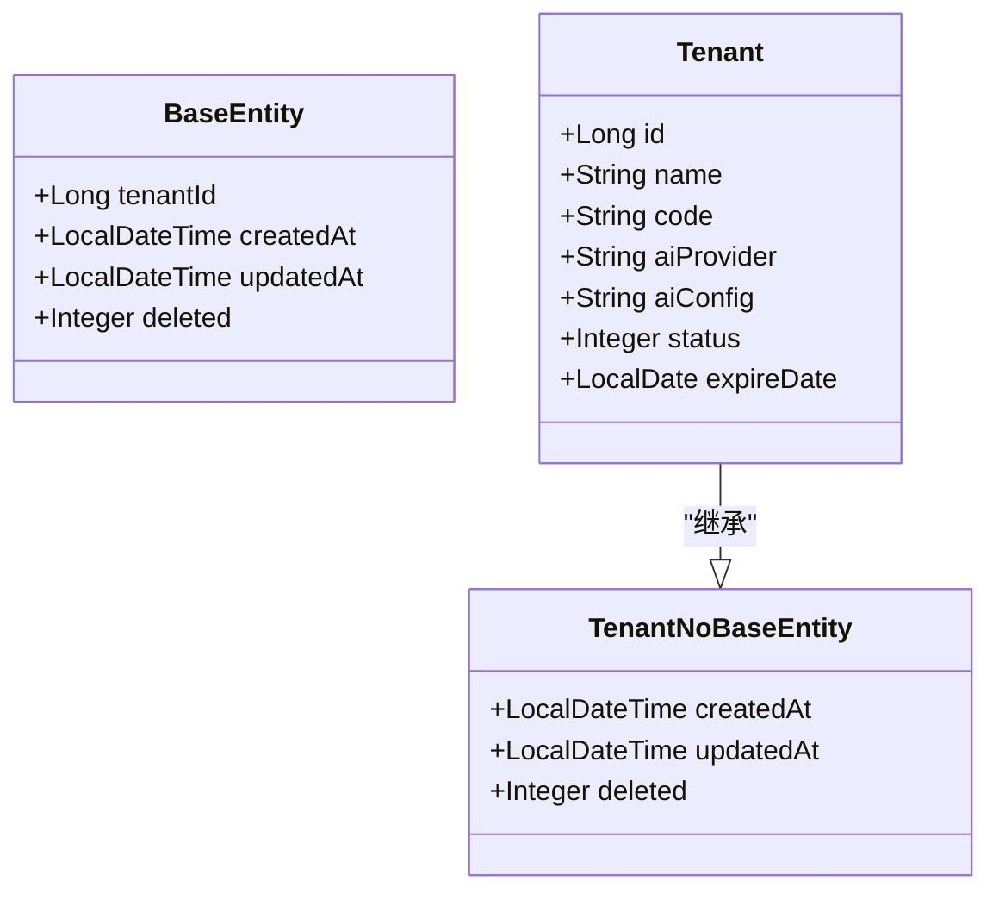
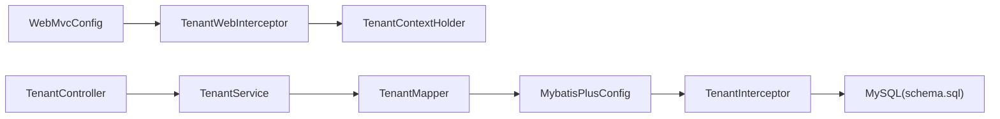

# 多租户架构

<cite>
**本文引用的文件**
- [EduApplication.java](file://backend/src/main/java/com/edu/EduApplication.java)
- [application.yml](file://backend/src/main/resources/application.yml)
- [schema.sql](file://backend/src/main/resources/db/schema.sql)
- [MybatisPlusConfig.java](file://backend/src/main/java/com/edu/common/config/MybatisPlusConfig.java)
- [WebMvcConfig.java](file://backend/src/main/java/com/edu/common/config/WebMvcConfig.java)
- [TenantInterceptor.java](file://backend/src/main/java/com/edu/common/interceptor/TenantInterceptor.java)
- [TenantWebInterceptor.java](file://backend/src/main/java/com/edu/common/interceptor/TenantWebInterceptor.java)
- [TenantContextHolder.java](file://backend/src/main/java/com/edu/common/util/TenantContextHolder.java)
- [BaseEntity.java](file://backend/src/main/java/com/edu/common/entity/BaseEntity.java)
- [TenantNoBaseEntity.java](file://backend/src/main/java/com/edu/common/entity/TenantNoBaseEntity.java)
- [Tenant.java](file://backend/src/main/java/com/edu/tenant/entity/Tenant.java)
- [TenantService.java](file://backend/src/main/java/com/edu/tenant/service/TenantService.java)
- [TenantController.java](file://backend/src/main/java/com/edu/tenant/controller/TenantController.java)
- [TenantException.java](file://backend/src/main/java/com/edu/common/exception/TenantException.java)
- [TenantInterceptorTest.java](file://backend/src/test/java/com/edu/common/interceptor/TenantInterceptorTest.java)
- [TenantContextHolderTest.java](file://backend/src/test/java/com/edu/common/util/TenantContextHolderTest.java)
</cite>

## 目录
1. [引言](#引言)
2. [项目结构](#项目结构)
3. [核心组件](#核心组件)
4. [架构总览](#架构总览)
5. [详细组件分析](#详细组件分析)
6. [依赖分析](#依赖分析)
7. [性能考虑](#性能考虑)
8. [故障排查指南](#故障排查指南)
9. [结论](#结论)
10. [附录](#附录)

## 引言
本文件面向开发者与架构师，系统化阐述教师智能教学平台的多租户设计与实现机制。重点包括：多租户概念与数据隔离策略、租户标识管理、租户拦截器工作原理、租户上下文传递机制、数据库连接与SQL过滤、租户配置与数据访问控制、以及资源隔离的落地实现。文档提供多租户场景下的数据流图、拦截器执行流程与配置示例，帮助快速在系统中集成与扩展多租户能力。

## 项目结构
后端采用Spring Boot + MyBatis-Plus架构，多租户能力通过“Web层拦截器 + MyBatis-Plus内嵌拦截器”的组合实现，配合租户上下文持有者与统一异常处理，形成完整的租户隔离闭环。数据库层面以“tenant_id”作为跨表隔离键，结合索引与外键约束保障一致性与性能。

图表来源
- [EduApplication.java:1-15](file://backend/src/main/java/com/edu/EduApplication.java#L1-L15)
- [WebMvcConfig.java:1-24](file://backend/src/main/java/com/edu/common/config/WebMvcConfig.java#L1-L24)
- [TenantWebInterceptor.java:1-42](file://backend/src/main/java/com/edu/common/interceptor/TenantWebInterceptor.java#L1-L42)
- [TenantService.java:1-81](file://backend/src/main/java/com/edu/tenant/service/TenantService.java#L1-L81)
- [TenantController.java:1-76](file://backend/src/main/java/com/edu/tenant/controller/TenantController.java#L1-L76)
- [MybatisPlusConfig.java:1-23](file://backend/src/main/java/com/edu/common/config/MybatisPlusConfig.java#L1-L23)
- [TenantInterceptor.java:1-142](file://backend/src/main/java/com/edu/common/interceptor/TenantInterceptor.java#L1-L142)
- [schema.sql:1-379](file://backend/src/main/resources/db/schema.sql#L1-L379)
- [TenantContextHolder.java:1-24](file://backend/src/main/java/com/edu/common/util/TenantContextHolder.java#L1-L24)
- [TenantException.java:1-28](file://backend/src/main/java/com/edu/common/exception/TenantException.java#L1-L28)

章节来源
- [EduApplication.java:1-15](file://backend/src/main/java/com/edu/EduApplication.java#L1-L15)
- [application.yml:1-65](file://backend/src/main/resources/application.yml#L1-L65)
- [schema.sql:1-379](file://backend/src/main/resources/db/schema.sql#L1-L379)

## 核心组件
- 租户上下文持有者：基于TransmittableThreadLocal的租户ID容器，支持线程与子线程间透传，确保跨线程访问时仍能获取到正确的租户上下文。
- Web层租户拦截器：从HTTP请求头X-Tenant-Id读取租户ID，写入租户上下文；请求结束后清理上下文，避免内存泄漏。
- MyBatis-Plus租户拦截器：在SQL解析阶段自动为查询语句追加tenant_id过滤条件，支持普通SELECT与UNION等复杂查询；对特定“豁免表”跳过过滤。
- 租户实体基类：统一在实体中声明tenant_id字段，便于MyBatis-Plus映射与逻辑删除。
- 租户服务与控制器：提供租户创建、查询、AI配置更新、禁用等能力，并进行租户有效性校验（状态、有效期）。
- 数据库Schema：所有业务表均包含tenant_id字段或通过外键关联至tenant_id，配合索引提升查询性能。

章节来源
- [TenantContextHolder.java:1-24](file://backend/src/main/java/com/edu/common/util/TenantContextHolder.java#L1-L24)
- [TenantWebInterceptor.java:1-42](file://backend/src/main/java/com/edu/common/interceptor/TenantWebInterceptor.java#L1-L42)
- [TenantInterceptor.java:1-142](file://backend/src/main/java/com/edu/common/interceptor/TenantInterceptor.java#L1-L142)
- [BaseEntity.java:1-38](file://backend/src/main/java/com/edu/common/entity/BaseEntity.java#L1-L38)
- [TenantService.java:1-81](file://backend/src/main/java/com/edu/tenant/service/TenantService.java#L1-L81)
- [TenantController.java:1-76](file://backend/src/main/java/com/edu/tenant/controller/TenantController.java#L1-L76)
- [schema.sql:1-379](file://backend/src/main/resources/db/schema.sql#L1-L379)

## 架构总览
多租户架构由“请求接入 → 上下文注入 → SQL过滤 → 数据返回”四步构成。Web层拦截器负责识别租户，MyBatis-Plus拦截器负责在SQL层面强制隔离，服务层负责业务规则与异常处理，数据库层提供物理隔离的表结构与索引支撑。

图表来源
- [WebMvcConfig.java:18-23](file://backend/src/main/java/com/edu/common/config/WebMvcConfig.java#L18-L23)
- [TenantWebInterceptor.java:19-41](file://backend/src/main/java/com/edu/common/interceptor/TenantWebInterceptor.java#L19-L41)
- [TenantContextHolder.java:12-22](file://backend/src/main/java/com/edu/common/util/TenantContextHolder.java#L12-L22)
- [TenantController.java:20-46](file://backend/src/main/java/com/edu/tenant/controller/TenantController.java#L20-L46)
- [TenantService.java:20-56](file://backend/src/main/java/com/edu/tenant/service/TenantService.java#L20-L56)
- [MybatisPlusConfig.java:16-21](file://backend/src/main/java/com/edu/common/config/MybatisPlusConfig.java#L16-L21)
- [TenantInterceptor.java:66-95](file://backend/src/main/java/com/edu/common/interceptor/TenantInterceptor.java#L66-L95)
- [schema.sql:9-41](file://backend/src/main/resources/db/schema.sql#L9-L41)

## 详细组件分析

### 租户上下文与线程透传
- 使用TransmittableThreadLocal保存当前请求的租户ID，确保在异步任务、定时任务或线程池中也能正确获取租户上下文。
- 在Web拦截器afterCompletion阶段清理上下文，防止请求间污染。

图表来源
- [TenantWebInterceptor.java:19-41](file://backend/src/main/java/com/edu/common/interceptor/TenantWebInterceptor.java#L19-L41)
- [TenantContextHolder.java:12-22](file://backend/src/main/java/com/edu/common/util/TenantContextHolder.java#L12-L22)

章节来源
- [TenantContextHolderTest.java:14-46](file://backend/src/test/java/com/edu/common/util/TenantContextHolderTest.java#L14-L46)

### Web层拦截器与租户标识注入
- 拦截路径：/api/**，优先级最高，确保在业务处理前完成租户上下文注入。
- 请求头约定：X-Tenant-Id，支持空值与非法格式的健壮性处理。
- 生命周期：preHandle设置上下文，afterCompletion清理，避免内存泄漏。

章节来源
- [WebMvcConfig.java:18-23](file://backend/src/main/java/com/edu/common/config/WebMvcConfig.java#L18-L23)
- [TenantWebInterceptor.java:17-41](file://backend/src/main/java/com/edu/common/interceptor/TenantWebInterceptor.java#L17-L41)

### MyBatis-Plus租户拦截器与SQL过滤
- 过滤时机：beforeQuery阶段，解析原始SQL为AST，自动为SELECT/UNION等语句追加tenant_id条件。
- 免过滤表集：针对无tenant_id列或通过父表关联的表（如tenant、tenant_config、permission、class、grade、school、sys_user、question、exam_question、answer、student_wrong_question、user_role、role_permission），直接跳过过滤。
- 安全性：解析失败抛出运行时异常，避免静默失败；支持自定义豁免表集合扩展。

图表来源
- [TenantInterceptor.java:66-95](file://backend/src/main/java/com/edu/common/interceptor/TenantInterceptor.java#L66-L95)
- [TenantInterceptor.java:97-122](file://backend/src/main/java/com/edu/common/interceptor/TenantInterceptor.java#L97-L122)
- [TenantInterceptor.java:124-140](file://backend/src/main/java/com/edu/common/interceptor/TenantInterceptor.java#L124-L140)

章节来源
- [TenantInterceptorTest.java:41-141](file://backend/src/test/java/com/edu/common/interceptor/TenantInterceptorTest.java#L41-L141)

### 租户实体基类与数据库隔离
- 实体基类BaseEntity统一包含tenant_id、createdAt、updatedAt、deleted字段，便于MyBatis-Plus自动填充与逻辑删除。
- 特殊表：TenantNoBaseEntity用于租户表等系统表，不包含tenant_id，避免循环依赖与冗余隔离。
- 数据库Schema：所有业务表均具备tenant_id或通过外键关联tenant_id，配合索引提升查询性能与一致性。

图表来源
- [BaseEntity.java:10-37](file://backend/src/main/java/com/edu/common/entity/BaseEntity.java#L10-L37)
- [TenantNoBaseEntity.java:10-22](file://backend/src/main/java/com/edu/common/entity/TenantNoBaseEntity.java#L10-L22)
- [Tenant.java:12-20](file://backend/src/main/java/com/edu/tenant/entity/Tenant.java#L12-L20)

章节来源
- [schema.sql:9-41](file://backend/src/main/resources/db/schema.sql#L9-L41)
- [schema.sql:302-379](file://backend/src/main/resources/db/schema.sql#L302-L379)

### 租户服务与数据访问控制
- 业务规则：创建租户时校验编码唯一性；查询租户时验证状态与有效期；更新AI配置与禁用租户均进行存在性检查。
- 异常体系：统一使用TenantException表达“不存在、已禁用、已到期、无权访问”等业务异常，便于前端与网关统一处理。

章节来源
- [TenantService.java:20-80](file://backend/src/main/java/com/edu/tenant/service/TenantService.java#L20-L80)
- [TenantException.java:6-27](file://backend/src/main/java/com/edu/common/exception/TenantException.java#L6-L27)

### 配置与部署要点
- 数据源与MyBatis-Plus：application.yml中配置数据源、MyBatis-Plus全局配置（驼峰映射、逻辑删除字段、Mapper扫描路径等）。
- 拦截器注册：WebMvcConfig将TenantWebInterceptor注册为最高优先级；MybatisPlusConfig注册TenantInterceptor。
- 启动类：EduApplication启用Mapper扫描，确保各模块Mapper被加载。

章节来源
- [application.yml:15-44](file://backend/src/main/resources/application.yml#L15-L44)
- [WebMvcConfig.java:18-23](file://backend/src/main/java/com/edu/common/config/WebMvcConfig.java#L18-L23)
- [MybatisPlusConfig.java:16-21](file://backend/src/main/java/com/edu/common/config/MybatisPlusConfig.java#L16-L21)
- [EduApplication.java:7-9](file://backend/src/main/java/com/edu/EduApplication.java#L7-L9)

## 依赖分析
- 组件耦合度：Web层与业务层通过接口解耦；拦截器仅依赖上下文与SQL解析库；持久层通过MyBatis-Plus与拦截器协作。
- 关键依赖链：
  - WebMvcConfig → TenantWebInterceptor → TenantContextHolder
  - TenantService → TenantMapper → MybatisPlusConfig → TenantInterceptor → MySQL
- 循环依赖：未发现循环依赖；拦截器与上下文相互独立，职责清晰。

图表来源
- [WebMvcConfig.java:16-23](file://backend/src/main/java/com/edu/common/config/WebMvcConfig.java#L16-L23)
- [TenantWebInterceptor.java:19-41](file://backend/src/main/java/com/edu/common/interceptor/TenantWebInterceptor.java#L19-L41)
- [TenantController.java:18-46](file://backend/src/main/java/com/edu/tenant/controller/TenantController.java#L18-L46)
- [TenantService.java:18-56](file://backend/src/main/java/com/edu/tenant/service/TenantService.java#L18-L56)
- [MybatisPlusConfig.java:16-21](file://backend/src/main/java/com/edu/common/config/MybatisPlusConfig.java#L16-L21)
- [TenantInterceptor.java:66-95](file://backend/src/main/java/com/edu/common/interceptor/TenantInterceptor.java#L66-L95)
- [schema.sql:9-41](file://backend/src/main/resources/db/schema.sql#L9-L41)

## 性能考虑
- SQL解析成本：TenantInterceptor在每次查询前解析SQL，建议对高频查询进行缓存与限流，避免解析开销放大。
- 索引优化：业务表普遍包含tenant_id索引或外键索引，建议定期分析慢查询并补充复合索引。
- 线程透传：TransmittableThreadLocal在多线程场景下减少上下文传递成本，但需注意清理时机，避免内存泄漏。
- 数据库连接：HikariCP连接池参数已在application.yml中配置，建议根据并发量与QPS调整最大连接数与超时时间。

## 故障排查指南
- 现象：查询不到数据或返回了其他租户的数据
  - 排查点：确认请求头X-Tenant-Id是否正确传递；检查TenantContextHolder是否在请求生命周期内存在；核对SQL是否被TenantInterceptor注入tenant_id条件。
  - 参考测试：TenantInterceptorTest覆盖了“无tenant_id跳过”“豁免表不注入”“UNION注入”等场景。
- 现象：解析SQL失败导致异常
  - 排查点：检查SQL语法是否合法；确认是否命中了TenantInterceptor的豁免表；查看日志中的原始SQL。
  - 参考测试：TenantInterceptorTest覆盖了解析失败场景。
- 现象：线程池中无法获取租户上下文
  - 排查点：确认是否使用了TransmittableThreadLocal；确保在子线程启动前设置上下文；避免在异步回调中遗漏设置。
  - 参考测试：TenantContextHolderTest验证了线程透传行为。
- 现象：租户状态异常或已过期
  - 排查点：TenantService在查询租户时会校验状态与有效期，异常将抛出TenantException；检查租户状态与到期日期。

章节来源
- [TenantInterceptorTest.java:96-115](file://backend/src/test/java/com/edu/common/interceptor/TenantInterceptorTest.java#L96-L115)
- [TenantInterceptorTest.java:131-141](file://backend/src/test/java/com/edu/common/interceptor/TenantInterceptorTest.java#L131-L141)
- [TenantContextHolderTest.java:34-46](file://backend/src/test/java/com/edu/common/util/TenantContextHolderTest.java#L34-L46)
- [TenantService.java:44-56](file://backend/src/main/java/com/edu/tenant/service/TenantService.java#L44-L56)
- [TenantException.java:12-26](file://backend/src/main/java/com/edu/common/exception/TenantException.java#L12-L26)

## 结论
本系统通过“Web层拦截器 + MyBatis-Plus拦截器 + 租户上下文持有者 + 统一异常处理”的组合，实现了稳定、可扩展的多租户隔离方案。数据库层面以tenant_id为核心隔离键，辅以索引与外键约束，兼顾安全与性能。建议在生产环境中结合监控与压测持续优化SQL解析与连接池配置，并通过完善的测试覆盖保证多租户行为的正确性。

## 附录
- 配置示例（摘自application.yml）
  - 数据源：MySQL连接信息、HikariCP连接池参数
  - MyBatis-Plus：Mapper扫描路径、驼峰映射、逻辑删除字段
  - JWT与AI默认配置：用于鉴权与AI服务调用
- 数据模型（节选）
  - 租户表：包含租户ID、编码、AI提供商、状态、到期日等
  - 用户/角色/权限/组织/题库/试卷/答题/分析/错题等业务表均包含tenant_id或通过外键关联tenant_id
  - 索引：为tenant_id与外键列建立索引，提升查询性能

章节来源
- [application.yml:15-65](file://backend/src/main/resources/application.yml#L15-L65)
- [schema.sql:9-379](file://backend/src/main/resources/db/schema.sql#L9-L379)