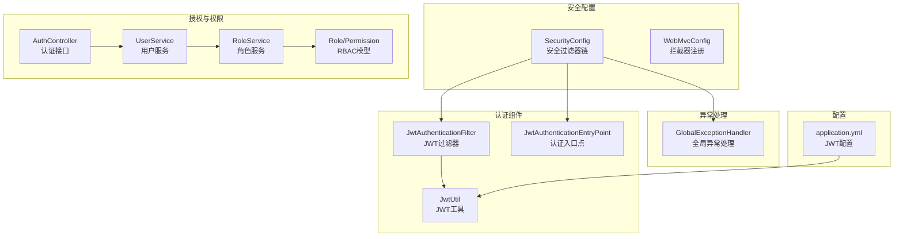
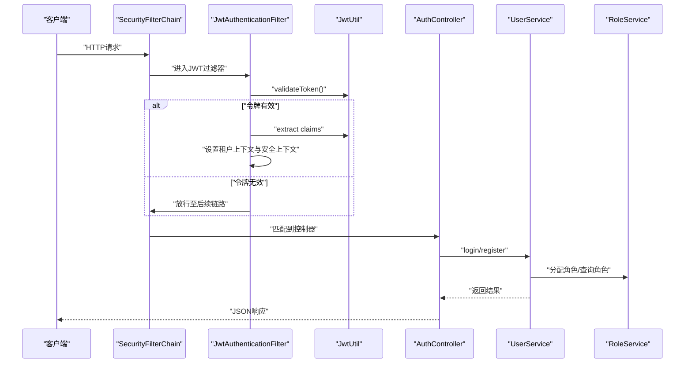
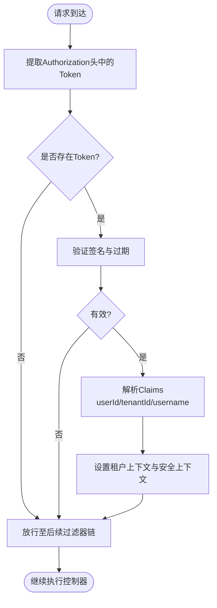
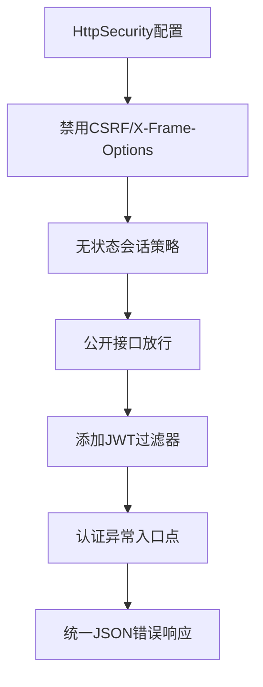
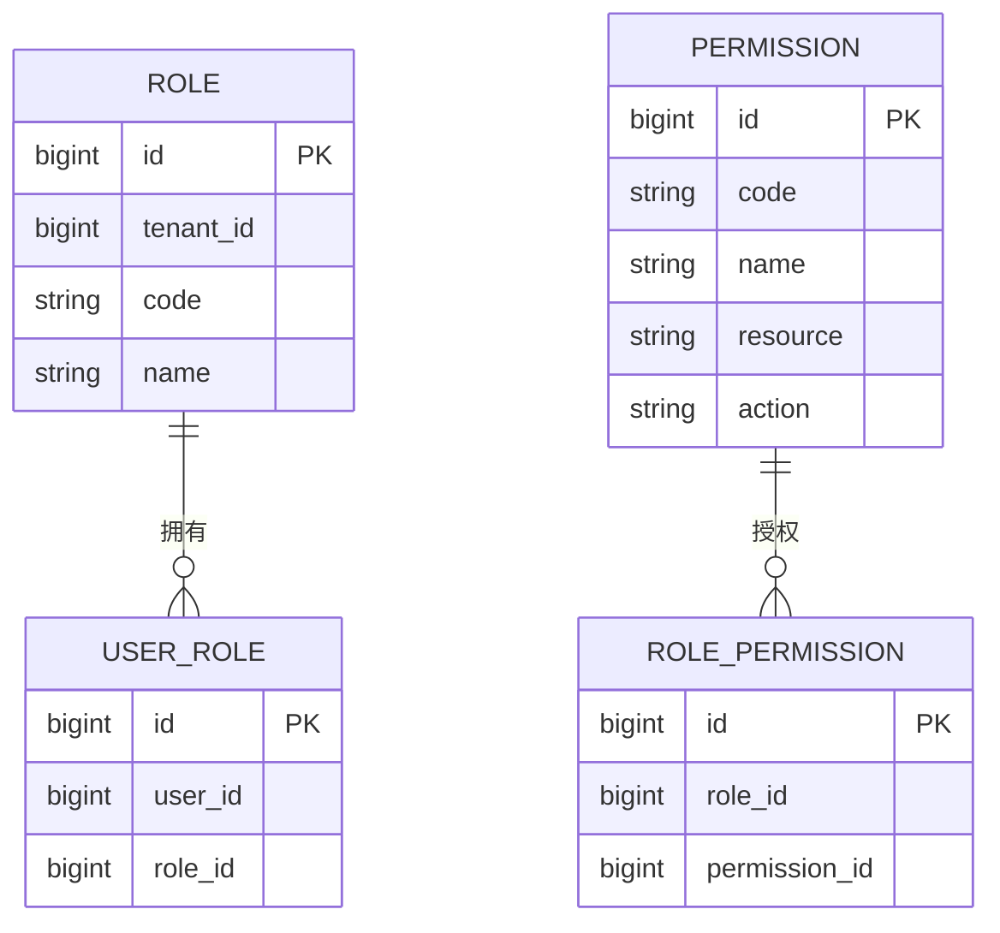
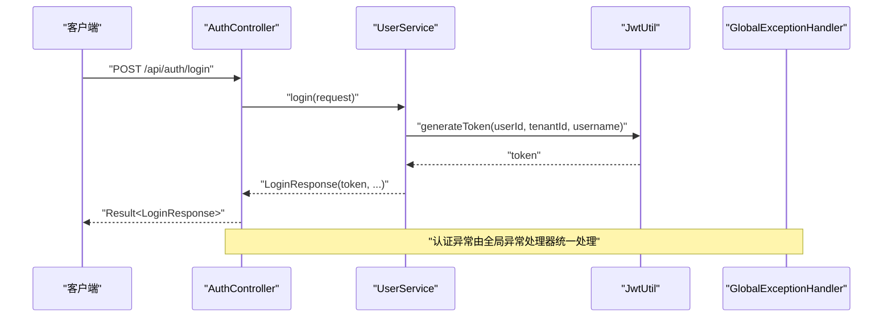
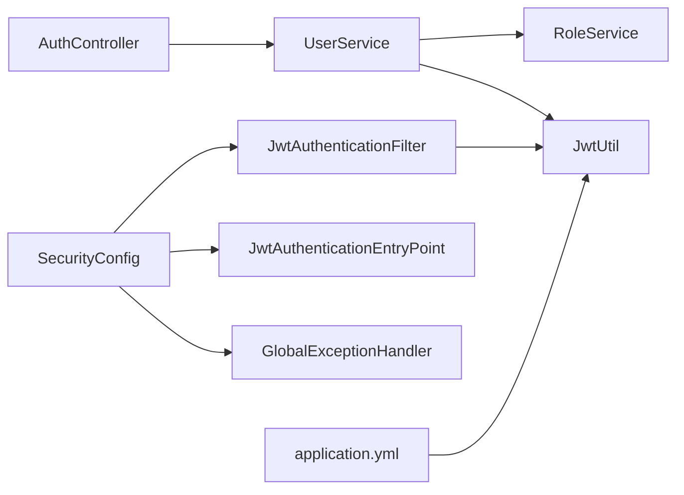
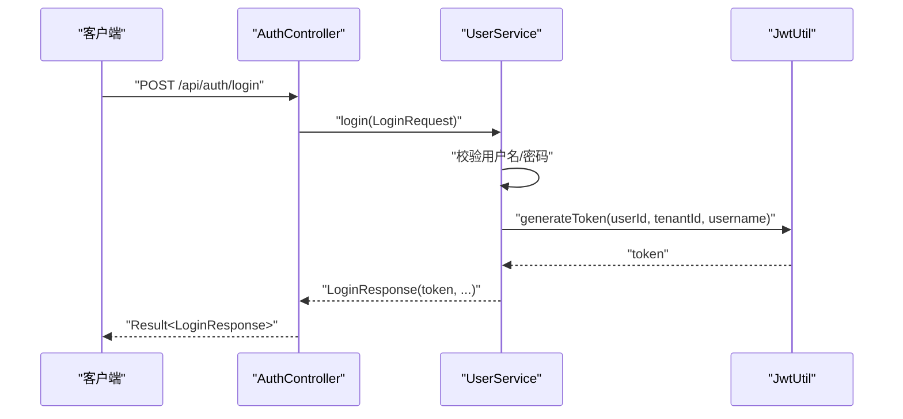

# 安全架构设计

<cite>
**本文引用的文件**
- [SecurityConfig.java](file://backend/src/main/java/com/edu/common/config/SecurityConfig.java)
- [JwtAuthenticationFilter.java](file://backend/src/main/java/com/edu/common/security/JwtAuthenticationFilter.java)
- [JwtAuthenticationEntryPoint.java](file://backend/src/main/java/com/edu/common/security/JwtAuthenticationEntryPoint.java)
- [JwtUtil.java](file://backend/src/main/java/com/edu/common/util/JwtUtil.java)
- [UserService.java](file://backend/src/main/java/com/edu/user/service/UserService.java)
- [RoleService.java](file://backend/src/main/java/com/edu/user/service/RoleService.java)
- [AuthController.java](file://backend/src/main/java/com/edu/user/controller/AuthController.java)
- [GlobalExceptionHandler.java](file://backend/src/main/java/com/edu/common/exception/GlobalExceptionHandler.java)
- [WebMvcConfig.java](file://backend/src/main/java/com/edu/common/config/WebMvcConfig.java)
- [application.yml](file://backend/src/main/resources/application.yml)
- [Role.java](file://backend/src/main/java/com/edu/user/entity/Role.java)
- [Permission.java](file://backend/src/main/java/com/edu/user/entity/Permission.java)
- [UserRole.java](file://backend/src/main/java/com/edu/user/entity/UserRole.java)
- [RolePermission.java](file://backend/src/main/java/com/edu/user/entity/RolePermission.java)
</cite>

## 目录
1. [简介](#简介)
2. [项目结构](#项目结构)
3. [核心组件](#核心组件)
4. [架构总览](#架构总览)
5. [详细组件分析](#详细组件分析)
6. [依赖分析](#依赖分析)
7. [性能考虑](#性能考虑)
8. [故障排查指南](#故障排查指南)
9. [结论](#结论)
10. [附录](#附录)

## 简介
本文件面向教师智能教学系统的安全架构设计与实现，重点阐述以下内容：
- 基于JWT的无状态认证工作原理与实现
- 安全过滤器链配置、异常处理机制与公开接口策略
- 基于租户上下文的多租户安全隔离
- RBAC权限模型（角色-权限）与用户角色管理
- 密码加密策略与安全配置要点
- 跨域与CORS处理现状与建议
- 认证流程图、安全架构图与配置示例路径

## 项目结构
后端采用分层架构，安全相关代码主要集中在以下模块：
- 安全配置：Spring Security配置、密码编码器、过滤器链
- 认证组件：JWT工具、认证过滤器、认证入口点
- 授权与权限：用户服务、角色服务、控制器
- 异常处理：全局异常处理器
- 配置文件：应用配置（JWT密钥、过期时间等）

图表来源
- [SecurityConfig.java:26-43](file://backend/src/main/java/com/edu/common/config/SecurityConfig.java#L26-L43)
- [JwtAuthenticationFilter.java:23-53](file://backend/src/main/java/com/edu/common/security/JwtAuthenticationFilter.java#L23-L53)
- [JwtAuthenticationEntryPoint.java:16-31](file://backend/src/main/java/com/edu/common/security/JwtAuthenticationEntryPoint.java#L16-L31)
- [JwtUtil.java:33-45](file://backend/src/main/java/com/edu/common/util/JwtUtil.java#L33-L45)
- [AuthController.java:16-31](file://backend/src/main/java/com/edu/user/controller/AuthController.java#L16-L31)
- [UserService.java:68-104](file://backend/src/main/java/com/edu/user/service/UserService.java#L68-L104)
- [RoleService.java:34-55](file://backend/src/main/java/com/edu/user/service/RoleService.java#L34-L55)
- [GlobalExceptionHandler.java:21-68](file://backend/src/main/java/com/edu/common/exception/GlobalExceptionHandler.java#L21-L68)
- [application.yml:45-47](file://backend/src/main/resources/application.yml#L45-L47)

章节来源
- [SecurityConfig.java:26-49](file://backend/src/main/java/com/edu/common/config/SecurityConfig.java#L26-L49)
- [WebMvcConfig.java:14-23](file://backend/src/main/java/com/edu/common/config/WebMvcConfig.java#L14-L23)
- [application.yml:45-47](file://backend/src/main/resources/application.yml#L45-L47)

## 核心组件
- 安全过滤器链：禁用CSRF与X-Frame-Options，设置无状态会话，统一认证入口点，公开接口放行，添加JWT过滤器
- JWT工具：生成、解析、验证令牌，提取用户ID、租户ID、用户名，检查过期
- 认证过滤器：从请求头提取Bearer Token，校验有效性，设置租户上下文与安全上下文
- 认证入口点：未认证时返回JSON格式的统一错误响应
- 用户服务：注册、登录、密码加密、角色分配
- 角色服务：角色查询、分配、用户角色列表
- 全局异常处理：业务异常、认证异常、权限不足、参数校验异常统一处理
- WebMvc拦截器：租户上下文拦截器在MVC层生效

章节来源
- [SecurityConfig.java:26-43](file://backend/src/main/java/com/edu/common/config/SecurityConfig.java#L26-L43)
- [JwtAuthenticationFilter.java:27-61](file://backend/src/main/java/com/edu/common/security/JwtAuthenticationFilter.java#L27-L61)
- [JwtAuthenticationEntryPoint.java:18-30](file://backend/src/main/java/com/edu/common/security/JwtAuthenticationEntryPoint.java#L18-L30)
- [JwtUtil.java:33-121](file://backend/src/main/java/com/edu/common/util/JwtUtil.java#L33-L121)
- [UserService.java:34-104](file://backend/src/main/java/com/edu/user/service/UserService.java#L34-L104)
- [RoleService.java:34-74](file://backend/src/main/java/com/edu/user/service/RoleService.java#L34-L74)
- [GlobalExceptionHandler.java:23-60](file://backend/src/main/java/com/edu/common/exception/GlobalExceptionHandler.java#L23-L60)
- [WebMvcConfig.java:18-23](file://backend/src/main/java/com/edu/common/config/WebMvcConfig.java#L18-L23)

## 架构总览
系统采用无状态认证（JWT），通过自定义过滤器在请求进入控制器前完成身份识别与租户隔离。认证失败由统一入口点返回标准错误响应；业务异常与安全异常由全局异常处理器统一处理。

图表来源
- [SecurityConfig.java:26-43](file://backend/src/main/java/com/edu/common/config/SecurityConfig.java#L26-L43)
- [JwtAuthenticationFilter.java:27-53](file://backend/src/main/java/com/edu/common/security/JwtAuthenticationFilter.java#L27-L53)
- [JwtUtil.java:66-77](file://backend/src/main/java/com/edu/common/util/JwtUtil.java#L66-L77)
- [AuthController.java:20-30](file://backend/src/main/java/com/edu/user/controller/AuthController.java#L20-L30)
- [UserService.java:68-104](file://backend/src/main/java/com/edu/user/service/UserService.java#L68-L104)
- [RoleService.java:34-55](file://backend/src/main/java/com/edu/user/service/RoleService.java#L34-L55)

## 详细组件分析

### JWT无状态认证工作原理
- 令牌生成：包含用户ID、租户ID、用户名、签发时间、过期时间与签名
- 令牌验证：使用对称密钥验证签名与过期时间
- 请求处理：过滤器从Authorization头读取Bearer Token，校验后将用户标识写入安全上下文
- 租户隔离：从令牌中提取租户ID，设置租户上下文，确保数据隔离

图表来源
- [JwtAuthenticationFilter.java:32-52](file://backend/src/main/java/com/edu/common/security/JwtAuthenticationFilter.java#L32-L52)
- [JwtUtil.java:66-121](file://backend/src/main/java/com/edu/common/util/JwtUtil.java#L66-L121)

章节来源
- [JwtUtil.java:33-45](file://backend/src/main/java/com/edu/common/util/JwtUtil.java#L33-L45)
- [JwtUtil.java:66-77](file://backend/src/main/java/com/edu/common/util/JwtUtil.java#L66-L77)
- [JwtAuthenticationFilter.java:34-49](file://backend/src/main/java/com/edu/common/security/JwtAuthenticationFilter.java#L34-L49)

### 安全过滤器链配置与异常处理
- 禁用CSRF与X-Frame-Options，启用无状态会话
- 公开接口放行：认证、租户、H2控制台、错误端点
- 添加JWT过滤器在用户名密码过滤器之前
- 认证异常交由认证入口点统一输出JSON错误

图表来源
- [SecurityConfig.java:27-42](file://backend/src/main/java/com/edu/common/config/SecurityConfig.java#L27-L42)
- [JwtAuthenticationEntryPoint.java:18-30](file://backend/src/main/java/com/edu/common/security/JwtAuthenticationEntryPoint.java#L18-L30)

章节来源
- [SecurityConfig.java:27-42](file://backend/src/main/java/com/edu/common/config/SecurityConfig.java#L27-L42)
- [JwtAuthenticationEntryPoint.java:18-30](file://backend/src/main/java/com/edu/common/security/JwtAuthenticationEntryPoint.java#L18-L30)

### 基于角色的访问控制（RBAC）
- 角色实体：包含租户ID、角色编码与名称
- 权限实体：资源与动作的抽象
- 关联表：用户-角色、角色-权限
- 用户服务：根据角色编码为用户分配默认角色
- 角色服务：按编码查询角色、分配角色给用户、查询用户角色列表

图表来源
- [Role.java:11-17](file://backend/src/main/java/com/edu/user/entity/Role.java#L11-L17)
- [Permission.java:10-17](file://backend/src/main/java/com/edu/user/entity/Permission.java#L10-L17)
- [UserRole.java:8-14](file://backend/src/main/java/com/edu/user/entity/UserRole.java#L8-L14)
- [RolePermission.java:8-14](file://backend/src/main/java/com/edu/user/entity/RolePermission.java#L8-L14)

章节来源
- [RoleService.java:26-55](file://backend/src/main/java/com/edu/user/service/RoleService.java#L26-L55)
- [UserService.java:60-66](file://backend/src/main/java/com/edu/user/service/UserService.java#L60-L66)

### 会话管理策略
- 无状态会话：通过配置STATELESS，不使用Session存储用户状态
- 租户上下文：在JWT过滤器中设置租户ID，贯穿请求生命周期
- 登录即发JWT：登录成功后返回令牌，客户端在后续请求头携带

章节来源
- [SecurityConfig.java:31](file://backend/src/main/java/com/edu/common/config/SecurityConfig.java#L31)
- [JwtAuthenticationFilter.java:40-41](file://backend/src/main/java/com/edu/common/security/JwtAuthenticationFilter.java#L40-L41)
- [UserService.java:94](file://backend/src/main/java/com/edu/user/service/UserService.java#L94)

### 密码加密与安全配置
- 密码加密：使用BCryptPasswordEncoder进行编码与匹配
- JWT配置：密钥与过期时间通过环境变量注入
- 数据源配置：MySQL连接参数与初始化脚本

章节来源
- [SecurityConfig.java:46-48](file://backend/src/main/java/com/edu/common/config/SecurityConfig.java#L46-L48)
- [UserService.java:53](file://backend/src/main/java/com/edu/user/service/UserService.java#L53)
- [application.yml:45-47](file://backend/src/main/resources/application.yml#L45-L47)

### 跨域处理现状与建议
- 当前未显式配置CORS，若前端与后端端口不同，需在SecurityConfig中添加CORS配置以允许特定来源与方法
- 建议仅开放必要来源与方法，并限制凭证传递

[本节为通用建议，不直接分析具体文件]

### 认证流程与控制器交互
- 登录/注册接口：AuthController调用UserService完成认证与角色分配
- 返回结果：LoginResponse包含令牌与用户信息
- 异常处理：全局异常处理器捕获业务异常与认证异常并返回统一格式

图表来源
- [AuthController.java:20-24](file://backend/src/main/java/com/edu/user/controller/AuthController.java#L20-L24)
- [UserService.java:68-104](file://backend/src/main/java/com/edu/user/service/UserService.java#L68-L104)
- [JwtUtil.java:33-45](file://backend/src/main/java/com/edu/common/util/JwtUtil.java#L33-L45)
- [GlobalExceptionHandler.java:48-53](file://backend/src/main/java/com/edu/common/exception/GlobalExceptionHandler.java#L48-L53)

## 依赖分析
- 组件耦合度：安全过滤器依赖JWT工具；用户服务依赖角色服务与密码编码器；全局异常处理器被Spring MVC异常传播机制触发
- 外部依赖：JWT库、Spring Security、MyBatis-Plus、MySQL驱动
- 配置依赖：JWT密钥与过期时间来自配置文件，数据库连接参数来自环境变量

图表来源
- [SecurityConfig.java:23-24](file://backend/src/main/java/com/edu/common/config/SecurityConfig.java#L23-L24)
- [JwtAuthenticationFilter.java:25](file://backend/src/main/java/com/edu/common/security/JwtAuthenticationFilter.java#L25)
- [JwtUtil.java:20-24](file://backend/src/main/java/com/edu/common/util/JwtUtil.java#L20-L24)
- [AuthController.java:18](file://backend/src/main/java/com/edu/user/controller/AuthController.java#L18)
- [UserService.java:30-32](file://backend/src/main/java/com/edu/user/service/UserService.java#L30-L32)
- [RoleService.java:24](file://backend/src/main/java/com/edu/user/service/RoleService.java#L24)
- [JwtAuthenticationEntryPoint.java:23](file://backend/src/main/java/com/edu/common/security/JwtAuthenticationEntryPoint.java#L23)
- [GlobalExceptionHandler.java:23-28](file://backend/src/main/java/com/edu/common/exception/GlobalExceptionHandler.java#L23-L28)
- [application.yml:45-47](file://backend/src/main/resources/application.yml#L45-L47)

章节来源
- [SecurityConfig.java:23-24](file://backend/src/main/java/com/edu/common/config/SecurityConfig.java#L23-L24)
- [JwtAuthenticationFilter.java:25](file://backend/src/main/java/com/edu/common/security/JwtAuthenticationFilter.java#L25)
- [JwtUtil.java:20-24](file://backend/src/main/java/com/edu/common/util/JwtUtil.java#L20-L24)
- [AuthController.java:18](file://backend/src/main/java/com/edu/user/controller/AuthController.java#L18)
- [UserService.java:30-32](file://backend/src/main/java/com/edu/user/service/UserService.java#L30-L32)
- [RoleService.java:24](file://backend/src/main/java/com/edu/user/service/RoleService.java#L24)
- [JwtAuthenticationEntryPoint.java:23](file://backend/src/main/java/com/edu/common/security/JwtAuthenticationEntryPoint.java#L23)
- [GlobalExceptionHandler.java:23-28](file://backend/src/main/java/com/edu/common/exception/GlobalExceptionHandler.java#L23-L28)
- [application.yml:45-47](file://backend/src/main/resources/application.yml#L45-L47)

## 性能考虑
- JWT验证为内存计算，避免额外数据库查询，适合高并发场景
- 过期时间建议适中，过短增加重登录频率，过长增加风险暴露窗口
- 可结合Redis实现黑名单（JWT撤销）或短期缓存优化频繁校验
- 密码加密成本较高，登录时仅做一次匹配，避免重复编码

[本节提供一般性指导，不直接分析具体文件]

## 故障排查指南
- 认证失败：检查Authorization头格式是否为Bearer Token，密钥与过期时间配置是否正确
- 令牌过期：确认客户端在过期前刷新令牌
- 权限不足：检查用户角色与资源权限映射是否正确
- 参数校验失败：查看全局异常处理器对字段校验错误的聚合输出
- 租户上下文缺失：确认登录时是否携带正确的租户ID，以及JWT中是否包含该值

章节来源
- [JwtAuthenticationEntryPoint.java:23-30](file://backend/src/main/java/com/edu/common/security/JwtAuthenticationEntryPoint.java#L23-L30)
- [GlobalExceptionHandler.java:37-46](file://backend/src/main/java/com/edu/common/exception/GlobalExceptionHandler.java#L37-L46)
- [JwtUtil.java:115-121](file://backend/src/main/java/com/edu/common/util/JwtUtil.java#L115-L121)

## 结论
系统采用JWT无状态认证与RBAC权限模型，结合租户上下文实现多租户隔离。通过统一的过滤器链、认证入口点与全局异常处理，形成清晰的安全边界与一致的错误响应。建议在生产环境中完善CORS配置、引入令牌撤销机制与审计日志，持续提升安全性与可观测性。

[本节为总结性内容，不直接分析具体文件]

## 附录

### 配置示例路径
- JWT密钥与过期时间：[application.yml:45-47](file://backend/src/main/resources/application.yml#L45-L47)
- 密码编码器Bean：[SecurityConfig.java:46-48](file://backend/src/main/java/com/edu/common/config/SecurityConfig.java#L46-L48)
- 公开接口放行规则：[SecurityConfig.java:34-38](file://backend/src/main/java/com/edu/common/config/SecurityConfig.java#L34-L38)
- 认证入口点Bean：[SecurityConfig.java:23-24](file://backend/src/main/java/com/edu/common/config/SecurityConfig.java#L23-L24)

### 关键流程图：登录与令牌发放

图表来源
- [AuthController.java:20-24](file://backend/src/main/java/com/edu/user/controller/AuthController.java#L20-L24)
- [UserService.java:68-104](file://backend/src/main/java/com/edu/user/service/UserService.java#L68-L104)
- [JwtUtil.java:33-45](file://backend/src/main/java/com/edu/common/util/JwtUtil.java#L33-L45)