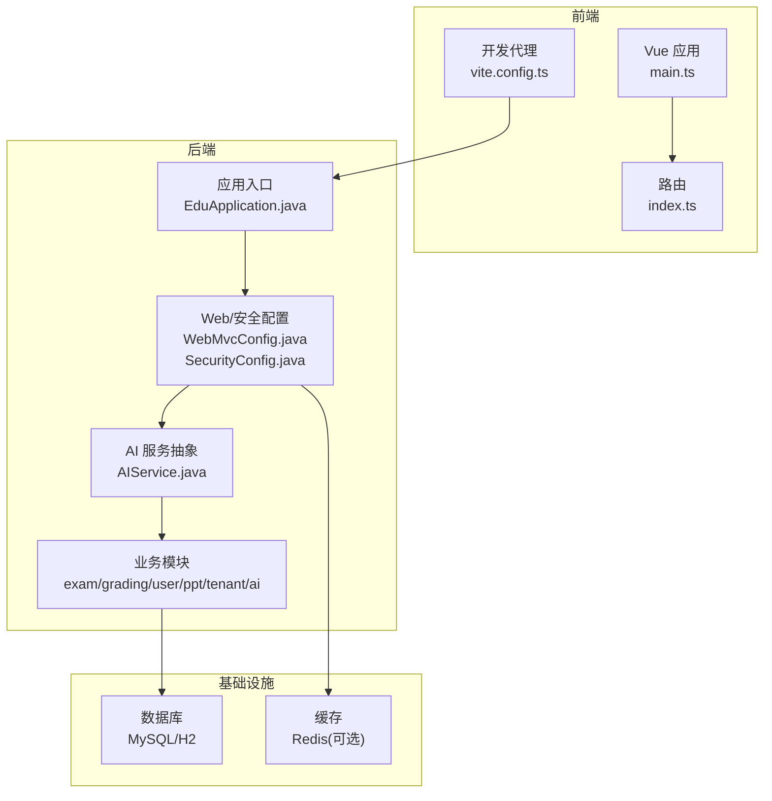
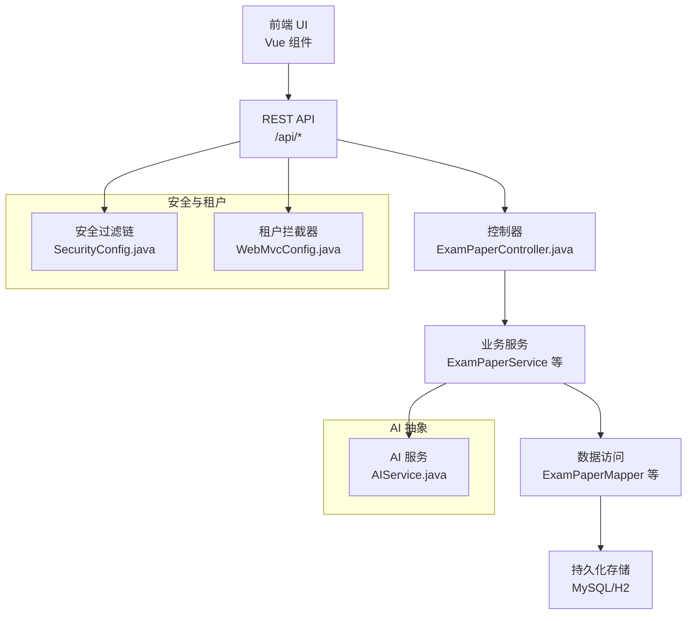
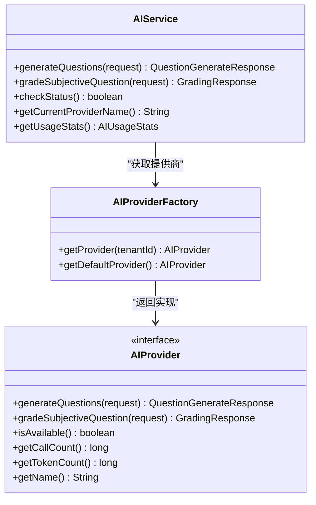
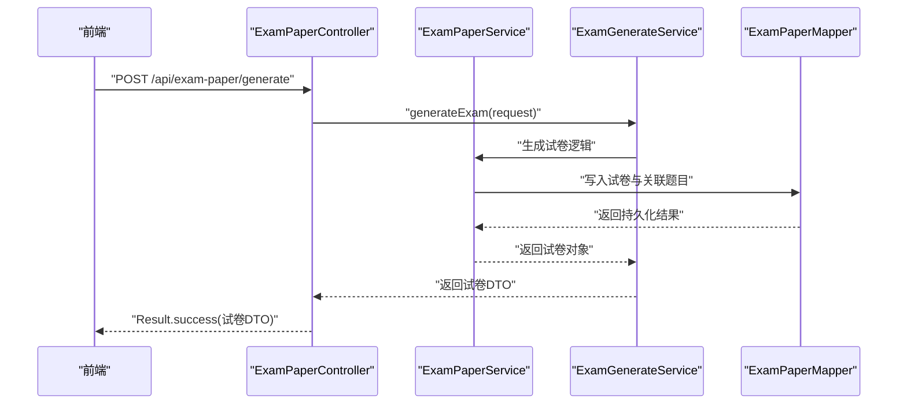
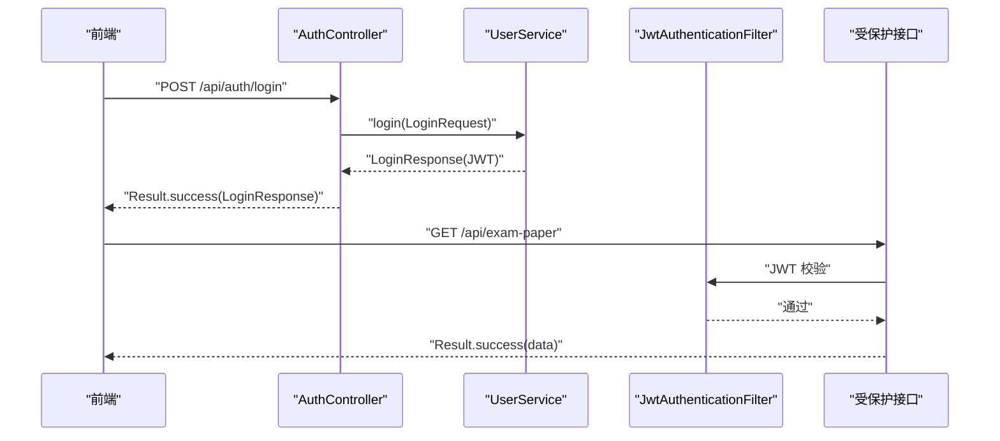
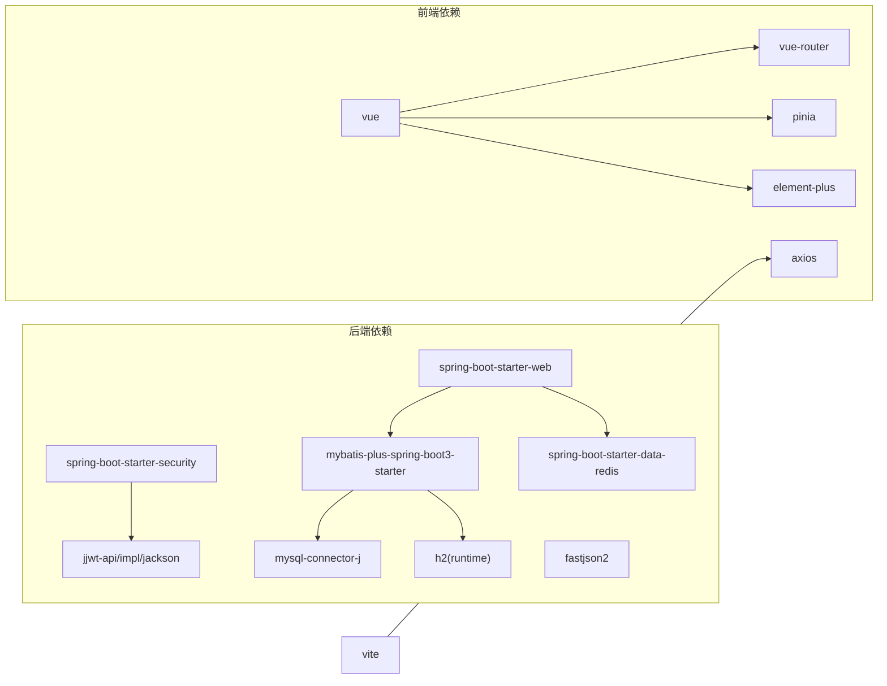

# 整体架构设计

<cite>
**本文引用的文件**
- [EduApplication.java](file://backend/src/main/java/com/edu/EduApplication.java)
- [pom.xml](file://backend/pom.xml)
- [application.yml](file://backend/src/main/resources/application.yml)
- [application-simple.yml](file://backend/src/main/resources/application-simple.yml)
- [WebMvcConfig.java](file://backend/src/main/java/com/edu/common/config/WebMvcConfig.java)
- [SecurityConfig.java](file://backend/src/main/java/com/edu/common/config/SecurityConfig.java)
- [AIService.java](file://backend/src/main/java/com/edu/ai/service/AIService.java)
- [AuthController.java](file://backend/src/main/java/com/edu/user/controller/AuthController.java)
- [ExamPaperController.java](file://backend/src/main/java/com/edu/exam/controller/ExamPaperController.java)
- [package.json](file://frontend/package.json)
- [vite.config.ts](file://frontend/vite.config.ts)
- [main.ts](file://frontend/src/main.ts)
- [index.ts](file://frontend/src/router/index.ts)
- [README.md](file://README.md)
- [INSTALL.md](file://INSTALL.md)
</cite>

## 目录
1. [引言](#引言)
2. [项目结构](#项目结构)
3. [核心组件](#核心组件)
4. [架构总览](#架构总览)
5. [详细组件分析](#详细组件分析)
6. [依赖分析](#依赖分析)
7. [性能考虑](#性能考虑)
8. [故障排查指南](#故障排查指南)
9. [结论](#结论)
10. [附录](#附录)

## 引言
本文件面向教师智能教学系统，提供整体架构设计与实现说明。系统采用前后端分离架构，后端基于 Spring Boot 3 + MyBatis-Plus，前端基于 Vue 3 + Vite，通过 REST 接口进行通信；同时内置多租户能力与安全认证体系，并集成 AI 服务抽象层以支持云端与私有 AI 提供商的灵活切换。本文从分层架构、模块化组织、组件交互、技术栈选择与扩展性设计等维度，帮助开发者快速理解系统结构与运行机制。

## 项目结构
系统采用典型的三层架构与模块化组织：
- 表现层（前端）：Vue 3 单页应用，路由与状态管理，通过代理访问后端 API。
- 业务层（后端）：Spring MVC 控制器 + 业务服务 + 数据访问层，按功能域划分模块（如 exam、grading、user、ppt、tenant、ai 等）。
- 数据层（后端）：MyBatis-Plus + MySQL，H2 可选用于测试；Redis 可选启用；支持逻辑删除与驼峰映射。

图表来源
- [EduApplication.java:1-15](file://backend/src/main/java/com/edu/EduApplication.java#L1-L15)
- [WebMvcConfig.java:1-24](file://backend/src/main/java/com/edu/common/config/WebMvcConfig.java#L1-L24)
- [SecurityConfig.java:1-50](file://backend/src/main/java/com/edu/common/config/SecurityConfig.java#L1-L50)
- [AIService.java:1-102](file://backend/src/main/java/com/edu/ai/service/AIService.java#L1-L102)
- [vite.config.ts:1-21](file://frontend/vite.config.ts#L1-L21)
- [main.ts:1-21](file://frontend/src/main.ts#L1-L21)
- [index.ts:1-114](file://frontend/src/router/index.ts#L1-L114)

章节来源
- [README.md:1-88](file://README.md#L1-L88)
- [INSTALL.md:1-134](file://INSTALL.md#L1-L134)

## 核心组件
- 应用入口与扫描：后端通过 Spring Boot 入口类启动，自动扫描 Mapper 包路径，加载 MyBatis-Plus 配置。
- 配置中心：YAML 配置集中管理数据库、Redis、JWT、AI 提供商等参数。
- 安全与拦截：基于 Spring Security 的无状态 JWT 过滤链，结合 WebMvc 拦截器实现多租户上下文注入。
- AI 抽象：统一的 AIService 作为 AI 能力入口，通过工厂模式选择云端或私有 AI 提供商。
- 前后端通信：前端通过 Vite 代理将 /api 请求转发至后端 8080 端口，路由守卫控制登录态。

章节来源
- [EduApplication.java:1-15](file://backend/src/main/java/com/edu/EduApplication.java#L1-L15)
- [application.yml:1-65](file://backend/src/main/resources/application.yml#L1-L65)
- [application-simple.yml:1-64](file://backend/src/main/resources/application-simple.yml#L1-L64)
- [WebMvcConfig.java:1-24](file://backend/src/main/java/com/edu/common/config/WebMvcConfig.java#L1-L24)
- [SecurityConfig.java:1-50](file://backend/src/main/java/com/edu/common/config/SecurityConfig.java#L1-L50)
- [AIService.java:1-102](file://backend/src/main/java/com/edu/ai/service/AIService.java#L1-L102)
- [vite.config.ts:1-21](file://frontend/vite.config.ts#L1-L21)
- [index.ts:104-114](file://frontend/src/router/index.ts#L104-L114)

## 架构总览
系统采用“前后端分离 + 微内核”的架构思路：
- 分层架构：表现层（UI）、业务层（Controller/Service）、数据层（Mapper/Entity/DB）清晰分离。
- 模块化：按领域拆分 exam、grading、user、ppt、tenant、ai 等模块，职责单一、边界明确。
- 安全与多租户：JWT 无状态认证 + 租户拦截器，确保跨租户隔离与权限控制。
- 可插拔 AI：通过工厂与接口抽象，支持云端（如 Claude）与私有 AI 服务的无缝切换。
- 扩展性：YAML 配置集中管理，便于横向扩展与环境差异化部署。

图表来源
- [ExamPaperController.java:1-218](file://backend/src/main/java/com/edu/exam/controller/ExamPaperController.java#L1-L218)
- [SecurityConfig.java:1-50](file://backend/src/main/java/com/edu/common/config/SecurityConfig.java#L1-L50)
- [WebMvcConfig.java:1-24](file://backend/src/main/java/com/edu/common/config/WebMvcConfig.java#L1-L24)
- [AIService.java:1-102](file://backend/src/main/java/com/edu/ai/service/AIService.java#L1-L102)

## 详细组件分析

### 后端应用与配置
- 应用入口：负责启动 Spring Boot 并扫描所有 *.mapper 包，确保 MyBatis-Plus 正常工作。
- 配置文件：集中管理数据库连接、MyBatis-Plus 映射、JWT 密钥与过期时间、AI 提供商参数、日志级别等。
- 安全配置：禁用 CSRF 与 frameOptions，会话策略为 STATELESS；对 /api/auth/**、/api/tenant/** 等开放路径放行，其余请求需鉴权。
- WebMvc 配置：注册租户拦截器，对 /api/** 路径生效，优先级最高，确保租户上下文在鉴权之前注入。

章节来源
- [EduApplication.java:1-15](file://backend/src/main/java/com/edu/EduApplication.java#L1-L15)
- [application.yml:1-65](file://backend/src/main/resources/application.yml#L1-L65)
- [application-simple.yml:1-64](file://backend/src/main/resources/application-simple.yml#L1-L64)
- [SecurityConfig.java:26-43](file://backend/src/main/java/com/edu/common/config/SecurityConfig.java#L26-L43)
- [WebMvcConfig.java:18-23](file://backend/src/main/java/com/edu/common/config/WebMvcConfig.java#L18-L23)

### 前端应用与路由
- 应用入口：注册 Pinia、Vue Router、Element Plus，并挂载根组件。
- 路由配置：定义登录页与布局页，子路由覆盖题库、试卷、批改、分析、PPT 制作、用户与班级管理等功能页面；全局前置守卫校验 token。
- 开发代理：将 /api 前缀请求代理到后端 8080 端口，避免跨域问题。

章节来源
- [main.ts:1-21](file://frontend/src/main.ts#L1-L21)
- [index.ts:1-114](file://frontend/src/router/index.ts#L1-L114)
- [vite.config.ts:12-20](file://frontend/vite.config.ts#L12-L20)

### AI 服务抽象与提供商工厂
- 统一入口：AIService 封装题目生成、主观题批改、状态检查与使用统计，屏蔽具体提供商差异。
- 多租户选择：根据租户上下文动态选择 AI 提供商，若缺失则回退到默认提供商。
- 工厂模式：通过 AIProviderFactory 获取具体实现（Cloud/Private），便于扩展新的提供商。

图表来源
- [AIService.java:20-82](file://backend/src/main/java/com/edu/ai/service/AIService.java#L20-L82)

章节来源
- [AIService.java:1-102](file://backend/src/main/java/com/edu/ai/service/AIService.java#L1-L102)

### 控制器与业务流程示例：试卷管理
- 控制器职责：接收请求、参数校验、调用业务服务、封装响应。
- 关键流程：创建试卷、AI 生成试卷、个性化出题、查询列表/详情、发布/更新/删除、添加题目到试卷。
- 数据转换：将实体对象映射为 DTO 响应，保证对外接口稳定与安全。

图表来源
- [ExamPaperController.java:56-61](file://backend/src/main/java/com/edu/exam/controller/ExamPaperController.java#L56-L61)

章节来源
- [ExamPaperController.java:1-218](file://backend/src/main/java/com/edu/exam/controller/ExamPaperController.java#L1-L218)

### 认证与授权流程
- 登录接口：AuthController 调用 UserService 生成 JWT 返回给前端。
- 安全过滤链：SecurityConfig 配置无状态策略，对 /api/auth/** 放行，其他请求必须携带有效 JWT。
- 路由守卫：前端路由守卫读取本地 token，未登录跳转登录页。

图表来源
- [AuthController.java:20-30](file://backend/src/main/java/com/edu/user/controller/AuthController.java#L20-L30)
- [SecurityConfig.java:26-43](file://backend/src/main/java/com/edu/common/config/SecurityConfig.java#L26-L43)
- [index.ts:104-112](file://frontend/src/router/index.ts#L104-L112)

## 依赖分析
- 后端依赖：Spring Boot Web/Security/Validation、MyBatis-Plus、MySQL 驱动、H2（测试）、Redis Starter、JWT、Fastjson2、JSqlParser、TransmittableThreadLocal、Lombok、测试依赖。
- 前端依赖：Vue 3、Vue Router、Pinia、Axios、Element Plus 及其图标库；Vite 开发工具链。
- 配置与构建：Maven 插件打包 Spring Boot 应用；Vite 提供开发服务器与代理。

图表来源
- [pom.xml:29-133](file://backend/pom.xml#L29-L133)
- [package.json:11-24](file://frontend/package.json#L11-L24)

章节来源
- [pom.xml:1-152](file://backend/pom.xml#L1-L152)
- [package.json:1-25](file://frontend/package.json#L1-L25)

## 性能考虑
- 数据库连接池：HikariCP 在配置中设置了最小空闲与最大连接数，建议结合实际并发与慢查询监控调整。
- 日志与调试：MyBatis-Plus 开启 SQL 输出便于调试，生产环境建议关闭或降级。
- 缓存策略：Redis Starter 已引入，可按需启用并缓存热点数据（如字典、用户信息、AI 调用统计等）。
- 前端代理：开发阶段使用 Vite 代理减少跨域问题，生产环境建议由 Nginx 或网关统一处理。

## 故障排查指南
- 启动失败：确认 Java 17+、Maven、MySQL 8+、Redis（可选）均已正确安装与配置。
- 数据库连接：检查 application.yml 中的数据库 URL、用户名、密码是否正确，必要时使用 application-simple.yml 快速验证。
- 端口占用：前端默认 3000，后端默认 8080，可通过各自配置文件修改。
- 登录异常：确认 /api/auth/** 是否放行，JWT 密钥与过期时间配置是否一致。
- AI 服务：检查 AI 提供商配置（云端 API Key、私有服务地址与超时），以及租户上下文是否正确传递。

章节来源
- [README.md:37-88](file://README.md#L37-L88)
- [INSTALL.md:103-134](file://INSTALL.md#L103-L134)
- [application.yml:45-59](file://backend/src/main/resources/application.yml#L45-L59)

## 结论
本系统以“前后端分离 + 分层架构 + 模块化 + 多租户 + 可插拔 AI”为核心设计，既满足教师智能教学场景的功能需求，又具备良好的扩展性与可维护性。通过 YAML 配置集中管理与工厂模式解耦提供商，可在不改动业务代码的前提下灵活切换 AI 能力。建议后续在网关层、缓存层与可观测性方面持续增强，以支撑更大规模的多租户与高并发场景。

## 附录
- 端口与默认账号
  - 前端：3000（Vite 开发服务器）
  - 后端：8080（Spring Boot）
  - 数据库：3306（MySQL）
  - 默认登录：admin/admin123（安装指南提供）

章节来源
- [INSTALL.md:103-117](file://INSTALL.md#L103-L117)