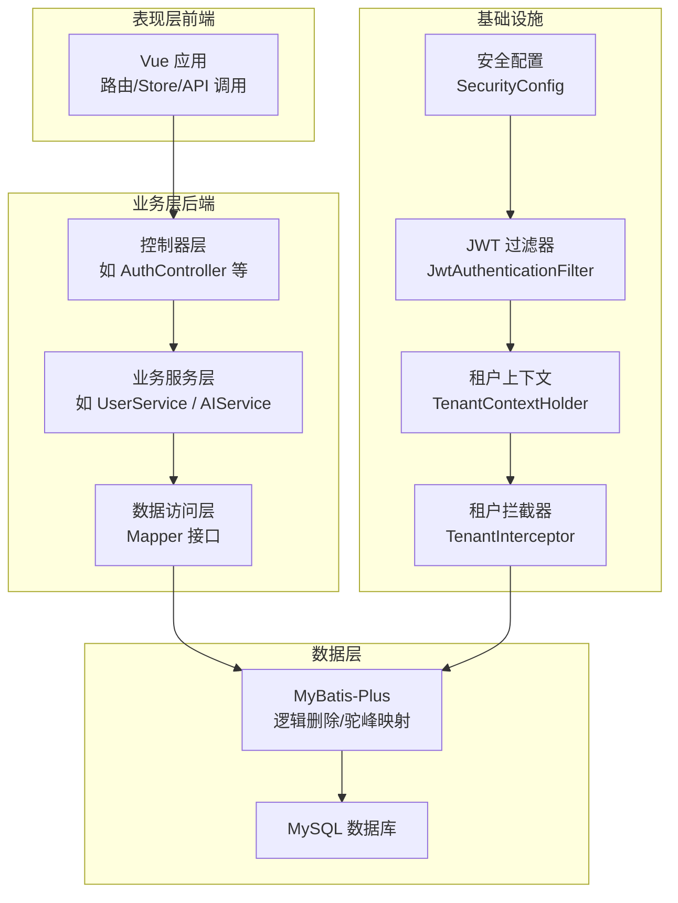
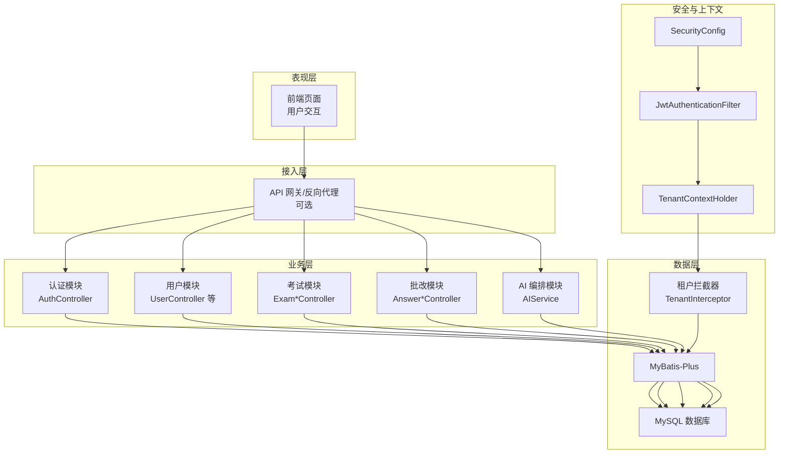
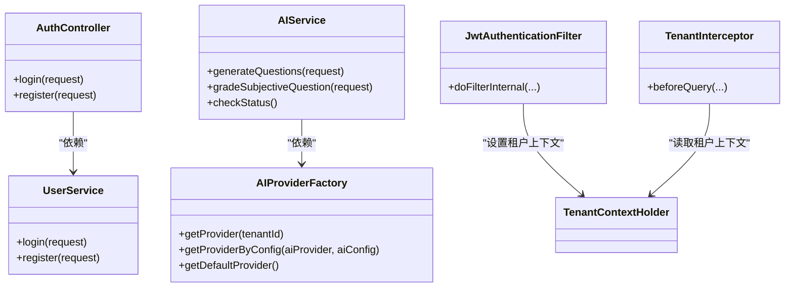
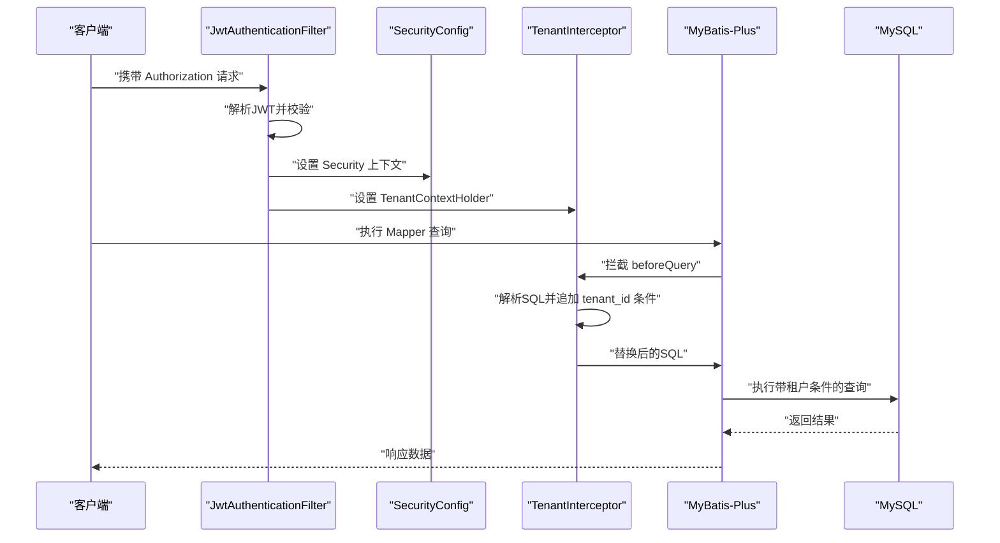
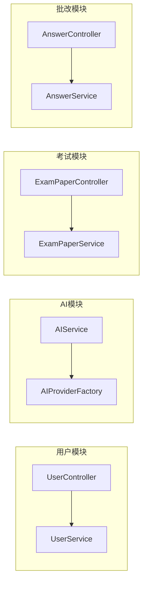
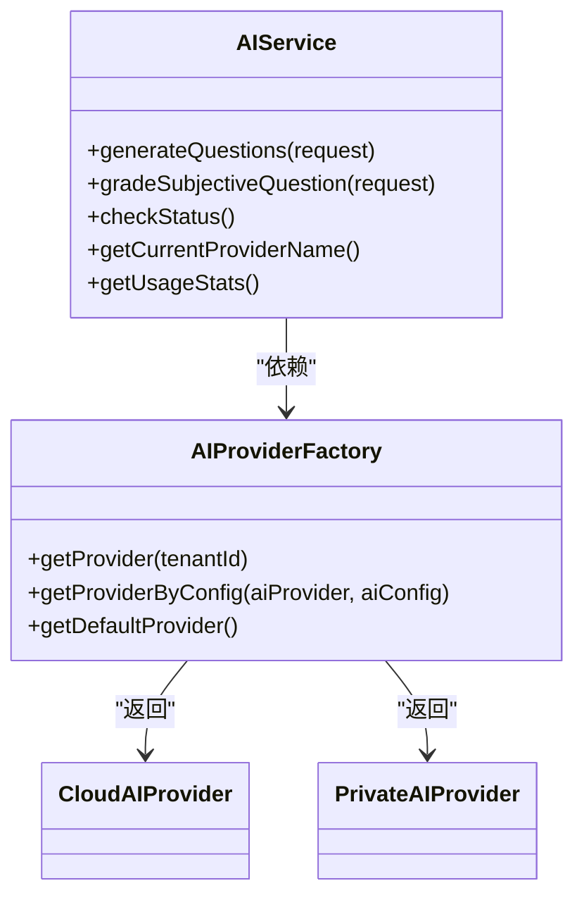
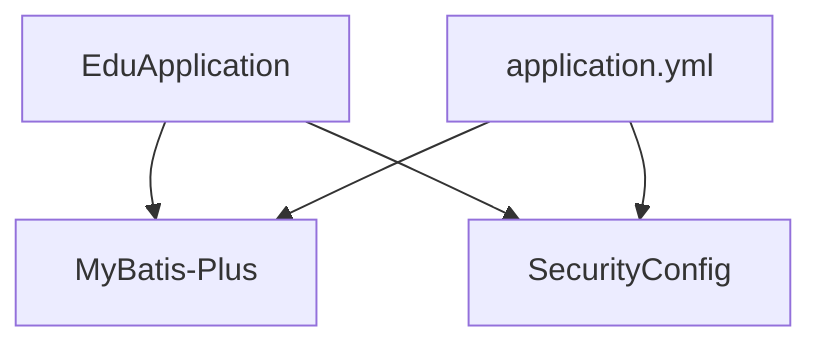

# 系统架构

<cite>
**本文引用的文件**
- [EduApplication.java](file://backend/src/main/java/com/edu/EduApplication.java)
- [application.yml](file://backend/src/main/resources/application.yml)
- [pom.xml](file://backend/pom.xml)
- [README.md](file://README.md)
- [INSTALL.md](file://INSTALL.md)
- [SecurityConfig.java](file://backend/src/main/java/com/edu/common/config/SecurityConfig.java)
- [JwtAuthenticationFilter.java](file://backend/src/main/java/com/edu/common/security/JwtAuthenticationFilter.java)
- [TenantInterceptor.java](file://backend/src/main/java/com/edu/common/interceptor/TenantInterceptor.java)
- [TenantContextHolder.java](file://backend/src/main/java/com/edu/common/util/TenantContextHolder.java)
- [AIProviderFactory.java](file://backend/src/main/java/com/edu/ai/provider/AIProviderFactory.java)
- [AIService.java](file://backend/src/main/java/com/edu/ai/service/AIService.java)
- [Tenant.java](file://backend/src/main/java/com/edu/tenant/entity/Tenant.java)
- [TenantNoBaseEntity.java](file://backend/src/main/java/com/edu/common/entity/TenantNoBaseEntity.java)
- [schema.sql](file://backend/src/main/resources/db/schema.sql)
- [AuthController.java](file://backend/src/main/java/com/edu/user/controller/AuthController.java)
</cite>

## 目录
1. [引言](#引言)
2. [项目结构](#项目结构)
3. [核心组件](#核心组件)
4. [架构总览](#架构总览)
5. [详细组件分析](#详细组件分析)
6. [依赖分析](#依赖分析)
7. [性能考虑](#性能考虑)
8. [故障排查指南](#故障排查指南)
9. [结论](#结论)
10. [附录](#附录)

## 引言
本系统是一个面向教师的智能教学平台，采用分层架构与多租户设计，结合微服务化的模块化组织方式，支持AI能力的按租户动态选择与调用。系统通过表现层（前端）、业务层（后端控制器/服务）、数据层（MyBatis-Plus + MySQL）实现清晰的职责分离；通过JWT鉴权与租户上下文传递保障安全与数据隔离；通过AI工厂模式实现云端与私有AI服务的灵活切换。本文档旨在帮助开发者全面理解系统整体结构、运行机制与扩展方向。

## 项目结构
后端采用Spring Boot工程，按功能域划分模块，典型结构如下：
- 表现层：前端Vue应用，负责用户界面与API调用
- 业务层：后端各模块控制器（如用户、考试、批改、AI等）
- 业务服务层：各模块Service，封装领域逻辑
- 数据访问层：Mapper + MyBatis-Plus XML映射
- 基础设施：安全配置、拦截器、工具类、全局异常处理等
- 资源：数据库初始化脚本、MyBatis配置、应用配置



图表来源
- [EduApplication.java:1-15](file://backend/src/main/java/com/edu/EduApplication.java#L1-L15)
- [application.yml:1-65](file://backend/src/main/resources/application.yml#L1-L65)
- [SecurityConfig.java:1-50](file://backend/src/main/java/com/edu/common/config/SecurityConfig.java#L1-L50)
- [JwtAuthenticationFilter.java:1-70](file://backend/src/main/java/com/edu/common/security/JwtAuthenticationFilter.java#L1-L70)
- [TenantInterceptor.java:1-142](file://backend/src/main/java/com/edu/common/interceptor/TenantInterceptor.java#L1-L142)
- [TenantContextHolder.java:1-24](file://backend/src/main/java/com/edu/common/util/TenantContextHolder.java#L1-L24)
- [schema.sql:1-379](file://backend/src/main/resources/db/schema.sql#L1-L379)

章节来源
- [EduApplication.java:1-15](file://backend/src/main/java/com/edu/EduApplication.java#L1-L15)
- [application.yml:1-65](file://backend/src/main/resources/application.yml#L1-L65)
- [pom.xml:1-152](file://backend/pom.xml#L1-L152)
- [README.md:1-88](file://README.md#L1-L88)
- [INSTALL.md:1-134](file://INSTALL.md#L1-L134)

## 核心组件
- 应用入口与扫描：Spring Boot启动类负责扫描Mapper与装配Bean
- 安全与鉴权：基于JWT的无状态认证，过滤器链注入Security配置
- 多租户隔离：租户上下文持有者与SQL拦截器，自动为查询拼接租户条件
- AI能力编排：AI工厂根据租户配置选择云端或私有AI服务
- 数据访问：MyBatis-Plus提供逻辑删除、驼峰映射、全局配置

章节来源
- [EduApplication.java:1-15](file://backend/src/main/java/com/edu/EduApplication.java#L1-L15)
- [SecurityConfig.java:1-50](file://backend/src/main/java/com/edu/common/config/SecurityConfig.java#L1-L50)
- [JwtAuthenticationFilter.java:1-70](file://backend/src/main/java/com/edu/common/security/JwtAuthenticationFilter.java#L1-L70)
- [TenantInterceptor.java:1-142](file://backend/src/main/java/com/edu/common/interceptor/TenantInterceptor.java#L1-L142)
- [TenantContextHolder.java:1-24](file://backend/src/main/java/com/edu/common/util/TenantContextHolder.java#L1-L24)
- [AIProviderFactory.java:1-67](file://backend/src/main/java/com/edu/ai/provider/AIProviderFactory.java#L1-L67)
- [AIService.java:1-102](file://backend/src/main/java/com/edu/ai/service/AIService.java#L1-L102)
- [application.yml:32-44](file://backend/src/main/resources/application.yml#L32-L44)

## 架构总览
系统采用分层架构与模块化设计，结合多租户数据隔离与AI能力的动态选择，形成高内聚、低耦合的体系结构。



图表来源
- [AuthController.java:1-32](file://backend/src/main/java/com/edu/user/controller/AuthController.java#L1-L32)
- [SecurityConfig.java:1-50](file://backend/src/main/java/com/edu/common/config/SecurityConfig.java#L1-L50)
- [JwtAuthenticationFilter.java:1-70](file://backend/src/main/java/com/edu/common/security/JwtAuthenticationFilter.java#L1-L70)
- [TenantInterceptor.java:1-142](file://backend/src/main/java/com/edu/common/interceptor/TenantInterceptor.java#L1-L142)
- [AIService.java:1-102](file://backend/src/main/java/com/edu/ai/service/AIService.java#L1-L102)
- [schema.sql:1-379](file://backend/src/main/resources/db/schema.sql#L1-L379)

## 详细组件分析

### 分层架构设计
- 表现层：前端Vue应用，负责路由、状态管理与API调用
- 业务层：控制器负责HTTP请求处理与参数校验，返回统一结果包装
- 业务服务层：封装领域逻辑，协调DAO与第三方服务
- 数据访问层：Mapper接口 + XML映射，配合MyBatis-Plus实现通用CRUD与逻辑删除
- 基础设施：安全配置、JWT过滤器、租户上下文与SQL拦截器



图表来源
- [AuthController.java:1-32](file://backend/src/main/java/com/edu/user/controller/AuthController.java#L1-L32)
- [AIService.java:1-102](file://backend/src/main/java/com/edu/ai/service/AIService.java#L1-L102)
- [AIProviderFactory.java:1-67](file://backend/src/main/java/com/edu/ai/provider/AIProviderFactory.java#L1-L67)
- [JwtAuthenticationFilter.java:1-70](file://backend/src/main/java/com/edu/common/security/JwtAuthenticationFilter.java#L1-L70)
- [TenantInterceptor.java:1-142](file://backend/src/main/java/com/edu/common/interceptor/TenantInterceptor.java#L1-L142)

章节来源
- [AuthController.java:1-32](file://backend/src/main/java/com/edu/user/controller/AuthController.java#L1-L32)
- [AIService.java:1-102](file://backend/src/main/java/com/edu/ai/service/AIService.java#L1-L102)
- [AIProviderFactory.java:1-67](file://backend/src/main/java/com/edu/ai/provider/AIProviderFactory.java#L1-L67)
- [JwtAuthenticationFilter.java:1-70](file://backend/src/main/java/com/edu/common/security/JwtAuthenticationFilter.java#L1-L70)
- [TenantInterceptor.java:1-142](file://backend/src/main/java/com/edu/common/interceptor/TenantInterceptor.java#L1-L142)

### 多租户架构与数据隔离
- 租户上下文：通过JWT中的租户信息设置到线程本地上下文，贯穿请求生命周期
- SQL拦截：基于JSqlParser解析原始SQL，在查询语句中自动追加租户条件，避免越权访问
- 排除表：对部分存在外键关联或无tenant_id列的表进行豁免，确保关联查询正确性
- 实体基类：系统表不参与租户隔离，使用无租户字段的基类



图表来源
- [JwtAuthenticationFilter.java:1-70](file://backend/src/main/java/com/edu/common/security/JwtAuthenticationFilter.java#L1-L70)
- [SecurityConfig.java:1-50](file://backend/src/main/java/com/edu/common/config/SecurityConfig.java#L1-L50)
- [TenantInterceptor.java:1-142](file://backend/src/main/java/com/edu/common/interceptor/TenantInterceptor.java#L1-L142)
- [TenantContextHolder.java:1-24](file://backend/src/main/java/com/edu/common/util/TenantContextHolder.java#L1-L24)

章节来源
- [TenantInterceptor.java:1-142](file://backend/src/main/java/com/edu/common/interceptor/TenantInterceptor.java#L1-L142)
- [TenantContextHolder.java:1-24](file://backend/src/main/java/com/edu/common/util/TenantContextHolder.java#L1-L24)
- [Tenant.java:1-21](file://backend/src/main/java/com/edu/tenant/entity/Tenant.java#L1-L21)
- [TenantNoBaseEntity.java:1-23](file://backend/src/main/java/com/edu/common/entity/TenantNoBaseEntity.java#L1-L23)
- [schema.sql:1-379](file://backend/src/main/resources/db/schema.sql#L1-L379)

### 微服务化与模块化组织
- 模块划分：按业务域拆分（用户、考试、批改、AI、PPT、租户等），每个模块包含controller/dto/entity/mapper/service
- 组件交互：控制器仅负责参数绑定与结果封装，业务逻辑下沉至Service；Service之间通过依赖注入协作
- 可扩展性：AI能力通过工厂模式解耦不同提供商，便于新增私有/公有AI服务



图表来源
- [AuthController.java:1-32](file://backend/src/main/java/com/edu/user/controller/AuthController.java#L1-L32)
- [AIService.java:1-102](file://backend/src/main/java/com/edu/ai/service/AIService.java#L1-L102)
- [AIProviderFactory.java:1-67](file://backend/src/main/java/com/edu/ai/provider/AIProviderFactory.java#L1-L67)

章节来源
- [AuthController.java:1-32](file://backend/src/main/java/com/edu/user/controller/AuthController.java#L1-L32)
- [AIService.java:1-102](file://backend/src/main/java/com/edu/ai/service/AIService.java#L1-L102)
- [AIProviderFactory.java:1-67](file://backend/src/main/java/com/edu/ai/provider/AIProviderFactory.java#L1-L67)

### 数据模型与数据流
- 数据模型：涵盖租户、用户、角色权限、学校/年级/班级、题库/题目、试卷/模板、答题卡/答案、成绩分析、错题、PPT文档等
- 关系图：展示主从关系与索引设计，支撑多租户隔离与高效查询

```mermaid
erDiagram
TENANT {
bigint id PK
varchar code UK
varchar name
varchar ai_provider
json ai_config
tinyint status
date expire_date
}
SCHOOL {
bigint id PK
bigint tenant_id FK
varchar name
varchar address
varchar contact_phone
}
SYS_USER {
bigint id PK
bigint tenant_id FK
varchar username UK
varchar password
varchar real_name
varchar email
varchar phone
tinyint status
tinyint deleted
}
ROLE {
bigint id PK
bigint tenant_id FK
varchar name
varchar code UK
varchar description
}
PERMISSION {
bigint id PK
varchar code UK
varchar name
varchar resource
varchar action
}
USER_ROLE {
bigint id PK
bigint user_id FK
bigint role_id FK
}
ROLE_PERMISSION {
bigint id PK
bigint role_id FK
bigint permission_id FK
}
GRADE {
bigint id PK
bigint school_id FK
varchar name
tinyint level
int sequence
}
CLASS {
bigint id PK
bigint grade_id FK
varchar name
bigint teacher_id
int student_count
}
STUDENT {
bigint id PK
bigint tenant_id FK
bigint class_id FK
bigint user_id
varchar name
varchar student_no UK
tinyint gender
date birth_date
tinyint status
tinyint deleted
}
QUESTION_BANK {
bigint id PK
bigint tenant_id FK
varchar name
varchar subject
tinyint grade_level
varchar description
tinyint is_public
tinyint deleted
}
QUESTION {
bigint id PK
bigint bank_id FK
varchar subject
varchar question_type
tinyint difficulty
text content
json options
text answer
text answer_analysis
json knowledge_points
varchar source
tinyint deleted
}
EXAM_TEMPLATE {
bigint id PK
bigint tenant_id FK
varchar name
varchar subject
decimal total_score
int time_limit
json structure
tinyint deleted
}
EXAM_PAPER {
bigint id PK
bigint tenant_id FK
bigint template_id
varchar title
varchar subject
bigint grade_id
bigint class_id
decimal total_score
int time_limit
tinyint status
tinyint deleted
}
EXAM_QUESTION {
bigint id PK
bigint exam_paper_id FK
bigint question_id FK
int sequence
decimal score
}
ANSWER_SHEET {
bigint id PK
bigint tenant_id FK
bigint exam_paper_id FK
bigint student_id FK
tinyint status
decimal total_score
datetime submit_time
datetime grading_time
bigint graded_by
tinyint deleted
}
ANSWER {
bigint id PK
bigint answer_sheet_id FK
bigint exam_question_id FK
text student_answer
tinyint is_correct
decimal score
decimal ai_score
decimal manual_score
text ai_analysis
datetime graded_at
}
SCORE_ANALYSIS {
bigint id PK
bigint exam_paper_id FK
bigint class_id FK
decimal avg_score
decimal max_score
decimal min_score
decimal pass_rate
decimal excellent_rate
json question_analysis
}
STUDENT_WRONG_QUESTION {
bigint id PK
bigint student_id FK
bigint question_id FK
bigint exam_paper_id
int wrong_count
datetime last_wrong_at
datetime corrected_at
}
PPT_DOCUMENT {
bigint id PK
bigint tenant_id FK
varchar title
varchar subject
varchar template_type
text content_json
varchar file_path
int page_count
bigint created_by
tinyint deleted
}
TENANT ||--o{ SCHOOL : "拥有"
TENANT ||--o{ SYS_USER : "拥有"
TENANT ||--o{ ROLE : "拥有"
TENANT ||--o{ QUESTION_BANK : "拥有"
TENANT ||--o{ EXAM_PAPER : "拥有"
TENANT ||--o{ ANSWER_SHEET : "拥有"
TENANT ||--o{ PPT_DOCUMENT : "拥有"
TENANT ||--o{ STUDENT : "拥有"
SCHOOL ||--o{ GRADE : "包含"
GRADE ||--o{ CLASS : "包含"
CLASS ||--o{ STUDENT : "包含"
QUESTION_BANK ||--o{ QUESTION : "包含"
EXAM_TEMPLATE ||--o{ EXAM_PAPER : "生成"
EXAM_PAPER ||--o{ EXAM_QUESTION : "包含"
EXAM_QUESTION ||--o{ QUESTION : "关联"
EXAM_PAPER ||--o{ ANSWER_SHEET : "产生"
ANSWER_SHEET ||--o{ ANSWER : "承载"
EXAM_PAPER ||--o{ SCORE_ANALYSIS : "分析"
STUDENT ||--o{ ANSWER_SHEET : "作答"
STUDENT ||--o{ STUDENT_WRONG_QUESTION : "错题"
QUESTION ||--o{ STUDENT_WRONG_QUESTION : "错题"
EXAM_PAPER ||--o{ STUDENT_WRONG_QUESTION : "来源"
```

图表来源
- [schema.sql:1-379](file://backend/src/main/resources/db/schema.sql#L1-L379)

章节来源
- [schema.sql:1-379](file://backend/src/main/resources/db/schema.sql#L1-L379)

### AI能力编排与租户选择
- 工厂模式：根据租户配置动态选择云端或私有AI服务
- 统一入口：AI服务对外暴露统一方法，内部委派给具体Provider
- 状态与统计：提供可用性检查与调用统计信息



图表来源
- [AIService.java:1-102](file://backend/src/main/java/com/edu/ai/service/AIService.java#L1-L102)
- [AIProviderFactory.java:1-67](file://backend/src/main/java/com/edu/ai/provider/AIProviderFactory.java#L1-L67)

章节来源
- [AIService.java:1-102](file://backend/src/main/java/com/edu/ai/service/AIService.java#L1-L102)
- [AIProviderFactory.java:1-67](file://backend/src/main/java/com/edu/ai/provider/AIProviderFactory.java#L1-L67)

## 依赖分析
- 启动与扫描：Spring Boot启动类启用Mapper扫描
- 安全：SecurityConfig禁用CSRF与FrameOptions，开启无状态会话，开放认证与租户注册接口
- 数据库：MyBatis-Plus配置驼峰映射、逻辑删除字段、全局配置
- 依赖：后端引入Web、Security、Validation、MyBatis-Plus、MySQL驱动、H2、Redis、JWT、Fastjson2、JSqlParser、TransmittableThreadLocal、Lombok等



图表来源
- [EduApplication.java:1-15](file://backend/src/main/java/com/edu/EduApplication.java#L1-L15)
- [application.yml:1-65](file://backend/src/main/resources/application.yml#L1-L65)
- [SecurityConfig.java:1-50](file://backend/src/main/java/com/edu/common/config/SecurityConfig.java#L1-L50)

章节来源
- [EduApplication.java:1-15](file://backend/src/main/java/com/edu/EduApplication.java#L1-L15)
- [application.yml:1-65](file://backend/src/main/resources/application.yml#L1-L65)
- [pom.xml:1-152](file://backend/pom.xml#L1-L152)

## 性能考虑
- 连接池配置：Hikari连接池参数（最小空闲、最大连接、空闲超时、连接超时）需结合并发与数据库性能调优
- 逻辑删除：MyBatis-Plus逻辑删除减少物理删除成本，但需合理维护索引与统计
- SQL拦截：JSqlParser解析与字符串拼接可能带来额外开销，建议对高频查询进行缓存与监控
- AI调用：云端/私有服务的超时与重试策略需在工厂与Provider中统一配置
- 前端：静态资源与构建优化，减少首屏加载时间

## 故障排查指南
- 认证失败：确认JWT是否正确携带与签名有效，检查SecurityConfig放行路径
- 租户数据隔离异常：检查TenantInterceptor是否生效，确认SQL中是否包含tenant_id条件
- 数据库连接：核对application.yml中的数据库URL、用户名、密码与驱动
- 端口占用：前后端默认端口分别为8080与3000，确保未被占用
- 初始化脚本：执行schema.sql与init-data.sql，确保数据库结构与基础数据完整

章节来源
- [SecurityConfig.java:1-50](file://backend/src/main/java/com/edu/common/config/SecurityConfig.java#L1-L50)
- [JwtAuthenticationFilter.java:1-70](file://backend/src/main/java/com/edu/common/security/JwtAuthenticationFilter.java#L1-L70)
- [TenantInterceptor.java:1-142](file://backend/src/main/java/com/edu/common/interceptor/TenantInterceptor.java#L1-L142)
- [application.yml:15-19](file://backend/src/main/resources/application.yml#L15-L19)
- [README.md:76-88](file://README.md#L76-L88)

## 结论
该系统通过清晰的分层架构、严格的多租户数据隔离与灵活的AI能力编排，实现了教师智能教学场景下的高内聚与可扩展性。JWT无状态认证与租户上下文贯穿请求链路，确保安全与隔离；MyBatis-Plus与JSqlParser的组合提升了数据访问效率与一致性。未来可在网关层引入限流熔断、AI服务侧增加可观测性与缓存策略，并进一步细化模块边界以支持独立演进。

## 附录
- 端口与默认账号：前端3000、后端8080、默认管理员账号见安装指南
- 环境安装：Chocolatey快速安装或手动安装Java/Maven/MySQL，按安装指南执行初始化脚本

章节来源
- [INSTALL.md:103-117](file://INSTALL.md#L103-L117)
- [README.md:71-75](file://README.md#L71-L75)