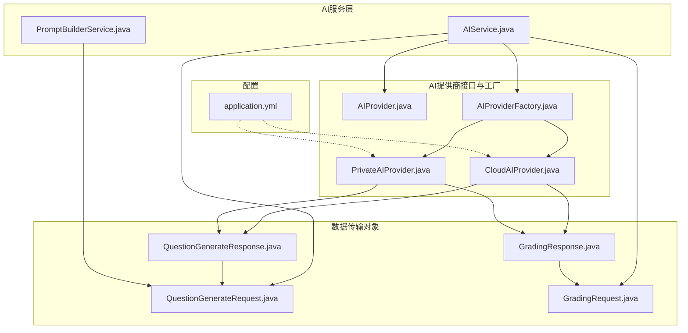
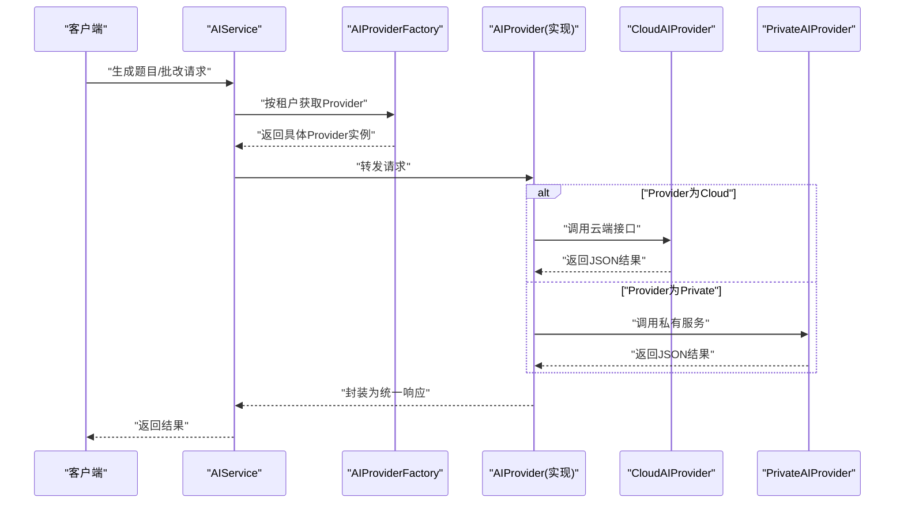
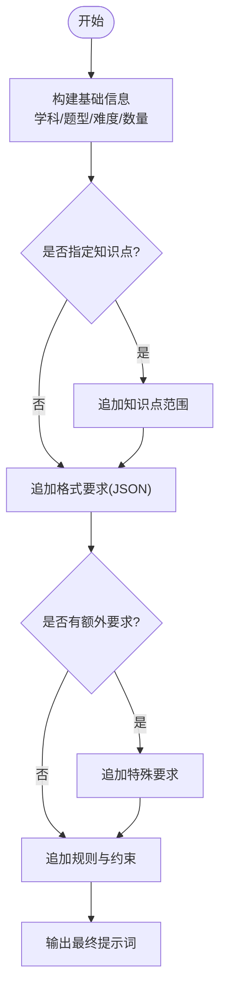
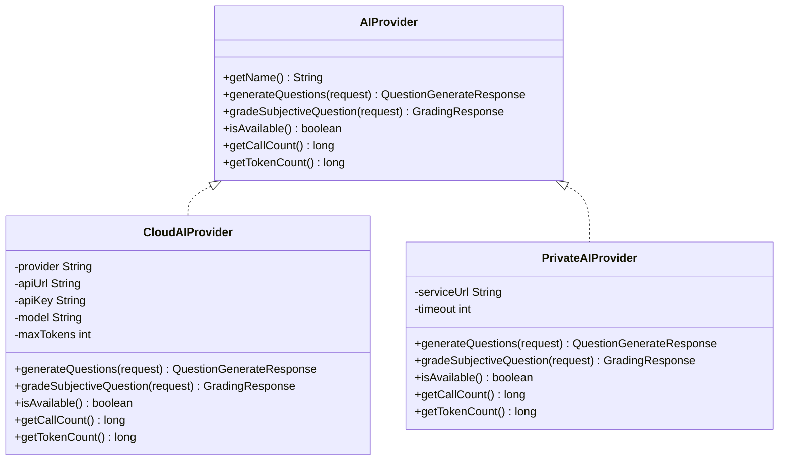
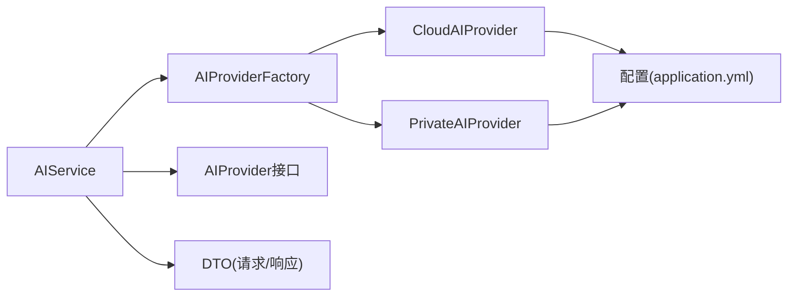

# AI智能出题

<cite>
**本文引用的文件**
- [AIService.java](file://backend/src/main/java/com/edu/ai/service/AIService.java)
- [PromptBuilderService.java](file://backend/src/main/java/com/edu/ai/service/PromptBuilderService.java)
- [AIProvider.java](file://backend/src/main/java/com/edu/ai/provider/AIProvider.java)
- [AIProviderFactory.java](file://backend/src/main/java/com/edu/ai/provider/AIProviderFactory.java)
- [CloudAIProvider.java](file://backend/src/main/java/com/edu/ai/provider/CloudAIProvider.java)
- [PrivateAIProvider.java](file://backend/src/main/java/com/edu/ai/provider/PrivateAIProvider.java)
- [QuestionGenerateRequest.java](file://backend/src/main/java/com/edu/ai/dto/QuestionGenerateRequest.java)
- [QuestionGenerateResponse.java](file://backend/src/main/java/com/edu/ai/dto/QuestionGenerateResponse.java)
- [GradingRequest.java](file://backend/src/main/java/com/edu/ai/dto/GradingRequest.java)
- [GradingResponse.java](file://backend/src/main/java/com/edu/ai/dto/GradingResponse.java)
- [application.yml](file://backend/src/main/resources/application.yml)
- [AIServiceTest.java](file://backend/src/test/java/com/edu/ai/service/AIServiceTest.java)
- [PromptBuilderServiceTest.java](file://backend/src/test/java/com/edu/ai/service/PromptBuilderServiceTest.java)
- [QuestionController.java](file://backend/src/main/java/com/edu/exam/controller/QuestionController.java)
</cite>

## 目录
1. [简介](#简介)
2. [项目结构](#项目结构)
3. [核心组件](#核心组件)
4. [架构总览](#架构总览)
5. [详细组件分析](#详细组件分析)
6. [依赖分析](#依赖分析)
7. [性能考虑](#性能考虑)
8. [故障排除指南](#故障排除指南)
9. [结论](#结论)
10. [附录](#附录)

## 简介
本文件面向“AI智能出题”能力，系统性阐述从自然语言处理、提示词构建、题目生成策略与质量评估，到云端与私有AI服务的集成与切换、配置管理与负载均衡、以及出题质量控制（正确性验证、知识点覆盖度检查、重复率控制）的完整方案。同时提供配置指南、使用示例与故障排除建议，帮助开发者与运维人员快速落地与稳定运行。

## 项目结构
AI智能出题相关代码位于后端模块的 ai 包下，采用“接口+工厂+多实现”的分层设计，结合 DTO 与提示词构建服务，形成可扩展、可配置、可观测的统一AI服务入口。

图表来源
- [AIService.java:1-102](file://backend/src/main/java/com/edu/ai/service/AIService.java#L1-L102)
- [PromptBuilderService.java:1-121](file://backend/src/main/java/com/edu/ai/service/PromptBuilderService.java#L1-L121)
- [AIProvider.java:1-42](file://backend/src/main/java/com/edu/ai/provider/AIProvider.java#L1-L42)
- [AIProviderFactory.java:1-67](file://backend/src/main/java/com/edu/ai/provider/AIProviderFactory.java#L1-L67)
- [CloudAIProvider.java:1-267](file://backend/src/main/java/com/edu/ai/provider/CloudAIProvider.java#L1-L267)
- [PrivateAIProvider.java:1-195](file://backend/src/main/java/com/edu/ai/provider/PrivateAIProvider.java#L1-L195)
- [QuestionGenerateRequest.java:1-42](file://backend/src/main/java/com/edu/ai/dto/QuestionGenerateRequest.java#L1-L42)
- [QuestionGenerateResponse.java:1-43](file://backend/src/main/java/com/edu/ai/dto/QuestionGenerateResponse.java#L1-L43)
- [GradingRequest.java:1-40](file://backend/src/main/java/com/edu/ai/dto/GradingRequest.java#L1-L40)
- [GradingResponse.java:1-42](file://backend/src/main/java/com/edu/ai/dto/GradingResponse.java#L1-L42)
- [application.yml:49-60](file://backend/src/main/resources/application.yml#L49-L60)

章节来源
- [AIService.java:1-102](file://backend/src/main/java/com/edu/ai/service/AIService.java#L1-L102)
- [AIProviderFactory.java:1-67](file://backend/src/main/java/com/edu/ai/provider/AIProviderFactory.java#L1-L67)
- [application.yml:49-60](file://backend/src/main/resources/application.yml#L49-L60)

## 核心组件
- AIService：统一AI服务入口，负责根据租户上下文选择AI提供商，转发生成题目与主观题批改请求，并提供状态查询与用量统计。
- PromptBuilderService：构建标准化提示词，支持题目生成与主观题批改的指令设计、上下文注入与参数化模板。
- AIProvider 接口与实现：定义统一能力契约；CloudAIProvider 与 PrivateAIProvider 分别对接云端与私有机房服务。
- DTO：QuestionGenerateRequest/Response 与 GradingRequest/Response 描述请求与响应的数据结构。
- 配置中心：application.yml 中集中管理默认提供商、云端与私有AI的关键参数。

章节来源
- [AIService.java:14-102](file://backend/src/main/java/com/edu/ai/service/AIService.java#L14-L102)
- [PromptBuilderService.java:7-121](file://backend/src/main/java/com/edu/ai/service/PromptBuilderService.java#L7-L121)
- [AIProvider.java:8-42](file://backend/src/main/java/com/edu/ai/provider/AIProvider.java#L8-L42)
- [CloudAIProvider.java:21-267](file://backend/src/main/java/com/edu/ai/provider/CloudAIProvider.java#L21-L267)
- [PrivateAIProvider.java:21-195](file://backend/src/main/java/com/edu/ai/provider/PrivateAIProvider.java#L21-L195)
- [QuestionGenerateRequest.java:7-42](file://backend/src/main/java/com/edu/ai/dto/QuestionGenerateRequest.java#L7-L42)
- [QuestionGenerateResponse.java:7-43](file://backend/src/main/java/com/edu/ai/dto/QuestionGenerateResponse.java#L7-L43)
- [GradingRequest.java:5-40](file://backend/src/main/java/com/edu/ai/dto/GradingRequest.java#L5-L40)
- [GradingResponse.java:7-42](file://backend/src/main/java/com/edu/ai/dto/GradingResponse.java#L7-L42)
- [application.yml:49-60](file://backend/src/main/resources/application.yml#L49-L60)

## 架构总览
AI智能出题采用“服务编排 + 提示词工程 + 多提供商适配”的架构模式。AIService 作为门面，通过 AIProviderFactory 基于租户上下文选择具体提供商；PromptBuilderService 负责构造高质量提示词；CloudAIProvider/PrivateAIProvider 实现统一接口，分别对接外部云服务与内部私有服务；DTO 层保证请求与响应的结构化与可追踪。

图表来源
- [AIService.java:24-82](file://backend/src/main/java/com/edu/ai/service/AIService.java#L24-L82)
- [AIProviderFactory.java:24-66](file://backend/src/main/java/com/edu/ai/provider/AIProviderFactory.java#L24-L66)
- [CloudAIProvider.java:52-105](file://backend/src/main/java/com/edu/ai/provider/CloudAIProvider.java#L52-L105)
- [PrivateAIProvider.java:43-172](file://backend/src/main/java/com/edu/ai/provider/PrivateAIProvider.java#L43-L172)

## 详细组件分析

### AIService 统一入口
- 角色与职责
  - 生成题目：根据请求参数选择提供商并调用生成接口，记录日志与统计。
  - 主观题批改：构造批改提示词并调用提供商进行评分与分析。
  - 状态检查：委托提供商检查可用性。
  - 用量统计：聚合调用次数与Token消耗。
  - 租户路由：基于租户上下文选择提供商，缺失时回退默认提供商。
- 关键流程
  - 生成题目序列图见“架构总览”。
  - 批改流程与生成类似，由 PromptBuilderService 构造批改提示词后交由提供商处理。
- 性能与可观测性
  - 使用原子计数器统计调用次数与Token消耗，便于成本与性能监控。
  - 日志记录关键信息，便于问题定位。

章节来源
- [AIService.java:14-102](file://backend/src/main/java/com/edu/ai/service/AIService.java#L14-L102)

### PromptBuilderService 提示词构建
- 题目生成提示词
  - 注入学科、题型、难度、知识点范围、额外要求与严格JSON格式约束。
  - 对不同题型（如选择题）动态注入选项字段模板。
  - 强制仅返回JSON数组，避免多余文本干扰解析。
- 主观题批改提示词
  - 注入题目、标准答案、学生答案、满分与评分标准，要求返回JSON结构。
  - 明确 isCorrect 的取值语义（0-错误、1-正确、2-部分正确）。
- 国际化友好
  - 将学科、题型、难度映射为中文，提升提示词可读性与一致性。

图表来源
- [PromptBuilderService.java:14-61](file://backend/src/main/java/com/edu/ai/service/PromptBuilderService.java#L14-L61)

章节来源
- [PromptBuilderService.java:7-121](file://backend/src/main/java/com/edu/ai/service/PromptBuilderService.java#L7-L121)

### AIProvider 接口与实现
- 接口契约
  - 名称、题目生成、主观题批改、可用性检查、调用次数与Token统计。
- CloudAIProvider
  - 支持通过配置项切换云端提供商与模型，使用RestTemplate调用云端消息接口。
  - 解析响应中的content与usage，提取文本与Token统计。
  - 对生成与批改结果进行JSON解析，封装为统一响应。
- PrivateAIProvider
  - 以HTTP方式调用私有服务的生成与批改接口，支持健康检查。
  - 解析服务返回的JSON，封装统一响应并统计Token消耗。

图表来源
- [AIProvider.java:8-42](file://backend/src/main/java/com/edu/ai/provider/AIProvider.java#L8-L42)
- [CloudAIProvider.java:21-267](file://backend/src/main/java/com/edu/ai/provider/CloudAIProvider.java#L21-L267)
- [PrivateAIProvider.java:21-195](file://backend/src/main/java/com/edu/ai/provider/PrivateAIProvider.java#L21-L195)

章节来源
- [AIProvider.java:8-42](file://backend/src/main/java/com/edu/ai/provider/AIProvider.java#L8-L42)
- [CloudAIProvider.java:21-267](file://backend/src/main/java/com/edu/ai/provider/CloudAIProvider.java#L21-L267)
- [PrivateAIProvider.java:21-195](file://backend/src/main/java/com/edu/ai/provider/PrivateAIProvider.java#L21-L195)

### AIProviderFactory 租户路由与默认策略
- 根据租户配置选择提供商：优先读取租户的AI提供商类型，支持 CLOUD 与 PRIVATE；默认回退云端。
- 提供按配置直接获取提供商的能力，便于测试与非租户场景使用。
- 提供默认提供商（云端），用于租户上下文缺失时的兜底。

章节来源
- [AIProviderFactory.java:11-67](file://backend/src/main/java/com/edu/ai/provider/AIProviderFactory.java#L11-L67)

### DTO 数据模型
- QuestionGenerateRequest：学科、题型、难度、知识点、数量、额外要求。
- QuestionGenerateResponse：生成题目列表、成功标志、错误信息、Token消耗。
- GradingRequest：题目内容、题型、标准答案、学生答案、满分、是否需要分析。
- GradingResponse：评分、正确性标记、分析、成功标志、错误信息、Token消耗。

章节来源
- [QuestionGenerateRequest.java:7-42](file://backend/src/main/java/com/edu/ai/dto/QuestionGenerateRequest.java#L7-L42)
- [QuestionGenerateResponse.java:7-43](file://backend/src/main/java/com/edu/ai/dto/QuestionGenerateResponse.java#L7-L43)
- [GradingRequest.java:5-40](file://backend/src/main/java/com/edu/ai/dto/GradingRequest.java#L5-L40)
- [GradingResponse.java:7-42](file://backend/src/main/java/com/edu/ai/dto/GradingResponse.java#L7-L42)

## 依赖分析
- 组件耦合
  - AIService 依赖 AIProviderFactory 与 AIProvider 接口，保持对实现的解耦。
  - PromptBuilderService 仅依赖请求DTO，无外部网络依赖，职责单一。
  - CloudAIProvider/PrivateAIProvider 依赖配置与HTTP客户端，实现统一接口。
- 外部依赖
  - 配置来源于 application.yml，云端提供商通过环境变量注入API密钥。
  - 私有AI通过健康检查保障可用性。
- 潜在循环依赖
  - 当前结构无循环依赖，接口与实现分离清晰。

图表来源
- [AIService.java:14-102](file://backend/src/main/java/com/edu/ai/service/AIService.java#L14-L102)
- [AIProviderFactory.java:18-66](file://backend/src/main/java/com/edu/ai/provider/AIProviderFactory.java#L18-L66)
- [CloudAIProvider.java:28-41](file://backend/src/main/java/com/edu/ai/provider/CloudAIProvider.java#L28-L41)
- [PrivateAIProvider.java:28-32](file://backend/src/main/java/com/edu/ai/provider/PrivateAIProvider.java#L28-L32)
- [application.yml:49-60](file://backend/src/main/resources/application.yml#L49-L60)

章节来源
- [AIService.java:14-102](file://backend/src/main/java/com/edu/ai/service/AIService.java#L14-L102)
- [AIProviderFactory.java:18-66](file://backend/src/main/java/com/edu/ai/provider/AIProviderFactory.java#L18-L66)
- [application.yml:49-60](file://backend/src/main/resources/application.yml#L49-L60)

## 性能考虑
- 调用统计与成本控制
  - AIService 与各 Provider 实现均维护调用次数与Token消耗，便于成本归集与阈值告警。
- 超时与重试
  - 私有AI提供超时配置，建议在网关或调用侧增加重试与熔断策略（当前实现未内置）。
- 并发与线程安全
  - 使用原子计数器统计调用与Token，避免锁竞争；提示词构建为纯函数，线程安全。
- 日志与追踪
  - AIService 记录关键操作日志，便于定位耗时与错误。

章节来源
- [AIService.java:84-101](file://backend/src/main/java/com/edu/ai/service/AIService.java#L84-L101)
- [CloudAIProvider.java:43-45](file://backend/src/main/java/com/edu/ai/provider/CloudAIProvider.java#L43-L45)
- [PrivateAIProvider.java:31-36](file://backend/src/main/java/com/edu/ai/provider/PrivateAIProvider.java#L31-L36)

## 故障排除指南
- 常见问题与定位
  - 无法生成题目：检查云端API密钥是否配置；确认私有AI服务URL与健康状态。
  - 批改失败：确认提示词格式与JSON结构是否符合预期；检查提供商返回内容。
  - 租户上下文缺失：AIService会回退默认提供商，但需确保默认配置有效。
- 单元测试参考
  - AIServiceTest：验证生成、批改、状态检查、用量统计与租户上下文缺失场景。
  - PromptBuilderServiceTest：验证提示词构建的完整性与格式约束。
- 控制台与日志
  - 关注 AIService 与 Provider 的日志输出，定位异常与解析失败。

章节来源
- [AIServiceTest.java:48-154](file://backend/src/test/java/com/edu/ai/service/AIServiceTest.java#L48-L154)
- [PromptBuilderServiceTest.java:15-105](file://backend/src/test/java/com/edu/ai/service/PromptBuilderServiceTest.java#L15-L105)
- [AIService.java:24-82](file://backend/src/main/java/com/edu/ai/service/AIService.java#L24-L82)
- [CloudAIProvider.java:52-105](file://backend/src/main/java/com/edu/ai/provider/CloudAIProvider.java#L52-L105)
- [PrivateAIProvider.java:43-172](file://backend/src/main/java/com/edu/ai/provider/PrivateAIProvider.java#L43-L172)

## 结论
该AI智能出题系统通过统一的服务入口与提示词工程，实现了对多种题型与学科的题目生成与主观题批改能力。借助租户维度的提供商切换与配置化管理，系统具备良好的可扩展性与可运维性。建议在生产环境中补充重试/熔断、缓存与更细粒度的质量校验（如重复率控制、知识点覆盖度），以进一步提升稳定性与教学效果。

## 附录

### 配置指南
- 默认提供商
  - 在配置文件中设置默认提供商类型，支持 CLOUD 与 PRIVATE。
- 云端AI
  - 提供商、API地址、API密钥、模型、最大Token数等参数可通过配置项与环境变量注入。
- 私有AI
  - 服务URL与超时时间可配置；通过健康检查接口确认可用性。
- JWT与数据库
  - JWT密钥与过期时间、数据库连接与MyBatis配置在同配置文件中管理（与AI出题功能无关，但影响系统整体运行）。

章节来源
- [application.yml:49-60](file://backend/src/main/resources/application.yml#L49-L60)

### 使用示例
- 生成题目
  - 请求DTO包含学科、题型、难度、数量、知识点与额外要求；AIService根据租户上下文选择提供商并返回统一响应。
- 主观题批改
  - 请求DTO包含题目内容、标准答案、学生答案、满分与是否需要分析；返回评分、正确性标记与分析。
- 题目持久化
  - 生成的题目可写入题库（对应控制器与服务用于后续业务流程）。

章节来源
- [QuestionGenerateRequest.java:7-42](file://backend/src/main/java/com/edu/ai/dto/QuestionGenerateRequest.java#L7-L42)
- [GradingRequest.java:5-40](file://backend/src/main/java/com/edu/ai/dto/GradingRequest.java#L5-L40)
- [QuestionController.java:15-132](file://backend/src/main/java/com/edu/exam/controller/QuestionController.java#L15-L132)

### 出题质量控制建议
- 答案正确性验证
  - 对生成的选择题答案唯一性与逻辑一致性进行校验；对主观题建议结合人工复核。
- 知识点覆盖度检查
  - 依据请求的知识点范围与生成题目中的知识点集合进行比对，计算覆盖率并设定阈值。
- 重复率控制
  - 建议引入去重策略（如基于内容指纹或语义相似度检测），并限制同一知识点组合的重复生成频率。
- 评分一致性
  - 对批改结果进行抽样复评，持续优化提示词与评分标准。

[本节为通用实践建议，不直接分析具体源码文件]