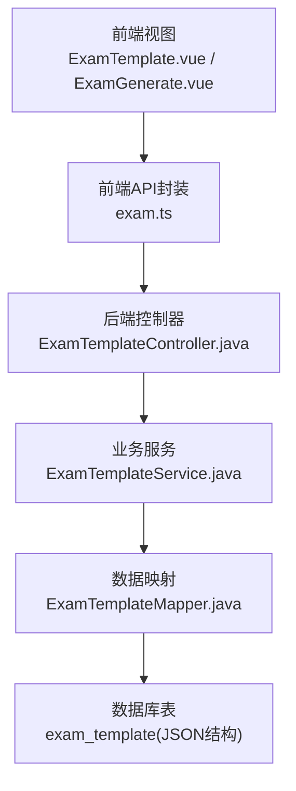
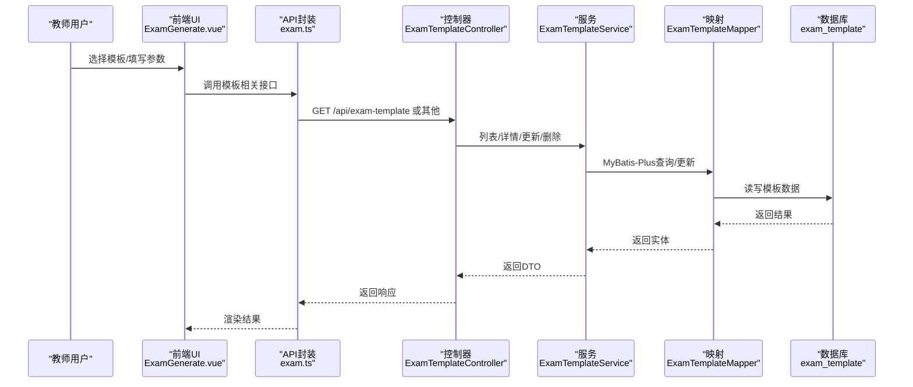
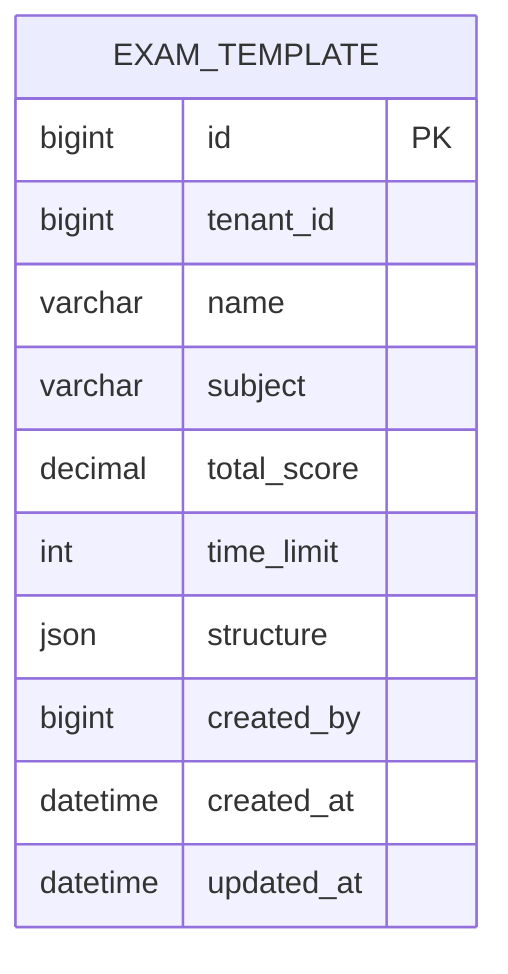
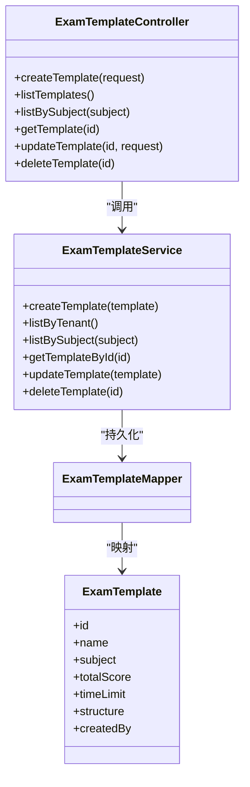
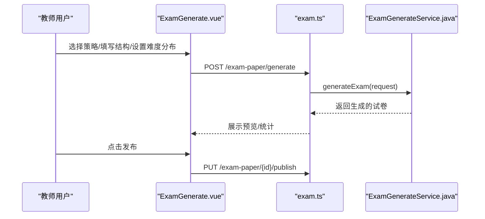
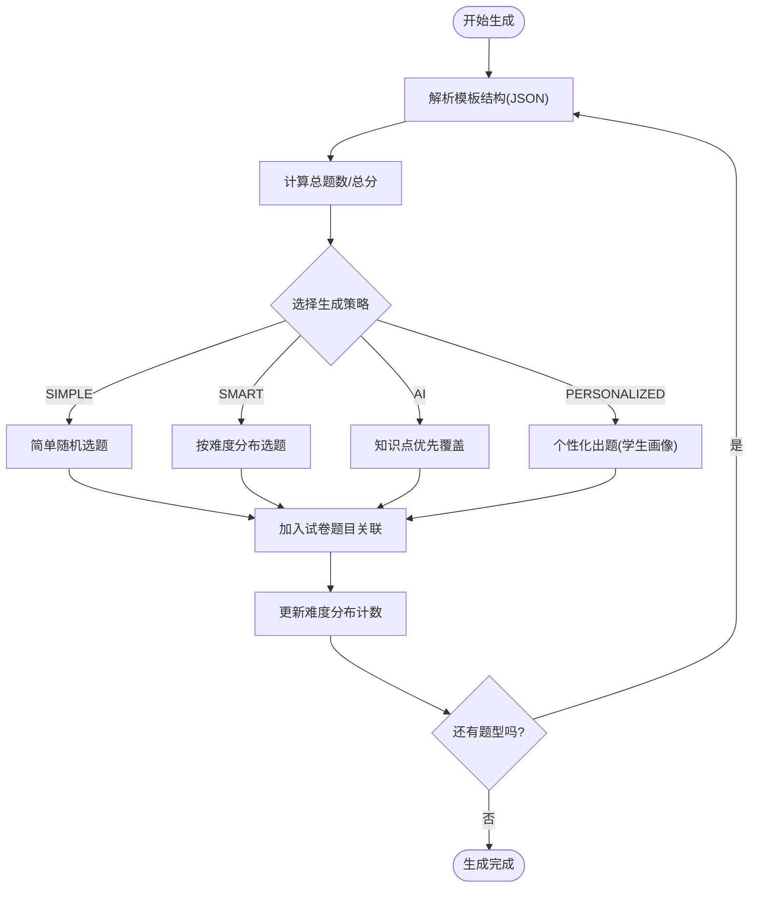
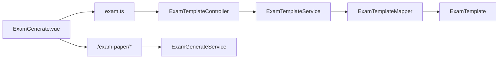

# 考试模板管理

<cite>
**本文引用的文件**
- [ExamTemplate.java](file://backend/src/main/java/com/edu/exam/entity/ExamTemplate.java)
- [ExamTemplateService.java](file://backend/src/main/java/com/edu/exam/service/ExamTemplateService.java)
- [ExamTemplateController.java](file://backend/src/main/java/com/edu/exam/controller/ExamTemplateController.java)
- [ExamTemplateCreateRequest.java](file://backend/src/main/java/com/edu/exam/dto/ExamTemplateCreateRequest.java)
- [ExamTemplateResponse.java](file://backend/src/main/java/com/edu/exam/dto/ExamTemplateResponse.java)
- [ExamTemplateMapper.java](file://backend/src/main/java/com/edu/exam/mapper/ExamTemplateMapper.java)
- [BaseEntity.java](file://backend/src/main/java/com/edu/common/entity/BaseEntity.java)
- [schema.sql](file://backend/src/main/resources/db/schema.sql)
- [ExamTemplate.vue](file://frontend/src/views/ExamTemplate.vue)
- [ExamGenerate.vue](file://frontend/src/views/ExamGenerate.vue)
- [exam.ts](file://frontend/src/api/exam.ts)
- [ExamGenerateService.java](file://backend/src/main/java/com/edu/exam/service/ExamGenerateService.java)
- [ExamGenerateRequest.java](file://backend/src/main/java/com/edu/exam/dto/ExamGenerateRequest.java)
</cite>

## 目录
1. [简介](#简介)
2. [项目结构](#项目结构)
3. [核心组件](#核心组件)
4. [架构总览](#架构总览)
5. [详细组件分析](#详细组件分析)
6. [依赖分析](#依赖分析)
7. [性能考量](#性能考量)
8. [故障排查指南](#故障排查指南)
9. [结论](#结论)
10. [附录](#附录)

## 简介
本文件围绕“考试模板管理”功能进行系统化说明，涵盖模板设计理念、属性配置、版本管理与继承思路、模板应用流程（模板选择、参数调整、批量生成）、最佳实践与常见问题，并提供API接口文档与实际应用场景示例。当前系统以“模板即JSON结构配置”的方式实现模板复用与个性化定制，结合AI生成策略实现智能化组卷。

## 项目结构
- 后端采用分层架构：controller → service → mapper → entity，统一通过MyBatis-Plus访问数据库。
- 前端采用Vue3 + Element Plus，提供模板管理与AI组卷界面。
- 数据库层面，模板以JSON字段存储结构配置，支持灵活扩展。

图表来源
- [ExamTemplate.vue:1-157](file://frontend/src/views/ExamTemplate.vue#L1-L157)
- [ExamGenerate.vue:1-558](file://frontend/src/views/ExamGenerate.vue#L1-L558)
- [exam.ts:1-78](file://frontend/src/api/exam.ts#L1-L78)
- [ExamTemplateController.java:1-118](file://backend/src/main/java/com/edu/exam/controller/ExamTemplateController.java#L1-L118)
- [ExamTemplateService.java:1-66](file://backend/src/main/java/com/edu/exam/service/ExamTemplateService.java#L1-L66)
- [ExamTemplateMapper.java:1-13](file://backend/src/main/java/com/edu/exam/mapper/ExamTemplateMapper.java#L1-L13)
- [schema.sql:186-199](file://backend/src/main/resources/db/schema.sql#L186-L199)

章节来源
- [ExamTemplate.vue:1-157](file://frontend/src/views/ExamTemplate.vue#L1-L157)
- [ExamGenerate.vue:1-558](file://frontend/src/views/ExamGenerate.vue#L1-L558)
- [exam.ts:1-78](file://frontend/src/api/exam.ts#L1-L78)
- [ExamTemplateController.java:1-118](file://backend/src/main/java/com/edu/exam/controller/ExamTemplateController.java#L1-L118)
- [ExamTemplateService.java:1-66](file://backend/src/main/java/com/edu/exam/service/ExamTemplateService.java#L1-L66)
- [ExamTemplateMapper.java:1-13](file://backend/src/main/java/com/edu/exam/mapper/ExamTemplateMapper.java#L1-L13)
- [schema.sql:186-199](file://backend/src/main/resources/db/schema.sql#L186-L199)

## 核心组件
- 模板实体：ExamTemplate，包含模板基础属性与JSON结构字段。
- 控制器：ExamTemplateController，提供模板的增删改查与按学科查询。
- 服务：ExamTemplateService，封装租户隔离、列表查询与CRUD。
- 映射：ExamTemplateMapper，基于MyBatis-Plus的通用Mapper。
- 前端模板管理：ExamTemplate.vue，提供模板列表、新增/编辑、删除。
- 前端AI组卷：ExamGenerate.vue，提供模板选择、难度分布、知识点覆盖、策略选择与生成预览。
- 生成服务：ExamGenerateService，负责解析模板结构、按策略选题、生成试卷并持久化。

章节来源
- [ExamTemplate.java:1-26](file://backend/src/main/java/com/edu/exam/entity/ExamTemplate.java#L1-L26)
- [ExamTemplateController.java:1-118](file://backend/src/main/java/com/edu/exam/controller/ExamTemplateController.java#L1-L118)
- [ExamTemplateService.java:1-66](file://backend/src/main/java/com/edu/exam/service/ExamTemplateService.java#L1-L66)
- [ExamTemplateMapper.java:1-13](file://backend/src/main/java/com/edu/exam/mapper/ExamTemplateMapper.java#L1-L13)
- [ExamTemplate.vue:1-157](file://frontend/src/views/ExamTemplate.vue#L1-L157)
- [ExamGenerate.vue:1-558](file://frontend/src/views/ExamGenerate.vue#L1-L558)
- [ExamGenerateService.java:1-374](file://backend/src/main/java/com/edu/exam/service/ExamGenerateService.java#L1-L374)

## 架构总览
模板系统围绕“模板定义 + 结构配置 + 生成策略 + 应用执行”展开，形成“模板即配置”的轻量模型，便于复用与个性化。

图表来源
- [ExamTemplateController.java:1-118](file://backend/src/main/java/com/edu/exam/controller/ExamTemplateController.java#L1-L118)
- [ExamTemplateService.java:1-66](file://backend/src/main/java/com/edu/exam/service/ExamTemplateService.java#L1-L66)
- [ExamTemplateMapper.java:1-13](file://backend/src/main/java/com/edu/exam/mapper/ExamTemplateMapper.java#L1-L13)
- [schema.sql:186-199](file://backend/src/main/resources/db/schema.sql#L186-L199)

## 详细组件分析

### 模板实体与数据库设计
- 实体字段：模板ID、租户ID、名称、学科、总分、时长、结构JSON、创建人、创建时间等。
- 结构字段：以JSON数组形式存储“题型-数量-每题分值”等配置，便于灵活组合。
- 多租户：通过BaseEntity注入tenant_id实现租户隔离。
- 索引：对tenant_id、subject等常用过滤字段建立索引，提升查询性能。

图表来源
- [ExamTemplate.java:1-26](file://backend/src/main/java/com/edu/exam/entity/ExamTemplate.java#L1-L26)
- [BaseEntity.java:1-38](file://backend/src/main/java/com/edu/common/entity/BaseEntity.java#L1-L38)
- [schema.sql:186-199](file://backend/src/main/resources/db/schema.sql#L186-L199)

章节来源
- [ExamTemplate.java:1-26](file://backend/src/main/java/com/edu/exam/entity/ExamTemplate.java#L1-L26)
- [BaseEntity.java:1-38](file://backend/src/main/java/com/edu/common/entity/BaseEntity.java#L1-L38)
- [schema.sql:186-199](file://backend/src/main/resources/db/schema.sql#L186-L199)

### 模板控制器与服务
- 控制器提供：创建模板、获取模板列表（按租户/按学科）、获取模板详情、更新模板、删除模板。
- 服务实现：在创建时注入租户ID；查询按租户过滤；更新/删除支持幂等。
- DTO：请求体ExamTemplateCreateRequest与响应体ExamTemplateResponse，字段与实体对应。

图表来源
- [ExamTemplateController.java:1-118](file://backend/src/main/java/com/edu/exam/controller/ExamTemplateController.java#L1-L118)
- [ExamTemplateService.java:1-66](file://backend/src/main/java/com/edu/exam/service/ExamTemplateService.java#L1-L66)
- [ExamTemplateMapper.java:1-13](file://backend/src/main/java/com/edu/exam/mapper/ExamTemplateMapper.java#L1-L13)
- [ExamTemplate.java:1-26](file://backend/src/main/java/com/edu/exam/entity/ExamTemplate.java#L1-L26)

章节来源
- [ExamTemplateController.java:1-118](file://backend/src/main/java/com/edu/exam/controller/ExamTemplateController.java#L1-L118)
- [ExamTemplateService.java:1-66](file://backend/src/main/java/com/edu/exam/service/ExamTemplateService.java#L1-L66)
- [ExamTemplateMapper.java:1-13](file://backend/src/main/java/com/edu/exam/mapper/ExamTemplateMapper.java#L1-L13)
- [ExamTemplateCreateRequest.java:1-28](file://backend/src/main/java/com/edu/exam/dto/ExamTemplateCreateRequest.java#L1-L28)
- [ExamTemplateResponse.java:1-31](file://backend/src/main/java/com/edu/exam/dto/ExamTemplateResponse.java#L1-L31)

### 前端模板管理与AI组卷
- 模板管理：ExamTemplate.vue提供模板列表、新增/编辑弹窗、删除确认与加载数据。
- AI组卷：ExamGenerate.vue提供策略选择（简单随机/智能分布/AI推荐/个性化出题）、难度分布滑条、知识点覆盖、结构化题型配置、生成预览与发布。
- API封装：exam.ts提供模板与试卷相关接口，统一HTTP调用。

图表来源
- [ExamGenerate.vue:1-558](file://frontend/src/views/ExamGenerate.vue#L1-L558)
- [exam.ts:1-78](file://frontend/src/api/exam.ts#L1-L78)
- [ExamGenerateService.java:1-374](file://backend/src/main/java/com/edu/exam/service/ExamGenerateService.java#L1-L374)

章节来源
- [ExamTemplate.vue:1-157](file://frontend/src/views/ExamTemplate.vue#L1-L157)
- [ExamGenerate.vue:1-558](file://frontend/src/views/ExamGenerate.vue#L1-L558)
- [exam.ts:1-78](file://frontend/src/api/exam.ts#L1-L78)

### 生成策略与模板应用流程
- 模板结构解析：ExamGenerateService接收JSON结构，遍历题型分组，计算总题数与总分。
- 难度分布：支持默认与自定义分布，自动平衡至100%。
- 选题策略：
  - 简单随机：随机打乱后截取。
  - 智能分布：按难度分组选取，不足时从剩余题目补充。
  - AI推荐：优先覆盖指定知识点，替换部分题目。
  - 个性化出题：基于学生错题分析薄弱知识点，动态调整难度分布并触发AI策略。
- 批量生成：按模板结构循环选题并写入试卷题目关联表，最终返回完整试卷。

图表来源
- [ExamGenerateService.java:34-101](file://backend/src/main/java/com/edu/exam/service/ExamGenerateService.java#L34-L101)
- [ExamGenerateService.java:106-136](file://backend/src/main/java/com/edu/exam/service/ExamGenerateService.java#L106-L136)
- [ExamGenerateService.java:141-202](file://backend/src/main/java/com/edu/exam/service/ExamGenerateService.java#L141-L202)
- [ExamGenerateService.java:207-247](file://backend/src/main/java/com/edu/exam/service/ExamGenerateService.java#L207-L247)
- [ExamGenerateService.java:253-294](file://backend/src/main/java/com/edu/exam/service/ExamGenerateService.java#L253-L294)

章节来源
- [ExamGenerateService.java:1-374](file://backend/src/main/java/com/edu/exam/service/ExamGenerateService.java#L1-L374)
- [ExamGenerateRequest.java:1-30](file://backend/src/main/java/com/edu/exam/dto/ExamGenerateRequest.java#L1-L30)

### 版本管理与继承（设计建议）
当前模板未实现显式的版本号或继承字段。建议引入以下机制以增强模板生命周期管理：
- 版本字段：为模板增加version字段，支持语义化版本号。
- 继承关系：新增parent_template_id，指向父模板，子模板仅记录差异配置。
- 修改历史：新增模板变更日志表，记录每次更新的结构差异与备注。
- 回滚机制：基于变更日志支持一键回滚到指定版本。
- 兼容性检查：在更新模板时进行结构兼容性校验，避免破坏现有生成流程。

上述建议为概念性设计，非当前代码实现，故不附加章节来源。

## 依赖分析
- 控制器依赖服务，服务依赖Mapper，Mapper映射实体，实体继承BaseEntity并注入租户ID。
- 前端通过exam.ts封装API，分别调用模板与试卷相关接口。
- 生成服务依赖题库、试卷、学生与错题等模块，体现跨模块协作。

图表来源
- [ExamTemplateController.java:1-118](file://backend/src/main/java/com/edu/exam/controller/ExamTemplateController.java#L1-L118)
- [ExamTemplateService.java:1-66](file://backend/src/main/java/com/edu/exam/service/ExamTemplateService.java#L1-L66)
- [ExamTemplateMapper.java:1-13](file://backend/src/main/java/com/edu/exam/mapper/ExamTemplateMapper.java#L1-L13)
- [ExamTemplate.java:1-26](file://backend/src/main/java/com/edu/exam/entity/ExamTemplate.java#L1-L26)
- [ExamGenerate.vue:1-558](file://frontend/src/views/ExamGenerate.vue#L1-L558)
- [exam.ts:1-78](file://frontend/src/api/exam.ts#L1-L78)
- [ExamGenerateService.java:1-374](file://backend/src/main/java/com/edu/exam/service/ExamGenerateService.java#L1-L374)

章节来源
- [ExamTemplateController.java:1-118](file://backend/src/main/java/com/edu/exam/controller/ExamTemplateController.java#L1-L118)
- [ExamTemplateService.java:1-66](file://backend/src/main/java/com/edu/exam/service/ExamTemplateService.java#L1-L66)
- [ExamTemplateMapper.java:1-13](file://backend/src/main/java/com/edu/exam/mapper/ExamTemplateMapper.java#L1-L13)
- [ExamTemplate.java:1-26](file://backend/src/main/java/com/edu/exam/entity/ExamTemplate.java#L1-L26)
- [ExamGenerate.vue:1-558](file://frontend/src/views/ExamGenerate.vue#L1-L558)
- [exam.ts:1-78](file://frontend/src/api/exam.ts#L1-L78)
- [ExamGenerateService.java:1-374](file://backend/src/main/java/com/edu/exam/service/ExamGenerateService.java#L1-L374)

## 性能考量
- 查询优化：对tenant_id、subject建立索引，减少过滤成本。
- 结构解析：模板结构为JSON数组，解析复杂度与题型分组数量线性相关，建议控制分组数量与每组题数上限。
- 选题策略：智能/AI策略涉及多次分组与随机打乱，注意大数据量下的内存与CPU开销；可考虑分页或采样策略。
- 批量写入：生成试卷时逐题写入关联表，事务内批量提交可减少锁竞争；必要时拆分批次。

## 故障排查指南
- 租户上下文缺失：创建模板时若租户ID为空，会抛出业务异常。请确保登录态携带正确的租户信息。
- 模板不存在：按ID查询模板返回空时，前端应提示“模板不存在”。
- 题库无题：当某题型在题库中无可用题目时，智能/AI策略会抛出异常。请先完善题库或调整题型分组。
- 分值不一致：前端在生成前会提示结构总分与设置总分不一致，需调整题型分组或总分。
- 个性化出题缺少学生：选择“个性化出题”但未选择目标学生时，前端会提示并阻止生成。

章节来源
- [ExamTemplateService.java:21-31](file://backend/src/main/java/com/edu/exam/service/ExamTemplateService.java#L21-L31)
- [ExamTemplateController.java:69-76](file://backend/src/main/java/com/edu/exam/controller/ExamTemplateController.java#L69-L76)
- [ExamGenerateService.java:146-148](file://backend/src/main/java/com/edu/exam/service/ExamGenerateService.java#L146-L148)
- [ExamGenerate.vue:342-351](file://frontend/src/views/ExamGenerate.vue#L342-L351)

## 结论
模板系统以“结构化JSON配置”为核心，实现了模板复用与个性化定制的平衡。通过多种生成策略与AI能力，满足不同教学场景的组卷需求。建议后续引入版本与继承机制，进一步完善模板全生命周期管理。

## 附录

### API接口文档
- 获取模板列表
  - 方法：GET
  - 路径：/api/exam-template
  - 请求体：无
  - 响应：模板列表（ExamTemplateResponse[]）

- 按学科获取模板列表
  - 方法：GET
  - 路径：/api/exam-template/subject/{subject}
  - 路径参数：subject（学科枚举）
  - 响应：模板列表（ExamTemplateResponse[]）

- 获取模板详情
  - 方法：GET
  - 路径：/api/exam-template/{id}
  - 路径参数：id（模板ID）
  - 响应：模板详情（ExamTemplateResponse）

- 创建模板
  - 方法：POST
  - 路径：/api/exam-template
  - 请求体：ExamTemplateCreateRequest
  - 响应：模板详情（ExamTemplateResponse）

- 更新模板
  - 方法：PUT
  - 路径：/api/exam-template/{id}
  - 路径参数：id（模板ID）
  - 请求体：ExamTemplateCreateRequest
  - 响应：无（200）

- 删除模板
  - 方法：DELETE
  - 路径：/api/exam-template/{id}
  - 路径参数：id（模板ID）
  - 响应：无（200）

- AI生成试卷
  - 方法：POST
  - 路径：/exam-paper/generate
  - 请求体：ExamGenerateRequest（含结构JSON、难度分布、知识点、策略等）
  - 响应：生成的试卷（ExamPaperResponse）

- 个性化生成试卷
  - 方法：POST
  - 路径：/exam-paper/generate-personalized
  - 请求体：ExamGenerateRequest（含目标学生ID）
  - 响应：生成的试卷（ExamPaperResponse）

- 发布试卷
  - 方法：PUT
  - 路径：/exam-paper/{id}/publish
  - 路径参数：id（试卷ID）
  - 响应：无（200）

章节来源
- [ExamTemplateController.java:25-103](file://backend/src/main/java/com/edu/exam/controller/ExamTemplateController.java#L25-L103)
- [ExamGenerate.vue:377-383](file://frontend/src/views/ExamGenerate.vue#L377-L383)
- [exam.ts:3-78](file://frontend/src/api/exam.ts#L3-L78)
- [ExamGenerateRequest.java:1-30](file://backend/src/main/java/com/edu/exam/dto/ExamGenerateRequest.java#L1-L30)

### 模板设计指南与最佳实践
- 模板属性配置
  - 学科：与题库保持一致，确保选题命中率。
  - 题型分布：建议覆盖主干题型，如选择、填空、判断、计算。
  - 难度比例：默认3:5:2（简单:中等:困难），可根据教学目标调整。
  - 知识点权重：AI策略可优先覆盖薄弱知识点，提升个性化效果。
- 模板复用与标准化
  - 将常用模板沉淀为标准模板，统一学科与结构命名规范。
  - 对高频题型分组进行归档，减少重复配置工作。
- 个性化定制
  - 个性化出题需明确目标学生，结合其薄弱知识点与错题情况动态调整难度分布。
  - 建议定期回顾个性化生成结果，持续优化知识点权重与策略参数。
- 版本管理建议
  - 引入版本号与继承字段，支持差异化的模板演进。
  - 记录模板变更日志，便于审计与回滚。
- 应用场景示例
  - 期中期末复习：使用“智能分布+AI推荐”，保证知识点覆盖面与难度梯度。
  - 课堂小测：使用“简单随机”，快速生成同质化练习。
  - 学生补偿：使用“个性化出题”，针对薄弱环节强化训练。