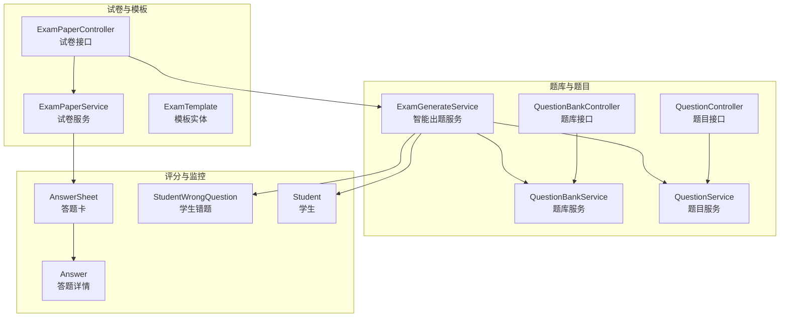
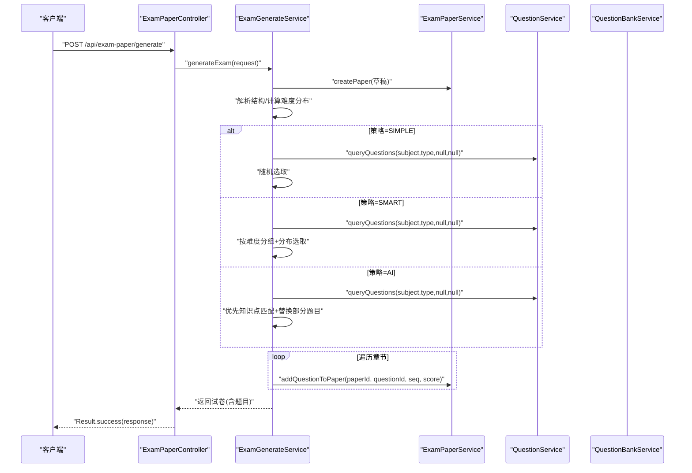
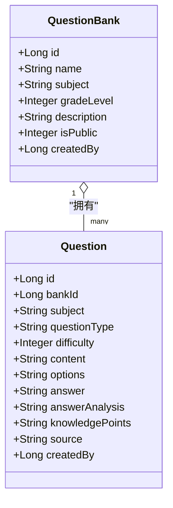
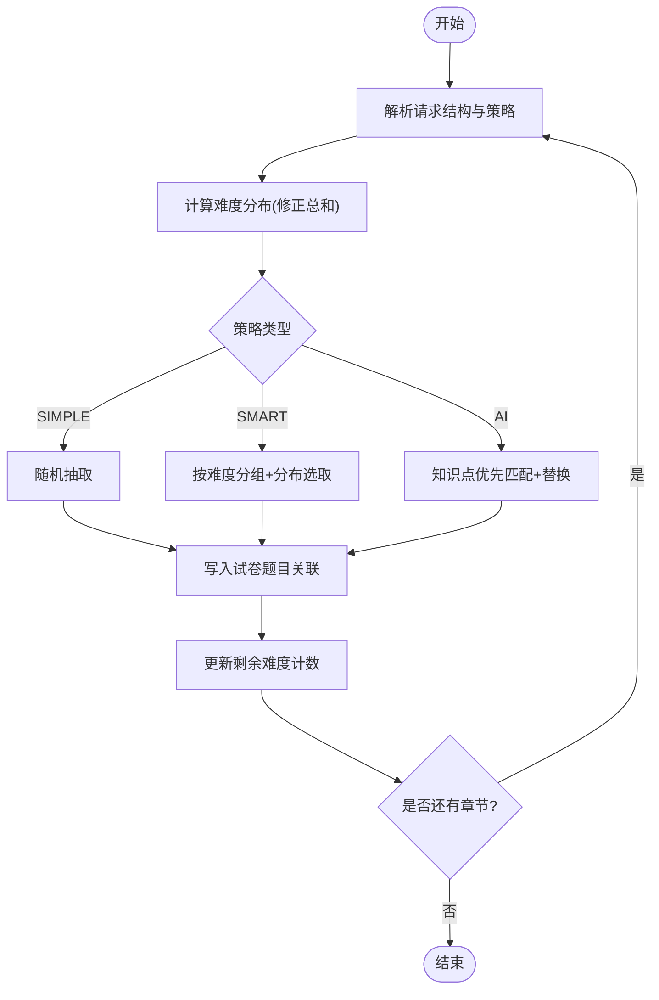
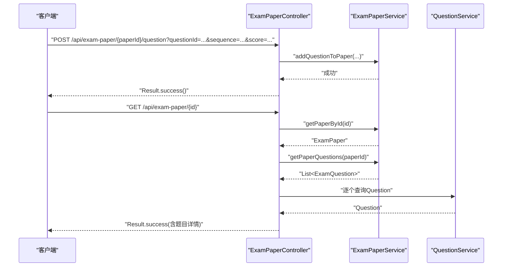
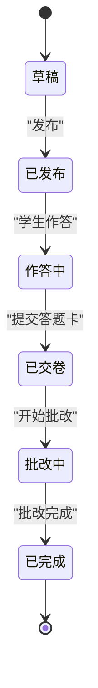
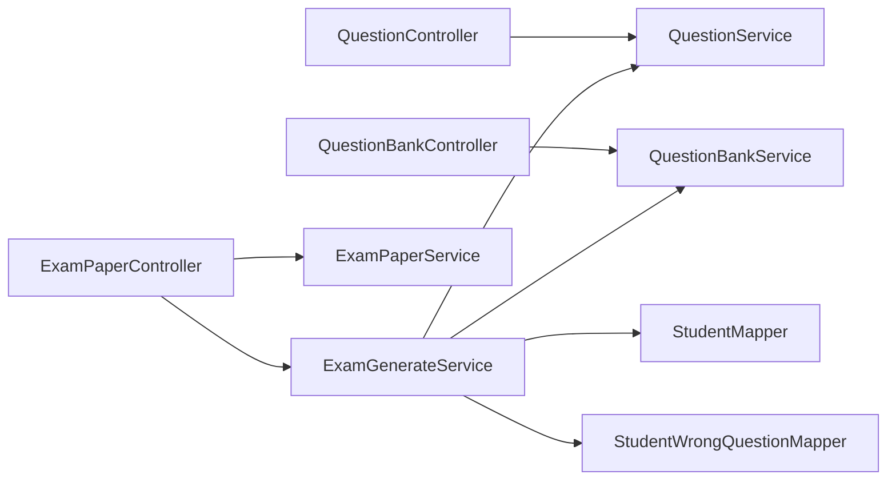

# 考试管理

<cite>
**本文引用的文件**
- [ExamPaper.java](file://backend/src/main/java/com/edu/exam/entity/ExamPaper.java)
- [Question.java](file://backend/src/main/java/com/edu/exam/entity/Question.java)
- [QuestionBank.java](file://backend/src/main/java/com/edu/exam/entity/QuestionBank.java)
- [ExamTemplate.java](file://backend/src/main/java/com/edu/exam/entity/ExamTemplate.java)
- [ExamPaperService.java](file://backend/src/main/java/com/edu/exam/service/ExamPaperService.java)
- [QuestionService.java](file://backend/src/main/java/com/edu/exam/service/QuestionService.java)
- [QuestionBankService.java](file://backend/src/main/java/com/edu/exam/service/QuestionBankService.java)
- [ExamGenerateService.java](file://backend/src/main/java/com/edu/exam/service/ExamGenerateService.java)
- [QuestionController.java](file://backend/src/main/java/com/edu/exam/controller/QuestionController.java)
- [QuestionBankController.java](file://backend/src/main/java/com/edu/exam/controller/QuestionBankController.java)
- [ExamPaperController.java](file://backend/src/main/java/com/edu/exam/controller/ExamPaperController.java)
- [QuestionCreateRequest.java](file://backend/src/main/java/com/edu/exam/dto/QuestionCreateRequest.java)
- [ExamGenerateRequest.java](file://backend/src/main/java/com/edu/exam/dto/ExamGenerateRequest.java)
- [AnswerSheet.java](file://backend/src/main/java/com/edu/grading/entity/AnswerSheet.java)
- [Answer.java](file://backend/src/main/java/com/edu/grading/entity/Answer.java)
- [StudentWrongQuestion.java](file://backend/src/main/java/com/edu/grading/entity/StudentWrongQuestion.java)
- [Student.java](file://backend/src/main/java/com/edu/user/entity/Student.java)
- [StudentMapper.java](file://backend/src/main/java/com/edu/user/mapper/StudentMapper.java)
- [StudentWrongQuestionMapper.java](file://backend/src/main/java/com/edu/grading/mapper/StudentWrongQuestionMapper.java)
</cite>

## 目录
1. [引言](#引言)
2. [项目结构](#项目结构)
3. [核心组件](#核心组件)
4. [架构总览](#架构总览)
5. [详细组件分析](#详细组件分析)
6. [依赖分析](#依赖分析)
7. [性能考量](#性能考量)
8. [故障排查指南](#故障排查指南)
9. [结论](#结论)
10. [附录](#附录)

## 引言
本文件面向“考试管理”模块，系统性梳理题库管理、智能出题、试卷生成与管理、发布与监控等能力。重点覆盖以下方面：
- 题库管理：题目的创建、查询、分类与批量导入（基于现有题库与题目实体扩展）。
- 智能出题：难度控制与知识点覆盖策略，支持SIMPLE/SMART/AI三种策略；个性化出题结合学生错题画像。
- 试卷生成与管理：模板化设计、自动排版与发布流程。
- 考试发布与监控：时间控制、状态跟踪与防作弊预留。
- 数据模型与API：完整实体关系与接口定义。

## 项目结构
后端采用分层架构：controller（接口层）、service（业务层）、mapper/entity（持久层/模型），围绕“题库-题目-试卷-模板-答题与评分”形成闭环。



图表来源
- [QuestionBankController.java:1-121](file://backend/src/main/java/com/edu/exam/controller/QuestionBankController.java#L1-L121)
- [QuestionController.java:1-132](file://backend/src/main/java/com/edu/exam/controller/QuestionController.java#L1-L132)
- [ExamPaperController.java:1-218](file://backend/src/main/java/com/edu/exam/controller/ExamPaperController.java#L1-L218)
- [QuestionBankService.java:1-70](file://backend/src/main/java/com/edu/exam/service/QuestionBankService.java#L1-L70)
- [QuestionService.java:1-73](file://backend/src/main/java/com/edu/exam/service/QuestionService.java#L1-L73)
- [ExamPaperService.java:1-107](file://backend/src/main/java/com/edu/exam/service/ExamPaperService.java#L1-L107)
- [ExamGenerateService.java:1-374](file://backend/src/main/java/com/edu/exam/service/ExamGenerateService.java#L1-L374)
- [AnswerSheet.java:1-34](file://backend/src/main/java/com/edu/grading/entity/AnswerSheet.java#L1-L34)
- [Answer.java:1-39](file://backend/src/main/java/com/edu/grading/entity/Answer.java#L1-L39)
- [StudentWrongQuestion.java](file://backend/src/main/java/com/edu/grading/entity/StudentWrongQuestion.java)
- [Student.java](file://backend/src/main/java/com/edu/user/entity/Student.java)

章节来源
- [QuestionBankController.java:1-121](file://backend/src/main/java/com/edu/exam/controller/QuestionBankController.java#L1-L121)
- [QuestionController.java:1-132](file://backend/src/main/java/com/edu/exam/controller/QuestionController.java#L1-L132)
- [ExamPaperController.java:1-218](file://backend/src/main/java/com/edu/exam/controller/ExamPaperController.java#L1-L218)
- [ExamPaperService.java:1-107](file://backend/src/main/java/com/edu/exam/service/ExamPaperService.java#L1-L107)
- [QuestionService.java:1-73](file://backend/src/main/java/com/edu/exam/service/QuestionService.java#L1-L73)
- [QuestionBankService.java:1-70](file://backend/src/main/java/com/edu/exam/service/QuestionBankService.java#L1-L70)
- [ExamGenerateService.java:1-374](file://backend/src/main/java/com/edu/exam/service/ExamGenerateService.java#L1-L374)

## 核心组件
- 题库与题目
  - QuestionBank：题库实体，支持学科、年级段、是否公开等属性。
  - Question：题目实体，包含题型、难度、内容、选项、答案、解析、知识点标签、来源等。
- 试卷与模板
  - ExamPaper：试卷实体，包含模板ID、标题、学科、年级/班级、总分、时长、状态、发布时间等。
  - ExamTemplate：模板实体，包含名称、学科、总分、时长、结构（JSON）等。
- 服务层
  - QuestionBankService/QuestionService：题库与题目的增删改查、按条件检索、计数统计。
  - ExamPaperService：试卷创建、发布、删除、添加题目、按租户/班级查询。
  - ExamGenerateService：智能出题（SIMPLE/SMART/AI）、个性化出题（基于学生错题画像）。
- 控制器层
  - QuestionBankController/QuestionController/ExamPaperController：统一返回Result包装结果，提供REST接口。

章节来源
- [QuestionBank.java:1-20](file://backend/src/main/java/com/edu/exam/entity/QuestionBank.java#L1-L20)
- [Question.java:1-25](file://backend/src/main/java/com/edu/exam/entity/Question.java#L1-L25)
- [ExamPaper.java:1-31](file://backend/src/main/java/com/edu/exam/entity/ExamPaper.java#L1-L31)
- [ExamTemplate.java:1-26](file://backend/src/main/java/com/edu/exam/entity/ExamTemplate.java#L1-L26)
- [QuestionBankService.java:1-70](file://backend/src/main/java/com/edu/exam/service/QuestionBankService.java#L1-L70)
- [QuestionService.java:1-73](file://backend/src/main/java/com/edu/exam/service/QuestionService.java#L1-L73)
- [ExamPaperService.java:1-107](file://backend/src/main/java/com/edu/exam/service/ExamPaperService.java#L1-L107)
- [ExamGenerateService.java:1-374](file://backend/src/main/java/com/edu/exam/service/ExamGenerateService.java#L1-L374)
- [QuestionBankController.java:1-121](file://backend/src/main/java/com/edu/exam/controller/QuestionBankController.java#L1-L121)
- [QuestionController.java:1-132](file://backend/src/main/java/com/edu/exam/controller/QuestionController.java#L1-L132)
- [ExamPaperController.java:1-218](file://backend/src/main/java/com/edu/exam/controller/ExamPaperController.java#L1-L218)

## 架构总览
下图展示“智能出题”的核心流程：接收请求、解析结构与策略、计算难度分布、按策略选择题目、写入试卷与题目关联表。



图表来源
- [ExamPaperController.java:57-70](file://backend/src/main/java/com/edu/exam/controller/ExamPaperController.java#L57-L70)
- [ExamGenerateService.java:34-101](file://backend/src/main/java/com/edu/exam/service/ExamGenerateService.java#L34-L101)
- [ExamPaperService.java:27-98](file://backend/src/main/java/com/edu/exam/service/ExamPaperService.java#L27-L98)
- [QuestionService.java:35-49](file://backend/src/main/java/com/edu/exam/service/QuestionService.java#L35-L49)

## 详细组件分析

### 题库管理
- 功能要点
  - 创建/更新/删除题库，按租户与公开范围查询。
  - 题目在题库内按创建时间排序，支持按学科、题型、难度、知识点筛选。
  - 题库响应包含题目数量统计，便于容量管理。
- 批量导入建议
  - 基于QuestionService的批量插入与事务封装，可在上层控制器或定时任务中实现批量导入流程（当前仓库未提供具体批量导入接口，建议新增批量导入接口以提升效率）。



图表来源
- [QuestionBank.java:1-20](file://backend/src/main/java/com/edu/exam/entity/QuestionBank.java#L1-L20)
- [Question.java:1-25](file://backend/src/main/java/com/edu/exam/entity/Question.java#L1-L25)

章节来源
- [QuestionBankController.java:27-105](file://backend/src/main/java/com/edu/exam/controller/QuestionBankController.java#L27-L105)
- [QuestionBankService.java:21-68](file://backend/src/main/java/com/edu/exam/service/QuestionBankService.java#L21-L68)
- [QuestionController.java:46-72](file://backend/src/main/java/com/edu/exam/controller/QuestionController.java#L46-L72)
- [QuestionService.java:28-49](file://backend/src/main/java/com/edu/exam/service/QuestionService.java#L28-L49)

### 智能出题机制
- 策略说明
  - SIMPLE：按题型随机抽取，适合快速组卷。
  - SMART：按难度分布（默认3:5:2）分层选取，不足时从剩余题目补充。
  - AI：在SMART基础上优先覆盖指定知识点，用于个性化出题。
- 个性化出题
  - 基于学生错题记录提取薄弱知识点，动态调整难度分布（错题多则提高简单题比例），再调用AI策略生成试卷。
- 难度分布与知识点覆盖
  - 支持自定义难度分布映射，自动修正总和为1；知识点数组支持多点覆盖。



图表来源
- [ExamGenerateService.java:34-101](file://backend/src/main/java/com/edu/exam/service/ExamGenerateService.java#L34-L101)
- [ExamGenerateService.java:106-136](file://backend/src/main/java/com/edu/exam/service/ExamGenerateService.java#L106-L136)
- [ExamGenerateService.java:141-202](file://backend/src/main/java/com/edu/exam/service/ExamGenerateService.java#L141-L202)
- [ExamGenerateService.java:207-247](file://backend/src/main/java/com/edu/exam/service/ExamGenerateService.java#L207-L247)
- [ExamGenerateService.java:253-294](file://backend/src/main/java/com/edu/exam/service/ExamGenerateService.java#L253-L294)

章节来源
- [ExamGenerateRequest.java:1-30](file://backend/src/main/java/com/edu/exam/dto/ExamGenerateRequest.java#L1-L30)
- [ExamGenerateService.java:1-374](file://backend/src/main/java/com/edu/exam/service/ExamGenerateService.java#L1-L374)

### 试卷生成与管理
- 接口能力
  - 手动创建：设置模板、学科、年级/班级、总分与时长，初始状态为草稿。
  - AI生成：传入结构、难度分布、知识点与策略，自动生成并返回带题目的试卷。
  - 个性化生成：传入目标学生ID，自动分析薄弱知识点并调整难度分布。
  - 发布：将草稿置为已发布并记录发布时间。
  - 题目管理：按顺序添加题目、查询试卷题目明细。
- 关联关系
  - 试卷与题目通过中间表ExamQuestion建立一对多关系，支持顺序与每题分值。



图表来源
- [ExamPaperController.java:147-156](file://backend/src/main/java/com/edu/exam/controller/ExamPaperController.java#L147-L156)
- [ExamPaperController.java:98-106](file://backend/src/main/java/com/edu/exam/controller/ExamPaperController.java#L98-L106)
- [ExamPaperService.java:90-105](file://backend/src/main/java/com/edu/exam/service/ExamPaperService.java#L90-L105)
- [QuestionService.java:51-53](file://backend/src/main/java/com/edu/exam/service/QuestionService.java#L51-L53)

章节来源
- [ExamPaperController.java:38-143](file://backend/src/main/java/com/edu/exam/controller/ExamPaperController.java#L38-L143)
- [ExamPaperService.java:27-105](file://backend/src/main/java/com/edu/exam/service/ExamPaperService.java#L27-L105)

### 考试发布与监控
- 发布流程
  - 将草稿状态置为已发布，记录发布时间；发布后可下发给班级进行作答。
- 监控与状态
  - 答题卡AnswerSheet包含状态字段（未提交/已提交/批改中/已批改），支持后续阅卷与统计。
- 防作弊预留
  - 可在发布时绑定时间限制、监考策略与唯一标识；当前实现以状态字段与时间戳为基础，便于扩展。



图表来源
- [ExamPaperService.java:67-77](file://backend/src/main/java/com/edu/exam/service/ExamPaperService.java#L67-L77)
- [AnswerSheet.java:25](file://backend/src/main/java/com/edu/grading/entity/AnswerSheet.java#L25)

章节来源
- [ExamPaperService.java:67-77](file://backend/src/main/java/com/edu/exam/service/ExamPaperService.java#L67-L77)
- [AnswerSheet.java:1-34](file://backend/src/main/java/com/edu/grading/entity/AnswerSheet.java#L1-L34)

## 依赖分析
- 组件耦合
  - ExamPaperController依赖ExamPaperService与ExamGenerateService；ExamGenerateService依赖QuestionService、QuestionBankService、StudentMapper与StudentWrongQuestionMapper。
  - QuestionController与QuestionBankController分别依赖对应Service；QuestionService与QuestionBankService依赖MyBatis-Plus Mapper。
- 外部依赖
  - JSON解析使用Fastjson2；MyBatis-Plus用于数据库访问；Spring事务保证一致性。



图表来源
- [QuestionBankController.java:1-121](file://backend/src/main/java/com/edu/exam/controller/QuestionBankController.java#L1-L121)
- [QuestionController.java:1-132](file://backend/src/main/java/com/edu/exam/controller/QuestionController.java#L1-L132)
- [ExamPaperController.java:1-218](file://backend/src/main/java/com/edu/exam/controller/ExamPaperController.java#L1-L218)
- [ExamGenerateService.java:28-32](file://backend/src/main/java/com/edu/exam/service/ExamGenerateService.java#L28-L32)

章节来源
- [ExamGenerateService.java:1-374](file://backend/src/main/java/com/edu/exam/service/ExamGenerateService.java#L1-L374)

## 性能考量
- 查询优化
  - 题目查询支持按学科、题型、难度、知识点过滤；建议在相关字段建立索引（如subject、questionType、difficulty、knowledgePoints）。
- 出题策略
  - SMART策略先按难度分组再随机，避免重复扫描全表；AI策略优先匹配知识点集合，减少无效比较。
- 事务边界
  - 试卷创建、发布、删除与题目添加均在事务中执行，确保一致性；批量导入建议拆分为小批次并保持事务短小。

## 故障排查指南
- 常见问题
  - 租户上下文缺失：创建题库/试卷时需设置租户ID，否则抛出业务异常。
  - 试卷不存在：发布/删除/查询前需校验ID有效性。
  - 题库无符合题目：当题库为空或筛选条件过严时，智能出题会抛出异常。
  - 个性化出题缺少学生：目标学生ID为空时拒绝生成。
- 定位方法
  - 查看服务层日志与异常栈；确认DTO参数与数据库索引是否存在。
  - 对照控制器返回码与Result封装，定位前端错误提示来源。

章节来源
- [QuestionBankService.java:23-31](file://backend/src/main/java/com/edu/exam/service/QuestionBankService.java#L23-L31)
- [ExamPaperService.java:69-76](file://backend/src/main/java/com/edu/exam/service/ExamPaperService.java#L69-L76)
- [ExamGenerateService.java:146-148](file://backend/src/main/java/com/edu/exam/service/ExamGenerateService.java#L146-L148)
- [ExamGenerateService.java:255-257](file://backend/src/main/java/com/edu/exam/service/ExamGenerateService.java#L255-L257)

## 结论
该模块以清晰的分层与实体模型支撑了完整的考试管理闭环：从题库建设、智能出题到试卷生成与发布，具备良好的扩展性。建议后续完善批量导入接口、引入AI服务对接与防作弊策略，进一步提升自动化与智能化水平。

## 附录

### 数据模型与关系
```mermaid
erDiagram
QUESTION_BANK {
bigint id PK
string name
string subject
int grade_level
string description
int is_public
bigint created_by
}
QUESTION {
bigint id PK
bigint bank_id FK
string subject
string question_type
int difficulty
text content
text options
text answer
text answer_analysis
string knowledge_points
string source
bigint created_by
}
EXAM_TEMPLATE {
bigint id PK
string name
string subject
decimal total_score
int time_limit
text structure
bigint created_by
}
EXAM_PAPER {
bigint id PK
bigint template_id FK
string title
string subject
bigint grade_id
bigint class_id
decimal total_score
int time_limit
int status
bigint created_by
datetime published_at
}
EXAM_QUESTION {
bigint id PK
bigint exam_paper_id FK
bigint question_id FK
int sequence
decimal score
}
ANSWERSHEET {
bigint id PK
bigint exam_paper_id FK
bigint student_id FK
int status
decimal total_score
datetime submit_time
datetime grading_time
bigint graded_by
}
ANSWER {
bigint id PK
bigint answer_sheet_id FK
bigint exam_question_id FK
text student_answer
int is_correct
decimal score
decimal ai_score
decimal manual_score
text ai_analysis
datetime graded_at
}
STUDENT {
bigint id PK
...
}
STUDENT_WRONG_QUESTION {
bigint id PK
bigint student_id FK
bigint question_id FK
int wrong_count
datetime last_wrong_at
datetime corrected_at
}
QUESTION_BANK ||--o{ QUESTION : "拥有"
EXAM_TEMPLATE ||--o{ EXAM_PAPER : "生成"
EXAM_PAPER ||--o{ EXAM_QUESTION : "包含"
QUESTION ||--o{ EXAM_QUESTION : "被包含"
EXAM_PAPER ||--o{ ANSWERSHEET : "发布"
ANSWERSHEET ||--o{ ANSWER : "承载"
STUDENT ||--o{ ANSWERSHEET : "作答"
STUDENT ||--o{ STUDENT_WRONG_QUESTION : "错题"
QUESTION ||--o{ STUDENT_WRONG_QUESTION : "产生错题"
```

图表来源
- [QuestionBank.java:1-20](file://backend/src/main/java/com/edu/exam/entity/QuestionBank.java#L1-L20)
- [Question.java:1-25](file://backend/src/main/java/com/edu/exam/entity/Question.java#L1-L25)
- [ExamTemplate.java:1-26](file://backend/src/main/java/com/edu/exam/entity/ExamTemplate.java#L1-L26)
- [ExamPaper.java:1-31](file://backend/src/main/java/com/edu/exam/entity/ExamPaper.java#L1-L31)
- [AnswerSheet.java:1-34](file://backend/src/main/java/com/edu/grading/entity/AnswerSheet.java#L1-L34)
- [Answer.java:1-39](file://backend/src/main/java/com/edu/grading/entity/Answer.java#L1-L39)
- [StudentWrongQuestion.java](file://backend/src/main/java/com/edu/grading/entity/StudentWrongQuestion.java)
- [Student.java](file://backend/src/main/java/com/edu/user/entity/Student.java)

### API 接口文档

- 题库管理
  - POST /api/question-bank
    - 请求体：QuestionBankCreateRequest
    - 返回：QuestionBankResponse
  - GET /api/question-bank
    - 返回：List<QuestionBankResponse>
  - GET /api/question-bank/subject/{subject}
    - 返回：List<QuestionBankResponse>
  - GET /api/question-bank/{id}
    - 返回：QuestionBankResponse
  - PUT /api/question-bank/{id}
    - 请求体：QuestionBankCreateRequest
    - 返回：Void
  - DELETE /api/question-bank/{id}
    - 返回：Void

- 题目管理
  - POST /api/question
    - 请求体：QuestionCreateRequest
    - 返回：QuestionResponse
  - GET /api/question/bank/{bankId}
    - 返回：List<QuestionResponse>
  - GET /api/question/query
    - 参数：subject, type, difficulty, knowledgePoint
    - 返回：List<QuestionResponse>
  - GET /api/question/{id}
    - 返回：QuestionResponse
  - PUT /api/question/{id}
    - 请求体：QuestionCreateRequest
    - 返回：Void
  - DELETE /api/question/{id}
    - 返回：Void

- 试卷管理
  - POST /api/exam-paper
    - 请求体：ExamPaperCreateRequest
    - 返回：ExamPaperResponse
  - POST /api/exam-paper/generate
    - 请求体：ExamGenerateRequest
    - 返回：ExamPaperResponse（含题目）
  - POST /api/exam-paper/generate-personalized
    - 请求体：ExamGenerateRequest（含targetStudentId）
    - 返回：ExamPaperResponse（含题目）
  - GET /api/exam-paper
    - 返回：List<ExamPaperResponse>
  - GET /api/exam-paper/class/{classId}
    - 返回：List<ExamPaperResponse>
  - GET /api/exam-paper/{id}
    - 返回：ExamPaperResponse（含题目）
  - PUT /api/exam-paper/{id}
    - 请求体：ExamPaperCreateRequest
    - 返回：Void
  - PUT /api/exam-paper/{id}/publish
    - 返回：Void
  - DELETE /api/exam-paper/{id}
    - 返回：Void
  - POST /api/exam-paper/{paperId}/question?questionId=...&sequence=...&score=...
    - 返回：Void

章节来源
- [QuestionBankController.java:27-105](file://backend/src/main/java/com/edu/exam/controller/QuestionBankController.java#L27-L105)
- [QuestionController.java:28-113](file://backend/src/main/java/com/edu/exam/controller/QuestionController.java#L28-L113)
- [ExamPaperController.java:38-156](file://backend/src/main/java/com/edu/exam/controller/ExamPaperController.java#L38-L156)
- [QuestionCreateRequest.java:1-37](file://backend/src/main/java/com/edu/exam/dto/QuestionCreateRequest.java#L1-L37)
- [ExamGenerateRequest.java:1-30](file://backend/src/main/java/com/edu/exam/dto/ExamGenerateRequest.java#L1-L30)