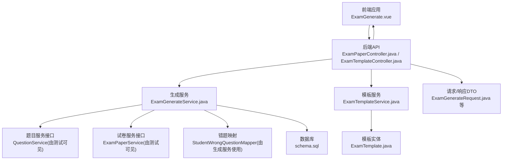
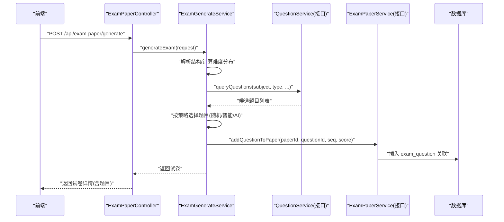
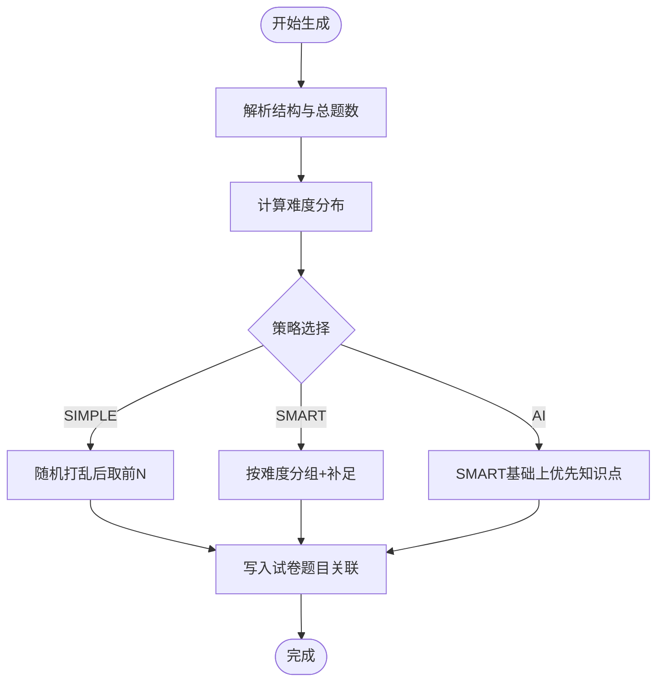
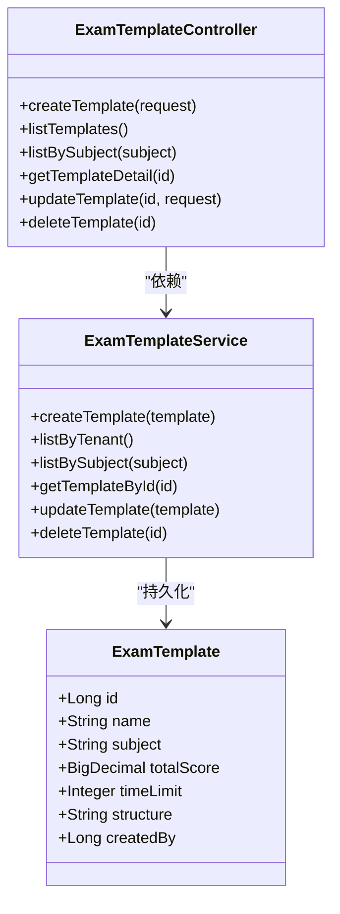
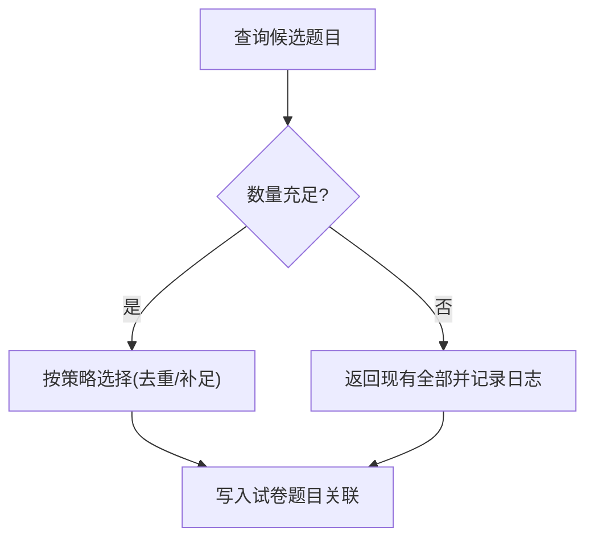
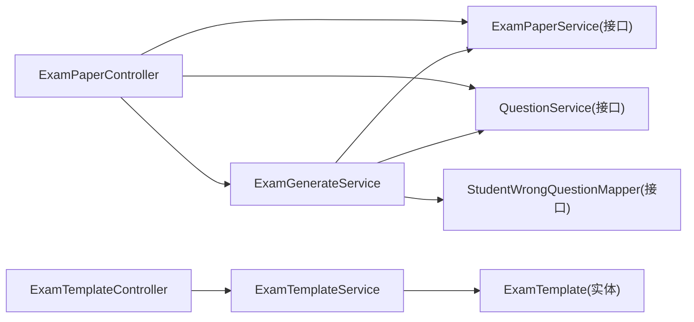

# 试卷生成

<cite>
**本文引用的文件**   
- [ExamGenerateService.java](file://backend/src/main/java/com/edu/exam/service/ExamGenerateService.java)
- [ExamGenerateRequest.java](file://backend/src/main/java/com/edu/exam/dto/ExamGenerateRequest.java)
- [ExamPaperController.java](file://backend/src/main/java/com/edu/exam/controller/ExamPaperController.java)
- [ExamTemplateController.java](file://backend/src/main/java/com/edu/exam/controller/ExamTemplateController.java)
- [ExamTemplateService.java](file://backend/src/main/java/com/edu/exam/service/ExamTemplateService.java)
- [ExamTemplate.java](file://backend/src/main/java/com/edu/exam/entity/ExamTemplate.java)
- [Question.java](file://backend/src/main/java/com/edu/exam/entity/Question.java)
- [ExamTemplateCreateRequest.java](file://backend/src/main/java/com/edu/exam/dto/ExamTemplateCreateRequest.java)
- [StudentWrongQuestion.java](file://backend/src/main/java/com/edu/grading/entity/StudentWrongQuestion.java)
- [schema.sql](file://backend/src/main/resources/db/schema.sql)
- [exam.ts](file://frontend/src/api/exam.ts)
- [ExamGenerate.vue](file://frontend/src/views/ExamGenerate.vue)
- [ExamGenerateServiceTest.java](file://backend/src/test/java/com/edu/exam/service/ExamGenerateServiceTest.java)
- [AIService.java](file://backend/src/main/java/com/edu/ai/service/AIService.java)
- [QuestionGenerateRequest.java](file://backend/src/main/java/com/edu/ai/dto/QuestionGenerateRequest.java)
- [AIProviderFactory.java](file://backend/src/main/java/com/edu/ai/provider/AIProviderFactory.java)
</cite>

## 目录
1. [简介](#简介)
2. [项目结构](#项目结构)
3. [核心组件](#核心组件)
4. [架构总览](#架构总览)
5. [详细组件分析](#详细组件分析)
6. [依赖分析](#依赖分析)
7. [性能考量](#性能考量)
8. [故障排查指南](#故障排查指南)
9. [结论](#结论)
10. [附录](#附录)

## 简介
本文件面向“智能试卷生成”能力，系统性阐述后端服务如何通过策略化的题目筛选与随机化处理，结合难度分布与知识点覆盖策略，生成符合业务需求的试卷；同时介绍模板系统的设计与使用，以及前后端API交互与使用示例。重点覆盖以下方面：
- AI驱动的题目组合算法与策略选择
- 难度分布控制与知识点覆盖策略
- 试卷模板系统与打印格式配置思路
- 试卷生成流程与题目去重、重复率控制、质量检查
- 试卷属性管理（时长、总分、及格分）
- 完整API接口文档与使用示例

## 项目结构
后端采用分层架构，试卷相关模块位于 exam 包下，包含控制器、服务、实体、DTO、Mapper等；AI能力位于 ai 包下，提供统一入口与工厂；数据库表结构在 schema.sql 中定义。

图表来源
- [ExamPaperController.java:1-218](file://backend/src/main/java/com/edu/exam/controller/ExamPaperController.java#L1-L218)
- [ExamTemplateController.java:1-118](file://backend/src/main/java/com/edu/exam/controller/ExamTemplateController.java#L1-L118)
- [ExamGenerateService.java:1-374](file://backend/src/main/java/com/edu/exam/service/ExamGenerateService.java#L1-L374)
- [ExamTemplateService.java:1-66](file://backend/src/main/java/com/edu/exam/service/ExamTemplateService.java#L1-L66)
- [schema.sql:1-379](file://backend/src/main/resources/db/schema.sql#L1-L379)

章节来源
- [ExamPaperController.java:1-218](file://backend/src/main/java/com/edu/exam/controller/ExamPaperController.java#L1-L218)
- [ExamTemplateController.java:1-118](file://backend/src/main/java/com/edu/exam/controller/ExamTemplateController.java#L1-L118)
- [ExamGenerateService.java:1-374](file://backend/src/main/java/com/edu/exam/service/ExamGenerateService.java#L1-L374)
- [ExamTemplateService.java:1-66](file://backend/src/main/java/com/edu/exam/service/ExamTemplateService.java#L1-L66)
- [schema.sql:1-379](file://backend/src/main/resources/db/schema.sql#L1-L379)

## 核心组件
- 生成服务：负责解析试卷结构、按策略选择题目、维护难度分布、个性化出题、写入试卷题目关联。
- 控制器：对外暴露生成、模板管理、查询等REST接口。
- 模板服务：提供模板的CRUD与按租户/学科查询。
- 实体与DTO：定义试卷、题目、模板的数据模型与请求/响应载体。
- 前端：提供可视化配置与调用后端API的界面。

章节来源
- [ExamGenerateService.java:1-374](file://backend/src/main/java/com/edu/exam/service/ExamGenerateService.java#L1-L374)
- [ExamPaperController.java:1-218](file://backend/src/main/java/com/edu/exam/controller/ExamPaperController.java#L1-L218)
- [ExamTemplateService.java:1-66](file://backend/src/main/java/com/edu/exam/service/ExamTemplateService.java#L1-L66)
- [ExamTemplate.java:1-26](file://backend/src/main/java/com/edu/exam/entity/ExamTemplate.java#L1-L26)
- [ExamGenerateRequest.java:1-30](file://backend/src/main/java/com/edu/exam/dto/ExamGenerateRequest.java#L1-L30)

## 架构总览
下面以序列图展示“AI智能生成试卷”的端到端流程，涵盖请求解析、策略选择、题目筛选与写入。

图表来源
- [ExamPaperController.java:57-70](file://backend/src/main/java/com/edu/exam/controller/ExamPaperController.java#L57-L70)
- [ExamGenerateService.java:35-101](file://backend/src/main/java/com/edu/exam/service/ExamGenerateService.java#L35-L101)
- [ExamGenerateServiceTest.java:68-86](file://backend/src/test/java/com/edu/exam/service/ExamGenerateServiceTest.java#L68-L86)

章节来源
- [ExamPaperController.java:57-70](file://backend/src/main/java/com/edu/exam/controller/ExamPaperController.java#L57-L70)
- [ExamGenerateService.java:35-101](file://backend/src/main/java/com/edu/exam/service/ExamGenerateService.java#L35-L101)
- [ExamGenerateServiceTest.java:68-86](file://backend/src/test/java/com/edu/exam/service/ExamGenerateServiceTest.java#L68-L86)

## 详细组件分析

### 生成服务：智能试卷生成机制
- 试卷结构解析：将请求中的结构字段解析为数组，逐段计算总题数与分值。
- 策略选择：支持 SIMPLE（简单随机）、SMART（智能分布）、AI（AI推荐），默认 SMART。
- 难度分布控制：若未提供分布，使用默认比例；最终保证与总题数一致。
- 题目筛选与随机化：
  - SIMPLE：从同类型题库中随机打乱后取前N个。
  - SMART：按难度分组，优先满足目标分布，不足时从剩余题目补充。
  - AI：在SMART基础上，优先覆盖指定知识点，并替换部分题目。
- 个性化出题：基于学生错题记录提取薄弱知识点，调整难度分布，再走AI策略。
- 写入试卷：按顺序将题目加入试卷并记录分值。

图表来源
- [ExamGenerateService.java:48-101](file://backend/src/main/java/com/edu/exam/service/ExamGenerateService.java#L48-L101)
- [ExamGenerateService.java:141-247](file://backend/src/main/java/com/edu/exam/service/ExamGenerateService.java#L141-L247)

章节来源
- [ExamGenerateService.java:35-101](file://backend/src/main/java/com/edu/exam/service/ExamGenerateService.java#L35-L101)
- [ExamGenerateService.java:141-247](file://backend/src/main/java/com/edu/exam/service/ExamGenerateService.java#L141-L247)

### 试卷模板系统
- 模板实体：包含名称、学科、总分、时长、结构配置、创建人等。
- 模板服务：提供创建、查询（按租户/学科）、更新、删除。
- 模板控制器：提供REST接口，支持按学科筛选与详情查询。
- 结构配置：模板的结构字段为JSON，与生成请求中的结构保持一致，便于复用。

图表来源
- [ExamTemplate.java:1-26](file://backend/src/main/java/com/edu/exam/entity/ExamTemplate.java#L1-L26)
- [ExamTemplateService.java:1-66](file://backend/src/main/java/com/edu/exam/service/ExamTemplateService.java#L1-L66)
- [ExamTemplateController.java:1-118](file://backend/src/main/java/com/edu/exam/controller/ExamTemplateController.java#L1-L118)

章节来源
- [ExamTemplate.java:1-26](file://backend/src/main/java/com/edu/exam/entity/ExamTemplate.java#L1-L26)
- [ExamTemplateService.java:1-66](file://backend/src/main/java/com/edu/exam/service/ExamTemplateService.java#L1-L66)
- [ExamTemplateController.java:1-118](file://backend/src/main/java/com/edu/exam/controller/ExamTemplateController.java#L1-L118)

### 试卷生成流程与质量控制
- 题目去重：在SMART与AI策略中，会先过滤已选题目，避免重复。
- 重复率控制：通过“已选题目集合”与“剩余候选集合”的差集选择，减少重复。
- 质量检查：
  - 当候选题目数量不足时，仍会生成尽可能多的题目并返回。
  - 若某类型题目为空，抛出业务异常提示。
  - 前端可校验结构总分与设置总分一致性，避免不一致导致的体验问题。

图表来源
- [ExamGenerateService.java:141-155](file://backend/src/main/java/com/edu/exam/service/ExamGenerateService.java#L141-L155)
- [ExamGenerateService.java:165-202](file://backend/src/main/java/com/edu/exam/service/ExamGenerateService.java#L165-L202)
- [ExamGenerateServiceTest.java:121-141](file://backend/src/test/java/com/edu/exam/service/ExamGenerateServiceTest.java#L121-L141)

章节来源
- [ExamGenerateService.java:141-155](file://backend/src/main/java/com/edu/exam/service/ExamGenerateService.java#L141-L155)
- [ExamGenerateService.java:165-202](file://backend/src/main/java/com/edu/exam/service/ExamGenerateService.java#L165-L202)
- [ExamGenerateServiceTest.java:121-141](file://backend/src/test/java/com/edu/exam/service/ExamGenerateServiceTest.java#L121-L141)

### 试卷属性管理
- 属性字段：标题、学科、适用年级/班级、总分、时长、创建人等。
- 控制器：提供创建、更新、发布、删除等操作。
- 数据库：对应 exam_paper 表，包含状态、发布时间等字段。

章节来源
- [ExamPaperController.java:38-52](file://backend/src/main/java/com/edu/exam/controller/ExamPaperController.java#L38-L52)
- [ExamPaperController.java:109-125](file://backend/src/main/java/com/edu/exam/controller/ExamPaperController.java#L109-L125)
- [schema.sql:201-218](file://backend/src/main/resources/db/schema.sql#L201-L218)

### AI驱动的题目组合与知识点覆盖
- AIService：统一入口，按租户选择AI Provider（云端/私有），支持状态检查与用量统计。
- AIProviderFactory：根据租户配置动态选择Provider。
- QuestionGenerateRequest：封装学科、题型、难度、知识点、数量等生成参数。
- 在AI策略中，优先匹配指定知识点，提升针对性。

章节来源
- [AIService.java:1-102](file://backend/src/main/java/com/edu/ai/service/AIService.java#L1-L102)
- [AIProviderFactory.java:1-67](file://backend/src/main/java/com/edu/ai/provider/AIProviderFactory.java#L1-L67)
- [QuestionGenerateRequest.java:1-42](file://backend/src/main/java/com/edu/ai/dto/QuestionGenerateRequest.java#L1-L42)
- [ExamGenerateService.java:207-247](file://backend/src/main/java/com/edu/exam/service/ExamGenerateService.java#L207-L247)

## 依赖分析
- 生成服务依赖：
  - QuestionService：查询题目
  - ExamPaperService：创建试卷与写入题目关联
  - QuestionBankService：题库服务（用于扩展）
  - StudentMapper、StudentWrongQuestionMapper：个性化出题所需
- 控制器依赖：
  - ExamPaperService、ExamGenerateService、QuestionService
- 模板服务依赖：
  - ExamTemplateMapper（由基类实现）

图表来源
- [ExamPaperController.java:31-34](file://backend/src/main/java/com/edu/exam/controller/ExamPaperController.java#L31-L34)
- [ExamGenerateService.java:28-32](file://backend/src/main/java/com/edu/exam/service/ExamGenerateService.java#L28-L32)
- [ExamTemplateController.java:23](file://backend/src/main/java/com/edu/exam/controller/ExamTemplateController.java#L23)

章节来源
- [ExamPaperController.java:31-34](file://backend/src/main/java/com/edu/exam/controller/ExamPaperController.java#L31-L34)
- [ExamGenerateService.java:28-32](file://backend/src/main/java/com/edu/exam/service/ExamGenerateService.java#L28-L32)
- [ExamTemplateController.java:23](file://backend/src/main/java/com/edu/exam/controller/ExamTemplateController.java#L23)

## 性能考量
- 随机化与分组：使用分组与随机打乱，复杂度约为 O(n log n) 排序 + O(n) 遍历。
- 多段结构：逐段处理，避免一次性加载过多数据。
- 建议优化：
  - 对题库查询增加索引（如学科、题型、难度）。
  - 对大题量场景，分批写入 exam_question。
  - 缓存常用模板结构，减少JSON解析开销。

## 故障排查指南
- 题目不足：当某类型题目数量少于所需时，系统仍会返回现有全部并记录日志，需检查题库或放宽条件。
- 个性化出题异常：若未指定目标学生或学生不存在，将抛出业务异常。
- 难度分布异常：若输入分布之和非1，系统会自动调整中等难度占比以保证总和为1。
- 前端校验：前端会对结构总分与设置总分进行一致性提示，避免不一致。

章节来源
- [ExamGenerateServiceTest.java:121-141](file://backend/src/test/java/com/edu/exam/service/ExamGenerateServiceTest.java#L121-L141)
- [ExamGenerateService.java:254-294](file://backend/src/main/java/com/edu/exam/service/ExamGenerateService.java#L254-L294)
- [ExamGenerateService.java:339-373](file://backend/src/main/java/com/edu/exam/service/ExamGenerateService.java#L339-L373)
- [ExamGenerate.vue:342-351](file://frontend/src/views/ExamGenerate.vue#L342-L351)

## 结论
该系统提供了灵活且可扩展的智能试卷生成能力：通过多种生成策略、难度分布控制与知识点覆盖，结合模板系统与前后端协作，能够高效地生成符合教学目标的试卷。建议后续在AI策略上进一步对接真实AI Provider，并完善重复率控制与质量评估指标。

## 附录

### API接口文档

- 生成试卷
  - 方法：POST
  - 路径：/api/exam-paper/generate
  - 请求体：ExamGenerateRequest
  - 响应：ExamPaperResponse（含题目列表）
  - 示例：见“使用示例”

- 个性化生成
  - 方法：POST
  - 路径：/api/exam-paper/generate-personalized
  - 请求体：ExamGenerateRequest（需包含目标学生ID）
  - 响应：ExamPaperResponse（含题目列表）

- 创建试卷（手动）
  - 方法：POST
  - 路径：/api/exam-paper
  - 请求体：ExamPaperCreateRequest
  - 响应：ExamPaperResponse

- 获取试卷列表
  - 方法：GET
  - 路径：/api/exam-paper
  - 响应：ExamPaperResponse 列表

- 获取班级试卷列表
  - 方法：GET
  - 路径：/api/exam-paper/class/{classId}
  - 响应：ExamPaperResponse 列表

- 获取试卷详情
  - 方法：GET
  - 路径：/api/exam-paper/{id}
  - 响应：ExamPaperResponse（含题目）

- 更新试卷
  - 方法：PUT
  - 路径：/api/exam-paper/{id}
  - 请求体：ExamPaperCreateRequest
  - 响应：void

- 发布试卷
  - 方法：PUT
  - 路径：/api/exam-paper/{id}/publish
  - 响应：void

- 删除试卷
  - 方法：DELETE
  - 路径：/api/exam-paper/{id}
  - 响应：void

- 添加题目到试卷
  - 方法：POST
  - 路径：/api/exam-paper/{paperId}/question
  - 参数：questionId, sequence, score
  - 响应：void

- 创建模板
  - 方法：POST
  - 路径：/api/exam-template
  - 请求体：ExamTemplateCreateRequest
  - 响应：ExamTemplateResponse

- 获取模板列表
  - 方法：GET
  - 路径：/api/exam-template
  - 响应：ExamTemplateResponse 列表

- 按学科获取模板
  - 方法：GET
  - 路径：/api/exam-template/subject/{subject}
  - 响应：ExamTemplateResponse 列表

- 获取模板详情
  - 方法：GET
  - 路径：/api/exam-template/{id}
  - 响应：ExamTemplateResponse

- 更新模板
  - 方法：PUT
  - 路径：/api/exam-template/{id}
  - 请求体：ExamTemplateCreateRequest
  - 响应：void

- 删除模板
  - 方法：DELETE
  - 路径：/api/exam-template/{id}
  - 响应：void

章节来源
- [ExamPaperController.java:38-143](file://backend/src/main/java/com/edu/exam/controller/ExamPaperController.java#L38-L143)
- [ExamTemplateController.java:28-103](file://backend/src/main/java/com/edu/exam/controller/ExamTemplateController.java#L28-L103)

### 使用示例

- 前端调用示例（基于ExamGenerate.vue）
  - 生成策略：SIMPLE/SMART/AI/PERSONALIZED
  - 结构配置：多个题型段落，每段包含题型、数量、每题分值
  - 难度分布：简单/中等/困难百分比
  - 知识点覆盖：AI策略下可指定知识点
  - 个性化出题：选择目标学生，自动合并薄弱知识点
  - 分值校验：前端提示结构总分与设置总分不一致

- 后端调用示例（基于ExamGenerateService）
  - 传入ExamGenerateRequest，包含标题、学科、总分、时长、结构、策略、难度分布、知识点、目标学生ID等
  - 返回ExamPaperResponse，包含题目列表与统计

章节来源
- [ExamGenerate.vue:338-392](file://frontend/src/views/ExamGenerate.vue#L338-L392)
- [ExamGenerateService.java:35-101](file://backend/src/main/java/com/edu/exam/service/ExamGenerateService.java#L35-L101)