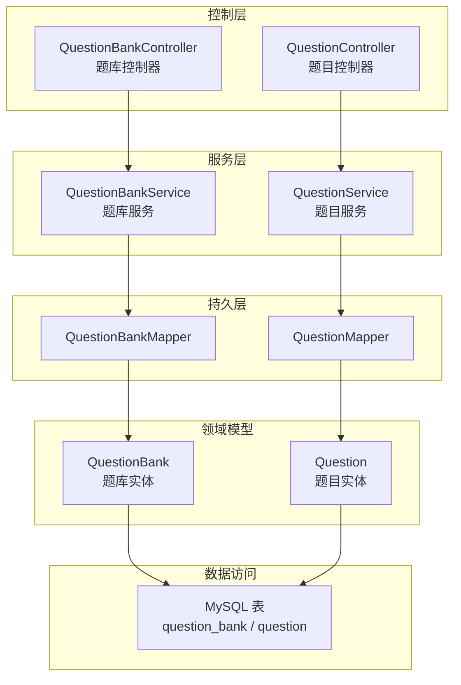
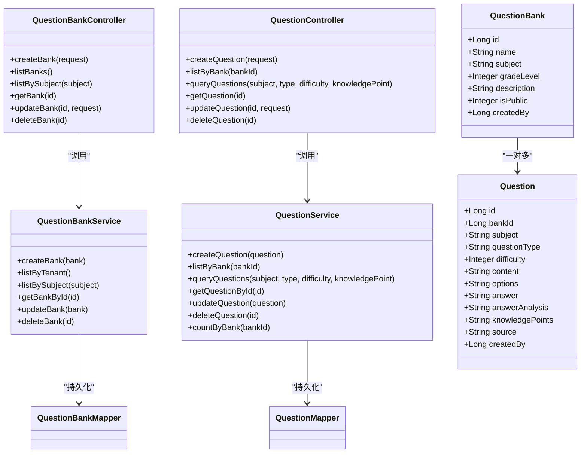
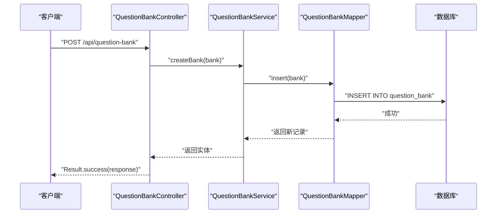
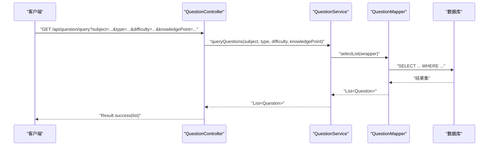
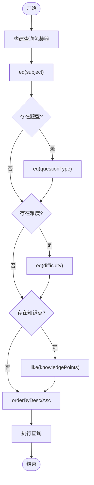
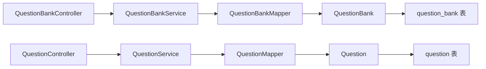

# 题库管理

<cite>
**本文引用的文件**
- [QuestionBankController.java](file://backend/src/main/java/com/edu/exam/controller/QuestionBankController.java)
- [QuestionController.java](file://backend/src/main/java/com/edu/exam/controller/QuestionController.java)
- [QuestionBankService.java](file://backend/src/main/java/com/edu/exam/service/QuestionBankService.java)
- [QuestionService.java](file://backend/src/main/java/com/edu/exam/service/QuestionService.java)
- [QuestionBank.java](file://backend/src/main/java/com/edu/exam/entity/QuestionBank.java)
- [Question.java](file://backend/src/main/java/com/edu/exam/entity/Question.java)
- [QuestionBankCreateRequest.java](file://backend/src/main/java/com/edu/exam/dto/QuestionBankCreateRequest.java)
- [QuestionCreateRequest.java](file://backend/src/main/java/com/edu/exam/dto/QuestionCreateRequest.java)
- [QuestionBankResponse.java](file://backend/src/main/java/com/edu/exam/dto/QuestionBankResponse.java)
- [QuestionResponse.java](file://backend/src/main/java/com/edu/exam/dto/QuestionResponse.java)
- [QuestionBankMapper.java](file://backend/src/main/java/com/edu/exam/mapper/QuestionBankMapper.java)
- [QuestionMapper.java](file://backend/src/main/java/com/edu/exam/mapper/QuestionMapper.java)
- [BaseEntity.java](file://backend/src/main/java/com/edu/common/entity/BaseEntity.java)
- [schema.sql](file://backend/src/main/resources/db/schema.sql)
</cite>

## 目录
1. [简介](#简介)
2. [项目结构](#项目结构)
3. [核心组件](#核心组件)
4. [架构总览](#架构总览)
5. [详细组件分析](#详细组件分析)
6. [依赖分析](#依赖分析)
7. [性能考虑](#性能考虑)
8. [故障排查指南](#故障排查指南)
9. [结论](#结论)
10. [附录：API 接口文档](#附录api-接口文档)

## 简介
本文件面向“题库管理”功能，系统性阐述题目的 CRUD 流程与题库实体设计，覆盖以下主题：
- 题库与题目的创建、查询、更新、删除全流程
- 题库实体设计：学科、难度、知识点标签、公开范围等
- 题目内容结构：题型、选项、标准答案、解析、知识点标签
- 批量操作能力现状与扩展建议（导入、导出、复制）
- 完整 API 接口清单与使用示例
- 错误处理机制与常见问题定位

## 项目结构
后端采用分层架构：Controller 负责 HTTP 入口与参数封装；Service 层负责业务逻辑与事务控制；Mapper 基于 MyBatis-Plus 访问数据库；Entity/DTO 描述数据模型。

图表来源
- [QuestionBankController.java:19-121](file://backend/src/main/java/com/edu/exam/controller/QuestionBankController.java#L19-L121)
- [QuestionController.java:18-132](file://backend/src/main/java/com/edu/exam/controller/QuestionController.java#L18-L132)
- [QuestionBankService.java:19-70](file://backend/src/main/java/com/edu/exam/service/QuestionBankService.java#L19-L70)
- [QuestionService.java:18-73](file://backend/src/main/java/com/edu/exam/service/QuestionService.java#L18-L73)
- [QuestionBankMapper.java](file://backend/src/main/java/com/edu/exam/mapper/QuestionBankMapper.java#L8)
- [QuestionMapper.java](file://backend/src/main/java/com/edu/exam/mapper/QuestionMapper.java#L8)
- [QuestionBank.java:11-19](file://backend/src/main/java/com/edu/exam/entity/QuestionBank.java#L11-L19)
- [Question.java:9-24](file://backend/src/main/java/com/edu/exam/entity/Question.java#L9-L24)
- [schema.sql:152-184](file://backend/src/main/resources/db/schema.sql#L152-L184)

章节来源
- [QuestionBankController.java:19-121](file://backend/src/main/java/com/edu/exam/controller/QuestionBankController.java#L19-L121)
- [QuestionController.java:18-132](file://backend/src/main/java/com/edu/exam/controller/QuestionController.java#L18-L132)
- [QuestionBankService.java:19-70](file://backend/src/main/java/com/edu/exam/service/QuestionBankService.java#L19-L70)
- [QuestionService.java:18-73](file://backend/src/main/java/com/edu/exam/service/QuestionService.java#L18-L73)
- [schema.sql:152-184](file://backend/src/main/resources/db/schema.sql#L152-L184)

## 核心组件
- 题库实体：包含名称、学科、适用年级、描述、公开范围、创建人等字段，继承通用基类以支持多租户与时间戳。
- 题目实体：包含所属题库、学科、题型、难度、内容、选项、标准答案、解析、知识点标签、来源、创建人等字段。
- DTO：请求与响应对象，用于 API 参数校验与返回数据结构化。
- Mapper/Service/Controller：遵循分层职责，保证事务边界与查询条件构建清晰。

章节来源
- [QuestionBank.java:11-19](file://backend/src/main/java/com/edu/exam/entity/QuestionBank.java#L11-L19)
- [Question.java:9-24](file://backend/src/main/java/com/edu/exam/entity/Question.java#L9-L24)
- [QuestionBankCreateRequest.java:11-28](file://backend/src/main/java/com/edu/exam/dto/QuestionBankCreateRequest.java#L11-L28)
- [QuestionCreateRequest.java:11-37](file://backend/src/main/java/com/edu/exam/dto/QuestionCreateRequest.java#L11-L37)
- [QuestionBankResponse.java:11-32](file://backend/src/main/java/com/edu/exam/dto/QuestionBankResponse.java#L11-L32)
- [QuestionResponse.java:11-38](file://backend/src/main/java/com/edu/exam/dto/QuestionResponse.java#L11-L38)
- [BaseEntity.java:11-37](file://backend/src/main/java/com/edu/common/entity/BaseEntity.java#L11-L37)

## 架构总览
题库与题目模块围绕“题库-题目”的一对多关系组织，通过控制器暴露 REST API，服务层统一处理业务规则与事务，持久层基于 MyBatis-Plus 的通用 Mapper 进行数据访问。

图表来源
- [QuestionBankController.java:22-121](file://backend/src/main/java/com/edu/exam/controller/QuestionBankController.java#L22-L121)
- [QuestionController.java:23-132](file://backend/src/main/java/com/edu/exam/controller/QuestionController.java#L23-L132)
- [QuestionBankService.java:19-70](file://backend/src/main/java/com/edu/exam/service/QuestionBankService.java#L19-L70)
- [QuestionService.java:18-73](file://backend/src/main/java/com/edu/exam/service/QuestionService.java#L18-L73)
- [QuestionBank.java:11-19](file://backend/src/main/java/com/edu/exam/entity/QuestionBank.java#L11-L19)
- [Question.java:9-24](file://backend/src/main/java/com/edu/exam/entity/Question.java#L9-L24)

## 详细组件分析

### 题库实体与设计要点
- 字段设计：名称、学科、适用年级、描述、公开范围（私有/租户内公开）、创建人、时间戳、逻辑删除。
- 多租户隔离：继承通用基类，自动注入租户 ID，查询默认按租户过滤或公开范围合并。
- 公开策略：列表查询同时包含“本租户创建”和“公开为 1”的题库，保障跨教师共享。

章节来源
- [QuestionBank.java:11-19](file://backend/src/main/java/com/edu/exam/entity/QuestionBank.java#L11-L19)
- [BaseEntity.java:11-37](file://backend/src/main/java/com/edu/common/entity/BaseEntity.java#L11-L37)
- [QuestionBankService.java:34-52](file://backend/src/main/java/com/edu/exam/service/QuestionBankService.java#L34-L52)
- [schema.sql:152-165](file://backend/src/main/resources/db/schema.sql#L152-L165)

### 题目实体与内容结构
- 题型：CHOICE/FILL/JUDGE/CALCULATION 等，通过字符串枚举表达。
- 难度：1-简单、2-中等、3-困难。
- 内容：题干文本；选项：JSON 格式（选择题）；答案：标准答案文本；解析：答案解析文本；知识点：JSON 格式标签数组。
- 来源：MANUAL 或 AI_GENERATED，便于区分人工录入与 AI 生成。
- 关联：每道题目属于一个题库，形成“题库-题目”的一对多关系。

章节来源
- [Question.java:9-24](file://backend/src/main/java/com/edu/exam/entity/Question.java#L9-L24)
- [schema.sql:167-184](file://backend/src/main/resources/db/schema.sql#L167-L184)

### 题库 CRUD 流程
- 创建：控制器接收请求，填充实体字段（含租户上下文），调用服务层插入，返回响应。
- 列表：按租户过滤，或合并公开题库；支持按学科筛选。
- 查询详情：根据主键查询，不存在则返回错误。
- 更新：先查后改，避免越权与空对象。
- 删除：软删除由基类注解统一处理。

图表来源
- [QuestionBankController.java:30-42](file://backend/src/main/java/com/edu/exam/controller/QuestionBankController.java#L30-L42)
- [QuestionBankService.java:21-32](file://backend/src/main/java/com/edu/exam/service/QuestionBankService.java#L21-L32)
- [QuestionBankMapper.java](file://backend/src/main/java/com/edu/exam/mapper/QuestionBankMapper.java#L8)
- [schema.sql:152-165](file://backend/src/main/resources/db/schema.sql#L152-L165)

章节来源
- [QuestionBankController.java:27-105](file://backend/src/main/java/com/edu/exam/controller/QuestionBankController.java#L27-L105)
- [QuestionBankService.java:21-68](file://backend/src/main/java/com/edu/exam/service/QuestionBankService.java#L21-L68)

### 题目 CRUD 流程
- 创建：设置来源为 MANUAL，默认值，插入后返回。
- 列表：按题库 ID 查询，按创建时间升序排列。
- 查询：支持按学科、题型、难度、知识点模糊匹配。
- 更新/删除：先查后改，日志记录变更。

图表来源
- [QuestionController.java:61-72](file://backend/src/main/java/com/edu/exam/controller/QuestionController.java#L61-L72)
- [QuestionService.java:35-49](file://backend/src/main/java/com/edu/exam/service/QuestionService.java#L35-L49)
- [QuestionMapper.java](file://backend/src/main/java/com/edu/exam/mapper/QuestionMapper.java#L8)
- [schema.sql:167-184](file://backend/src/main/resources/db/schema.sql#L167-L184)

章节来源
- [QuestionController.java:25-113](file://backend/src/main/java/com/edu/exam/controller/QuestionController.java#L25-L113)
- [QuestionService.java:20-65](file://backend/src/main/java/com/edu/exam/service/QuestionService.java#L20-L65)

### 查询与筛选算法
- 题库列表：租户过滤 + 公开合并，按创建时间倒序。
- 题目查询：固定条件（学科）+ 可选条件（题型、难度、知识点模糊匹配）。

图表来源
- [QuestionBankService.java:34-52](file://backend/src/main/java/com/edu/exam/service/QuestionBankService.java#L34-L52)
- [QuestionService.java:35-49](file://backend/src/main/java/com/edu/exam/service/QuestionService.java#L35-L49)

章节来源
- [QuestionBankService.java:34-52](file://backend/src/main/java/com/edu/exam/service/QuestionBankService.java#L34-L52)
- [QuestionService.java:35-49](file://backend/src/main/java/com/edu/exam/service/QuestionService.java#L35-L49)

### 批量操作现状与扩展建议
- 现状：当前未提供批量导入、导出、复制接口。
- 建议：
  - 导入：新增 Excel/JSON 批量上传接口，解析后批量写入题目，支持去重与校验。
  - 导出：按题库/筛选条件导出为 Excel/JSON，包含内容、选项、答案、解析、知识点。
  - 复制：复制题库及其全部题目到目标题库，保持题型、难度、知识点一致。
  - 批量删除：提供按条件批量删除或清空题库题目接口，注意软删除与审计。

[本节为概念性建议，不直接分析具体文件，故无章节来源]

## 依赖分析
- 控制器依赖服务层，服务层依赖 Mapper，Mapper 映射至数据库表。
- 题库与题目实体均继承通用基类，统一注入租户 ID、时间戳与逻辑删除。
- 查询条件通过 LambdaQueryWrapper 构建，确保类型安全与可维护性。

图表来源
- [QuestionBankController.java:22-25](file://backend/src/main/java/com/edu/exam/controller/QuestionBankController.java#L22-L25)
- [QuestionController.java](file://backend/src/main/java/com/edu/exam/controller/QuestionController.java#L23)
- [QuestionBankService.java](file://backend/src/main/java/com/edu/exam/service/QuestionBankService.java#L19)
- [QuestionService.java](file://backend/src/main/java/com/edu/exam/service/QuestionService.java#L18)
- [QuestionBankMapper.java](file://backend/src/main/java/com/edu/exam/mapper/QuestionBankMapper.java#L8)
- [QuestionMapper.java](file://backend/src/main/java/com/edu/exam/mapper/QuestionMapper.java#L8)
- [schema.sql:152-184](file://backend/src/main/resources/db/schema.sql#L152-L184)

章节来源
- [QuestionBankController.java:22-25](file://backend/src/main/java/com/edu/exam/controller/QuestionBankController.java#L22-L25)
- [QuestionController.java](file://backend/src/main/java/com/edu/exam/controller/QuestionController.java#L23)
- [QuestionBankService.java](file://backend/src/main/java/com/edu/exam/service/QuestionBankService.java#L19)
- [QuestionService.java](file://backend/src/main/java/com/edu/exam/service/QuestionService.java#L18)
- [BaseEntity.java:11-37](file://backend/src/main/java/com/edu/common/entity/BaseEntity.java#L11-L37)

## 性能考虑
- 索引优化：题库与题目表均建立常用查询字段索引，如题库的学科与公开标志、题目的题库外键。
- 分页与排序：列表查询默认按时间排序，建议在前端或服务层增加分页参数，避免一次性加载过多数据。
- 缓存策略：对高频展示的题库元数据与题目统计（如题库题目数量）可引入缓存，降低数据库压力。
- 批量操作：导入/导出建议异步处理，结合任务队列与进度反馈，避免阻塞主线程。

章节来源
- [schema.sql:326-355](file://backend/src/main/resources/db/schema.sql#L326-L355)
- [QuestionBankService.java:34-52](file://backend/src/main/java/com/edu/exam/service/QuestionBankService.java#L34-L52)
- [QuestionService.java:28-33](file://backend/src/main/java/com/edu/exam/service/QuestionService.java#L28-L33)

## 故障排查指南
- 404 场景：查询题目或题库详情时若不存在，控制器返回错误提示，确认主键与权限。
- 400 校验失败：请求 DTO 字段为空或超长，检查必填项与长度限制。
- 业务异常：租户上下文缺失导致无法创建题库，需确保登录态与租户绑定。
- 数据一致性：更新/删除操作均在事务中执行，若出现异常需检查数据库连接与回滚日志。

章节来源
- [QuestionBankController.java:74-77](file://backend/src/main/java/com/edu/exam/controller/QuestionBankController.java#L74-L77)
- [QuestionController.java:80-83](file://backend/src/main/java/com/edu/exam/controller/QuestionController.java#L80-L83)
- [QuestionBankCreateRequest.java:13-14](file://backend/src/main/java/com/edu/exam/dto/QuestionBankCreateRequest.java#L13-L14)
- [QuestionCreateRequest.java:13-14](file://backend/src/main/java/com/edu/exam/dto/QuestionCreateRequest.java#L13-L14)
- [QuestionBankService.java:24-25](file://backend/src/main/java/com/edu/exam/service/QuestionBankService.java#L24-L25)

## 结论
题库与题目模块实现了清晰的分层设计与完善的 CRUD 能力，支持按学科、难度、知识点等维度进行筛选。通过多租户基类与公开策略，满足不同场景下的共享需求。建议后续补充批量导入/导出/复制能力，进一步提升教师使用效率。

## 附录：API 接口文档

- 题库管理
  - 创建题库
    - 方法与路径：POST /api/question-bank
    - 请求参数：见 [QuestionBankCreateRequest.java:11-28](file://backend/src/main/java/com/edu/exam/dto/QuestionBankCreateRequest.java#L11-L28)
    - 响应：见 [QuestionBankResponse.java:11-32](file://backend/src/main/java/com/edu/exam/dto/QuestionBankResponse.java#L11-L32)
    - 示例：创建一个名为“高一数学同步练习”的题库，学科为 MATH，公开范围为私有。
  - 获取题库列表
    - 方法与路径：GET /api/question-bank
    - 响应：List<QuestionBankResponse>
  - 按学科筛选题库
    - 方法与路径：GET /api/question-bank/subject/{subject}
    - 示例：GET /api/question-bank/subject/MATH
  - 获取题库详情
    - 方法与路径：GET /api/question-bank/{id}
    - 响应：QuestionBankResponse
  - 更新题库
    - 方法与路径：PUT /api/question-bank/{id}
    - 请求参数：QuestionBankCreateRequest
  - 删除题库
    - 方法与路径：DELETE /api/question-bank/{id}

- 题目管理
  - 创建题目
    - 方法与路径：POST /api/question
    - 请求参数：见 [QuestionCreateRequest.java:11-37](file://backend/src/main/java/com/edu/exam/dto/QuestionCreateRequest.java#L11-L37)
    - 响应：见 [QuestionResponse.java:11-38](file://backend/src/main/java/com/edu/exam/dto/QuestionResponse.java#L11-L38)
  - 获取题库下题目列表
    - 方法与路径：GET /api/question/bank/{bankId}
  - 条件查询题目
    - 方法与路径：GET /api/question/query
    - 查询参数：subject（必填）、type（可选）、difficulty（可选）、knowledgePoint（可选）
  - 获取题目详情
    - 方法与路径：GET /api/question/{id}
  - 更新题目
    - 方法与路径：PUT /api/question/{id}
    - 请求参数：QuestionCreateRequest
  - 删除题目
    - 方法与路径：DELETE /api/question/{id}

章节来源
- [QuestionBankController.java:30-105](file://backend/src/main/java/com/edu/exam/controller/QuestionBankController.java#L30-L105)
- [QuestionController.java:28-113](file://backend/src/main/java/com/edu/exam/controller/QuestionController.java#L28-L113)
- [QuestionBankCreateRequest.java:11-28](file://backend/src/main/java/com/edu/exam/dto/QuestionBankCreateRequest.java#L11-L28)
- [QuestionCreateRequest.java:11-37](file://backend/src/main/java/com/edu/exam/dto/QuestionCreateRequest.java#L11-L37)
- [QuestionBankResponse.java:11-32](file://backend/src/main/java/com/edu/exam/dto/QuestionBankResponse.java#L11-L32)
- [QuestionResponse.java:11-38](file://backend/src/main/java/com/edu/exam/dto/QuestionResponse.java#L11-L38)