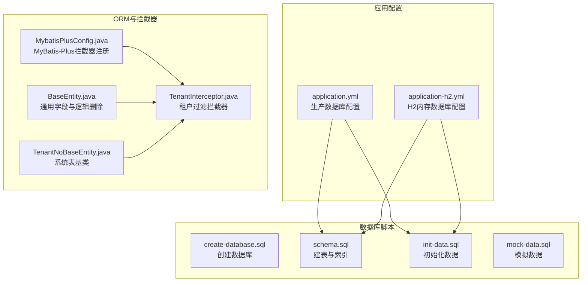
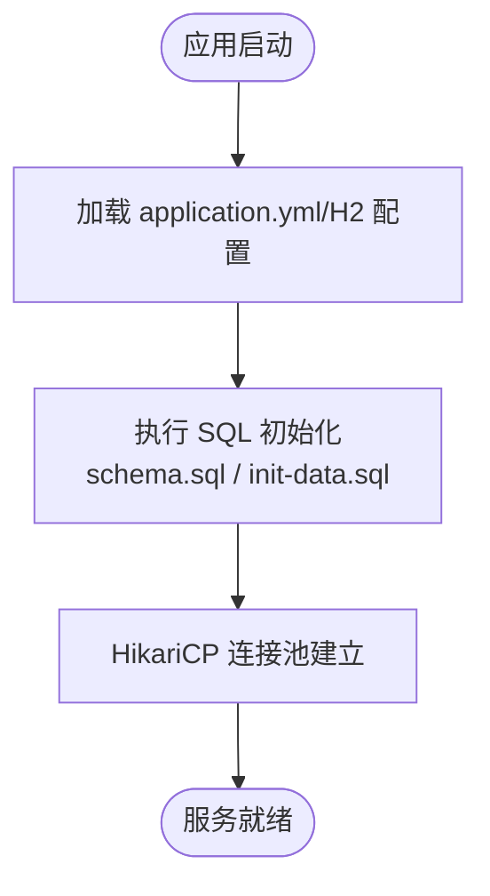
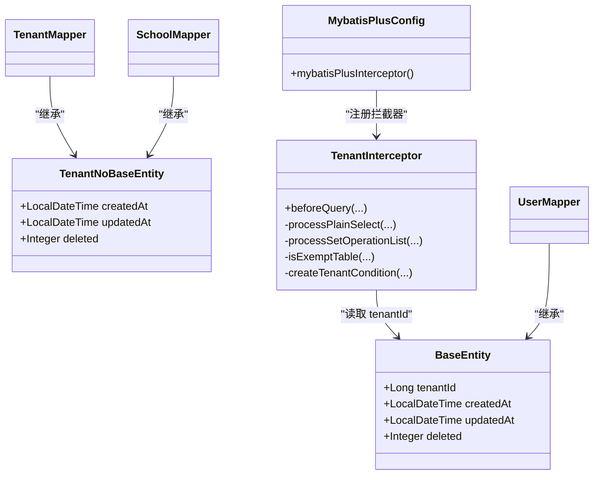
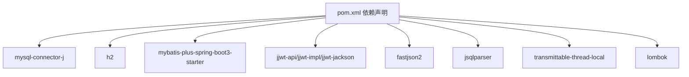

# 数据库运维

<cite>
**本文引用的文件**
- [application.yml](file://backend/src/main/resources/application.yml)
- [application-h2.yml](file://backend/src/main/resources/application-h2.yml)
- [create-database.sql](file://backend/src/main/resources/db/create-database.sql)
- [schema.sql](file://backend/src/main/resources/db/schema.sql)
- [init-data.sql](file://backend/src/main/resources/db/init-data.sql)
- [mock-data.sql](file://backend/src/main/resources/db/mock-data.sql)
- [MybatisPlusConfig.java](file://backend/src/main/java/com/edu/common/config/MybatisPlusConfig.java)
- [TenantInterceptor.java](file://backend/src/main/java/com/edu/common/interceptor/TenantInterceptor.java)
- [BaseEntity.java](file://backend/src/main/java/com/edu/common/entity/BaseEntity.java)
- [TenantNoBaseEntity.java](file://backend/src/main/java/com/edu/common/entity/TenantNoBaseEntity.java)
- [UserMapper.java](file://backend/src/main/java/com/edu/user/mapper/UserMapper.java)
- [TenantMapper.java](file://backend/src/main/java/com/edu/tenant/mapper/TenantMapper.java)
- [SchoolMapper.java](file://backend/src/main/java/com/edu/tenant/mapper/SchoolMapper.java)
- [pom.xml](file://backend/pom.xml)
- [start.bat](file://backend/start.bat)
- [start-h2.bat](file://backend/start-h2.bat)
</cite>

## 目录
1. [简介](#简介)
2. [项目结构](#项目结构)
3. [核心组件](#核心组件)
4. [架构总览](#架构总览)
5. [详细组件分析](#详细组件分析)
6. [依赖分析](#依赖分析)
7. [性能考虑](#性能考虑)
8. [故障排查指南](#故障排查指南)
9. [结论](#结论)
10. [附录](#附录)

## 简介
本文件面向数据库运维工程师与平台开发团队，系统化梳理数据库的日常维护、备份与恢复、性能优化、监控与故障排查、版本与迁移管理、以及数据安全与权限管理的最佳实践。结合后端工程中的数据库初始化脚本、连接池配置、MyBatis-Plus配置、租户隔离机制与实体模型，形成可落地的运维手册。

## 项目结构
后端通过Spring Boot加载数据库配置与初始化脚本，采用MySQL作为生产数据库，H2用于本地快速验证；数据库对象由SQL脚本定义，实体与Mapper遵循MyBatis-Plus约定。



**图表来源**
- [application.yml:15-25](file://backend/src/main/resources/application.yml#L15-L25)
- [application-h2.yml:20-37](file://backend/src/main/resources/application-h2.yml#L20-L37)
- [create-database.sql:1-7](file://backend/src/main/resources/db/create-database.sql#L1-L7)
- [schema.sql:1-379](file://backend/src/main/resources/db/schema.sql#L1-L379)
- [init-data.sql:1-89](file://backend/src/main/resources/db/init-data.sql#L1-L89)
- [mock-data.sql:1-86](file://backend/src/main/resources/db/mock-data.sql#L1-L86)
- [MybatisPlusConfig.java:16-21](file://backend/src/main/java/com/edu/common/config/MybatisPlusConfig.java#L16-L21)
- [TenantInterceptor.java:29-142](file://backend/src/main/java/com/edu/common/interceptor/TenantInterceptor.java#L29-L142)
- [BaseEntity.java:10-37](file://backend/src/main/java/com/edu/common/entity/BaseEntity.java#L10-L37)
- [TenantNoBaseEntity.java:10-22](file://backend/src/main/java/com/edu/common/entity/TenantNoBaseEntity.java#L10-L22)

**章节来源**
- [application.yml:1-65](file://backend/src/main/resources/application.yml#L1-L65)
- [application-h2.yml:1-76](file://backend/src/main/resources/application-h2.yml#L1-L76)
- [schema.sql:1-379](file://backend/src/main/resources/db/schema.sql#L1-L379)

## 核心组件
- 生产数据库配置：包含MySQL连接参数、HikariCP连接池参数、SQL初始化策略与位置。
- H2内存数据库配置：用于本地开发与测试，自动执行schema与init-data。
- 数据库脚本：统一的建表、索引、初始化与模拟数据脚本。
- ORM与拦截器：MyBatis-Plus全局配置与租户过滤拦截器，实现多租户隔离与逻辑删除。
- 实体基类：统一的创建/更新时间与逻辑删除字段，减少重复代码。

**章节来源**
- [application.yml:15-25](file://backend/src/main/resources/application.yml#L15-L25)
- [application.yml:32-44](file://backend/src/main/resources/application.yml#L32-L44)
- [MybatisPlusConfig.java:16-21](file://backend/src/main/java/com/edu/common/config/MybatisPlusConfig.java#L16-L21)
- [BaseEntity.java:10-37](file://backend/src/main/java/com/edu/common/entity/BaseEntity.java#L10-L37)
- [TenantNoBaseEntity.java:10-22](file://backend/src/main/java/com/edu/common/entity/TenantNoBaseEntity.java#L10-L22)

## 架构总览
数据库层由MySQL承载生产数据，H2用于本地验证；应用通过Spring Boot自动执行SQL初始化脚本，MyBatis-Plus负责数据访问；租户拦截器在SQL层面自动注入租户过滤条件，确保数据隔离。

```mermaid
graph TB
subgraph "应用层"
APP["EduApplication<br/>Spring Boot 应用"]
CFG["MybatisPlusConfig<br/>拦截器注册"]
INT["TenantInterceptor<br/>租户过滤"]
end
subgraph "数据访问层"
MP["MyBatis-Plus"]
MAPPER["Mapper 接口<br/>UserMapper / TenantMapper / SchoolMapper"]
end
subgraph "数据库层"
MYSQL["MySQL 生产库"]
H2["H2 内存库"]
SCHEMA["schema.sql / init-data.sql"]
end
APP --> CFG --> INT
APP --> MP --> MAPPER
MP --> MYSQL
MP --> H2
MYSQL <- --> SCHEMA
H2 <- --> SCHEMA
```

**图表来源**
- [MybatisPlusConfig.java:16-21](file://backend/src/main/java/com/edu/common/config/MybatisPlusConfig.java#L16-L21)
- [TenantInterceptor.java:29-142](file://backend/src/main/java/com/edu/common/interceptor/TenantInterceptor.java#L29-L142)
- [UserMapper.java:1-9](file://backend/src/main/java/com/edu/user/mapper/UserMapper.java#L1-L9)
- [TenantMapper.java:1-9](file://backend/src/main/java/com/edu/tenant/mapper/TenantMapper.java#L1-L9)
- [SchoolMapper.java:1-9](file://backend/src/main/java/com/edu/tenant/mapper/SchoolMapper.java#L1-L9)
- [application.yml:8-13](file://backend/src/main/resources/application.yml#L8-L13)
- [application-h2.yml:32-37](file://backend/src/main/resources/application-h2.yml#L32-L37)

## 详细组件分析

### 连接池与初始化配置
- 生产数据库连接：使用MySQL驱动，HikariCP连接池，设置最小空闲、最大连接数、空闲超时与连接超时。
- SQL初始化：每次启动都会执行schema与init-data，失败即停止，确保数据库结构与基础数据一致。
- H2配置：内存数据库，启用H2控制台，自动执行初始化脚本，便于本地调试。



**图表来源**
- [application.yml:8-13](file://backend/src/main/resources/application.yml#L8-L13)
- [application.yml:15-25](file://backend/src/main/resources/application.yml#L15-L25)
- [application-h2.yml:20-37](file://backend/src/main/resources/application-h2.yml#L20-L37)

**章节来源**
- [application.yml:8-13](file://backend/src/main/resources/application.yml#L8-L13)
- [application.yml:15-25](file://backend/src/main/resources/application.yml#L15-L25)
- [application-h2.yml:20-37](file://backend/src/main/resources/application-h2.yml#L20-L37)

### 数据库脚本与版本管理
- create-database.sql：创建数据库与字符集设置，确保目标库存在且字符集一致。
- schema.sql：定义所有业务表与索引，包含租户、组织、用户、题库、试卷、批改、PPT等模块，以及大量外键相关索引。
- init-data.sql：初始化默认租户、学校、角色、权限、管理员、题库、示例题目、模板与学生等数据。
- mock-data.sql：生成多租户与大规模组织/班级/学生数据，用于压力与集成测试。

建议采用Git管理脚本版本，按“功能/修复/热修复”分支合并，配合语义化版本号与变更日志，确保可追溯性与可回滚性。

**章节来源**
- [create-database.sql:1-7](file://backend/src/main/resources/db/create-database.sql#L1-L7)
- [schema.sql:1-379](file://backend/src/main/resources/db/schema.sql#L1-L379)
- [init-data.sql:1-89](file://backend/src/main/resources/db/init-data.sql#L1-L89)
- [mock-data.sql:1-86](file://backend/src/main/resources/db/mock-data.sql#L1-L86)

### 多租户隔离与实体模型
- 租户过滤：TenantInterceptor基于JSqlParser解析SQL，在SELECT/SET操作中自动追加tenant_id条件，排除系统表与部分关联表。
- 实体基类：BaseEntity统一包含tenant_id、创建/更新时间与逻辑删除字段；TenantNoBaseEntity用于系统表（如tenant、permission等）。
- Mapper接口：遵循MyBatis-Plus约定，无需手写SQL即可实现CRUD与分页。



**图表来源**
- [BaseEntity.java:10-37](file://backend/src/main/java/com/edu/common/entity/BaseEntity.java#L10-L37)
- [TenantNoBaseEntity.java:10-22](file://backend/src/main/java/com/edu/common/entity/TenantNoBaseEntity.java#L10-L22)
- [TenantInterceptor.java:29-142](file://backend/src/main/java/com/edu/common/interceptor/TenantInterceptor.java#L29-L142)
- [MybatisPlusConfig.java:16-21](file://backend/src/main/java/com/edu/common/config/MybatisPlusConfig.java#L16-L21)
- [UserMapper.java:1-9](file://backend/src/main/java/com/edu/user/mapper/UserMapper.java#L1-L9)
- [TenantMapper.java:1-9](file://backend/src/main/java/com/edu/tenant/mapper/TenantMapper.java#L1-L9)
- [SchoolMapper.java:1-9](file://backend/src/main/java/com/edu/tenant/mapper/SchoolMapper.java#L1-L9)

**章节来源**
- [TenantInterceptor.java:29-142](file://backend/src/main/java/com/edu/common/interceptor/TenantInterceptor.java#L29-L142)
- [MybatisPlusConfig.java:16-21](file://backend/src/main/java/com/edu/common/config/MybatisPlusConfig.java#L16-L21)
- [BaseEntity.java:10-37](file://backend/src/main/java/com/edu/common/entity/BaseEntity.java#L10-L37)
- [TenantNoBaseEntity.java:10-22](file://backend/src/main/java/com/edu/common/entity/TenantNoBaseEntity.java#L10-L22)

### 数据迁移与版本升级
- 迁移策略：以不可逆脚本为主，先创建新表/列/索引，再进行数据迁移，最后删除旧结构；对大表迁移采用分批处理与索引重建。
- 版本控制：每个迁移脚本命名包含版本号与描述，合并到主干前进行评审与小范围灰度。
- 回滚预案：保留降级脚本，记录受影响表与关键索引，确保回滚后仍满足基本查询需求。

[本节为通用运维实践，不直接分析具体文件]

### 备份与恢复
- 全量备份：使用逻辑备份工具导出schema与数据，或使用物理备份工具备份数据目录。
- 增量备份：开启binlog并定期归档，结合时间点恢复（PITR）能力。
- 恢复演练：定期在隔离环境中执行恢复测试，验证备份完整性与恢复时间目标。
- 恢复流程：停机/切换流量 -> 恢复数据 -> 校验一致性 -> 启动服务。

[本节为通用运维实践，不直接分析具体文件]

### 性能优化
- 索引优化：根据schema.sql中的索引定义，确保高频过滤/连接字段（如tenant_id、外键列）具备合适索引；避免冗余索引。
- 查询优化：利用租户拦截器自动注入tenant_id，避免遗漏导致全表扫描；对复杂查询使用explain分析执行计划。
- 连接池配置：依据并发请求峰值调整最小空闲、最大连接数、连接超时与空闲超时，监控连接池等待时间与活跃连接数。

**章节来源**
- [schema.sql:300-379](file://backend/src/main/resources/db/schema.sql#L300-L379)
- [application.yml:20-25](file://backend/src/main/resources/application.yml#L20-L25)

### 监控指标与告警
- 连接池：活跃连接数、空闲连接数、等待时间、获取超时次数。
- 查询性能：慢查询阈值、慢查询数量、平均响应时间、P95/P99延迟。
- 数据库健康：连接成功率、重启次数、binlog大小与延迟、主从复制状态。
- 告警策略：针对连接池耗尽、慢查询激增、备份失败、恢复演练失败设置分级告警。

[本节为通用运维实践，不直接分析具体文件]

### 故障排查
- 启动失败：检查SQL初始化是否成功，确认数据库存在、字符集匹配与权限足够。
- 查询异常：检查租户上下文是否设置，确认租户拦截器生效；核对索引是否存在。
- 连接池问题：观察等待队列长度与超时次数，评估最大连接数与查询优化。
- 数据不一致：核对逻辑删除字段与实体基类配置，确保软删除不影响查询结果。

**章节来源**
- [application.yml:8-13](file://backend/src/main/resources/application.yml#L8-L13)
- [TenantInterceptor.java:66-95](file://backend/src/main/java/com/edu/common/interceptor/TenantInterceptor.java#L66-L95)
- [BaseEntity.java:34-37](file://backend/src/main/java/com/edu/common/entity/BaseEntity.java#L34-L37)

## 依赖分析
- 数据库驱动：MySQL Connector/J用于生产，H2用于测试。
- ORM框架：MyBatis-Plus提供分页、逻辑删除、租户拦截器等能力。
- 解析库：JSqlParser用于SQL解析与租户条件注入。
- 安全与工具：JWT、Fastjson2、TransmittableThreadLocal、Lombok等。



**图表来源**
- [pom.xml:29-133](file://backend/pom.xml#L29-L133)

**章节来源**
- [pom.xml:29-133](file://backend/pom.xml#L29-L133)

## 性能考虑
- 连接池调优：根据QPS与并发线程数设定最大连接数与空闲超时，避免连接争用。
- SQL执行计划：定期审查慢查询，补充缺失索引或重写复杂子查询。
- 逻辑删除与软删除：统一使用deleted字段，确保查询时不会误读已删除数据。
- 分页与批量：对大结果集使用分页与游标，避免一次性加载过多数据。

[本节为通用指导，不直接分析具体文件]

## 故障排查指南
- 启动阶段
  - 确认数据库可达、凭据正确、字符集与时区配置一致。
  - 检查SQL初始化是否执行成功，失败时查看日志定位具体语句。
- 运行阶段
  - 若出现跨租户数据泄露，检查租户拦截器是否生效与exempt表名单是否合理。
  - 若查询变慢，使用执行计划分析，确认索引命中情况。
- 连接池问题
  - 关注连接池等待队列与超时次数，必要时扩容或优化SQL。

**章节来源**
- [application.yml:8-13](file://backend/src/main/resources/application.yml#L8-L13)
- [TenantInterceptor.java:66-95](file://backend/src/main/java/com/edu/common/interceptor/TenantInterceptor.java#L66-L95)

## 结论
本项目通过标准化的数据库脚本、完善的连接池与初始化配置、以及基于MyBatis-Plus的租户拦截器，实现了可维护、可扩展、可审计的数据库运维体系。建议在现有基础上完善备份恢复与监控告警方案，并持续优化索引与查询性能，保障平台稳定运行。

## 附录
- 启动与环境
  - 生产环境：使用application.yml，确保DB_PASSWORD等敏感变量已注入。
  - 本地测试：使用application-h2.yml，H2控制台可通过/h2-console访问。
- 脚本位置
  - 数据库脚本位于resources/db目录，包含创建数据库、建表、索引与初始化数据。
- 实体与Mapper
  - 实体基类统一字段与逻辑删除；Mapper接口遵循MyBatis-Plus约定。

**章节来源**
- [start.bat:1-15](file://backend/start.bat#L1-L15)
- [start-h2.bat:1-12](file://backend/start-h2.bat#L1-L12)
- [application.yml:15-25](file://backend/src/main/resources/application.yml#L15-L25)
- [application-h2.yml:20-37](file://backend/src/main/resources/application-h2.yml#L20-L37)
- [schema.sql:1-379](file://backend/src/main/resources/db/schema.sql#L1-L379)
- [init-data.sql:1-89](file://backend/src/main/resources/db/init-data.sql#L1-L89)