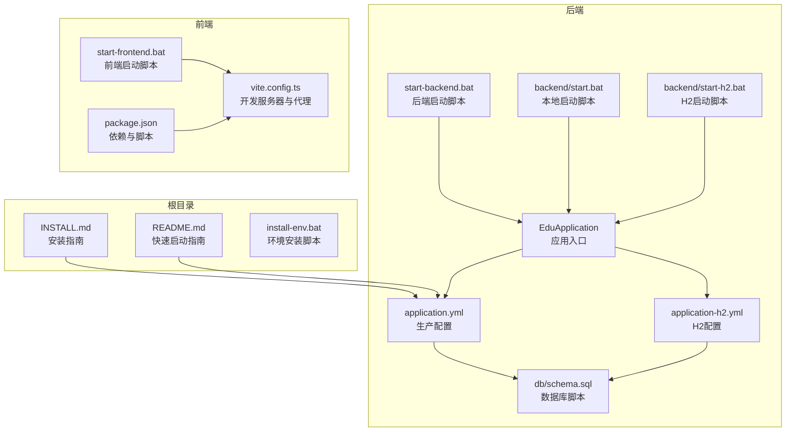
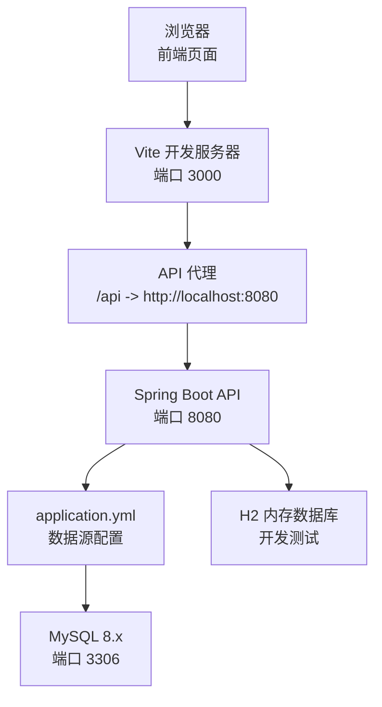
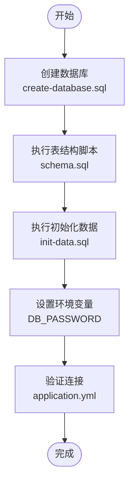
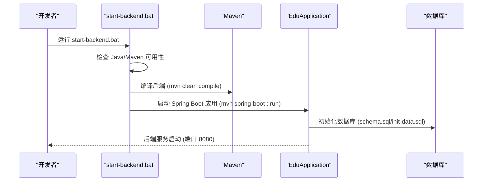
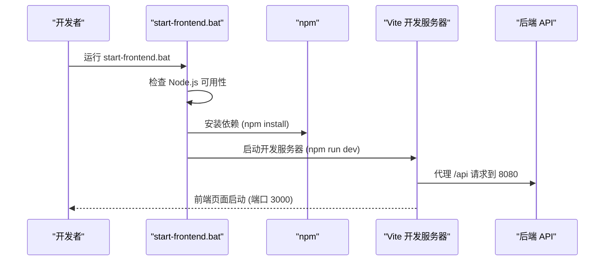
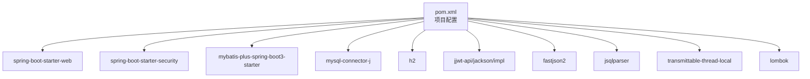

# 环境搭建

<cite>
**本文引用的文件**
- [README.md](file://README.md)
- [INSTALL.md](file://INSTALL.md)
- [install-env.bat](file://install-env.bat)
- [backend/pom.xml](file://backend/pom.xml)
- [backend/src/main/resources/application.yml](file://backend/src/main/resources/application.yml)
- [backend/src/main/resources/application-h2.yml](file://backend/src/main/resources/application-h2.yml)
- [backend/src/main/resources/db/schema.sql](file://backend/src/main/resources/db/schema.sql)
- [backend/src/main/resources/db/create-database.sql](file://backend/src/main/resources/db/create-database.sql)
- [backend/src/main/java/com/edu/EduApplication.java](file://backend/src/main/java/com/edu/EduApplication.java)
- [backend/start.bat](file://backend/start.bat)
- [backend/start-h2.bat](file://backend/start-h2.bat)
- [start-backend.bat](file://start-backend.bat)
- [start-frontend.bat](file://start-frontend.bat)
- [frontend/package.json](file://frontend/package.json)
- [frontend/vite.config.ts](file://frontend/vite.config.ts)
</cite>

## 目录
1. [简介](#简介)
2. [项目结构](#项目结构)
3. [核心组件](#核心组件)
4. [架构概览](#架构概览)
5. [详细组件分析](#详细组件分析)
6. [依赖关系分析](#依赖关系分析)
7. [性能考虑](#性能考虑)
8. [故障排除指南](#故障排除指南)
9. [结论](#结论)
10. [附录](#附录)

## 简介
本文件为教师智能教学系统的环境搭建与启动指南，涵盖开发环境安装配置、环境变量设置、数据库初始化、后端与前端启动流程，以及常见问题排查。系统采用前后端分离架构：后端基于 Spring Boot 3.2.0 + Java 17，前端基于 Vue 3 + Vite，数据库支持 MySQL 8.x 与 H2 内存数据库两种模式。

## 项目结构
项目采用多模块结构，主要目录与职责如下：
- backend：后端工程，包含 Spring Boot 应用、MyBatis-Plus 配置、数据库脚本与启动脚本
- frontend：前端工程，包含 Vue 3 应用、Vite 构建配置与 API 代理
- docs/superpowers/plans/specs：设计与规划文档
- 根目录脚本：环境安装与系统启动脚本

**图表来源**
- [backend/src/main/java/com/edu/EduApplication.java:1-15](file://backend/src/main/java/com/edu/EduApplication.java#L1-L15)
- [backend/src/main/resources/application.yml:1-65](file://backend/src/main/resources/application.yml#L1-L65)
- [backend/src/main/resources/application-h2.yml:1-76](file://backend/src/main/resources/application-h2.yml#L1-L76)
- [backend/src/main/resources/db/schema.sql:1-379](file://backend/src/main/resources/db/schema.sql#L1-L379)
- [start-backend.bat:1-40](file://start-backend.bat#L1-L40)
- [backend/start.bat:1-15](file://backend/start.bat#L1-L15)
- [backend/start-h2.bat:1-12](file://backend/start-h2.bat#L1-L12)
- [frontend/package.json:1-25](file://frontend/package.json#L1-L25)
- [frontend/vite.config.ts:1-21](file://frontend/vite.config.ts#L1-L21)
- [INSTALL.md:1-134](file://INSTALL.md#L1-L134)
- [README.md:1-88](file://README.md#L1-L88)

**章节来源**
- [README.md:1-88](file://README.md#L1-L88)
- [INSTALL.md:1-134](file://INSTALL.md#L1-L134)

## 核心组件
- 后端技术栈
  - Java 17：项目属性指定 Java 版本为 17
  - Spring Boot 3.2.0：应用启动与自动配置
  - MyBatis-Plus 3.5.5：数据库 ORM 与分页插件
  - MySQL Connector/J：MySQL 驱动
  - H2 Database：内存数据库（用于测试与快速启动）
  - Redis Starter：可选缓存支持
  - JWT：鉴权令牌
  - Fastjson2：高性能 JSON 处理
- 前端技术栈
  - Vue 3.4：前端框架
  - Vite 5：构建与开发服务器
  - Vue Router 4.2：路由管理
  - Pinia 2.1：状态管理
  - Element Plus 2.4：UI 组件库
  - Axios 1.6：HTTP 请求库

**章节来源**
- [backend/pom.xml:1-152](file://backend/pom.xml#L1-L152)
- [frontend/package.json:1-25](file://frontend/package.json#L1-L25)

## 架构概览
系统采用前后端分离架构，后端提供 RESTful API，前端通过 Vite 开发服务器代理请求至后端。数据库支持 MySQL 与 H2 两种模式，生产环境默认使用 MySQL，H2 模式适合快速验证与测试。

**图表来源**
- [frontend/vite.config.ts:12-20](file://frontend/vite.config.ts#L12-L20)
- [backend/src/main/resources/application.yml:15-19](file://backend/src/main/resources/application.yml#L15-L19)
- [backend/src/main/resources/application-h2.yml:21-25](file://backend/src/main/resources/application-h2.yml#L21-L25)

## 详细组件分析

### 环境要求与安装
- 后端：Java 17+、Maven 3.8+、MySQL 8.x、Redis 7.x（可选）
- 前端：Node.js 18+、npm 9+

安装方式（推荐使用 Chocolatey 自动化安装）：
- 使用 PowerShell 以管理员身份运行安装脚本，自动安装 Java 17、Maven、MySQL
- 安装完成后重启终端，确保 PATH 生效
- 手动下载安装方式提供 winget/scoop 的替代方案

**章节来源**
- [README.md:3-6](file://README.md#L3-L6)
- [INSTALL.md:3-20](file://INSTALL.md#L3-L20)
- [install-env.bat:1-36](file://install-env.bat#L1-L36)

### 数据库配置与初始化
- 创建数据库：使用提供的 SQL 脚本创建数据库并设置字符集
- 初始化表结构与基础数据：通过 Spring Boot 的 SQL 初始化功能自动执行 schema.sql 与 init-data.sql
- 环境变量：DB_PASSWORD 用于注入数据库密码，避免硬编码

**图表来源**
- [backend/src/main/resources/db/create-database.sql:1-7](file://backend/src/main/resources/db/create-database.sql#L1-L7)
- [backend/src/main/resources/db/schema.sql:1-379](file://backend/src/main/resources/db/schema.sql#L1-L379)
- [backend/src/main/resources/application.yml:15-19](file://backend/src/main/resources/application.yml#L15-L19)

**章节来源**
- [README.md:8-36](file://README.md#L8-L36)
- [INSTALL.md:24-45](file://INSTALL.md#L24-L45)
- [backend/src/main/resources/db/create-database.sql:1-7](file://backend/src/main/resources/db/create-database.sql#L1-L7)
- [backend/src/main/resources/db/schema.sql:1-379](file://backend/src/main/resources/db/schema.sql#L1-L379)

### 环境变量与路径设置
- Java 17：设置 JAVA_HOME 指向 JDK 安装目录，并将 %JAVA_HOME%/bin 添加到 PATH
- Maven：设置 MAVEN_HOME 指向 Maven 安装目录，并将 %MAVEN_HOME%/bin 添加到 PATH
- MySQL：确保服务已启动，账户密码正确
- 前端：确保 Node.js 18+ 已安装并加入 PATH

验证命令：
- Java：java -version
- Maven：mvn -version
- MySQL：mysql -u root -p -e "SELECT VERSION();"

**章节来源**
- [INSTALL.md:84-100](file://INSTALL.md#L84-L100)
- [INSTALL.md:120-134](file://INSTALL.md#L120-L134)
- [install-env.bat:11-13](file://install-env.bat#L11-L13)

### 后端启动流程
- 方式一：Maven 直接运行（推荐开发调试）
  - 进入 backend 目录，执行 mvn spring-boot:run
- 方式二：打包后运行
  - 先执行 mvn clean package -DskipTests 打包
  - 使用 java -jar 启动生成的 jar 包
- 方式三：H2 内存数据库快速启动
  - 使用 backend/start-h2.bat 启动，无需 MySQL
- 方式四：本地自定义路径启动
  - 使用 backend/start.bat，内部预设 JAVA_HOME/MAVEN_HOME 并激活 H2 配置

**图表来源**
- [start-backend.bat:5-39](file://start-backend.bat#L5-L39)
- [backend/start.bat:1-15](file://backend/start.bat#L1-L15)
- [backend/start-h2.bat:1-12](file://backend/start-h2.bat#L1-L12)
- [backend/src/main/java/com/edu/EduApplication.java:1-15](file://backend/src/main/java/com/edu/EduApplication.java#L1-L15)

**章节来源**
- [README.md:37-52](file://README.md#L37-L52)
- [INSTALL.md:63-76](file://INSTALL.md#L63-L76)
- [start-backend.bat:1-40](file://start-backend.bat#L1-L40)
- [backend/start.bat:1-15](file://backend/start.bat#L1-L15)
- [backend/start-h2.bat:1-12](file://backend/start-h2.bat#L1-L12)

### 前端启动流程
- 安装依赖：在 frontend 目录执行 npm install
- 开发模式：执行 npm run dev，启动 Vite 开发服务器
- 访问地址：http://localhost:3000
- API 代理：/api 前缀的请求将转发至 http://localhost:8080

**图表来源**
- [start-frontend.bat:7-33](file://start-frontend.bat#L7-L33)
- [frontend/package.json:6-10](file://frontend/package.json#L6-L10)
- [frontend/vite.config.ts:12-20](file://frontend/vite.config.ts#L12-L20)

**章节来源**
- [README.md:54-69](file://README.md#L54-L69)
- [INSTALL.md:74-76](file://INSTALL.md#L74-L76)
- [start-frontend.bat:1-34](file://start-frontend.bat#L1-L34)
- [frontend/package.json:1-25](file://frontend/package.json#L1-L25)
- [frontend/vite.config.ts:1-21](file://frontend/vite.config.ts#L1-L21)

### 不同操作系统下的配置差异
- Windows
  - 使用 .bat 批处理脚本进行环境检测与启动
  - 支持 Chocolatey/winget/scoop 安装工具自动化安装
  - 注意以管理员权限运行 PowerShell/CMD
- Linux/Mac
  - 使用 shell 脚本与环境变量导出方式
  - Maven/MySQL 安装与 PATH 设置遵循各发行版习惯
  - 前端 npm 依赖安装与开发服务器启动方式一致

**章节来源**
- [INSTALL.md:3-20](file://INSTALL.md#L3-L20)
- [INSTALL.md:80-100](file://INSTALL.md#L80-L100)

## 依赖关系分析
后端依赖关系图展示了核心依赖与版本信息，包括 Spring Boot、MyBatis-Plus、MySQL 驱动、JWT、Fastjson2、JSqlParser、TransmittableThreadLocal、Lombok 以及测试依赖。

**图表来源**
- [backend/pom.xml:29-133](file://backend/pom.xml#L29-L133)

**章节来源**
- [backend/pom.xml:1-152](file://backend/pom.xml#L1-L152)

## 性能考虑
- 数据库连接池：HikariCP 默认配置已在 application.yml 中设置最小空闲、最大连接数、空闲超时与连接超时，可根据实际并发调整
- 日志级别：生产环境建议将 com.edu 日志级别调高，减少调试日志对性能的影响
- Redis：如不使用可禁用自动配置，减少启动开销
- 前端开发服务器：仅在开发阶段使用，生产环境通过静态资源部署

**章节来源**
- [backend/src/main/resources/application.yml:20-24](file://backend/src/main/resources/application.yml#L20-L24)
- [backend/src/main/resources/application.yml:26-31](file://backend/src/main/resources/application.yml#L26-L31)
- [backend/src/main/resources/application.yml:61-65](file://backend/src/main/resources/application.yml#L61-L65)

## 故障排除指南
- Maven 命令找不到
  - 确认已安装 Maven 并添加到 PATH 环境变量
- 数据库连接失败
  - 检查 MySQL 是否运行，用户名密码是否正确，数据库是否已创建
  - 确认 application.yml 中的 DB_PASSWORD 环境变量已设置
- 前端启动失败
  - 确保已执行 npm install 安装依赖
  - 检查端口 3000 是否被占用
- Redis 连接失败
  - Redis 为可选功能，可暂时注释掉 Redis 相关配置，或安装 Redis 服务
- 后端启动异常
  - 检查 Java 17 是否正确安装，确认 JAVA_HOME/PATH 设置
  - 如使用 H2 模式，确保 backend/start-h2.bat 脚本可用

**章节来源**
- [README.md:76-88](file://README.md#L76-L88)
- [INSTALL.md:120-134](file://INSTALL.md#L120-L134)
- [start-backend.bat:5-18](file://start-backend.bat#L5-L18)
- [start-frontend.bat:7-13](file://start-frontend.bat#L7-L13)

## 结论
通过本指南，您可以在 Windows/Linux/Mac 上完成教师智能教学系统的环境搭建与启动。推荐使用自动化安装脚本与启动脚本，确保环境一致性；生产环境建议使用 MySQL，开发测试可选用 H2 内存数据库；遇到问题时优先检查环境变量、端口占用与数据库连接。

## 附录
- 端口说明
  - 前端：3000（Vite 开发服务器）
  - 后端：8080（Spring Boot API）
  - MySQL：3306（数据库）
- 默认登录账号
  - 用户名：admin
  - 密码：admin123

**章节来源**
- [INSTALL.md:103-117](file://INSTALL.md#L103-L117)
- [README.md:71-75](file://README.md#L71-L75)