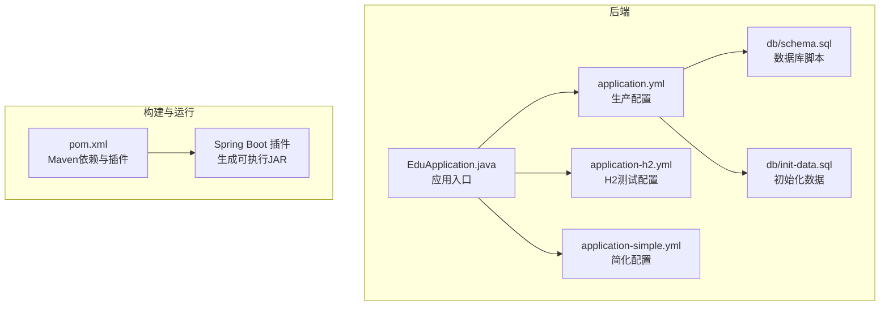
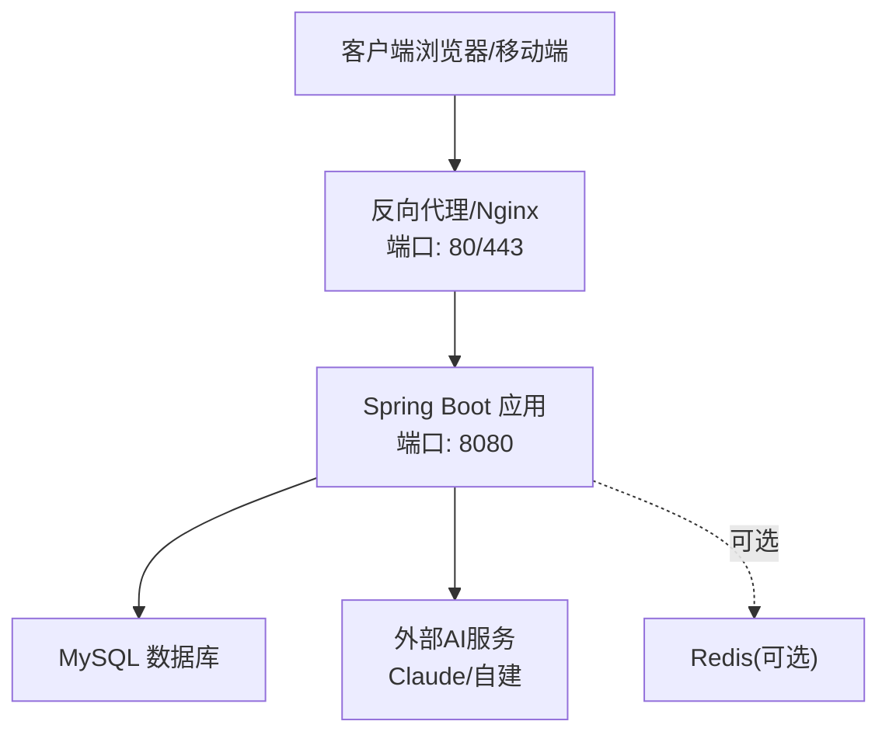
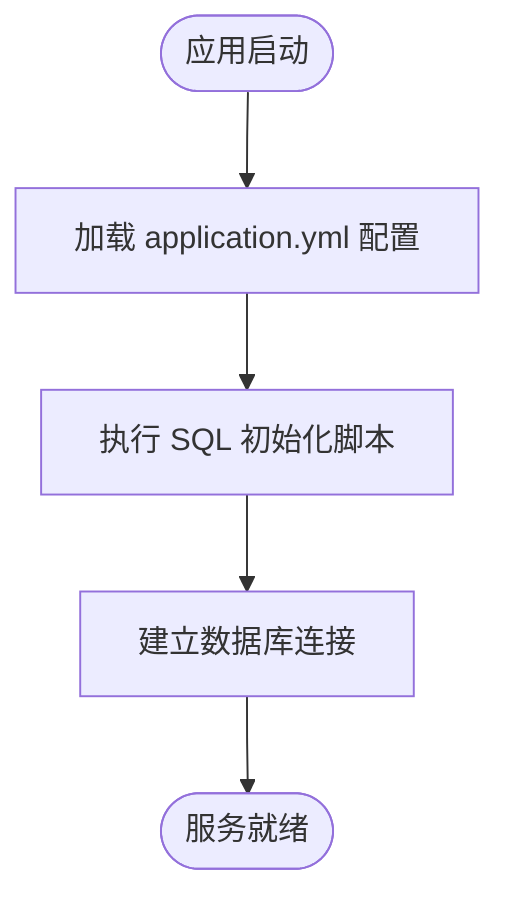
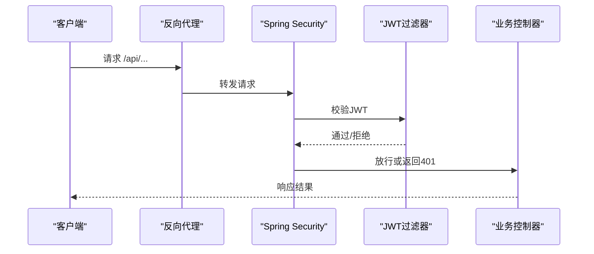
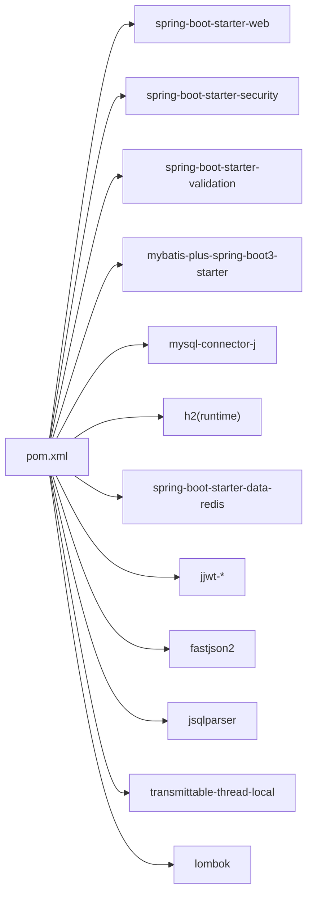

# 生产部署

<cite>
**本文引用的文件**
- [pom.xml](file://backend/pom.xml)
- [application.yml](file://backend/src/main/resources/application.yml)
- [application-h2.yml](file://backend/src/main/resources/application-h2.yml)
- [application-simple.yml](file://backend/src/main/resources/application-simple.yml)
- [EduApplication.java](file://backend/src/main/java/com/edu/EduApplication.java)
- [MybatisPlusConfig.java](file://backend/src/main/java/com/edu/common/config/MybatisPlusConfig.java)
- [SecurityConfig.java](file://backend/src/main/java/com/edu/common/config/SecurityConfig.java)
- [WebMvcConfig.java](file://backend/src/main/java/com/edu/common/config/WebMvcConfig.java)
- [schema.sql](file://backend/src/main/resources/db/schema.sql)
- [init-data.sql](file://backend/src/main/resources/db/init-data.sql)
- [README.md](file://README.md)
- [INSTALL.md](file://INSTALL.md)
</cite>

## 目录
1. [简介](#简介)
2. [项目结构](#项目结构)
3. [核心组件](#核心组件)
4. [架构总览](#架构总览)
5. [详细组件分析](#详细组件分析)
6. [依赖分析](#依赖分析)
7. [性能考虑](#性能考虑)
8. [故障排查指南](#故障排查指南)
9. [结论](#结论)
10. [附录](#附录)

## 简介
本文件面向生产环境部署，围绕后端服务的打包与运行、配置文件分离与环境变量管理、数据库与连接池配置、安全与拦截器、以及可扩展的容器化与编排思路进行系统化说明。文档同时给出基于现有仓库的部署脚本与自动化流程建议，帮助实现从开发到生产的平滑过渡。

## 项目结构
后端采用 Spring Boot 3 + Maven 构建，核心入口为应用主类，配置集中在 resources 下的 YAML 文件，数据库初始化脚本位于 db 目录。前端独立于后端，通过反向代理统一对外提供服务。

图表来源
- [EduApplication.java:1-15](file://backend/src/main/java/com/edu/EduApplication.java#L1-L15)
- [application.yml:1-65](file://backend/src/main/resources/application.yml#L1-L65)
- [application-h2.yml:1-76](file://backend/src/main/resources/application-h2.yml#L1-L76)
- [application-simple.yml:1-64](file://backend/src/main/resources/application-simple.yml#L1-L64)
- [schema.sql:1-379](file://backend/src/main/resources/db/schema.sql#L1-L379)
- [init-data.sql:1-89](file://backend/src/main/resources/db/init-data.sql#L1-L89)
- [pom.xml:1-152](file://backend/pom.xml#L1-L152)

章节来源
- [EduApplication.java:1-15](file://backend/src/main/java/com/edu/EduApplication.java#L1-L15)
- [application.yml:1-65](file://backend/src/main/resources/application.yml#L1-L65)
- [application-h2.yml:1-76](file://backend/src/main/resources/application-h2.yml#L1-L76)
- [application-simple.yml:1-64](file://backend/src/main/resources/application-simple.yml#L1-L64)
- [schema.sql:1-379](file://backend/src/main/resources/db/schema.sql#L1-L379)
- [init-data.sql:1-89](file://backend/src/main/resources/db/init-data.sql#L1-L89)
- [pom.xml:1-152](file://backend/pom.xml#L1-L152)

## 核心组件
- 应用入口与扫描
  - 应用主类启用 Spring Boot 并扫描 Mapper 包，保证 MyBatis-Plus 能自动发现映射器。
- 配置体系
  - 生产使用 application.yml；H2 测试使用 application-h2.yml；简化版 application-simple.yml 便于演示。
  - 关键配置项：服务器端口、数据源（含 Hikari 连接池）、MyBatis-Plus、JWT、AI 提供商与超时、日志级别。
- 安全与拦截
  - 基于 JWT 的无状态认证链路，放行公开接口，其余请求需鉴权。
  - Web 层与 SQL 层分别通过拦截器实现多租户隔离。
- 数据库与初始化
  - 提供完整的建表脚本与初始化数据，支持按需执行。

章节来源
- [EduApplication.java:1-15](file://backend/src/main/java/com/edu/EduApplication.java#L1-L15)
- [application.yml:1-65](file://backend/src/main/resources/application.yml#L1-L65)
- [MybatisPlusConfig.java:1-23](file://backend/src/main/java/com/edu/common/config/MybatisPlusConfig.java#L1-L23)
- [SecurityConfig.java:1-50](file://backend/src/main/java/com/edu/common/config/SecurityConfig.java#L1-L50)
- [WebMvcConfig.java:1-24](file://backend/src/main/java/com/edu/common/config/WebMvcConfig.java#L1-L24)
- [schema.sql:1-379](file://backend/src/main/resources/db/schema.sql#L1-L379)
- [init-data.sql:1-89](file://backend/src/main/resources/db/init-data.sql#L1-L89)

## 架构总览
下图展示生产部署的关键交互：客户端经反向代理访问后端 API，后端通过 Hikari 连接池访问 MySQL，必要时调用外部 AI 服务，安全过滤器负责鉴权。

图表来源
- [application.yml:1-65](file://backend/src/main/resources/application.yml#L1-L65)
- [SecurityConfig.java:1-50](file://backend/src/main/java/com/edu/common/config/SecurityConfig.java#L1-L50)

## 详细组件分析

### JAR 包构建与运行
- 构建方式
  - 使用 Maven 插件生成可执行 JAR，产物位于 backend/target 目录。
  - 支持跳过测试打包，缩短 CI 时间。
- 运行方式
  - 直接运行 JAR；或通过 Docker 容器化部署。
- 依赖与版本
  - Spring Boot 3、MyBatis-Plus、MySQL 驱动、H2（测试）、Redis Starter、JWT、Fastjson2 等。

章节来源
- [pom.xml:135-152](file://backend/pom.xml#L135-L152)
- [README.md:46-52](file://README.md#L46-L52)

### 配置文件分离与环境变量管理
- 环境区分
  - application.yml：生产默认配置，包含数据库、连接池、JWT、AI 等参数。
  - application-h2.yml：H2 内存数据库与控制台，适合本地快速验证。
  - application-simple.yml：简化版配置，便于演示与最小化部署。
- 环境变量注入
  - 数据库密码、JWT 密钥、AI API Key 等通过环境变量注入，避免硬编码。
  - 启动时可通过 JVM 参数或系统环境变量传入。
- 配置加载顺序
  - Spring Boot 会按 profile 与环境变量覆盖默认配置，生产建议显式指定 profile 并注入敏感信息。

章节来源
- [application.yml:1-65](file://backend/src/main/resources/application.yml#L1-L65)
- [application-h2.yml:1-76](file://backend/src/main/resources/application-h2.yml#L1-L76)
- [application-simple.yml:1-64](file://backend/src/main/resources/application-simple.yml#L1-L64)
- [README.md:22-35](file://README.md#L22-L35)

### 数据库配置、连接池与初始化
- 数据库连接
  - 使用 MySQL，驱动为官方 Connector/J。
  - 连接 URL 包含时区、字符集、SSL 等参数，确保跨时区一致性。
- 连接池（HikariCP）
  - 默认最小空闲、最大池大小、空闲超时、连接超时等参数已配置，满足中小规模并发。
  - 建议根据实际 QPS 与慢查询情况调整池大小与超时。
- 初始化脚本
  - schema.sql：完整建模，含索引与外键设计。
  - init-data.sql：默认租户、角色、权限、示例用户与题库等。
  - 应用启动时可自动执行初始化脚本（SQL 初始化配置已开启）。

图表来源
- [application.yml:8-13](file://backend/src/main/resources/application.yml#L8-L13)
- [schema.sql:1-379](file://backend/src/main/resources/db/schema.sql#L1-L379)
- [init-data.sql:1-89](file://backend/src/main/resources/db/init-data.sql#L1-L89)

章节来源
- [application.yml:15-24](file://backend/src/main/resources/application.yml#L15-L24)
- [application.yml:8-13](file://backend/src/main/resources/application.yml#L8-L13)
- [schema.sql:1-379](file://backend/src/main/resources/db/schema.sql#L1-L379)
- [init-data.sql:1-89](file://backend/src/main/resources/db/init-data.sql#L1-L89)

### 安全与拦截器（多租户）
- 安全策略
  - 禁用 CSRF 与嵌入式页面限制，启用无状态 Session。
  - 公开接口放行（认证、租户相关），其余接口统一鉴权。
- 拦截器
  - Web 层拦截器对 /api/* 设置最高优先级，注入租户上下文。
  - MyBatis-Plus 拦截器在 SQL 层强制追加租户条件，保障数据隔离。
- 密码编码
  - 使用 BCrypt 对用户密码进行编码存储。

图表来源
- [SecurityConfig.java:26-43](file://backend/src/main/java/com/edu/common/config/SecurityConfig.java#L26-L43)

章节来源
- [SecurityConfig.java:1-50](file://backend/src/main/java/com/edu/common/config/SecurityConfig.java#L1-L50)
- [WebMvcConfig.java:1-24](file://backend/src/main/java/com/edu/common/config/WebMvcConfig.java#L1-L24)
- [MybatisPlusConfig.java:1-23](file://backend/src/main/java/com/edu/common/config/MybatisPlusConfig.java#L1-L23)

### AI 服务集成与超时配置
- 默认提供商与模型
  - 默认使用云提供商（Claude），可切换至私有服务。
- 超时与令牌上限
  - 私有服务与云提供商均配置了超时与最大输出长度，避免长时间阻塞。
- 环境变量
  - 云提供商 API Key 通过环境变量注入，确保生产安全。

章节来源
- [application.yml:49-59](file://backend/src/main/resources/application.yml#L49-L59)

### 日志与可观测性
- 日志级别
  - 控制器与安全模块设置为 debug/info，便于定位问题。
- 建议
  - 生产环境建议降低日志级别，避免 IO 压力；结合集中式日志收集。

章节来源
- [application.yml:61-65](file://backend/src/main/resources/application.yml#L61-L65)

## 依赖分析
- 外部依赖
  - Spring Boot Web、Security、Validation、MyBatis-Plus、MySQL 驱动、H2（测试）、Redis Starter、JWT、Fastjson2、JSqlParser、TransmittableThreadLocal、Lombok。
- 构建插件
  - Spring Boot Maven 插件负责打包与启动。

图表来源
- [pom.xml:29-133](file://backend/pom.xml#L29-L133)

章节来源
- [pom.xml:1-152](file://backend/pom.xml#L1-L152)

## 性能考虑
- 连接池参数
  - 初始空闲、最大池大小、空闲超时、连接超时等参数已配置，建议结合压测与慢查询监控动态调整。
- 查询与索引
  - schema 已包含大量索引，注意避免 N+1 查询与不必要的 JOIN。
- 缓存（可选）
  - Redis Starter 已引入，可按需启用缓存层；当前配置默认排除自动装配，避免误用。
- GC 与 JVM
  - 建议在容器中设置合适的堆大小与 GC 参数，结合 APM 工具观测。
- AI 调用
  - 为外部 AI 服务设置合理超时与重试策略，避免级联故障。

章节来源
- [application.yml:20-24](file://backend/src/main/resources/application.yml#L20-L24)
- [schema.sql:300-379](file://backend/src/main/resources/db/schema.sql#L300-L379)
- [application.yml:26-31](file://backend/src/main/resources/application.yml#L26-L31)

## 故障排查指南
- 数据库连接失败
  - 检查 MySQL 是否运行、网络连通性、凭据与初始化脚本是否成功执行。
- 启动报错与 SQL 初始化
  - 查看 SQL 初始化配置是否启用，确认 schema 与 init-data 已正确执行。
- JWT 认证失败
  - 核对 JWT 密钥与过期时间，确认客户端携带的 Token 有效。
- H2 控制台
  - 若使用 H2 配置，可通过 /h2-console 访问，便于本地调试。
- 端口占用
  - 默认端口为 8080，如冲突请在配置中调整。

章节来源
- [application.yml:8-13](file://backend/src/main/resources/application.yml#L8-L13)
- [application-h2.yml:27-30](file://backend/src/main/resources/application-h2.yml#L27-L30)
- [SecurityConfig.java:26-43](file://backend/src/main/java/com/edu/common/config/SecurityConfig.java#L26-L43)

## 结论
本项目具备良好的生产部署基础：清晰的配置分离、完善的数据库脚本、安全的认证与拦截机制、以及可扩展的连接池与缓存能力。建议在生产环境中进一步完善容器化与编排、接入集中式日志与监控、并针对业务峰值进行连接池与 JVM 参数的专项调优。

## 附录

### A. 生产部署清单
- 环境准备
  - 安装并启动 MySQL，执行数据库脚本与初始化数据。
  - 准备生产配置文件与环境变量（数据库密码、JWT 密钥、AI Key）。
- 构建与运行
  - 使用 Maven 打包生成 JAR，或构建 Docker 镜像后运行。
  - 通过反向代理暴露 80/443 端口，后端监听 8080。
- 监控与日志
  - 接入日志收集与告警，观察连接池、慢查询与错误率。

章节来源
- [schema.sql:1-379](file://backend/src/main/resources/db/schema.sql#L1-L379)
- [init-data.sql:1-89](file://backend/src/main/resources/db/init-data.sql#L1-L89)
- [application.yml:1-65](file://backend/src/main/resources/application.yml#L1-L65)
- [README.md:37-52](file://README.md#L37-L52)

### B. 自动化部署流程建议
- CI/CD 流程
  - 代码合并触发构建，生成 JAR 并推送镜像到制品库。
  - 在目标环境执行数据库迁移与初始化脚本，滚动更新应用。
- 部署脚本要点
  - 读取环境变量，设置 JVM 参数与日志级别。
  - 健康检查与优雅停机，确保零中断升级。

章节来源
- [pom.xml:135-152](file://backend/pom.xml#L135-L152)
- [application.yml:1-65](file://backend/src/main/resources/application.yml#L1-L65)