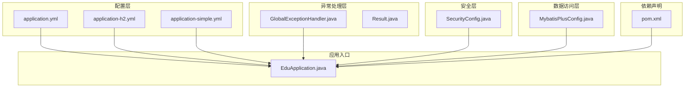
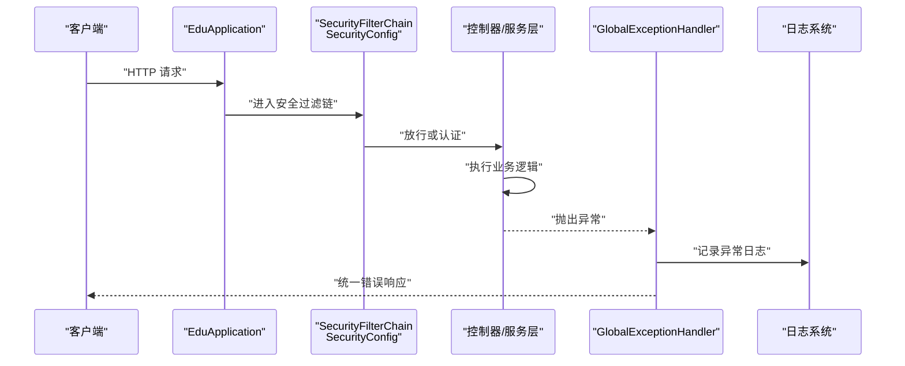
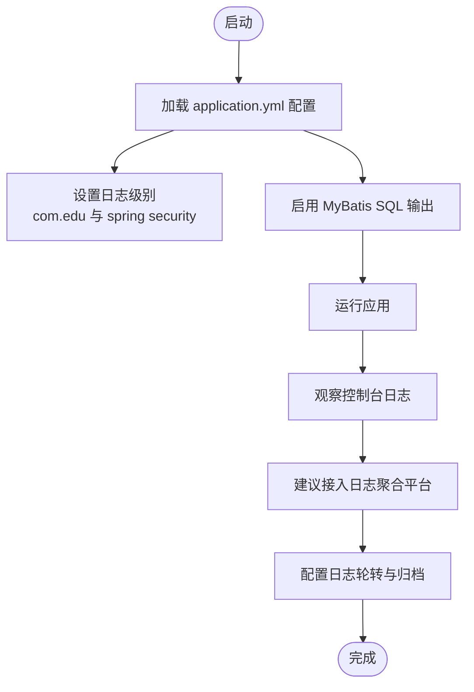
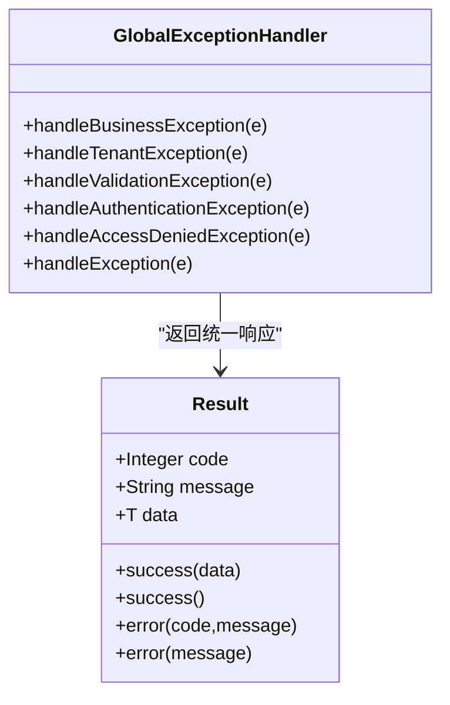
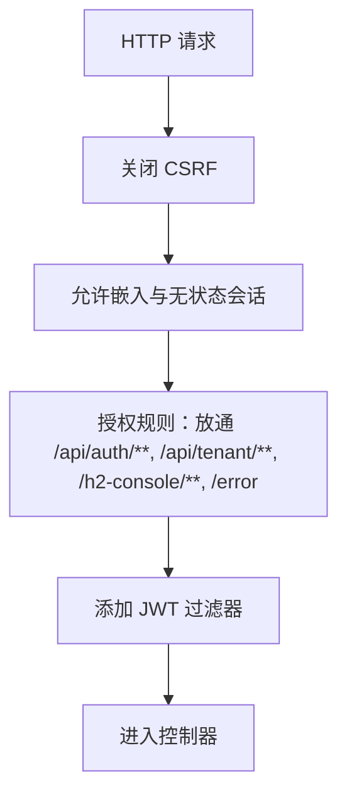
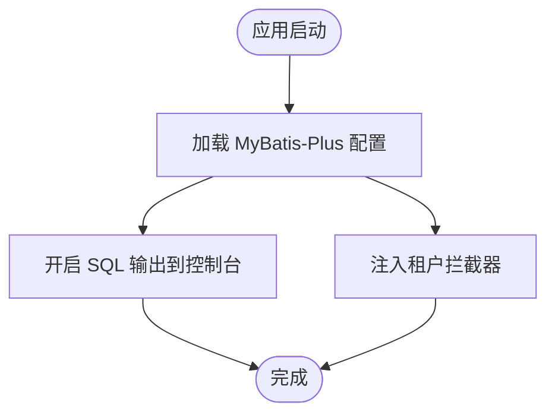
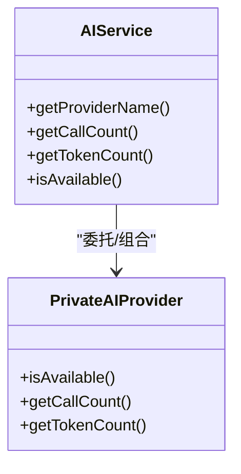
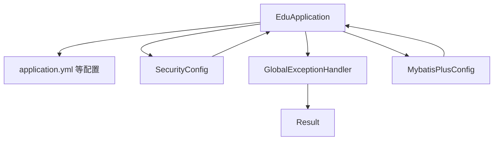

# 监控与日志

<cite>
**本文引用的文件**
- [application.yml](file://backend/src/main/resources/application.yml)
- [application-h2.yml](file://backend/src/main/resources/application-h2.yml)
- [application-simple.yml](file://backend/src/main/resources/application-simple.yml)
- [GlobalExceptionHandler.java](file://backend/src/main/java/com/edu/common/exception/GlobalExceptionHandler.java)
- [Result.java](file://backend/src/main/java/com/edu/common/entity/Result.java)
- [EduApplication.java](file://backend/src/main/java/com/edu/EduApplication.java)
- [pom.xml](file://backend/pom.xml)
- [SecurityConfig.java](file://backend/src/main/java/com/edu/common/config/SecurityConfig.java)
- [MybatisPlusConfig.java](file://backend/src/main/java/com/edu/common/config/MybatisPlusConfig.java)
- [AIService.java](file://backend/src/main/java/com/edu/ai/service/AIService.java)
- [PrivateAIProvider.java](file://backend/src/main/java/com/edu/ai/provider/PrivateAIProvider.java)
- [GlobalExceptionHandlerTest.java](file://backend/src/test/java/com/edu/common/exception/GlobalExceptionHandlerTest.java)
</cite>

## 目录
1. [简介](#简介)
2. [项目结构](#项目结构)
3. [核心组件](#核心组件)
4. [架构总览](#架构总览)
5. [详细组件分析](#详细组件分析)
6. [依赖关系分析](#依赖关系分析)
7. [性能考虑](#性能考虑)
8. [故障排查指南](#故障排查指南)
9. [结论](#结论)
10. [附录](#附录)

## 简介
本文件面向“监控与日志”主题，结合后端代码现状，系统性梳理当前实现的监控与日志能力，并提出可落地的改进方案。当前项目具备以下基础能力：
- 日志级别配置与输出位置（控制台）
- 全局异常处理与统一响应封装
- 安全过滤链与认证入口点
- MyBatis-Plus SQL 输出配置
- AI 服务可用性与调用统计（私有提供方）

在不引入外部监控中间件的前提下，文档将重点说明如何利用现有组件进行系统资源监控、应用性能监控与业务指标监控；如何配置日志级别、日志轮转与日志聚合；以及如何完善错误追踪与异常监控机制；并给出告警配置与通知策略建议及日志分析与性能分析方法。

## 项目结构
后端采用 Spring Boot 标准目录结构，关键与监控日志相关的模块分布如下：
- 配置层：application.yml 及其变体用于日志级别、数据源、AI 提供方等配置
- 异常处理层：GlobalExceptionHandler 提供统一异常处理与日志记录
- 安全层：SecurityConfig 配置安全过滤链与认证入口点
- 数据访问层：MybatisPlusConfig 注入租户拦截器与 SQL 输出配置
- 应用入口：EduApplication 启动类
- 依赖声明：pom.xml 中包含 web、security、validation、mybatis-plus、redis、jwt 等依赖

**图表来源**
- [application.yml:61-65](file://backend/src/main/resources/application.yml#L61-L65)
- [application-h2.yml:73-76](file://backend/src/main/resources/application-h2.yml#L73-L76)
- [application-simple.yml:61-64](file://backend/src/main/resources/application-simple.yml#L61-L64)
- [GlobalExceptionHandler.java:1-69](file://backend/src/main/java/com/edu/common/exception/GlobalExceptionHandler.java#L1-L69)
- [Result.java:1-44](file://backend/src/main/java/com/edu/common/entity/Result.java#L1-L44)
- [SecurityConfig.java:1-49](file://backend/src/main/java/com/edu/common/config/SecurityConfig.java#L1-L49)
- [MybatisPlusConfig.java:1-22](file://backend/src/main/java/com/edu/common/config/MybatisPlusConfig.java#L1-L22)
- [EduApplication.java:1-15](file://backend/src/main/java/com/edu/EduApplication.java#L1-L15)
- [pom.xml:29-99](file://backend/pom.xml#L29-L99)

**章节来源**
- [application.yml:1-65](file://backend/src/main/resources/application.yml#L1-L65)
- [application-h2.yml:1-76](file://backend/src/main/resources/application-h2.yml#L1-L76)
- [application-simple.yml:1-64](file://backend/src/main/resources/application-simple.yml#L1-L64)
- [GlobalExceptionHandler.java:1-69](file://backend/src/main/java/com/edu/common/exception/GlobalExceptionHandler.java#L1-L69)
- [Result.java:1-44](file://backend/src/main/java/com/edu/common/entity/Result.java#L1-L44)
- [SecurityConfig.java:1-49](file://backend/src/main/java/com/edu/common/config/SecurityConfig.java#L1-L49)
- [MybatisPlusConfig.java:1-22](file://backend/src/main/java/com/edu/common/config/MybatisPlusConfig.java#L1-L22)
- [EduApplication.java:1-15](file://backend/src/main/java/com/edu/EduApplication.java#L1-L15)
- [pom.xml:29-99](file://backend/pom.xml#L29-L99)

## 核心组件
- 日志与异常处理
  - application.yml 中 logging.level 配置了 com.edu 与 spring security 的日志级别，便于开发调试阶段观察业务与安全相关日志
  - GlobalExceptionHandler 对各类异常进行捕获与统一返回，同时通过日志记录异常信息，形成基础的错误追踪
  - Result 统一响应结构，便于前端与监控系统消费

- 安全与认证
  - SecurityConfig 配置无状态会话、放通部分路径、添加 JWT 过滤器与认证入口点，为后续审计与异常监控提供上下文

- 数据访问与 SQL 观察
  - MybatisPlusConfig 注入租户拦截器与 SQL 输出配置，StdOutImpl 将 SQL 输出到控制台，有助于定位慢查询与异常 SQL

- AI 服务可观测性
  - AIService 与 PrivateAIProvider 提供调用计数与可用性检查，为外部服务健康度与使用量统计提供基础

**章节来源**
- [application.yml:61-65](file://backend/src/main/resources/application.yml#L61-L65)
- [GlobalExceptionHandler.java:23-67](file://backend/src/main/java/com/edu/common/exception/GlobalExceptionHandler.java#L23-L67)
- [Result.java:21-42](file://backend/src/main/java/com/edu/common/entity/Result.java#L21-L42)
- [SecurityConfig.java:26-43](file://backend/src/main/java/com/edu/common/config/SecurityConfig.java#L26-L43)
- [MybatisPlusConfig.java:16-21](file://backend/src/main/java/com/edu/common/config/MybatisPlusConfig.java#L16-L21)
- [AIService.java:93-102](file://backend/src/main/java/com/edu/ai/service/AIService.java#L93-L102)
- [PrivateAIProvider.java:171-195](file://backend/src/main/java/com/edu/ai/provider/PrivateAIProvider.java#L171-L195)

## 架构总览
下图展示了从请求进入、安全过滤、异常处理到日志输出的整体流程，体现当前监控与日志的关键节点。

**图表来源**
- [EduApplication.java:11-13](file://backend/src/main/java/com/edu/EduApplication.java#L11-L13)
- [SecurityConfig.java:26-43](file://backend/src/main/java/com/edu/common/config/SecurityConfig.java#L26-L43)
- [GlobalExceptionHandler.java:23-67](file://backend/src/main/java/com/edu/common/exception/GlobalExceptionHandler.java#L23-L67)

## 详细组件分析

### 日志系统与配置
- 日志级别
  - application.yml 与 application-h2.yml 均配置了 com.edu 与 spring security 的日志级别，便于在开发与测试环境观察业务与安全行为
- 日志输出
  - application.yml 中 MyBatis 配置 StdOutImpl，SQL 会输出到控制台，有助于快速定位问题
- 日志聚合与轮转
  - 当前未见日志文件落盘与轮转配置，建议在生产环境增加日志文件输出与按天/按大小轮转策略

**图表来源**
- [application.yml:61-65](file://backend/src/main/resources/application.yml#L61-L65)
- [application.yml:37-37](file://backend/src/main/resources/application.yml#L37-L37)
- [application-h2.yml:73-76](file://backend/src/main/resources/application-h2.yml#L73-L76)

**章节来源**
- [application.yml:61-65](file://backend/src/main/resources/application.yml#L61-L65)
- [application.yml:37-37](file://backend/src/main/resources/application.yml#L37-L37)
- [application-h2.yml:73-76](file://backend/src/main/resources/application-h2.yml#L73-L76)

### 全局异常处理与错误追踪
- 异常分类与处理
  - 业务异常、租户异常、参数校验异常、认证异常、权限异常、通用异常均有对应处理器
  - 处理器统一记录日志并返回 Result 结构，便于前端与监控系统消费
- 测试验证
  - 提供了对异常处理器的行为测试，确保错误码与消息符合预期

**图表来源**
- [GlobalExceptionHandler.java:23-67](file://backend/src/main/java/com/edu/common/exception/GlobalExceptionHandler.java#L23-L67)
- [Result.java:21-42](file://backend/src/main/java/com/edu/common/entity/Result.java#L21-L42)

**章节来源**
- [GlobalExceptionHandler.java:23-67](file://backend/src/main/java/com/edu/common/exception/GlobalExceptionHandler.java#L23-L67)
- [Result.java:21-42](file://backend/src/main/java/com/edu/common/entity/Result.java#L21-L42)
- [GlobalExceptionHandlerTest.java:12-38](file://backend/src/test/java/com/edu/common/exception/GlobalExceptionHandlerTest.java#L12-L38)

### 安全过滤与审计上下文
- 无状态会话、放通特定路径、添加 JWT 过滤器与认证入口点
- 为后续在异常处理中注入用户/租户上下文提供基础，便于审计与告警关联

**图表来源**
- [SecurityConfig.java:26-43](file://backend/src/main/java/com/edu/common/config/SecurityConfig.java#L26-L43)

**章节来源**
- [SecurityConfig.java:26-43](file://backend/src/main/java/com/edu/common/config/SecurityConfig.java#L26-L43)

### 数据访问层可观测性
- MyBatis-Plus 配置启用 SQL 输出到控制台，便于快速定位慢查询与异常 SQL
- 租户拦截器注入，确保多租户隔离与审计

**图表来源**
- [MybatisPlusConfig.java:16-21](file://backend/src/main/java/com/edu/common/config/MybatisPlusConfig.java#L16-L21)
- [application.yml:37-37](file://backend/src/main/resources/application.yml#L37-L37)

**章节来源**
- [MybatisPlusConfig.java:16-21](file://backend/src/main/java/com/edu/common/config/MybatisPlusConfig.java#L16-L21)
- [application.yml:37-37](file://backend/src/main/resources/application.yml#L37-L37)

### AI 服务可用性与调用统计
- AIService 与 PrivateAIProvider 提供调用次数与令牌用量统计，以及可用性检查接口
- 可作为外部服务健康度与使用量的基础指标来源

**图表来源**
- [AIService.java:93-102](file://backend/src/main/java/com/edu/ai/service/AIService.java#L93-L102)
- [PrivateAIProvider.java:171-195](file://backend/src/main/java/com/edu/ai/provider/PrivateAIProvider.java#L171-L195)

**章节来源**
- [AIService.java:93-102](file://backend/src/main/java/com/edu/ai/service/AIService.java#L93-L102)
- [PrivateAIProvider.java:171-195](file://backend/src/main/java/com/edu/ai/provider/PrivateAIProvider.java#L171-L195)

## 依赖关系分析
- 应用启动与配置
  - EduApplication 负责扫描 Mapper 并启动 Spring Boot 应用
  - application.yml 等配置文件决定日志级别、数据源、AI 提供方等
- 异常处理与安全
  - GlobalExceptionHandler 与 SecurityConfig 分别负责异常与安全，二者共同构成运行期可观测性与安全性基础
- 数据访问
  - MybatisPlusConfig 注入租户拦截器与 SQL 输出，影响查询性能与审计
- 依赖声明
  - pom.xml 包含 web、security、validation、mybatis-plus、redis、jwt 等依赖，为监控与日志功能提供基础支撑

**图表来源**
- [EduApplication.java:7-9](file://backend/src/main/java/com/edu/EduApplication.java#L7-L9)
- [application.yml:61-65](file://backend/src/main/resources/application.yml#L61-L65)
- [SecurityConfig.java:26-43](file://backend/src/main/java/com/edu/common/config/SecurityConfig.java#L26-L43)
- [GlobalExceptionHandler.java:23-67](file://backend/src/main/java/com/edu/common/exception/GlobalExceptionHandler.java#L23-L67)
- [Result.java:21-42](file://backend/src/main/java/com/edu/common/entity/Result.java#L21-L42)
- [MybatisPlusConfig.java:16-21](file://backend/src/main/java/com/edu/common/config/MybatisPlusConfig.java#L16-L21)

**章节来源**
- [EduApplication.java:7-9](file://backend/src/main/java/com/edu/EduApplication.java#L7-L9)
- [application.yml:61-65](file://backend/src/main/resources/application.yml#L61-L65)
- [SecurityConfig.java:26-43](file://backend/src/main/java/com/edu/common/config/SecurityConfig.java#L26-L43)
- [GlobalExceptionHandler.java:23-67](file://backend/src/main/java/com/edu/common/exception/GlobalExceptionHandler.java#L23-L67)
- [Result.java:21-42](file://backend/src/main/java/com/edu/common/entity/Result.java#L21-L42)
- [MybatisPlusConfig.java:16-21](file://backend/src/main/java/com/edu/common/config/MybatisPlusConfig.java#L16-L21)
- [pom.xml:29-99](file://backend/pom.xml#L29-L99)

## 性能考虑
- SQL 观察
  - 在开发/测试环境启用 MyBatis SQL 输出有助于发现慢查询与异常 SQL；生产环境建议关闭或仅在特定时段开启
- 日志级别
  - 开发环境可设为 debug，生产环境建议调整为 info 或 warn，避免过多日志影响性能
- 外部服务健康度
  - 利用 AIService/Provider 的可用性检查与调用统计，建立外部服务健康度基线，及时发现异常波动

[本节为通用指导，无需列出具体文件来源]

## 故障排查指南
- 异常处理与日志
  - 通过 GlobalExceptionHandler 的日志记录与统一响应，快速定位业务异常、参数校验失败、认证失败、权限不足等问题
  - 使用 Result 统一结构便于前端与监控系统消费
- 安全相关问题
  - 检查 SecurityConfig 的放通路径与认证入口点配置，确认是否因权限配置导致访问异常
- SQL 问题
  - 通过 MyBatis SQL 输出定位慢查询与异常 SQL，必要时优化索引或重写语句
- 外部服务
  - 使用 PrivateAIProvider 的可用性检查与调用统计，判断外部服务是否正常

**章节来源**
- [GlobalExceptionHandler.java:23-67](file://backend/src/main/java/com/edu/common/exception/GlobalExceptionHandler.java#L23-L67)
- [Result.java:21-42](file://backend/src/main/java/com/edu/common/entity/Result.java#L21-L42)
- [SecurityConfig.java:26-43](file://backend/src/main/java/com/edu/common/config/SecurityConfig.java#L26-L43)
- [MybatisPlusConfig.java:16-21](file://backend/src/main/java/com/edu/common/config/MybatisPlusConfig.java#L16-L21)
- [PrivateAIProvider.java:171-195](file://backend/src/main/java/com/edu/ai/provider/PrivateAIProvider.java#L171-L195)

## 结论
当前项目已具备基础的日志与异常处理能力，能够满足开发与测试阶段的监控需求。为进一步提升生产环境的可观测性，建议：
- 引入日志文件落盘与轮转策略，对接日志聚合平台
- 增加系统资源监控（CPU、内存、线程池）与应用性能监控（QPS、响应时间、错误率）
- 完善业务指标采集（如 AI 调用次数、外部服务可用性）
- 建立基于阈值与趋势的告警机制与通知策略
- 结合现有异常处理与安全过滤，完善审计与追踪能力

[本节为总结性内容，无需列出具体文件来源]

## 附录

### 监控指标清单（建议）
- 系统资源监控
  - CPU 使用率、内存占用、线程数、GC 次数与耗时
- 应用性能监控
  - QPS、P95/P99 响应时间、错误率、超时率
- 业务指标监控
  - AI 调用次数、令牌用量、外部服务可用性、业务操作成功率
- 安全与审计
  - 认证失败次数、权限拒绝次数、敏感操作日志

[本节为概念性内容，无需列出具体文件来源]

### 日志级别与配置建议
- 开发环境：com.edu 设置为 debug，spring security 设置为 debug
- 测试环境：com.edu 设置为 info，spring security 设置为 info
- 生产环境：com.edu 设置为 warn，spring security 设置为 warn

**章节来源**
- [application.yml:61-65](file://backend/src/main/resources/application.yml#L61-L65)
- [application-h2.yml:73-76](file://backend/src/main/resources/application-h2.yml#L73-L76)
- [application-simple.yml:61-64](file://backend/src/main/resources/application-simple.yml#L61-L64)

### 告警与通知策略（建议）
- 阈值告警
  - 错误率超过阈值、响应时间超过阈值、外部服务不可用持续一定时间
- 趋势告警
  - 错误率/流量异常波动
- 通知渠道
  - 邮件、IM（企业微信/钉钉）、电话（严重级别）

[本节为概念性内容，无需列出具体文件来源]

### 日志分析与性能分析方法
- 日志分析
  - 关键字段：时间戳、请求 ID、用户/租户上下文、异常堆栈、外部服务调用链路
  - 工具：ELK/EFK、Splunk、自建日志聚合平台
- 性能分析
  - SQL 分析：结合 MyBatis 输出定位慢查询
  - 外部服务：结合 AIService/Provider 的统计与可用性检查
  - 压力测试：模拟高并发场景，观察错误率与响应时间

[本节为通用指导，无需列出具体文件来源]