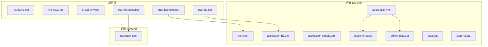
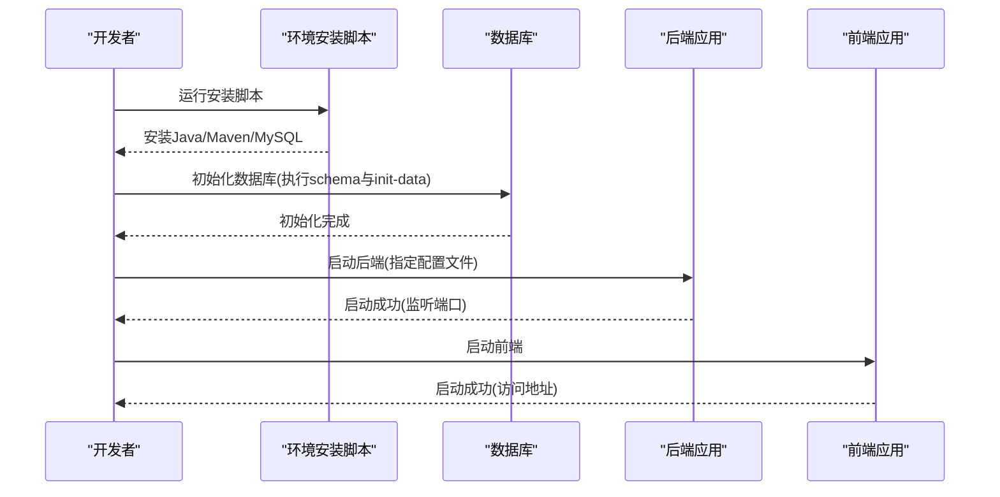
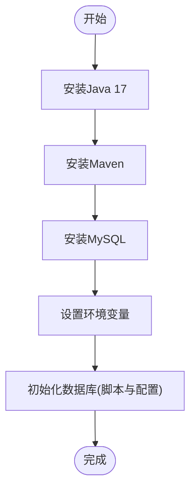
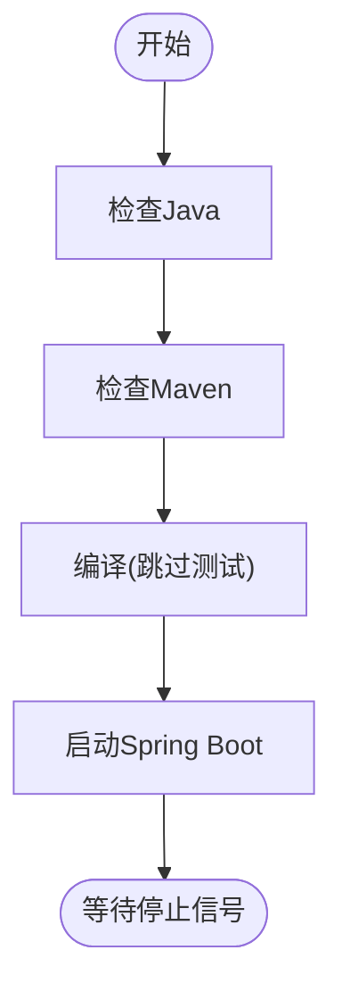
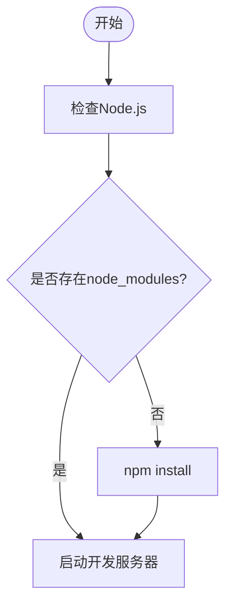
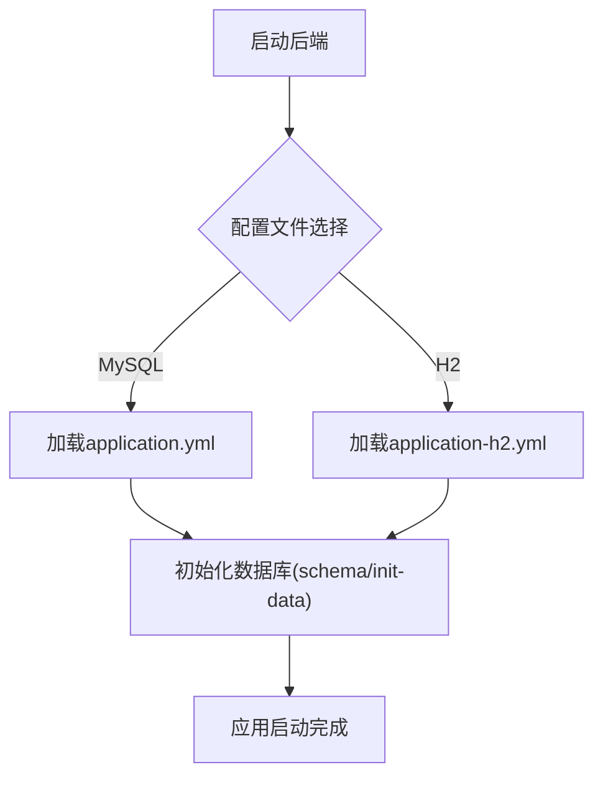
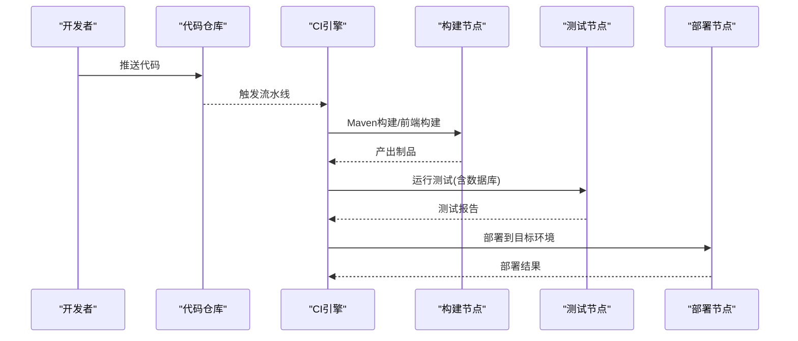
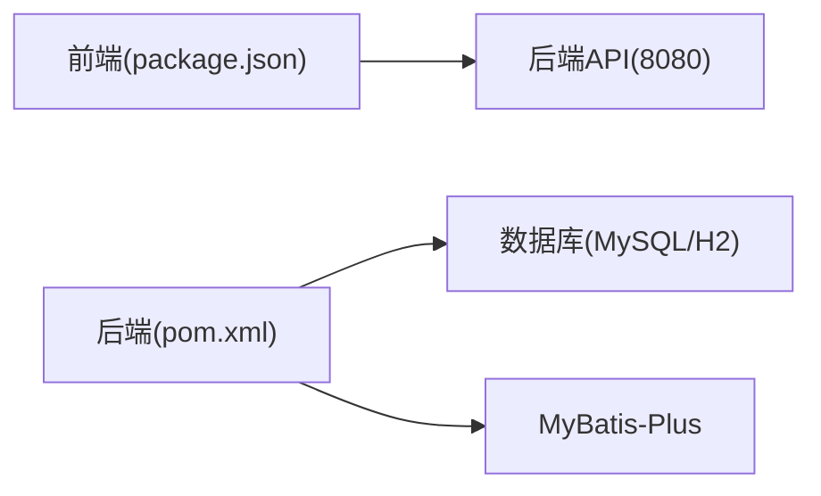

# 运维自动化

<cite>
**本文引用的文件**
- [README.md](file://README.md)
- [INSTALL.md](file://INSTALL.md)
- [install-env.bat](file://install-env.bat)
- [start-backend.bat](file://start-backend.bat)
- [start-frontend.bat](file://start-frontend.bat)
- [start-h2.bat](file://start-h2.bat)
- [backend/pom.xml](file://backend/pom.xml)
- [backend/src/main/resources/application.yml](file://backend/src/main/resources/application.yml)
- [backend/src/main/resources/application-h2.yml](file://backend/src/main/resources/application-h2.yml)
- [backend/src/main/resources/application-simple.yml](file://backend/src/main/resources/application-simple.yml)
- [backend/src/main/resources/db/schema.sql](file://backend/src/main/resources/db/schema.sql)
- [backend/src/main/resources/db/init-data.sql](file://backend/src/main/resources/db/init-data.sql)
- [backend/start.bat](file://backend/start.bat)
- [backend/start-h2.bat](file://backend/start-h2.bat)
- [frontend/package.json](file://frontend/package.json)
</cite>

## 目录
1. [简介](#简介)
2. [项目结构](#项目结构)
3. [核心组件](#核心组件)
4. [架构总览](#架构总览)
5. [详细组件分析](#详细组件分析)
6. [依赖关系分析](#依赖关系分析)
7. [性能考虑](#性能考虑)
8. [故障排查指南](#故障排查指南)
9. [结论](#结论)
10. [附录](#附录)

## 简介
本文件面向运维与平台工程团队，系统化梳理本项目的运维自动化实践，覆盖环境安装脚本、应用启动脚本、数据库初始化与配置、前后端启动流程、以及CI/CD流水线与工具链的落地建议。文档同时提供可操作的自动化执行与调度策略，帮助实现从开发到生产的全链路自动化。

## 项目结构
项目采用前后端分离架构，后端基于Spring Boot，前端基于Vue 3 + Vite。仓库根目录提供Windows批处理脚本与安装说明，便于快速搭建本地开发环境；后端通过Maven进行构建与打包，配置文件支持多环境切换（MySQL/H2），数据库初始化脚本位于resources/db目录。

**图表来源**
- [README.md:1-88](file://README.md#L1-L88)
- [INSTALL.md:1-134](file://INSTALL.md#L1-L134)
- [backend/pom.xml:1-152](file://backend/pom.xml#L1-L152)
- [backend/src/main/resources/application.yml:1-65](file://backend/src/main/resources/application.yml#L1-L65)
- [backend/src/main/resources/application-h2.yml:1-76](file://backend/src/main/resources/application-h2.yml#L1-L76)
- [backend/src/main/resources/application-simple.yml:1-64](file://backend/src/main/resources/application-simple.yml#L1-L64)
- [backend/src/main/resources/db/schema.sql:1-379](file://backend/src/main/resources/db/schema.sql#L1-L379)
- [backend/src/main/resources/db/init-data.sql:1-89](file://backend/src/main/resources/db/init-data.sql#L1-L89)
- [frontend/package.json:1-25](file://frontend/package.json#L1-L25)

**章节来源**
- [README.md:1-88](file://README.md#L1-L88)
- [INSTALL.md:1-134](file://INSTALL.md#L1-L134)

## 核心组件
- 环境安装脚本：提供一键安装Java、Maven、MySQL的引导流程，便于快速搭建开发环境。
- 应用启动脚本：封装后端与前端启动流程，包含环境检测、依赖安装与启动命令。
- 配置文件：application.yml与application-h2.yml分别对应MySQL与H2内存数据库模式，支持多环境切换与参数注入。
- 数据库初始化：schema.sql与init-data.sql提供完整的DDL与初始化数据，支持自动初始化。
- 构建与打包：pom.xml定义依赖与插件，支持Spring Boot打包与测试跳过。

**章节来源**
- [install-env.bat:1-36](file://install-env.bat#L1-L36)
- [start-backend.bat:1-40](file://start-backend.bat#L1-L40)
- [start-frontend.bat:1-34](file://start-frontend.bat#L1-L34)
- [backend/src/main/resources/application.yml:1-65](file://backend/src/main/resources/application.yml#L1-L65)
- [backend/src/main/resources/application-h2.yml:1-76](file://backend/src/main/resources/application-h2.yml#L1-L76)
- [backend/src/main/resources/application-simple.yml:1-64](file://backend/src/main/resources/application-simple.yml#L1-L64)
- [backend/src/main/resources/db/schema.sql:1-379](file://backend/src/main/resources/db/schema.sql#L1-L379)
- [backend/src/main/resources/db/init-data.sql:1-89](file://backend/src/main/resources/db/init-data.sql#L1-L89)
- [backend/pom.xml:1-152](file://backend/pom.xml#L1-L152)

## 架构总览
下图展示从本地开发到系统运行的关键路径：环境准备、数据库初始化、后端启动、前端启动与访问。

**图表来源**
- [INSTALL.md:24-76](file://INSTALL.md#L24-L76)
- [backend/src/main/resources/application.yml:1-65](file://backend/src/main/resources/application.yml#L1-L65)
- [backend/src/main/resources/application-h2.yml:1-76](file://backend/src/main/resources/application-h2.yml#L1-L76)
- [backend/src/main/resources/db/schema.sql:1-379](file://backend/src/main/resources/db/schema.sql#L1-L379)
- [backend/src/main/resources/db/init-data.sql:1-89](file://backend/src/main/resources/db/init-data.sql#L1-L89)

## 详细组件分析

### 环境安装脚本
- 功能：自动安装Java 17、Maven与MySQL，设置环境变量并提示后续步骤。
- 关键点：使用包管理器安装，随后需手动执行数据库初始化与配置。
- 建议：在CI环境中结合非交互式安装与环境变量注入，减少人工干预。

**图表来源**
- [install-env.bat:1-36](file://install-env.bat#L1-L36)
- [INSTALL.md:24-76](file://INSTALL.md#L24-L76)

**章节来源**
- [install-env.bat:1-36](file://install-env.bat#L1-L36)
- [INSTALL.md:1-134](file://INSTALL.md#L1-L134)

### 应用启动脚本（后端）
- 功能：检查Java与Maven，编译后端，启动Spring Boot应用。
- 关键点：支持跳过测试编译，启动前需确保数据库可用。
- 建议：在生产环境使用打包后的JAR并通过进程管理器托管，配合健康检查与日志采集。

**图表来源**
- [start-backend.bat:1-40](file://start-backend.bat#L1-L40)

**章节来源**
- [start-backend.bat:1-40](file://start-backend.bat#L1-L40)
- [backend/pom.xml:135-152](file://backend/pom.xml#L135-L152)

### 应用启动脚本（前端）
- 功能：检查Node.js，安装依赖，启动开发服务器。
- 关键点：若缺少node_modules则自动安装依赖，随后启动开发服务器。
- 建议：生产环境使用构建产物并配合反向代理，避免直接暴露开发服务器。

**图表来源**
- [start-frontend.bat:1-34](file://start-frontend.bat#L1-L34)
- [frontend/package.json:6-10](file://frontend/package.json#L6-L10)

**章节来源**
- [start-frontend.bat:1-34](file://start-frontend.bat#L1-L34)
- [frontend/package.json:1-25](file://frontend/package.json#L1-L25)

### 数据库初始化与配置
- 初始化脚本：schema.sql定义完整表结构与索引，init-data.sql插入默认租户、角色、权限与示例数据。
- 配置文件：
  - application.yml：默认MySQL配置，支持环境变量注入与自动初始化。
  - application-h2.yml：H2内存数据库配置，启用H2控制台，适合测试。
  - application-simple.yml：简化版配置，便于演示与快速验证。
- 建议：生产环境使用MySQL，H2仅用于本地测试；通过环境变量注入敏感配置。

**图表来源**
- [backend/src/main/resources/application.yml:1-65](file://backend/src/main/resources/application.yml#L1-L65)
- [backend/src/main/resources/application-h2.yml:1-76](file://backend/src/main/resources/application-h2.yml#L1-L76)
- [backend/src/main/resources/application-simple.yml:1-64](file://backend/src/main/resources/application-simple.yml#L1-L64)
- [backend/src/main/resources/db/schema.sql:1-379](file://backend/src/main/resources/db/schema.sql#L1-L379)
- [backend/src/main/resources/db/init-data.sql:1-89](file://backend/src/main/resources/db/init-data.sql#L1-L89)

**章节来源**
- [backend/src/main/resources/application.yml:1-65](file://backend/src/main/resources/application.yml#L1-L65)
- [backend/src/main/resources/application-h2.yml:1-76](file://backend/src/main/resources/application-h2.yml#L1-L76)
- [backend/src/main/resources/application-simple.yml:1-64](file://backend/src/main/resources/application-simple.yml#L1-L64)
- [backend/src/main/resources/db/schema.sql:1-379](file://backend/src/main/resources/db/schema.sql#L1-L379)
- [backend/src/main/resources/db/init-data.sql:1-89](file://backend/src/main/resources/db/init-data.sql#L1-L89)

### CI/CD流水线设计与实施
- 代码构建
  - 后端：使用Maven进行编译与打包，可跳过测试以加速流水线。
  - 前端：使用npm进行依赖安装与构建，生成静态产物。
- 测试执行
  - 建议在流水线中拆分阶段：单元测试、集成测试、端到端测试。
  - 可使用容器化测试数据库（如H2或轻量MySQL镜像）提升稳定性。
- 部署自动化
  - 后端：将Spring Boot JAR与配置文件打包为部署包，通过进程管理器或容器编排部署。
  - 前端：将构建产物部署至Web服务器或CDN。
- 工具链选择与集成
  - Jenkins：提供声明式流水线，支持多阶段构建与部署。
  - Ansible：用于基础设施即代码与应用部署，统一环境配置。
  - GitLab CI/CD：与Git仓库深度集成，适合Git优先的团队。
  - GitHub Actions：适用于开源或GitHub生态，可与依赖管理与安全扫描联动。
- 配置管理
  - 将数据库连接、AI服务密钥等敏感信息通过环境变量或密钥管理服务注入。
  - 多环境配置文件（dev/stage/prod）与分支策略结合，确保变更可控。

**图表来源**
- [backend/pom.xml:135-152](file://backend/pom.xml#L135-L152)
- [frontend/package.json:6-10](file://frontend/package.json#L6-L10)

**章节来源**
- [backend/pom.xml:1-152](file://backend/pom.xml#L1-L152)
- [frontend/package.json:1-25](file://frontend/package.json#L1-L25)

### 运维工具链选择与集成
- Ansible
  - 用途：基础设施配置、应用部署、数据库初始化脚本远程执行。
  - 建议：将schema.sql与init-data.sql作为Ansible任务的一部分，确保部署一致性。
- Jenkins
  - 用途：流水线编排、构建触发、测试报告聚合、部署审批。
  - 建议：结合凭据管理与参数化构建，支持多环境部署。
- GitLab CI/CD / GitHub Actions
  - 用途：与代码仓库联动，实现从PR到发布的自动化。
  - 建议：使用容器化构建与缓存策略，缩短流水线时间。

**章节来源**
- [backend/src/main/resources/db/schema.sql:1-379](file://backend/src/main/resources/db/schema.sql#L1-L379)
- [backend/src/main/resources/db/init-data.sql:1-89](file://backend/src/main/resources/db/init-data.sql#L1-L89)

### 运维任务的自动化执行与调度策略
- 启动类任务
  - 后端启动：通过进程管理器（如systemd或Windows服务）托管，配置自启动与健康检查。
  - 前端启动：使用反向代理（Nginx/Apache）托管静态资源，避免直接暴露开发服务器。
- 定时任务
  - 数据备份：定期备份数据库与配置文件，保留多个周期的快照。
  - 日志轮转：按大小与时间轮转日志，保留合规周期内的审计日志。
- 监控与告警
  - 健康检查：暴露/health端点，结合负载均衡探针与监控系统。
  - 性能指标：收集CPU、内存、数据库连接池、请求延迟等指标。
- 回滚与演练
  - 蓝绿/金丝雀发布：降低变更风险，支持快速回滚。
  - 定期演练：模拟故障场景，验证自动化恢复能力。

**章节来源**
- [backend/src/main/resources/application.yml:1-65](file://backend/src/main/resources/application.yml#L1-L65)
- [backend/src/main/resources/application-h2.yml:1-76](file://backend/src/main/resources/application-h2.yml#L1-L76)

## 依赖关系分析
- 后端对数据库的依赖：MySQL驱动与H2内存数据库可选，MyBatis-Plus负责ORM映射。
- 前端对后端API的依赖：通过Vite开发服务器代理转发至后端API。
- 构建工具：Maven负责后端打包，npm负责前端构建与预览。

**图表来源**
- [frontend/package.json:6-10](file://frontend/package.json#L6-L10)
- [backend/pom.xml:48-67](file://backend/pom.xml#L48-L67)
- [backend/src/main/resources/application.yml:15-25](file://backend/src/main/resources/application.yml#L15-L25)

**章节来源**
- [frontend/package.json:1-25](file://frontend/package.json#L1-L25)
- [backend/pom.xml:1-152](file://backend/pom.xml#L1-L152)
- [backend/src/main/resources/application.yml:1-65](file://backend/src/main/resources/application.yml#L1-L65)

## 性能考虑
- 启动优化：跳过测试编译、合理设置JVM参数、启用连接池与懒加载。
- 数据库优化：使用索引、慢查询日志、连接池参数调优。
- 前端优化：构建产物压缩、按需加载、CDN分发。
- 监控与可观测性：埋点关键路径、聚合指标、日志结构化。

## 故障排查指南
- 环境问题
  - Java/Maven/Node缺失：检查PATH与版本，参考安装脚本与安装说明。
  - 端口冲突：确认端口占用，调整配置文件中的server.port。
- 数据库问题
  - 连接失败：检查数据库服务状态、连接串、凭据与网络连通性。
  - 初始化失败：确认schema.sql与init-data.sql执行顺序与权限。
- 应用问题
  - 启动失败：查看日志输出，确认配置文件加载与环境变量注入。
  - 健康检查失败：检查/health端点与外部依赖（数据库、AI服务）。
- 前端问题
  - 代理不通：确认后端API地址与代理配置，检查跨域设置。

**章节来源**
- [README.md:76-88](file://README.md#L76-L88)
- [INSTALL.md:120-134](file://INSTALL.md#L120-L134)
- [backend/src/main/resources/application.yml:15-25](file://backend/src/main/resources/application.yml#L15-L25)

## 结论
本项目提供了完善的本地开发与演示能力，配套的脚本与配置文件为运维自动化奠定了基础。建议在现有基础上引入CI/CD流水线与工具链（如Jenkins/Ansible/GitLab CI/CD），完善监控与告警体系，并制定标准化的部署与回滚策略，以实现从开发到生产的高效、稳定与可追溯的自动化运维。

## 附录
- 快速启动清单
  - 安装Java 17、Maven、MySQL，执行数据库初始化脚本。
  - 配置application.yml或使用H2配置文件进行启动。
  - 启动后端与前端，访问对应端口。
- 常用命令路径
  - 后端启动脚本：[start-backend.bat:1-40](file://start-backend.bat#L1-L40)
  - 前端启动脚本：[start-frontend.bat:1-34](file://start-frontend.bat#L1-L34)
  - H2启动脚本：[start-h2.bat:1-40](file://start-h2.bat#L1-L40)
  - 构建与打包：[backend/pom.xml:135-152](file://backend/pom.xml#L135-L152)
  - 数据库初始化：[backend/src/main/resources/db/schema.sql:1-379](file://backend/src/main/resources/db/schema.sql#L1-L379)、[backend/src/main/resources/db/init-data.sql:1-89](file://backend/src/main/resources/db/init-data.sql#L1-L89)