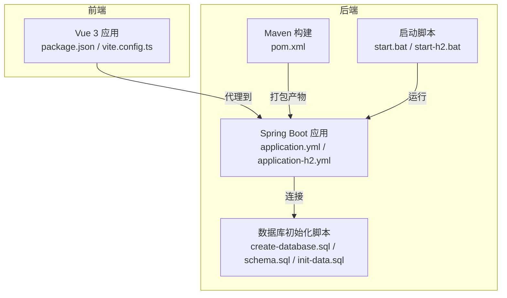
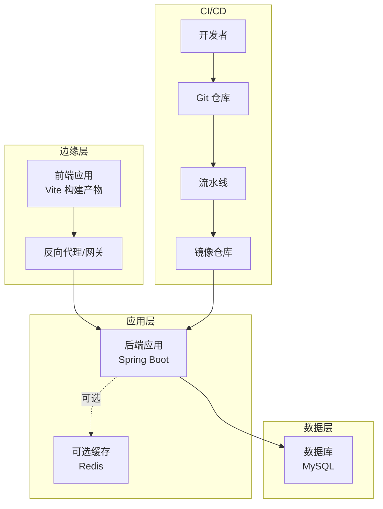
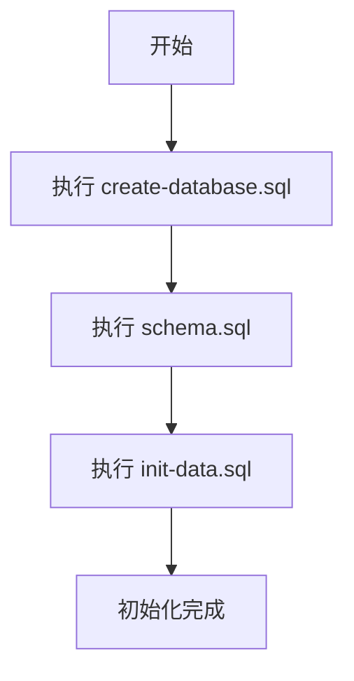
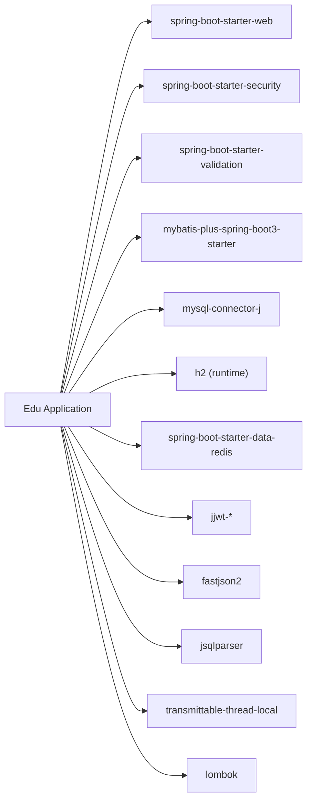

# 部署与运维

<cite>
**本文引用的文件**
- [backend/pom.xml](file://backend/pom.xml)
- [backend/src/main/resources/application.yml](file://backend/src/main/resources/application.yml)
- [backend/src/main/resources/application-h2.yml](file://backend/src/main/resources/application-h2.yml)
- [backend/src/main/resources/db/create-database.sql](file://backend/src/main/resources/db/create-database.sql)
- [backend/src/main/resources/db/schema.sql](file://backend/src/main/resources/db/schema.sql)
- [backend/src/main/resources/db/init-data.sql](file://backend/src/main/resources/db/init-data.sql)
- [backend/start.bat](file://backend/start.bat)
- [backend/start-h2.bat](file://backend/start-h2.bat)
- [INSTALL.md](file://INSTALL.md)
- [README.md](file://README.md)
- [frontend/package.json](file://frontend/package.json)
- [frontend/vite.config.ts](file://frontend/vite.config.ts)
</cite>

## 目录
1. [简介](#简介)
2. [项目结构](#项目结构)
3. [核心组件](#核心组件)
4. [架构总览](#架构总览)
5. [详细组件分析](#详细组件分析)
6. [依赖关系分析](#依赖关系分析)
7. [性能考虑](#性能考虑)
8. [故障排查指南](#故障排查指南)
9. [结论](#结论)
10. [附录](#附录)

## 简介
本文件面向生产环境的部署与运维，围绕后端Spring Boot应用、数据库、前端Vue应用以及本地开发环境进行系统化梳理。内容涵盖：
- 生产部署策略：容器化（Docker）、编排（Kubernetes）、云平台部署要点
- 环境配置管理：配置文件分离、环境变量注入、敏感信息保护
- 数据库部署与迁移：初始化脚本、版本升级与数据备份恢复
- 监控与日志：应用监控、性能指标采集、日志聚合与分析
- 运维自动化与CI/CD：脚本化部署与流水线配置建议
- 故障排查与应急响应：常见问题定位与处置流程

## 项目结构
后端采用Spring Boot工程，使用Maven管理依赖；数据库初始化脚本位于resources/db目录；前端为Vue 3 + Vite项目，通过代理访问后端API。

图表来源
- [backend/src/main/resources/application.yml:1-65](file://backend/src/main/resources/application.yml#L1-L65)
- [backend/src/main/resources/application-h2.yml:1-76](file://backend/src/main/resources/application-h2.yml#L1-L76)
- [backend/src/main/resources/db/schema.sql:1-379](file://backend/src/main/resources/db/schema.sql#L1-L379)
- [backend/pom.xml:1-152](file://backend/pom.xml#L1-L152)
- [backend/start.bat:1-15](file://backend/start.bat#L1-L15)
- [frontend/vite.config.ts:1-21](file://frontend/vite.config.ts#L1-L21)

章节来源
- [backend/src/main/resources/application.yml:1-65](file://backend/src/main/resources/application.yml#L1-L65)
- [backend/src/main/resources/application-h2.yml:1-76](file://backend/src/main/resources/application-h2.yml#L1-L76)
- [backend/src/main/resources/db/schema.sql:1-379](file://backend/src/main/resources/db/schema.sql#L1-L379)
- [backend/pom.xml:1-152](file://backend/pom.xml#L1-L152)
- [backend/start.bat:1-15](file://backend/start.bat#L1-L15)
- [frontend/vite.config.ts:1-21](file://frontend/vite.config.ts#L1-L21)

## 核心组件
- 后端应用配置
  - 生产配置：application.yml定义了数据库连接、MyBatis-Plus、JWT、AI Provider等关键参数，并通过环境变量注入敏感信息。
  - 测试配置：application-h2.yml使用H2内存数据库，便于本地快速验证。
- 数据库初始化
  - create-database.sql：创建数据库与字符集设置
  - schema.sql：全量表结构与索引
  - init-data.sql：默认租户、角色、权限、示例题目等初始化数据
- 构建与启动
  - pom.xml：声明Spring Boot、MySQL驱动、MyBatis-Plus、Redis、JWT、Fastjson2等依赖
  - start.bat / start-h2.bat：Windows本地启动脚本，支持H2与生产配置切换
- 前端代理
  - vite.config.ts：前端开发服务器代理至后端8080端口，便于联调

章节来源
- [backend/src/main/resources/application.yml:1-65](file://backend/src/main/resources/application.yml#L1-L65)
- [backend/src/main/resources/application-h2.yml:1-76](file://backend/src/main/resources/application-h2.yml#L1-L76)
- [backend/src/main/resources/db/create-database.sql:1-7](file://backend/src/main/resources/db/create-database.sql#L1-L7)
- [backend/src/main/resources/db/schema.sql:1-379](file://backend/src/main/resources/db/schema.sql#L1-L379)
- [backend/src/main/resources/db/init-data.sql:1-89](file://backend/src/main/resources/db/init-data.sql#L1-L89)
- [backend/pom.xml:1-152](file://backend/pom.xml#L1-L152)
- [backend/start.bat:1-15](file://backend/start.bat#L1-L15)
- [backend/start-h2.bat:1-12](file://backend/start-h2.bat#L1-L12)
- [frontend/vite.config.ts:1-21](file://frontend/vite.config.ts#L1-L21)

## 架构总览
下图展示生产环境典型部署形态：前端静态资源由反向代理或CDN承载，后端通过容器运行，数据库与可选缓存独立部署，配合CI/CD实现自动化交付。

说明
- 前端静态资源可由Nginx或CDN提供，减少后端压力
- 后端通过容器镜像部署，结合健康检查与滚动更新
- 数据库与缓存作为外部服务，通过网络访问
- CI/CD流水线负责代码检出、构建、测试、打包、镜像推送与部署

## 详细组件分析

### 数据库部署与迁移
- 初始化流程
  - 使用create-database.sql创建数据库与字符集
  - 使用schema.sql创建完整表结构与索引
  - 使用init-data.sql插入默认租户、角色、权限与示例数据
- 迁移策略
  - 建议将业务变更拆分为增量SQL脚本，按版本号命名并纳入版本控制
  - 迁移前先备份，迁移后验证完整性与性能
- 备份与恢复
  - 生产环境定期全量备份与增量备份结合
  - 恢复演练应覆盖RTO/RPO目标

图表来源
- [backend/src/main/resources/db/create-database.sql:1-7](file://backend/src/main/resources/db/create-database.sql#L1-L7)
- [backend/src/main/resources/db/schema.sql:1-379](file://backend/src/main/resources/db/schema.sql#L1-L379)
- [backend/src/main/resources/db/init-data.sql:1-89](file://backend/src/main/resources/db/init-data.sql#L1-L89)

章节来源
- [backend/src/main/resources/db/create-database.sql:1-7](file://backend/src/main/resources/db/create-database.sql#L1-L7)
- [backend/src/main/resources/db/schema.sql:1-379](file://backend/src/main/resources/db/schema.sql#L1-L379)
- [backend/src/main/resources/db/init-data.sql:1-89](file://backend/src/main/resources/db/init-data.sql#L1-L89)

### 环境配置管理
- 配置文件分离
  - application.yml用于生产环境，application-h2.yml用于本地H2测试
  - 通过Spring Profile激活不同配置
- 环境变量注入
  - 数据库密码、JWT密钥、AI Provider密钥等通过环境变量注入，避免硬编码
- 敏感信息保护
  - 建议使用密文存储与动态注入（如KMS/Secret管理），最小暴露面
  - 在CI/CD中使用受控的密钥管理与权限控制

章节来源
- [backend/src/main/resources/application.yml:15-19](file://backend/src/main/resources/application.yml#L15-L19)
- [backend/src/main/resources/application.yml:45-47](file://backend/src/main/resources/application.yml#L45-L47)
- [backend/src/main/resources/application.yml:49-59](file://backend/src/main/resources/application.yml#L49-L59)
- [backend/src/main/resources/application-h2.yml:21-25](file://backend/src/main/resources/application-h2.yml#L21-L25)

### 后端应用部署
- 构建与打包
  - 使用Maven插件生成可执行JAR，或直接运行spring-boot:run
- 容器化建议
  - 基于精简基础镜像（如Alpine/OpenJDK），多阶段构建优化体积
  - 设置JVM参数与容器资源限制，启用健康检查
- Kubernetes编排
  - 使用Deployment管理副本与滚动更新，Service暴露服务
  - ConfigMap管理非敏感配置，Secret管理敏感信息
  - 使用Ingress或网关统一入口，开启TLS与WAF
- 云平台部署
  - 选择托管数据库与缓存服务，降低运维复杂度
  - 利用平台提供的CI/CD、监控与告警能力

章节来源
- [backend/pom.xml:135-150](file://backend/pom.xml#L135-L150)
- [backend/start.bat:15-15](file://backend/start.bat#L15-L15)
- [backend/start-h2.bat:12-12](file://backend/start-h2.bat#L12-L12)

### 前端部署
- 构建与代理
  - 使用Vite构建静态资源，开发时通过代理访问后端API
- 部署建议
  - 将构建产物部署至Nginx或CDN，配置缓存与压缩
  - 通过网关或反向代理统一路由，确保跨域与HTTPS

章节来源
- [frontend/package.json:6-10](file://frontend/package.json#L6-L10)
- [frontend/vite.config.ts:12-20](file://frontend/vite.config.ts#L12-L20)

### 监控与日志
- 应用监控
  - 启用Spring Boot Actuator，暴露健康检查、指标端点
  - 结合Prometheus/Grafana采集JVM与业务指标
- 日志
  - 使用结构化日志格式，集中采集（如Fluentd/Fluent Bit）
  - 分离访问日志与应用日志，设置合理轮转与保留周期
- 告警
  - 基于阈值与异常模式触发告警，联动值班流程

[本节为通用运维实践说明，不直接分析具体源码文件]

### 运维自动化与CI/CD
- 自动化脚本
  - 后端：Maven构建、测试、打包、Docker镜像构建与推送
  - 数据库：迁移脚本执行、备份与恢复脚本
- CI/CD流水线
  - 触发条件：分支保护、PR合并、Tag发布
  - 步骤：检出代码 → 依赖安装 → 单元测试 → 构建 → 扫描安全 → 镜像构建 → 推送 → 发布（预发/生产）
  - 回滚：基于版本标签与蓝绿/金丝雀策略

[本节为通用运维实践说明，不直接分析具体源码文件]

## 依赖关系分析
后端依赖关系概览：Spring Boot Web/Security/Validation、MyBatis-Plus、MySQL驱动、H2（测试）、Redis、JWT、Fastjson2、JSqlParser、TransmittableThreadLocal、Lombok等。

图表来源
- [backend/pom.xml:29-132](file://backend/pom.xml#L29-L132)

章节来源
- [backend/pom.xml:1-152](file://backend/pom.xml#L1-L152)

## 性能考虑
- 数据库
  - 合理索引设计与查询优化，避免N+1查询
  - 连接池参数根据QPS与RT调优
- 应用
  - JVM参数与GC策略优化，启用异步任务处理耗时操作
  - 缓存热点数据，合理设置TTL
- 网络
  - 前端静态资源CDN加速，后端接口限流与熔断
- 监控
  - 关键指标（CPU、内存、连接数、慢查询、错误率）持续观测

[本节为通用性能指导，不直接分析具体源码文件]

## 故障排查指南
- 启动失败
  - 检查JDK版本与Maven配置，确认端口占用
  - 查看日志输出，定位依赖加载与配置解析问题
- 数据库连接失败
  - 校验主机、端口、用户名、密码与字符集设置
  - 确认初始化脚本已成功执行
- JWT或鉴权异常
  - 校验JWT密钥与过期时间配置
  - 检查安全过滤链与拦截器配置
- AI Provider调用异常
  - 校验API密钥、服务地址与超时设置
  - 关注第三方限流与可用性
- 前端联调不通
  - 确认Vite代理配置指向正确的后端地址
  - 检查CORS与HTTPS配置

章节来源
- [backend/src/main/resources/application.yml:15-19](file://backend/src/main/resources/application.yml#L15-L19)
- [backend/src/main/resources/application.yml:45-47](file://backend/src/main/resources/application.yml#L45-L47)
- [backend/src/main/resources/application.yml:49-59](file://backend/src/main/resources/application.yml#L49-L59)
- [frontend/vite.config.ts:14-18](file://frontend/vite.config.ts#L14-L18)

## 结论
本项目具备清晰的前后端分离与配置分离结构，生产部署可围绕容器化、Kubernetes编排与云平台服务展开。通过严格的环境变量注入与密钥管理、规范的数据库迁移与备份策略、完善的监控与日志体系，以及自动化CI/CD流水线，能够有效保障系统的稳定性与可维护性。

## 附录
- 快速安装与启动参考
  - 安装与初始化：[INSTALL.md:1-134](file://INSTALL.md#L1-L134)
  - 启动与访问：[README.md:1-88](file://README.md#L1-L88)
- 本地开发启动
  - Windows批处理脚本：[backend/start.bat:1-15](file://backend/start.bat#L1-L15)、[backend/start-h2.bat:1-12](file://backend/start-h2.bat#L1-L12)
- 前端开发与代理
  - 依赖与脚本：[frontend/package.json:1-25](file://frontend/package.json#L1-L25)
  - 代理配置：[frontend/vite.config.ts:12-20](file://frontend/vite.config.ts#L12-L20)