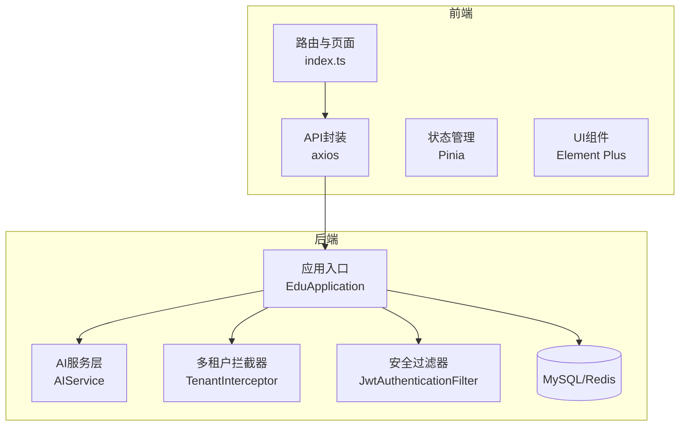
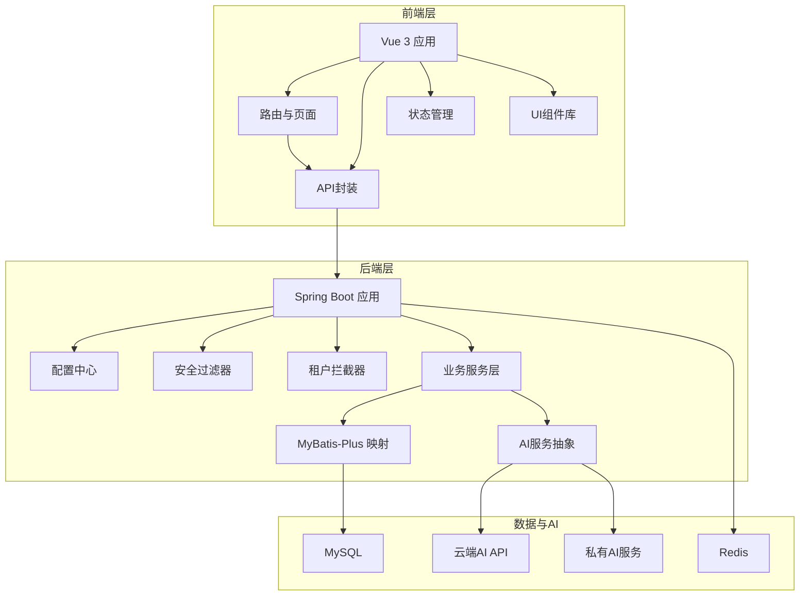
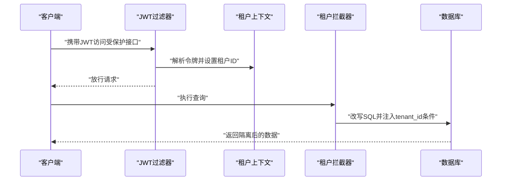
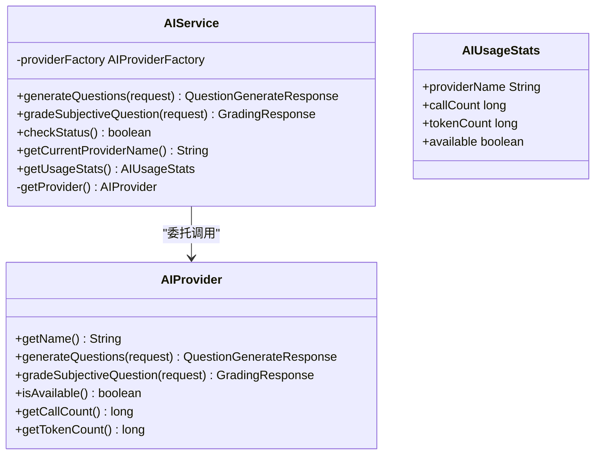
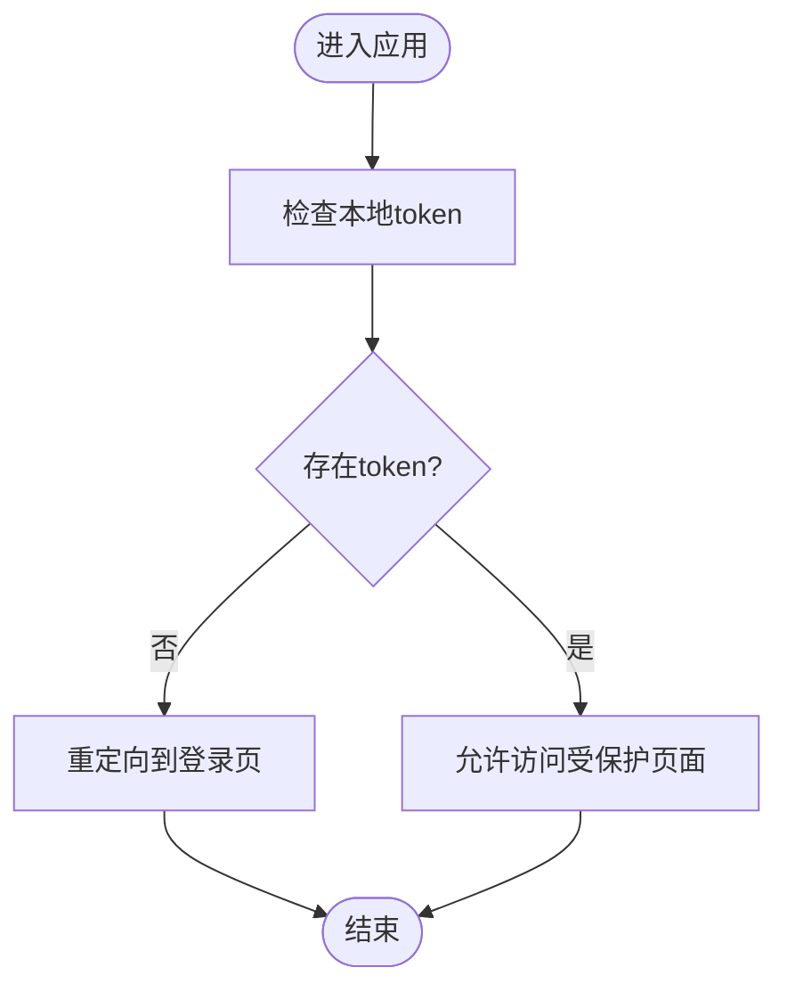
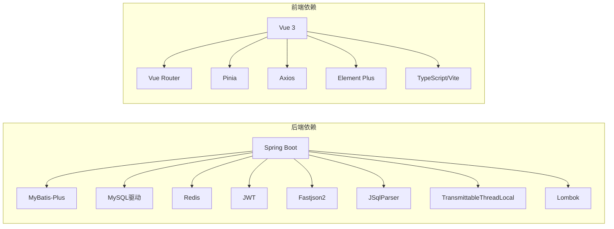

# 项目概述

<cite>
**本文引用的文件**
- [EduApplication.java](file://backend/src/main/java/com/edu/EduApplication.java)
- [pom.xml](file://backend/pom.xml)
- [application.yml](file://backend/src/main/resources/application.yml)
- [schema.sql](file://backend/src/main/resources/db/schema.sql)
- [README.md](file://README.md)
- [INSTALL.md](file://INSTALL.md)
- [2026-05-06-teacher-ai-platform-mvp.md](file://docs/superpowers/plans/2026-05-06-teacher-ai-platform-mvp.md)
- [2026-05-06-teacher-ai-platform-design.md](file://docs/superpowers/specs/2026-05-06-teacher-ai-platform-design.md)
- [AIProvider.java](file://backend/src/main/java/com/edu/ai/provider/AIProvider.java)
- [AIService.java](file://backend/src/main/java/com/edu/ai/service/AIService.java)
- [TenantInterceptor.java](file://backend/src/main/java/com/edu/common/interceptor/TenantInterceptor.java)
- [JwtAuthenticationFilter.java](file://backend/src/main/java/com/edu/common/security/JwtAuthenticationFilter.java)
- [index.ts](file://frontend/src/router/index.ts)
- [package.json](file://frontend/package.json)
</cite>

## 目录
1. [引言](#引言)
2. [项目结构](#项目结构)
3. [核心组件](#核心组件)
4. [架构总览](#架构总览)
5. [详细组件分析](#详细组件分析)
6. [依赖分析](#依赖分析)
7. [性能考虑](#性能考虑)
8. [故障排查指南](#故障排查指南)
9. [结论](#结论)
10. [附录](#附录)

## 引言
教师智能教学系统是一个面向K12教育场景的SaaS平台，旨在通过AI技术与教学业务深度融合，为教师提供智能化的教学辅助能力，包括但不限于：智能组卷、自动批改、成绩分析、错题沉淀、个性化学习支持等。系统采用模块化单体架构，后端基于Spring Boot 3 + Java 17 + MyBatis-Plus，前端采用Vue 3 + Element Plus，数据库为MySQL 8，结合Redis进行缓存与会话管理，并通过可插拔的AI服务抽象层支持云端API与私有化部署两种模式，满足不同客户的合规与性能需求。

## 项目结构
项目采用前后端分离的典型工程布局：
- 后端（Spring Boot）：按业务域划分模块（tenant、user、exam、grading、ai等），统一入口应用类负责启动与Mapper扫描。
- 前端（Vue 3 SPA）：路由驱动页面视图，Axios封装API调用，Pinia做状态管理，Element Plus提供UI组件。
- 文档与脚本：设计与实施计划文档、数据库初始化脚本、安装与启动脚本。



图表来源
- [EduApplication.java:1-15](file://backend/src/main/java/com/edu/EduApplication.java#L1-L15)
- [AIService.java:1-102](file://backend/src/main/java/com/edu/ai/service/AIService.java#L1-L102)
- [TenantInterceptor.java:1-142](file://backend/src/main/java/com/edu/common/interceptor/TenantInterceptor.java#L1-L142)
- [JwtAuthenticationFilter.java:1-70](file://backend/src/main/java/com/edu/common/security/JwtAuthenticationFilter.java#L1-L70)
- [index.ts:1-114](file://frontend/src/router/index.ts#L1-L114)

章节来源
- [EduApplication.java:1-15](file://backend/src/main/java/com/edu/EduApplication.java#L1-L15)
- [pom.xml:1-152](file://backend/pom.xml#L1-L152)
- [README.md:1-88](file://README.md#L1-L88)
- [INSTALL.md:1-134](file://INSTALL.md#L1-L134)

## 核心组件
- 应用入口与配置
  - 应用入口类负责启动Spring Boot应用并启用MyBatis Mapper扫描。
  - 后端配置文件集中管理端口、数据源、MyBatis-Plus、JWT、AI Provider等关键参数。
- 多租户与安全
  - 租户拦截器通过JSqlParser在SQL层面自动注入租户条件，保障数据隔离。
  - JWT过滤器在请求进入时解析令牌，设置租户上下文与Spring Security认证上下文。
- AI服务抽象
  - AI服务统一入口根据租户上下文动态选择云端或私有AI Provider，提供题目生成与主观题批改能力。
- 前后端路由与API
  - 前端路由覆盖登录、仪表盘、题库、试卷、批改、分析、错题、用户与班级管理等页面。
  - 前端通过Axios封装API调用，后端提供REST接口。

章节来源
- [EduApplication.java:1-15](file://backend/src/main/java/com/edu/EduApplication.java#L1-L15)
- [application.yml:1-65](file://backend/src/main/resources/application.yml#L1-L65)
- [TenantInterceptor.java:1-142](file://backend/src/main/java/com/edu/common/interceptor/TenantInterceptor.java#L1-L142)
- [JwtAuthenticationFilter.java:1-70](file://backend/src/main/java/com/edu/common/security/JwtAuthenticationFilter.java#L1-L70)
- [AIService.java:1-102](file://backend/src/main/java/com/edu/ai/service/AIService.java#L1-L102)
- [index.ts:1-114](file://frontend/src/router/index.ts#L1-L114)

## 架构总览
系统采用“模块化单体架构 + 多租户 + 前后端分离 + AI服务抽象”的设计：
- 前端：Vue 3 SPA，Element Plus组件库，路由守卫与状态管理。
- 后端：Spring Boot + MyBatis-Plus，统一响应、全局异常、安全过滤、租户拦截。
- 数据层：MySQL（核心业务）+ Redis（可选缓存/会话/计数）。
- AI层：统一AI服务抽象，支持云端API与私有服务切换。



图表来源
- [application.yml:1-65](file://backend/src/main/resources/application.yml#L1-L65)
- [AIService.java:1-102](file://backend/src/main/java/com/edu/ai/service/AIService.java#L1-L102)
- [TenantInterceptor.java:1-142](file://backend/src/main/java/com/edu/common/interceptor/TenantInterceptor.java#L1-L142)
- [JwtAuthenticationFilter.java:1-70](file://backend/src/main/java/com/edu/common/security/JwtAuthenticationFilter.java#L1-L70)
- [index.ts:1-114](file://frontend/src/router/index.ts#L1-L114)

## 详细组件分析

### 多租户与数据隔离
- 设计理念：采用“共享数据库 + 租户ID字段 + SQL自动注入”的方案，在所有业务表中保留tenant_id字段，通过拦截器在查询时自动追加租户条件，避免跨租户数据泄露。
- 实现要点：
  - 租户拦截器使用JSqlParser解析并改写SQL，对PlainSelect与SetOperationList进行处理，排除特定表（如用户、权限、学校等）。
  - 租户上下文通过ThreadLocal持有，并在JWT过滤器中从令牌中解析并注入。



图表来源
- [JwtAuthenticationFilter.java:1-70](file://backend/src/main/java/com/edu/common/security/JwtAuthenticationFilter.java#L1-L70)
- [TenantInterceptor.java:1-142](file://backend/src/main/java/com/edu/common/interceptor/TenantInterceptor.java#L1-L142)

章节来源
- [TenantInterceptor.java:1-142](file://backend/src/main/java/com/edu/common/interceptor/TenantInterceptor.java#L1-L142)
- [JwtAuthenticationFilter.java:1-70](file://backend/src/main/java/com/edu/common/security/JwtAuthenticationFilter.java#L1-L70)

### AI服务抽象与Provider选择
- 设计目标：统一AI调用入口，支持云端（Claude/GPT等）与私有部署两种Provider，按租户维度动态选择。
- 关键流程：
  - AIService根据租户上下文选择Provider，记录调用统计与可用性。
  - AIProvider接口定义题目生成与主观题批改能力，并提供服务状态查询。



图表来源
- [AIProvider.java:1-42](file://backend/src/main/java/com/edu/ai/provider/AIProvider.java#L1-L42)
- [AIService.java:1-102](file://backend/src/main/java/com/edu/ai/service/AIService.java#L1-L102)

章节来源
- [AIProvider.java:1-42](file://backend/src/main/java/com/edu/ai/provider/AIProvider.java#L1-L42)
- [AIService.java:1-102](file://backend/src/main/java/com/edu/ai/service/AIService.java#L1-L102)

### 前后端交互与路由守卫
- 前端路由：登录、仪表盘、题库、试卷、批改、分析、错题、用户与班级管理等页面。
- 路由守卫：未登录访问非登录页将重定向至登录。
- API调用：前端通过Axios封装统一调用后端REST接口。



图表来源
- [index.ts:1-114](file://frontend/src/router/index.ts#L1-L114)

章节来源
- [index.ts:1-114](file://frontend/src/router/index.ts#L1-L114)
- [package.json:1-25](file://frontend/package.json#L1-L25)

### 数据模型与业务边界
- 数据库初始化脚本涵盖租户、用户、组织架构、题库、试卷、答题与分析等核心表，配套索引与约束，支撑多租户隔离与高效查询。
- 业务边界清晰：题库与模板用于智能组卷；答题与批改用于自动评分与分析；错题沉淀用于后续个性化学习。

```mermaid
erDiagram
TENANT {
bigint id PK
varchar name
varchar code UK
varchar ai_provider
json ai_config
tinyint status
date expire_date
}
SCHOOL {
bigint id PK
bigint tenant_id FK
varchar name
varchar address
varchar contact_phone
}
GRADE {
bigint id PK
bigint school_id FK
varchar name
tinyint level
int sequence
}
CLASS {
bigint id PK
bigint grade_id FK
varchar name
bigint teacher_id
int student_count
}
SYS_USER {
bigint id PK
bigint tenant_id FK
varchar username UK
varchar password
varchar real_name
varchar email
varchar phone
varchar avatar
tinyint status
}
ROLE {
bigint id PK
bigint tenant_id FK
varchar name
varchar code UK
varchar description
}
PERMISSION {
bigint id PK
varchar code UK
varchar name
varchar resource
varchar action
}
QUESTION_BANK {
bigint id PK
bigint tenant_id FK
varchar name
varchar subject
tinyint grade_level
varchar description
tinyint is_public
}
QUESTION {
bigint id PK
bigint bank_id FK
varchar subject
varchar question_type
tinyint difficulty
text content
json options
text answer
text answer_analysis
json knowledge_points
varchar source
}
EXAM_TEMPLATE {
bigint id PK
bigint tenant_id FK
varchar name
varchar subject
decimal total_score
int time_limit
json structure
}
EXAM_PAPER {
bigint id PK
bigint tenant_id FK
bigint template_id
varchar title
varchar subject
bigint grade_id
bigint class_id
decimal total_score
int time_limit
tinyint status
}
EXAM_QUESTION {
bigint id PK
bigint exam_paper_id FK
bigint question_id FK
int sequence
decimal score
}
ANSWER_SHEET {
bigint id PK
bigint tenant_id FK
bigint exam_paper_id FK
bigint student_id FK
tinyint status
decimal total_score
datetime submit_time
datetime grading_time
bigint graded_by
}
ANSWER {
bigint id PK
bigint answer_sheet_id FK
bigint exam_question_id FK
text student_answer
tinyint is_correct
decimal score
decimal ai_score
decimal manual_score
text ai_analysis
datetime graded_at
}
SCORE_ANALYSIS {
bigint id PK
bigint exam_paper_id FK
bigint class_id FK
decimal avg_score
decimal max_score
decimal min_score
decimal pass_rate
decimal excellent_rate
json question_analysis
}
STUDENT_WRONG_QUESTION {
bigint id PK
bigint student_id FK
bigint question_id FK
bigint exam_paper_id
int wrong_count
datetime last_wrong_at
datetime corrected_at
}
TENANT ||--o{ SCHOOL : "拥有"
SCHOOL ||--o{ GRADE : "拥有"
GRADE ||--o{ CLASS : "拥有"
TENANT ||--o{ SYS_USER : "拥有"
TENANT ||--o{ ROLE : "拥有"
TENANT ||--o{ QUESTION_BANK : "拥有"
TENANT ||--o{ EXAM_PAPER : "拥有"
TENANT ||--o{ ANSWER_SHEET : "拥有"
TENANT ||--o{ STUDENT_WRONG_QUESTION : "拥有"
SCHOOL ||--o{ GRADE : "包含"
GRADE ||--o{ CLASS : "包含"
CLASS ||--o{ SYS_USER : "包含"
QUESTION_BANK ||--o{ QUESTION : "包含"
EXAM_TEMPLATE ||--o{ EXAM_PAPER : "生成"
EXAM_PAPER ||--o{ EXAM_QUESTION : "包含"
EXAM_PAPER ||--o{ ANSWER_SHEET : "分发"
ANSWER_SHEET ||--o{ ANSWER : "承载"
```

图表来源
- [schema.sql:1-379](file://backend/src/main/resources/db/schema.sql#L1-L379)

章节来源
- [schema.sql:1-379](file://backend/src/main/resources/db/schema.sql#L1-L379)

## 依赖分析
- 后端技术栈
  - Spring Boot Starter Web/Security/Validation + MyBatis-Plus + MySQL驱动 + Redis + JWT + Fastjson2 + JSqlParser + TransmittableThreadLocal + Lombok。
- 前端技术栈
  - Vue 3 + Vue Router + Pinia + Axios + Element Plus + TypeScript/Vite。
- 运行与安装
  - 后端可通过Maven启动或打包运行；前端通过npm安装依赖并启动开发服务器；数据库需先创建并执行初始化脚本。



图表来源
- [pom.xml:1-152](file://backend/pom.xml#L1-L152)
- [package.json:1-25](file://frontend/package.json#L1-L25)

章节来源
- [pom.xml:1-152](file://backend/pom.xml#L1-L152)
- [package.json:1-25](file://frontend/package.json#L1-L25)

## 性能考虑
- 数据访问层
  - MyBatis-Plus开启驼峰映射与日志输出，便于调试；逻辑删除字段统一管理软删除。
  - 租户拦截器在查询阶段注入条件，避免在应用层重复判断，降低耦合。
- 缓存与会话
  - Redis配置可选，默认禁用，可根据需要启用；适合缓存热点数据、会话与计数。
- AI调用
  - 提供调用统计与可用性检查，便于监控与降级；支持多Provider切换，提高可用性。

## 故障排查指南
- 后端启动与数据库
  - 确认数据库已创建并执行初始化脚本；检查数据源连接参数与密码。
- JWT与多租户
  - 若出现租户上下文缺失导致的默认AI服务提示，检查登录接口返回的令牌是否包含租户ID。
- 前端访问
  - 未登录访问受保护页面会被路由守卫重定向至登录；确认本地存储token有效。
- 常见问题
  - Maven命令不可用、数据库连接失败、前端依赖未安装、Redis连接失败等问题均有对应说明与建议。

章节来源
- [README.md:76-88](file://README.md#L76-L88)
- [INSTALL.md:1-134](file://INSTALL.md#L1-L134)

## 结论
教师智能教学系统通过模块化单体架构与多租户设计，实现了SaaS化的教学辅助平台；借助AI服务抽象层，兼顾了云端与私有化部署的灵活性；前后端分离与统一的API响应规范提升了开发效率与可维护性。该系统为教师提供从智能组卷到自动批改、从成绩分析到错题沉淀的完整闭环，具备良好的扩展性与落地价值。

## 附录
- 版本与计划
  - 设计文档与MVP计划明确了第一版聚焦于试卷生成与批改，后续版本将扩展OCR识别、主观题AI批改、学生画像与个性化出题等能力。
- 社区贡献
  - 项目提供安装与启动脚本、数据库初始化脚本与统一的开发环境配置，便于快速搭建与贡献。

章节来源
- [2026-05-06-teacher-ai-platform-mvp.md:1-800](file://docs/superpowers/plans/2026-05-06-teacher-ai-platform-mvp.md#L1-L800)
- [2026-05-06-teacher-ai-platform-design.md:1-666](file://docs/superpowers/specs/2026-05-06-teacher-ai-platform-design.md#L1-L666)
- [README.md:1-88](file://README.md#L1-L88)
- [INSTALL.md:1-134](file://INSTALL.md#L1-L134)