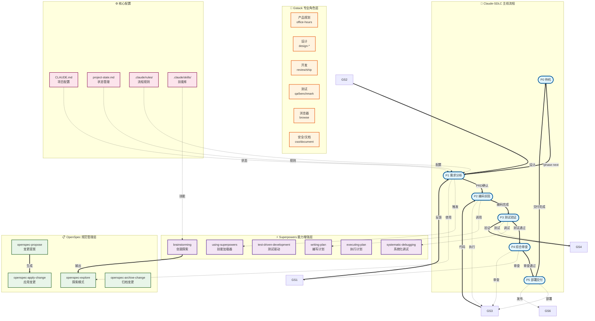

# 教师智能教学系统

基于 Spring Boot + Vue 3 的智能教学管理平台，集成 AI 能力，支持考试管理、智能评分、班级画像、PPT生成等功能。

## 功能特性

- **用户管理**: 多角色权限控制（管理员、教师、学生）
- **考试管理**: 题库管理、试卷生成、在线考试
- **智能评分**: AI辅助批改、成绩分析、错题统计
- **班级画像**: 学生成绩分析、知识点掌握度雷达图
- **AI集成**: Claude API 集成、智能出题、拍照批改
- **PPT生成**: 基于模板的快速PPT生成

## 技术栈

### 后端
- **框架**: Spring Boot 3.2.0 + Java 17
- **ORM**: MyBatis-Plus 3.5.5
- **数据库**: MySQL 8.x + Redis (可选)
- **安全**: JWT + Spring Security
- **AI**: Claude API / LiteLLM Proxy

### 前端
- **框架**: Vue 3 + TypeScript
- **构建**: Vite 5
- **UI库**: Element Plus
- **状态管理**: Pinia
- **图表**: ECharts 6

## 快速开始

### 环境要求

- **后端**: Java 17+, Maven 3.8+, MySQL 8.x
- **前端**: Node.js 18+, npm 9+

### 1. 数据库配置

创建数据库并初始化:

```bash
mysql -u root -p -e "CREATE DATABASE edu_platform CHARACTER SET utf8mb4 COLLATE utf8mb4_unicode_ci;"
mysql -u root -p edu_platform < backend/src/main/resources/db/schema.sql
```

### 2. 配置环境变量

设置数据库连接密码:

```bash
# Windows
set DB_PASSWORD=your_password

# Linux/Mac
export DB_PASSWORD=your_password
```

### 3. 启动后端

```bash
cd backend
mvn spring-boot:run
```

后端API: http://localhost:8080/api

### 4. 启动前端

```bash
cd frontend
npm install
npm run dev
```

前端界面: http://localhost:3000

### 5. 默认账号

- 用户名: `admin`
- 密码: `admin123`

## 项目结构

```
smart-teaching-system/
├── backend/              # Spring Boot 后端
│   └── src/main/java/com/edu/
│       ├── common/       # 公共模块
│       ├── user/         # 用户管理
│       ├── exam/         # 考试管理
│       ├── grading/      # 智能评分
│       ├── tenant/       # 租户管理
│       ├── ai/           # AI服务
│       └── ppt/          # PPT管理
├── frontend/             # Vue 3 前端
│   └── src/
│       ├── views/        # 页面组件
│       ├── api/          # 接口调用
│       ├── router/       # 路由配置
│       ├── store/        # 状态管理
│       └── utils/        # 工具函数
├── start-backend.bat          # 后端启动脚本（MySQL）
├── start-backend-h2.bat      # 后端启动脚本（H2）
└── start-frontend.bat         # 前端启动脚本
```

## 开发指南

### 后端开发

```bash
cd backend

# 编译
mvn clean compile -DskipTests

# 运行测试
mvn test

# 打包
mvn clean package -DskipTests
```

### 前端开发

```bash
cd frontend

# 安装依赖
npm install

# 开发模式
npm run dev

# 构建生产版本
npm run build

# 预览构建结果
npm run preview
```

## gstack 开发工具

本项目集成了 [gstack](https://github.com/garrytan/gstack) - 一个将 Claude Code 转变为虚拟工程团队的技能包，包含 23 个专业角色技能。

### 快速开始

1. **产品规划**: `/office-hours` - 用 6 个强制问题重新定义产品需求
2. **代码审查**: `/review` - 找出通过 CI 但生产环境会出问题的 bug
3. **QA 测试**: `/qa` - 真实浏览器测试，找 bug 并修复
4. **部署发布**: `/ship` - 同步、测试、推送、开 PR

### 技能分类

#### 产品规划
- `/office-hours` - YC Office Hours 风格的需求深挖
- `/plan-ceo-review` - CEO/创始人视角的战略挑战
- `/plan-eng-review` - 工程经理视角的架构锁定
- `/plan-design-review` - 高级设计师视角的 UI/UX 审查
- `/plan-devex-review` - DX 负责人视角的开发者体验审查

#### 设计
- `/design-shotgun` - 生成 4-6 个 AI 模型变体，可视化对比
- `/design-html` - 将模型转为生产级 HTML（30KB 零依赖）
- `/design-consultation` - 从零构建完整设计系统
- `/design-review` - 设计审查 + 自动修复

#### 开发
- `/review` - 主任工程师视角的代码审查
- `/investigate` - 系统化根因分析
- `/autoplan` - 一键完成 CEO→设计→工程审查
- `/ship` - 发布工程师：同步、测试、推送、开 PR
- `/land-and-deploy` - 合并 PR、等 CI、部署、验证生产

#### 测试
- `/qa` - QA 负责人：真实浏览器测试，找 bug 并修复
- `/qa-only` - QA 报告员：只报告 bug 不修改代码
- `/canary` - SRE：部署后监控
- `/benchmark` - 性能工程师：基线测试、Core Web Vitals

#### 浏览器
- `/browse` - 真实 Chromium 浏览器，~100ms/命令
- `/open-gstack-browser` - GStack 浏览器，侧边栏、反机器人
- `/setup-browser-cookies` - 从真实浏览器导入 cookies

### 配置文件

gstack 配置已添加到 `CLAUDE.md`：

```markdown
## gstack
使用 gstack 的 `/browse` 技能进行所有网页浏览。
禁止：mcp__claude-in-chrome__* 工具。

## Skill routing
- "浏览/打开网页/截图" → /browse
- "审查代码/review" → /review
- "测试/QA" → /qa
- "部署/ship" → /ship
- "规划新功能" → /office-hours → /autoplan
- "设计UI/界面" → /design-shotgun → /design-html
```

### 更多资源

- [gstack GitHub](https://github.com/garrytan/gstack)
- [技能详细说明](https://github.com/garrytan/gstack/blob/main/docs/skills.md)
- [安装指南](https://github.com/garrytan/gstack#install--30-seconds)

---

## 🛠️ 工具组合使用指南

本项目集成了 **Claude-SDLC + OpenSpec + Superpowers + Gstack** 四大工具系统，形成完整的 AI 辅助开发流程。

### 📊 系统架构图



### 🎯 工具定位与功能

#### 1️⃣ Claude-SDLC（主线流程控制器）

**定位**: 项目管理主线，控制开发流程

| 阶段 | 名称 | 主要活动 | 自动驱动 |
|------|------|---------|---------|
| P0 | 待机 | 等待新任务 | - |
| P1 | 需求分析+设计 | 需求澄清、技术调研、PRD编写 | ✅ openspec-explore |
| P2 | 编码实现 | 按PRD编码、遵循架构 | ✅ Superpowers:writing-plan |
| P3 | 测试验证 | 单元测试、集成测试、UI测试 | ✅ Gstack:/qa |
| P4 | 综合审查 | 代码审查、测试审查、集成审查 | ✅ Gstack:/review |
| P5 | 部署交付 | git commit/push、PR、文档 | ✅ Gstack:/ship |

**核心文件**:
- `.claude/project-state.md` - 状态管理（自动更新）
- `.claude/rules/01-lifecycle-phases.md` - 阶段定义
- `CLAUDE.md` - 项目配置入口

---

#### 2️⃣ Superpowers（能力增强层）

**定位**: 提供特定能力，增强开发效率

| 技能 | 触发条件 | 功能说明 | 适用阶段 |
|------|---------|---------|---------|
| `using-superpowers` | 会话开始 | 加载技能系统，检查适用性 | 所有阶段 |
| `brainstorming` | 创建新功能前 | 探索用户意图、需求、设计 | P1 |
| `systematic-debugging` | 遇到bug时 | 5步系统化调试方法 | P3, P4 |
| `test-driven-development` | 编写测试时 | TDD红-绿-重构流程 | P3 |
| `writing-plan` | 多步骤任务 | 编写实现计划 | P1→P2 |
| `executing-plan` | 执行计划时 | 按计划执行并审查检查点 | P2 |
| `dispatching-parallel-agents` | 并行任务 | 派发并行Agent | P2, P3 |

**使用流程**:
```
用户请求 → using-superpowers (检查)
    ↓
适用技能? → 调用对应技能
    ↓
不适用? → 直接执行
```

---

#### 3️⃣ OpenSpec（规范管理层）

**定位**: 管理变更提案和规范文档

| 技能 | 功能 | 输入 | 输出 | 使用场景 |
|------|------|------|------|---------|
| `openspec-explore` | 探索模式，思考伙伴 | 问题描述 | 探索结果、选项 | 需求分析阶段 |
| `openspec-propose` | 创建变更提案 | 探索结果 | 提案文档 | PRD编写后 |
| `openspec-apply-change` | 应用已批准的变更 | 提案文档 | 代码变更 | 编码开始前 |
| `openspec-archive-change` | 归档已完成的变更 | 完成记录 | 归档文档 | 交付完成后 |

**完整工作流**:
```
1. openspec-explore: 探索问题空间
   ↓
2. openspec-propose: 创建变更提案
   ↓
3. [用户审批]
   ↓
4. openspec-apply-change: 应用变更
   ↓
5. openspec-archive-change: 归档变更
```

---

#### 4️⃣ Gstack（专业角色层）

**定位**: 提供23个专业角色技能，覆盖完整开发流程

##### 产品规划类
| 技能 | 角色 | 功能 | 输出 |
|------|------|------|------|
| `/office-hours` | YC Office Hours | 6个强制问题重新定义产品 | PRD文档 |
| `/plan-ceo-review` | CEO/创始人 | 重新思考问题，找到10星产品 | 战略建议 |
| `/plan-eng-review` | 工程经理 | 锁定架构、数据流、测试用例 | 架构文档 |
| `/plan-design-review` | 高级设计师 | UI/UX设计审查，AI Slop检测 | 设计审查报告 |

##### 开发类
| 技能 | 角色 | 功能 | 适用场景 |
|------|------|------|---------|
| `/review` | 主任工程师 | 找出生产环境bug | 代码审查 |
| `/autoplan` | 审查流水线 | 一键完成审查 | 快速规划 |
| `/ship` | 发布工程师 | 同步、测试、推送、开PR | 部署前 |

##### 测试类
| 技能 | 角色 | 功能 | 特点 |
|------|------|------|------|
| `/qa` | QA负责人 | 真实浏览器测试，找bug并修复 | 自动修复 |
| `/benchmark` | 性能工程师 | 基线测试、Core Web Vitals | 性能分析 |

---

### 🎬 组合使用示例

#### 场景1: 开始新功能开发（完整流程）

```bash
# 步骤1: 检查当前状态
/status
# 输出: 当前阶段 P5, 任务: LiteLLM重构暂停

# 步骤2: 推进到P0（如果当前在P5）
/phase next
# 输出: ✅ P5 交付完成，自动进入 P0

# 步骤3: 开始新任务，推进到P1
/phase next
# 输出: ✅ 推进到 P1: 需求分析+设计

# 步骤4: 使用 Superpowers 探索需求
# (自动触发 brainstorming 技能)
"我想添加学生在线答题功能"
# 输出: 6个强制问题，需求澄清

# 步骤5: 使用 OpenSpec 探索技术可行性
/openspec-explore
# 输出: 技术方案对比，集成点分析

# 步骤6: 使用 Gstack 进行产品规划
/office-hours
# 输出: PRD文档，功能定义

# 步骤7: PRD确认后，自动推进到P2
/phase next
# 输出: ✅ P1 → P2, 进入编码实现

# 步骤8: 使用 Superpowers 编写计划
# (自动触发 writing-plan 技能)
# 输出: 实现计划，文件列表

# 步骤9: 使用 Gstack 自动审查计划
/autoplan
# 输出: CEO审查 + 设计审查 + 工程审查

# 步骤10: 开始编码
# (P2自动驱动模式: 编码 → 测试 → 审查 → 交付)
```

**时间线**:
```
P0 (5分钟) → P1 (30分钟) → P2 (2小时) → P3 (30分钟) → P4 (20分钟) → P5 (10分钟)
       ↑              ↑                ↑                ↑               ↑
   brainstorming  writing-plan      coding           /qa            /ship
   openspec       /autoplan                       /review
   /office-hours
```

---

#### 场景2: Bug修复（快速响应）

```bash
# 步骤1: 发现Bug，进入P3
/phase status
# 输出: 当前阶段 P2, 需要回退到P3

/phase back
# 原因: 发现生产环境Bug

# 步骤2: 使用 Superpowers 系统化调试
# (自动触发 systematic-debugging 技能)
"学生提交答题后，成绩显示错误"
# 输出: 5步调试计划

# 步骤3: 使用 Gstack 根因分析
/investigate
# 输出: 根因分析报告，数据流向图

# 步骤4: 修复代码
# (按照 investigate 的建议修复)

# 步骤5: 使用 Gstack 测试验证
/qa http://localhost:3000
# 输出: 浏览器测试报告，bug已修复

# 步骤6: 推进到P4审查
/phase next
# 输出: ✅ P3 → P4

# 步骤7: 使用 Gstack 代码审查
/review
# 输出: 代码审查报告，无阻断问题

# 步骤8: 推进到P5交付
/phase next
# 输出: ✅ P4 → P5

# 步骤9: 部署修复
/ship
# 输出: PR已创建，代码已推送
```

---

### 🔍 快速参考

#### 命令速查表

| 命令 | 工具 | 功能 |
|------|------|------|
| `/phase` | SDLC | 查看/推进/回退阶段 |
| `/status` | SDLC | 查看项目状态 |
| `/checkpoint` | SDLC | 保存进度快照 |
| `/review` | SDLC/Gstack | 综合审查 |
| `/office-hours` | Gstack | 产品规划 |
| `/qa` | Gstack | QA测试 |
| `/ship` | Gstack | 部署发布 |

#### 阶段-工具矩阵

| 阶段 | 主要工具 | 辅助工具 |
|------|---------|---------|
| P1 | OpenSpec, brainstorming | Gstack:/office-hours |
| P2 | writing-plan | Gstack:/autoplan, /review |
| P3 | TDD, systematic-debugging | Gstack:/qa, /benchmark |
| P4 | Gstack:/review, /codex | systematic-debugging |
| P5 | Gstack:/ship, /land-and-deploy | OpenSpec:archive |

---

### 📚 详细文档

完整的使用指南、架构图、场景流程、配置说明请查看：

📖 **[工具组合使用详细指南](docs/tools-integration-guide.md)**

**内容包括**：
- ✅ 完整的 Mermaid 架构图（多层架构）
- ✅ 4个组合使用场景详解（带时间线）
- ✅ 配置文件关系图
- ✅ 命令速查表和阶段-工具矩阵
- ✅ 最佳实践和故障排查

---

## 配置说明

### 后端配置

主要配置文件: `backend/src/main/resources/application.yml`

- 数据库配置: 修改 `spring.datasource`
- JWT配置: 修改 `jwt.secret`
- AI配置: 修改 `ai.*`

### 前端配置

主要配置文件: `frontend/vite.config.ts`

- 代理设置: `server.proxy`
- 构建优化: 代码分割、console移除

## 常见问题

### Q: Maven命令找不到?
确保已安装Maven并添加到PATH环境变量。

### Q: 数据库连接失败?
检查MySQL是否运行，用户名密码是否正确，数据库是否已创建。

### Q: 前端启动失败?
确保已执行 `npm install` 安装依赖。

### Q: Redis连接失败?
Redis是可选的，可以暂时注释掉Redis相关配置，或安装Redis服务。

## 许可证

MIT License

## 联系方式

- 项目地址: https://github.com/xhy0825/smart-teaching-system
- 问题反馈: https://github.com/xhy0825/smart-teaching-system/issues

---

**注意**: 本项目使用 Claude Code 进行开发，遵循 SDLC 五阶段流程（P1需求→P2编码→P3测试→P4审查→P5交付）。
