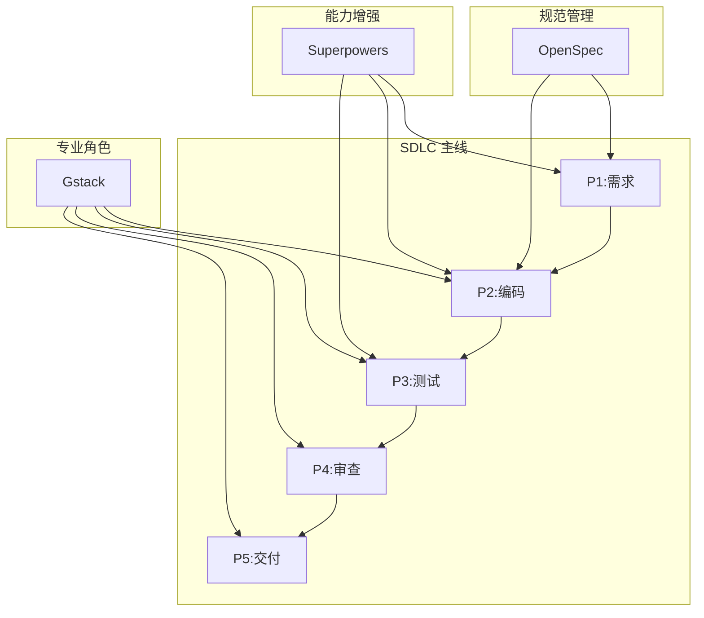

# 教师智能教学系统

基于 Spring Boot + Vue 3 的智能教学管理平台，集成 AI 能力，支持考试管理、智能评分、班级画像、PPT生成等功能。

## 功能特性

- **用户管理**: 多角色权限控制（管理员、教师、学生）
- **考试管理**: 题库管理、试卷生成、在线考试
- **智能评分**: AI辅助批改、成绩分析、错题统计
- **班级画像**: 学生成绩分析、知识点掌握度雷达图
- **AI集成**: Claude API 集成、智能出题、拍照批改
- **PPT生成**: 基于模板的快速PPT生成

## 技术栈

### 后端
- **框架**: Spring Boot 3.2.0 + Java 17
- **ORM**: MyBatis-Plus 3.5.5
- **数据库**: MySQL 8.x + Redis (可选)
- **安全**: JWT + Spring Security
- **AI**: Claude API / LiteLLM Proxy

### 前端
- **框架**: Vue 3 + TypeScript
- **构建**: Vite 5
- **UI库**: Element Plus
- **状态管理**: Pinia
- **图表**: ECharts 6

## 快速开始

### 环境要求

- **后端**: Java 17+, Maven 3.8+, MySQL 8.x
- **前端**: Node.js 18+, npm 9+

### 1. 数据库配置

创建数据库并初始化:

```bash
mysql -u root -p -e "CREATE DATABASE edu_platform CHARACTER SET utf8mb4 COLLATE utf8mb4_unicode_ci;"
mysql -u root -p edu_platform < backend/src/main/resources/db/schema.sql
```

### 2. 配置环境变量

设置数据库连接密码:

```bash
# Windows
set DB_PASSWORD=your_password

# Linux/Mac
export DB_PASSWORD=your_password
```

### 3. 启动后端

```bash
cd backend
mvn spring-boot:run
```

后端API: http://localhost:8080/api

### 4. 启动前端

```bash
cd frontend
npm install
npm run dev
```

前端界面: http://localhost:3000

### 5. 默认账号

- 用户名: `admin`
- 密码: `admin123`

## 项目结构

```
smart-teaching-system/
├── backend/              # Spring Boot 后端
│   └── src/main/java/com/edu/
│       ├── common/       # 公共模块
│       ├── user/         # 用户管理
│       ├── exam/         # 考试管理
│       ├── grading/      # 智能评分
│       ├── tenant/       # 租户管理
│       ├── ai/           # AI服务
│       └── ppt/          # PPT管理
├── frontend/             # Vue 3 前端
│   └── src/
│       ├── views/        # 页面组件
│       ├── api/          # 接口调用
│       ├── router/       # 路由配置
│       ├── store/        # 状态管理
│       └── utils/        # 工具函数
├── start-backend.bat          # 后端启动脚本（MySQL）
├── start-backend-h2.bat      # 后端启动脚本（H2）
└── start-frontend.bat         # 前端启动脚本
```

## 开发指南

### 后端开发

```bash
cd backend

# 编译
mvn clean compile -DskipTests

# 运行测试
mvn test

# 打包
mvn clean package -DskipTests
```

### 前端开发

```bash
cd frontend

# 安装依赖
npm install

# 开发模式
npm run dev

# 构建生产版本
npm run build

# 预览构建结果
npm run preview
```

## gstack 开发工具

本项目集成了 [gstack](https://github.com/garrytan/gstack) - 一个将 Claude Code 转变为虚拟工程团队的技能包，包含 23 个专业角色技能。

### 快速开始

1. **产品规划**: `/office-hours` - 用 6 个强制问题重新定义产品需求
2. **代码审查**: `/review` - 找出通过 CI 但生产环境会出问题的 bug
3. **QA 测试**: `/qa` - 真实浏览器测试，找 bug 并修复
4. **部署发布**: `/ship` - 同步、测试、推送、开 PR

### 技能分类

#### 产品规划
- `/office-hours` - YC Office Hours 风格的需求深挖
- `/plan-ceo-review` - CEO/创始人视角的战略挑战
- `/plan-eng-review` - 工程经理视角的架构锁定
- `/plan-design-review` - 高级设计师视角的 UI/UX 审查
- `/plan-devex-review` - DX 负责人视角的开发者体验审查

#### 设计
- `/design-shotgun` - 生成 4-6 个 AI 模型变体，可视化对比
- `/design-html` - 将模型转为生产级 HTML（30KB 零依赖）
- `/design-consultation` - 从零构建完整设计系统
- `/design-review` - 设计审查 + 自动修复

#### 开发
- `/review` - 主任工程师视角的代码审查
- `/investigate` - 系统化根因分析
- `/autoplan` - 一键完成 CEO→设计→工程审查
- `/ship` - 发布工程师：同步、测试、推送、开 PR
- `/land-and-deploy` - 合并 PR、等 CI、部署、验证生产

#### 测试
- `/qa` - QA 负责人：真实浏览器测试，找 bug 并修复
- `/qa-only` - QA 报告员：只报告 bug 不修改代码
- `/canary` - SRE：部署后监控
- `/benchmark` - 性能工程师：基线测试、Core Web Vitals

#### 浏览器
- `/browse` - 真实 Chromium 浏览器，~100ms/命令
- `/open-gstack-browser` - GStack 浏览器，侧边栏、反机器人
- `/setup-browser-cookies` - 从真实浏览器导入 cookies

### 配置文件

gstack 配置已添加到 `CLAUDE.md`：

```markdown
## gstack
使用 gstack 的 `/browse` 技能进行所有网页浏览。
禁止：mcp__claude-in-chrome__* 工具。

## Skill routing
- "浏览/打开网页/截图" → /browse
- "审查代码/review" → /review
- "测试/QA" → /qa
- "部署/ship" → /ship
- "规划新功能" → /office-hours → /autoplan
- "设计UI/界面" → /design-shotgun → /design-html
```

### 更多资源

- [gstack GitHub](https://github.com/garrytan/gstack)
- [技能详细说明](https://github.com/garrytan/gstack/blob/main/docs/skills.md)
- [安装指南](https://github.com/garrytan/gstack#install--30-seconds)

---

## 工具组合使用指南

本项目集成了 **Claude-SDLC + OpenSpec + Superpowers + Gstack** 四大工具系统，形成完整的 AI 辅助开发流程。

### 架构概览



### 工具定位

| 工具 | 定位 | 核心功能 |
|------|------|---------|
| **Claude-SDLC** | 项目管理主线 | P1-P5 五阶段流程控制 |
| **OpenSpec** | 规范管理层 | 探索、提案、应用、归档 |
| **Superpowers** | 能力增强层 | brainstorming、调试、TDD |
| **Gstack** | 专业角色层 | 23个专业角色技能 |

### 快速参考

| 场景 | 推荐工具组合 |
|------|---------|
| 新功能开发 | SDLC P1 → OpenSpec探索 → Superpowers规划 → Gstack实现 |
| Bug修复 | SDLC P3 → Superpowers调试 → Gstack测试 |
| 代码审查 | SDLC P4 → Gstack/review + /codex |
| 部署发布 | SDLC P5 → Gstack/ship + /land-and-deploy |

### 详细文档

完整的使用指南、架构图、场景流程、配置说明请查看：

📖 **[工具组合使用详细指南](docs/tools-integration-guide.md)**

内容包括：
- 完整的 Mermaid 架构图
- 4个组合使用场景详解
- 配置文件关系图
- 命令速查表和阶段-工具矩阵
- 最佳实践和故障排查

---

## 配置说明

### 后端配置

主要配置文件: `backend/src/main/resources/application.yml`

- 数据库配置: 修改 `spring.datasource`
- JWT配置: 修改 `jwt.secret`
- AI配置: 修改 `ai.*`

### 前端配置

主要配置文件: `frontend/vite.config.ts`

- 代理设置: `server.proxy`
- 构建优化: 代码分割、console移除

## 常见问题

### Q: Maven命令找不到?
确保已安装Maven并添加到PATH环境变量。

### Q: 数据库连接失败?
检查MySQL是否运行，用户名密码是否正确，数据库是否已创建。

### Q: 前端启动失败?
确保已执行 `npm install` 安装依赖。

### Q: Redis连接失败?
Redis是可选的，可以暂时注释掉Redis相关配置，或安装Redis服务。

## 许可证

MIT License

## 联系方式

- 项目地址: https://github.com/xhy0825/smart-teaching-system
- 问题反馈: https://github.com/xhy0825/smart-teaching-system/issues

---

**注意**: 本项目使用 Claude Code 进行开发，遵循 SDLC 五阶段流程（P1需求→P2编码→P3测试→P4审查→P5交付）。
