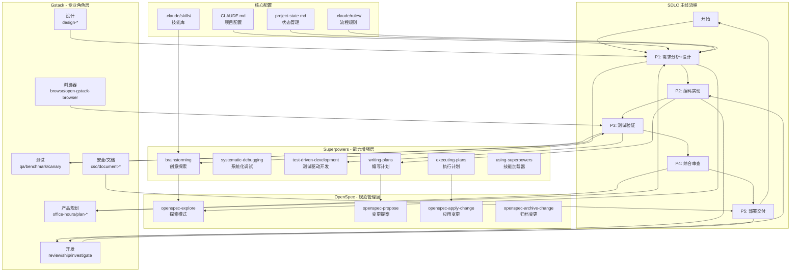

# 工具组合使用指南

## 工具集成架构



## 工具功能说明

### 1. Claude-SDLC（主线流程）

**定位**: 项目管理主线，控制开发流程

**阶段说明**:

| 阶段 | 名称 | 主要活动 | 可用工具 |
|------|------|---------|---------|
| P0 | 待机 | 等待新任务 | /status, /phase |
| P1 | 需求分析+设计 | 需求澄清、技术调研、PRD编写、架构设计 | OpenSpec, Superpowers:brainstorming |
| P2 | 编码实现 | 按PRD编码、遵循架构 | Gstack:review/ship, Superpowers:writing-plans |
| P3 | 测试验证 | 单元测试、集成测试、UI测试 | Gstack:qa/benchmark, Superpowers:TDD |
| P4 | 综合审查 | 代码审查、测试审查、集成审查、PRD追溯 | Gstack:review/codex, Superpowers:systematic-debugging |
| P5 | 部署交付 | git commit/push、PR、文档、交付报告 | Gstack:ship/land-and-deploy, OpenSpec:archive |

**核心文件**:
- `.claude/project-state.md` - 状态管理
- `.claude/rules/01-lifecycle-phases.md` - 阶段定义
- `CLAUDE.md` - 项目配置

---

### 2. Superpowers（能力增强层）

**定位**: 提供特定能力，增强开发效率

**技能说明**:

| 技能 | 触发条件 | 功能 | 适用阶段 |
|------|---------|------|---------|
| `using-superpowers` | 会话开始 | 加载技能系统，检查是否有适用技能 | 所有阶段 |
| `brainstorming` | 创建新功能前 | 探索用户意图、需求、设计 | P1 |
| `systematic-debugging` | 遇到bug时 | 系统化调试方法 | P3, P4 |
| `test-driven-development` | 编写测试时 | TDD流程 | P3 |
| `writing-plans` | 多步骤任务 | 编写实现计划 | P1→P2 |
| `executing-plans` | 执行计划时 | 按计划执行并审查 | P2 |
| `dispatching-parallel-agents` | 并行任务 | 派发并行Agent | P2, P3 |
| `verification-before-completion` | 完成任务前 | 验证功能是否正常 | P2, P3, P5 |

**使用流程**:
```
用户请求 → using-superpowers (检查) → 适用技能? → 调用对应技能
                                      ↓
                                   不适用? → 直接执行
```

---

### 3. OpenSpec（规范管理层）

**定位**: 管理变更提案和规范文档

**技能说明**:

| 技能 | 功能 | 输入 | 输出 |
|------|------|------|------|
| `openspec-explore` | 探索模式，思考伙伴 | 问题描述 | 探索结果、选项 |
| `openspec-propose` | 创建变更提案 | 探索结果 | 提案文档 |
| `openspec-apply-change` | 应用已批准的变更 | 提案文档 | 代码变更 |
| `openspec-archive-change` | 归档已完成的变更 | 完成记录 | 归档文档 |

**工作流**:
```
1. openspec-explore: 探索问题空间
   ↓
2. openspec-propose: 创建变更提案
   ↓
3. [用户审批]
   ↓
4. openspec-apply-change: 应用变更
   ↓
5. openspec-archive-change: 归档变更
```

---

### 4. Gstack（专业角色层）

**定位**: 提供23个专业角色技能，覆盖完整开发流程

**技能分类**:

#### 产品规划类
| 技能 | 角色 | 功能 |
|------|------|------|
| `/office-hours` | YC Office Hours | 6个强制问题重新定义产品 |
| `/plan-ceo-review` | CEO/创始人 | 重新思考问题，找到10星产品 |
| `/plan-eng-review` | 工程经理 | 锁定架构、数据流、测试用例 |
| `/plan-design-review` | 高级设计师 | UI/UX设计审查 |
| `/plan-devex-review` | DX负责人 | 开发者体验审查 |

#### 设计类
| 技能 | 角色 | 功能 |
|------|------|------|
| `/design-shotgun` | 设计探索者 | 生成4-6个AI模型变体 |
| `/design-html` | 设计工程师 | 转为生产级HTML |
| `/design-consultation` | 设计伙伴 | 构建完整设计系统 |
| `/design-review` | 会写代码的设计师 | 设计审查+修复 |

#### 开发类
| 技能 | 角色 | 功能 |
|------|------|------|
| `/review` | 主任工程师 | 找出生产环境bug |
| `/investigate` | 调试器 | 系统化根因分析 |
| `/autoplan` | 审查流水线 | 一键完成审查 |
| `/ship` | 发布工程师 | 同步、测试、推送、开PR |
| `/land-and-deploy` | 发布工程师 | 合并、部署、验证 |

#### 测试类
| 技能 | 角色 | 功能 |
|------|------|------|
| `/qa` | QA负责人 | 真实浏览器测试 |
| `/qa-only` | QA报告员 | 只报告不修改 |
| `/canary` | SRE | 部署后监控 |
| `/benchmark` | 性能工程师 | 基线测试 |

#### 浏览器类
| 技能 | 功能 |
|------|------|
| `/browse` | 真实Chromium浏览器 |
| `/open-gstack-browser` | GStack浏览器+侧边栏 |

---

## 组合使用场景

### 场景1: 开始新功能开发

```
1. [P0 → P1] /phase next
   ↓
2. [P1] Superpowers: brainstorming
   - 探索用户需求
   - 功能范围、目标用户、技术约束
   ↓
3. [P1] OpenSpec: openspec-explore
   - 深入探索问题空间
   - 生成多个方案
   ↓
4. [P1] Gstack: /office-hours
   - 6个强制问题重新定义
   - 生成PRD
   ↓
5. [P1 → P2] /phase next (PRD确认后自动推进)
   ↓
6. [P2] Superpowers: writing-plans
   - 编写实现计划
   ↓
7. [P2] Gstack: /autoplan
   - 自动完成审查流水线
   ↓
8. [P2] 编码实现...
```

### 场景2: Bug修复

```
1. [P3] Superpowers: systematic-debugging
   - 系统化调试流程
   ↓
2. [P3] Gstack: /investigate
   - 根因分析
   - 禁止无调查修复
   ↓
3. [P3] 修复代码
   ↓
4. [P3] Gstack: /qa
   - 真实浏览器测试
   - 验证修复
   ↓
5. [P3 → P4] /phase next
   ↓
6. [P4] Gstack: /review
   - 代码审查
   ↓
7. [P4 → P5] 审查通过，进入交付
```

### 场景3: 代码审查

```
1. [P4] Gstack: /review
   - 主任工程师视角
   - 找出潜在bug
   ↓
2. [P4] Gstack: /codex
   - OpenAI Codex独立审查
   - 交叉验证
   ↓
3. [P4] Superpowers: systematic-debugging
   - 如发现问题，系统化调试
   ↓
4. [P4] 修复问题
   ↓
5. [P4 → P5] /phase next (审查通过)
```

### 场景4: 部署发布

```
1. [P5] Gstack: /ship
   - 同步main
   - 运行测试
   - 审计覆盖率
   - 推送代码
   - 开PR
   ↓
2. [P5] Gstack: /land-and-deploy
   - 合并PR
   - 等待CI
   - 部署
   - 验证生产
   ↓
3. [P5] Gstack: /canary
   - 部署后监控
   - 控制台错误
   - 性能回归
   ↓
4. [P5] Gstack: /document-release
   - 更新文档
   - 匹配代码变更
   ↓
5. [P5 → P0] /phase next
   - 交付完成
   - 等待新任务
```

---

## 配置文件关系

```
CLAUDE.md (项目配置)
├── 项目概述
├── 技术栈
├── 架构概览
├── 常用命令
├── 开发规范
│   └── SDLC 五阶段流程 → 指向 .claude/rules/
├── gstack 配置 → 指向 gstack 技能
└── Skill routing → 自动技能路由

.claude/
├── project-state.md (状态管理)
│   ├── current_phase: P0-P5
│   ├── task_description
│   ├── prd_file
│   ├── modified_files
│   ├── architecture_decisions
│   └── phase_history
├── rules/ (流程规则)
│   ├── 01-lifecycle-phases.md (SDLC定义)
│   ├── 02-coding-standards.md
│   ├── 04-git-workflow.md
│   ├── 05-anti-amnesia.md
│   ├── 06-review-tools.md
│   ├── 07-parallel-agents.md
│   ├── 09-memory-management.md
│   └── 10-ui-ux-standards.md
├── skills/ (技能库)
│   ├── openspec-explore/
│   ├── openspec-propose/
│   ├── phase/
│   ├── checkpoint/
│   ├── review/
│   ├── gstack/ (从 ~/.claude/skills/gstack 链接)
│   └── superpowers-*/ (各种超级技能)
└── agents/ (并行Agent)
    ├── sdlc-coder.md
    ├── sdlc-tester.md
    └── sdlc-reviewer.md
```

---

## 快速参考

### 命令速查表

| 命令 | 工具 | 功能 |
|------|------|------|
| `/phase` | SDLC | 查看/推进/回退阶段 |
| `/status` | SDLC | 查看项目状态 |
| `/checkpoint` | SDLC | 保存进度快照 |
| `/review` | SDLC/Gstack | 综合审查 |
| `/archive` | OpenSpec | 归档变更 |
| Superpowers技能 | Superpowers | 各种能力增强 |
| `/office-hours` | Gstack | 产品规划 |
| `/qa` | Gstack | QA测试 |
| `/ship` | Gstack | 部署发布 |

### 阶段-工具矩阵

| 阶段 | 主要工具 | 辅助工具 |
|------|---------|---------|
| P1 | OpenSpec, Superpowers:brainstorming | Gstack:/office-hours |
| P2 | Superpowers:writing-plans | Gstack:/autoplan, /review |
| P3 | Superpowers:TDD, systematic-debugging | Gstack:/qa, /benchmark |
| P4 | Gstack:/review, /codex | Superpowers:systematic-debugging |
| P5 | Gstack:/ship, /land-and-deploy | OpenSpec:archive |

---

## 安装配置

### 已完成的配置

1. ✅ **SDLC流程**: 通过 `.claude/rules/` 配置
2. ✅ **Gstack**: 安装到 `~/.claude/skills/gstack`，配置到 `CLAUDE.md`
3. ✅ **OpenSpec**: 技能已安装到 `.claude/skills/openspec-*`
4. ✅ **Superpowers**: 技能已内置

### 验证安装

```bash
# 检查 Gstack
ls -la ~/.claude/skills/gstack/

# 检查 OpenSpec
ls -la .claude/skills/openspec-*/

# 检查 SDLC 状态
cat .claude/project-state.md | grep current_phase
```

---

## 最佳实践

### 1. 遵循阶段流程
- 不要跳过阶段
- 每个阶段完成再推进
- 使用 `/phase` 查看当前阶段

### 2. 选择合适的工具
- **规划阶段** → OpenSpec + Superpowers:brainstorming + Gstack:/office-hours
- **编码阶段** → Superpowers:writing-plans + Gstack:/autoplan
- **测试阶段** → Superpowers:TDD + Gstack:/qa
- **审查阶段** → Gstack:/review + /codex
- **发布阶段** → Gstack:/ship + /land-and-deploy

### 3. 利用自动化
- P2-P5 自动驱动
- 并行Agent加速开发
- 自动审查+修复

### 4. 保持文档同步
- 及时更新 `project-state.md`
- 使用 `/checkpoint` 保存进度
- 交付时运行 `/document-release`

---

## 故障排查

### 问题1: 技能不显示
```bash
# 重新运行 gstack setup
cd ~/.claude/skills/gstack && ./setup

# 检查 CLAUDE.md 配置
grep -A 20 "## gstack" CLAUDE.md
```

### 问题2: 阶段无法推进
```bash
# 查看当前阶段和完成条件
/phase status

# 检查 project-state.md
cat .claude/project-state.md
```

### 问题3: Gstack 命令失败
```bash
# 检查 bun 安装
bun --version

# 重新安装依赖
cd ~/.claude/skills/gstack && bun install
```

---

## 相关资源

- **Gstack**: https://github.com/garrytan/gstack
- **OpenSpec**: https://github.com/Fission-AI/OpenSpec
- **Superpowers**: 内置技能系统
- **SDLC规则**: `.claude/rules/01-lifecycle-phases.md`

---

**版本**: 1.0  
**更新日期**: 2026-06-06  
**维护者**: xhy0825
